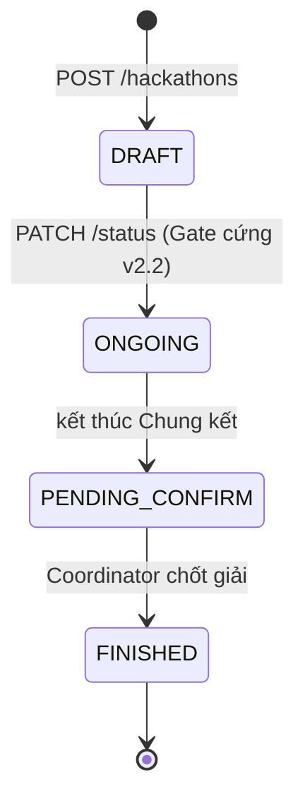
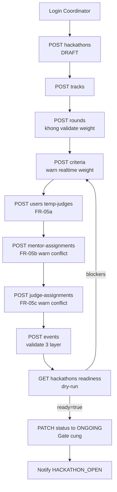

# MF-01 — Giai đoạn 1: Chuẩn bị sự kiện — API Catalog

> Phiên bản: 2.2 (đồng bộ Workflow v3.1 · FR v2.0 · DB Schema v2.1)
> Vai trò: BA · SA · PM · Solution Architect · Backend Architect · DBA
> Audience: Backend Dev, Frontend Dev, QA, Tech Lead

## 1. Phạm vi MF-01

Module **chuẩn bị sự kiện** — từ khi Coordinator tạo Hackathon (`DRAFT`) đến khi chuyển sang `ONGOING` để mở cổng đăng ký. Actor duy nhất: **Coordinator** (`users.role = 'COORDINATOR'` AND `users.status = 'APPROVED'`).

## 2. State machine `hackathons.status`

Transition **một chiều tuyến tính** — không cho quay lui.

## 3. Luồng GĐ1 (Happy Path)

## 4. Cấu trúc spec

| File | Nội dung |
|---|---|
| [_conventions.md](./_conventions.md) | Response envelope, error codes, warning codes, paging, headers, audit |
| [_security.md](./_security.md) | Contract JWT principal mà module Auth phải cung cấp, meta-annotation `@CoordinatorOnly` |
| [fr-01-hackathons.md](./fr-01-hackathons.md) | FR-01: tạo / sửa / xóa / list Hackathon (5 endpoint) |
| [fr-02-tracks.md](./fr-02-tracks.md) | FR-02: CRUD Track (5 endpoint) |
| [fr-03-rounds.md](./fr-03-rounds.md) | FR-03: CRUD Round (5 endpoint, KHÔNG validate weight) |
| [fr-04-criteria.md](./fr-04-criteria.md) | FR-04: CRUD Criteria + clone + weight-summary (8 endpoint) |
| [fr-05-personnel.md](./fr-05-personnel.md) | FR-05a/b/c: temp judge + mentor + judge assignment (11 endpoint) |
| [fr-06-status.md](./fr-06-status.md) | FR-06: state machine status + readiness dry-run (2 endpoint) |
| [fr-06a-events.md](./fr-06a-events.md) | FR-06A: lịch sự kiện validate 3 lớp (5 endpoint) |
| [fr-06b-activate.md](./fr-06b-activate.md) | FR-06B: safety net validate weight khi activate Round (1 endpoint) |

## 5. Bảng tổng hợp 38 endpoint MF-01

| # | Method | Path | FR | Note |
|---|---|---|---|---|
| 1 | POST | `/api/v1/hackathons` | FR-01 | Tạo, status mặc định DRAFT |
| 2 | GET | `/api/v1/hackathons` | FR-01 | List + filter status/year/season/q |
| 3 | GET | `/api/v1/hackathons/{id}` | FR-01 | Chi tiết |
| 4 | PUT | `/api/v1/hackathons/{id}` | FR-01 | Chỉ khi DRAFT |
| 5 | DELETE | `/api/v1/hackathons/{id}` | FR-01 | Chỉ DRAFT & chưa có Track |
| 6 | POST | `/api/v1/hackathons/{hackathonId}/tracks` | FR-02 | |
| 7 | GET | `/api/v1/hackathons/{hackathonId}/tracks` | FR-02 | |
| 8 | GET | `/api/v1/tracks/{id}` | FR-02 | |
| 9 | PUT | `/api/v1/tracks/{id}` | FR-02 | |
| 10 | DELETE | `/api/v1/tracks/{id}` | FR-02 | Guard teams + active rounds |
| 11 | POST | `/api/v1/tracks/{trackId}/rounds` | FR-03 | KHÔNG validate weight |
| 12 | GET | `/api/v1/tracks/{trackId}/rounds` | FR-03 | |
| 13 | GET | `/api/v1/rounds/{id}` | FR-03 | |
| 14 | PUT | `/api/v1/rounds/{id}` | FR-03 | |
| 15 | DELETE | `/api/v1/rounds/{id}` | FR-03 | Guard submissions |
| 16 | PATCH | `/api/v1/rounds/{id}/activate` | FR-06B | Safety net weight=1.0 |
| 17 | POST | `/api/v1/rounds/{roundId}/criteria` | FR-04 | Warn realtime weight |
| 18 | POST | `/api/v1/rounds/{roundId}/criteria/batch` | FR-04 | Bulk create |
| 19 | GET | `/api/v1/rounds/{roundId}/criteria` | FR-04 | |
| 20 | GET | `/api/v1/rounds/{roundId}/criteria/weight-summary` | FR-04 | Cho UI realtime |
| 21 | GET | `/api/v1/criteria/{id}` | FR-04 | |
| 22 | PUT | `/api/v1/criteria/{id}` | FR-04 | Block nếu có scores |
| 23 | DELETE | `/api/v1/criteria/{id}` | FR-04 | Block nếu có scores |
| 24 | POST | `/api/v1/rounds/{roundId}/criteria/clone` | FR-04 | Clone từ Round nguồn |
| 25 | POST | `/api/v1/users/temp-judges` | FR-05a | + Invitation + email |
| 26 | GET | `/api/v1/users/temp-judges` | FR-05a | List filter |
| 27 | POST | `/api/v1/invitations/{id}/resend` | FR-05a | Reset token/expires |
| 28 | POST | `/api/v1/mentor-assignments` | FR-05b | Warn conflict |
| 29 | GET | `/api/v1/tracks/{trackId}/mentors` | FR-05b | |
| 30 | GET | `/api/v1/users/{mentorId}/track-assignments` | FR-05b | |
| 31 | DELETE | `/api/v1/mentor-assignments/{id}` | FR-05b | |
| 32 | POST | `/api/v1/judge-assignments` | FR-05c | Warn conflict + final-round |
| 33 | GET | `/api/v1/rounds/{roundId}/judges` | FR-05c | |
| 34 | GET | `/api/v1/users/{judgeId}/round-assignments` | FR-05c | |
| 35 | DELETE | `/api/v1/judge-assignments/{id}` | FR-05c | |
| 36 | GET | `/api/v1/hackathons/{id}/readiness` | FR-06 | Dry-run gate |
| 37 | PATCH | `/api/v1/hackathons/{id}/status` | FR-06 | State machine |
| 38 | POST | `/api/v1/hackathons/{hackathonId}/events` | FR-06A | Validate 3 lớp |
| 39 | GET | `/api/v1/hackathons/{hackathonId}/events` | FR-06A | |
| 40 | GET | `/api/v1/events/{id}` | FR-06A | |
| 41 | PUT | `/api/v1/events/{id}` | FR-06A | Re-validate |
| 42 | DELETE | `/api/v1/events/{id}` | FR-06A | |

> Tổng: **42 endpoint** (lớn hơn 38 ước lượng ban đầu trong plan vì có thêm các GET list/inverse-lookup hỗ trợ UI).

## 6. Convention validate weight 3 tầng (xuyên suốt FR-04, FR-06, FR-06B)

| Tầng | Khi nào | Hành động | Endpoint |
|---|---|---|---|
| 1 — Realtime | Bước 4 — tạo/sửa Criteria | **WARN mềm** (không block); trả `warnings:[{code:"WEIGHT_NOT_ONE", currentTotal, missing}]` | POST/PUT criteria, GET weight-summary |
| 2 — Gate cứng | Bước 7 — chuyển ONGOING | **BLOCK 422** kèm danh sách Round vi phạm | PATCH `/hackathons/{id}/status`, GET `/readiness` |
| 3 — Safety net | Activate Round (FR-06B) | **BLOCK 422** | PATCH `/rounds/{id}/activate` |

## 7. Pending từ tài liệu MF-01 v2.2 (chuyển sang phase sau)

- **Pending #5**: `chapter_scoring_formula` — placeholder TEXT/JSON; logic tính chưa implement đến khi BTC định nghĩa công thức.
- **Pending wildcard**: hiện AND `hackathons.wildcard_enabled` AND `rounds.wildcard_enabled`. Nếu BTC muốn round override hoàn toàn → bỏ cột hackathon-level.
- **Pending hackathon_coordinators**: hiện Coordinator quyền toàn hệ thống. Tương lai cần phân quyền theo từng kỳ → bổ sung bảng `hackathon_coordinators(hackathon_id, user_id)`.
- **Pending #6 `judge_weight`**: chưa có cột; chờ BTC xác nhận INTERNAL vs EXTERNAL trọng số khác nhau hay không (sẽ ở GĐ chấm điểm, không phải MF-01).

## 8. Lưu ý cho Dev khi implement

1. **Coordinator quyền CỐ ĐỊNH**: dùng meta-annotation `@CoordinatorOnly` (xem `_security.md`).
2. **Validate weight 3 tầng**: KHÔNG được skip tầng nào; KHÔNG được biến tầng 1 thành block cứng (vi phạm UX nhập liệu).
3. **Conflict Mentor↔Judge 2 chiều**: kiểm tra ở thời điểm phân công của BÊN ĐẾN SAU; nếu bảng đối chiếu rỗng → ghi audit `WARNING_CONFLICT_CHECK_SKIPPED` & skip check, KHÔNG block.
4. **Email Judge khách mời**: hệ thống tự gửi link one-time-use; Coordinator KHÔNG biết mật khẩu.
5. **Validate event 3 lớp**: Lớp 1+2 block 422; Lớp 3 warn mềm trong field `warnings`; KICKOFF bắt buộc check ở Gate FR-06.
6. **Audit log**: mọi mutation gọi `AuditService.log(...)` trong cùng `@Transactional`. Snapshot trước/sau cho status change.
