# Defense Panel Playbooks — GĐ1 → GĐ6

> **Doc sync:** 2026-07-31 — Phases 0–11

> **Mục đích:** Hướng dẫn team **test và trình bày trên giao diện** (UI-first, không ưu tiên Postman) cho buổi hội đồng / demo.  
> **SSOT nhãn UI:** [manual-ui-playbook-gd1-gd6.md](../testing/manual-ui-playbook-gd1-gd6.md) · **Click sequence:** [demo-flow-gd1-gd6-summary.md](../testing/demo-flow-gd1-gd6-summary.md)  
> **Slug SSOT code:** `DevSeedCatalog.ALL_DEV_HACKATHON_SLUGS` (**6** happy slugs)

### Ghi chú Phase 9–10 (hội đồng)

- **Certificates & Wildcard đã xóa (Phase 9)** — không còn tab/API Vé vớt; bảng `certificates` / `wildcard_*` purged.
- **Advance = Top-N only** mỗi bảng (`round.topNAdvance` ± `availableSlots` / `minTeamsFinal`).
- **GĐ4:** sau **Công bố kết quả** SL mở **cửa sổ khiếu nại DQ** (`appeal_window_minutes`, mặc định 30′) trước khi **Chốt chuyển vòng**.

### Quick links UI mới

| Việc | URL / chỗ mở |
|------|----------------|
| Kit desk (phát / thu hồi) | `/coordinator/kit-desk` |
| Tồn kho kit | Setup → `?tab=kits` (**Vật phẩm & Kit**) |
| Cửa sổ khiếu nại GĐ4 | `/rounds/{prelimId}/results` sau publish |
| Showcase / Hall of Fame | GĐ6 `/hackathons/{id}/results` tab showcase · public HoF |
| CSV enriched | Results **Xuất CSV** = `CSV_RANKINGS`; Analytics = `CSV_SCORES` / `FULL_REPORT` / … |

---

## Mục lục

1. [Chuẩn bị môi trường](#1-chuẩn-bị-môi-trường)
2. [Phase 0 — Auth](#2-phase-0--auth)
3. [Bảng 6 slug đầy đủ](#3-bảng-6-slug-đầy-đủ)
4. [Mode A vs Mode B](#4-mode-a-vs-mode-b)
5. [Vách ngăn trình bày (bàn giao)](#5-vách-ngăn-trình-bày-bàn-giao)
6. [Phân công 5 người](#6-phân-công-5-người)
7. [Tài khoản dev](#7-tài-khoản-dev)
8. [Index playbook](#8-index-playbook)
9. [Liên kết tài liệu](#9-liên-kết-tài-liệu)

---

## 1. Chuẩn bị môi trường

### 1.1 Start Backend

```powershell
cd d:\FPT\SU26\SWP\ManageSealHackathon\BE
.\mvnw.cmd spring-boot:run "-Dspring-boot.run.profiles=dev"
```

Đợi log:

```text
[DataInitializer] Dev seed sẵn sàng — 6 happy slugs: seal-e2e-2026, seal-fall-2025-finished, seal-gd3-prelim-open, seal-gd4-advance-ready, seal-gd5-final-active, seal-gd6-pending-confirm
```

### 1.2 Start Frontend

```powershell
cd d:\FPT\SU26\SWP\ManageSealHackathon\seal-hackathon-fe
npm run dev
```

Mở `http://localhost:5173`. API base: `http://localhost:8080/api/v1`.

### 1.3 Flags seed (`application-dev.properties`)

| Flag | Mục đích |
|------|----------|
| `app.seed.e2e.enabled=true` | `seal-e2e-2026` (GĐ1–2) |
| `app.seed.gd3.enabled=true` | GĐ3 slug |
| `app.seed.gd4.enabled=true` | GĐ4 slug (`seal-gd4-advance-ready`) |
| `app.seed.gd5.enabled=true` | GĐ5 slug |
| `app.seed.gd6.enabled=true` | GĐ6 slug |

### 1.4 MinIO (upload PDF / banner)

Nếu upload lỗi:

```powershell
cd d:\FPT\SU26\SWP\ManageSealHackathon\BE
docker-compose -f docker-compose.minio.yml up -d
```

### 1.5 Verify seed (tuỳ chọn)

```powershell
cd d:\FPT\SU26\SWP\ManageSealHackathon\seal-hackathon-fe
npm run probe:seeds
```

### 1.6 Reset state

Restart BE — các seeder gọi `repairForFeTesting()` / `repairForGd2Testing()` tự sync lịch theo `LocalDate.now()`. **Không hard-code ngày** từ phiếu test cũ.

### 1.7 Mở slug trên FE

1. Login Coordinator → `/hackathons`
2. Tìm slug trong danh sách → mở card → **Thiết lập**
3. Ghi vào phiếu: `hackathonId`, `prelimRoundId`, `finalRoundId` (lấy từ tab **Vòng thi** hoặc URL)

**Banner trạng thái** (`EventContextBanner`): dùng làm tín hiệu vách ngăn — **Bản nháp** / **Đang diễn ra** / **Chờ chốt sổ** / **Đã kết thúc**.

---

## 2. Phase 0 — Auth

> **Seeder:** `AccountStatesDataSeeder` (không phải slug hackathon). Chạy trước GĐ1 nếu demo onboarding.

| ID | Role | Thao tác UI | Kỳ vọng |
|----|------|-------------|---------|
| P0-01 | Coord | Login `coord@fpt.edu.vn` | Vào dashboard / action-center |
| P0-02 | Student pending | Login `account.mentor.pending@fpt.edu.vn` / `Account@dev1` | Toast `ACCOUNT_PENDING` — chờ duyệt |
| P0-03 | Coord | `/admin/users` → **Duyệt** tài khoản | Student/Mentor → `APPROVED` → login được |

**Vách P0 → GĐ1:** Sau P0-03, student login OK → Person 1 bắt đầu **Tạo sự kiện** hoặc verify setup.

---

## 3. Bảng 6 slug đầy đủ

| # | Slug | GĐ | Playbook | Person | Trạng thái seed | Ghi chú |
|---|------|-----|----------|--------|-----------------|---------|
| 1 | `seal-e2e-2026` | GĐ1 + GĐ2 | [gd1](gd1-defense-playbook.md), [gd2](gd2-defense-playbook.md) | P1, P2 | `ONGOING`, prelim inactive | **Không có slug GĐ2 riêng** |
| 2 | `seal-fall-2025-finished` | Archive | [gd1](gd1-defense-playbook.md) | P1 (cuối) | `FINISHED` | Read-only portal SV |
| 3 | `seal-gd3-prelim-open` | GĐ3 | [gd3](gd3-defense-playbook.md) | P3 | Prelim active, chưa lock | Snapshot chính GĐ3 |
| 4 | `seal-gd4-advance-ready` | GĐ4 | [gd4](gd4-defense-playbook.md) | P4 | SL locked, unpublished | Happy path GĐ4 (+ appeal window) |
| 5 | `seal-gd5-final-active` | GĐ5 | [gd5-gd6](gd5-gd6-defense-playbook.md) A | P5 | CK active, submit mở | Snapshot chính GĐ5 |
| 6 | `seal-gd6-pending-confirm` | GĐ6 | [gd5-gd6](gd5-gd6-defense-playbook.md) B | P5 | `PENDING_CONFIRM` | Snapshot chính GĐ6 |

**DEPRECATED / purged (không còn Mode A):** `seal-gd4-tiebreak-submission-time`, `seal-gd4-tiebreak-manual`, `seal-gd4-wildcard-gap` — nằm trong `DevSeedCatalog.DEPRECATED_SLUGS`, bị xóa khi start `dev`. Person 4 **chỉ** dùng `seal-gd4-advance-ready`.

~47+ slug bad đã **purge** (`DEPRECATED_SLUGS`). Sabotage = thao tác tay trên **6** happy slug — xem [intentional-errors-catalog.md](../testing/intentional-errors-catalog.md).

---

## 4. Mode A vs Mode B

| Mode | Khi nào | Tại mỗi vách |
|------|---------|--------------|
| **A — Snapshot** | Demo nhanh từng GĐ | Mở slug cột «Mode A slug» (bảng §5) |
| **B — Continuous** | Demo full chain một kỳ | Tiếp trên cùng hackathon, **không** reload slug |

**GĐ2:** Mode A vẫn dùng `seal-e2e-2026` (cùng slug GĐ1, suite UI khác).  
**GĐ5→GĐ6:** Cùng Person 5 — Mode A đổi slug `gd5` → `gd6`; Mode B lock CK trên `gd5` rồi tiếp trang results.

---

## 5. Vách ngăn trình bày (bàn giao)

Điểm **Person trước DỪNG** và **Person sau BẮT ĐẦU**. Mỗi playbook có block chi tiết «VÁCH NGĂN TRÌNH BÀY».

| Vách | Person | DỪNG sau (UI) | BẮT ĐẦU từ (UI) | Verify màn hình | Mode A slug |
|------|--------|---------------|-----------------|-----------------|-------------|
| **P0 → GĐ1** | — → P1 | Coord duyệt SV → login OK | **Tạo sự kiện** hoặc verify setup | Student `APPROVED` | — |
| **GĐ1 → GĐ2** | P1 → P2 | **Xác nhận Kích hoạt** (header) | `/teams` → **Duyệt** đội | Banner **Đang diễn ra**; SL **chưa** Active | `seal-e2e-2026` |
| **GĐ2 → GĐ3** | P2 → P3 | **Kích hoạt Vòng thi** (Sơ loại) | **Phát đề** / SV **Nộp bài Sơ loại** | Round SL `Active`; đội locked + lottery xong | `seal-gd3-prelim-open` |
| **GĐ3 → GĐ4** | P3 → P4 | **Khóa chấm điểm** (SL) | `/rounds/{prelimId}/results` stepper | SL `scoring_locked`; ONGOING | `seal-gd4-advance-ready` |
| **GĐ4 → GĐ5** | P4 → P5 | **Kích hoạt Vòng thi** (Chung kết) | SV tab **Chung kết** → **Gửi Bài Dự Thi** | CK `Active`; ADVANCED; SL published | `seal-gd5-final-active` |
| **GĐ5 → GĐ6** | P5A → P5B | **Khóa chấm điểm** (CK) | `/results` → **Trao giải mới** | Banner **Chờ chốt sổ** | `seal-gd6-pending-confirm` |
| **Kết thúc** | P5B | **Chốt sổ & Công bố kết quả** | — | **Đã kết thúc** + export CSV | — |

### 3 gate kích hoạt chính

| Gate | API | = Vách |
|------|-----|--------|
| Gate 1 | `PATCH /hackathons/{id}/status` → `ONGOING` | GĐ1 → GĐ2 |
| Gate 2 | `PATCH /rounds/{prelimId}/activate` | GĐ2 → GĐ3 |
| Gate 3 | `PATCH /rounds/{finalId}/activate` | GĐ4 → GĐ5 |

**Side-effect GĐ5 → GĐ6:** `PATCH /rounds/{finalId}/lock-scoring` → `hackathon.status = PENDING_CONFIRM`.

```mermaid
flowchart LR
  P0[Phase0_Auth] --> G1[GĐ1_ONGOING]
  G1 -->|"Xác nhận Kích hoạt"| G2[GĐ2_SL_Active]
  G2 -->|"Kích hoạt Vòng SL"| G3[GĐ3_Lock_SL]
  G3 -->|"Khóa chấm SL"| G4[GĐ4_CK_Active]
  G4 -->|"Kích hoạt Vòng CK"| G5[GĐ5_PENDING_CONFIRM]
  G5 -->|"Khóa chấm CK"| G6[GĐ6_FINISHED]
  G6 -->|"Chốt sổ & Công bố"| End[Demo_Done]
```



---

## 6. Phân công 5 người

| Person | Playbook | Phạm vi | Thời lượng | Standby (test UI) |
|--------|----------|---------|------------|-------------------|
| **1** | [gd1-defense-playbook.md](gd1-defense-playbook.md) | Setup → ONGOING (+ kits, BUFFET break, appeal window cfg) | ~17 ph | P2 chuẩn bị `/teams` |
| **2** | [gd2-defense-playbook.md](gd2-defense-playbook.md) | Teams, đóng ĐK, lottery, activate SL | ~15 ph | P3 mở `seal-gd3-prelim-open` |
| **3** | [gd3-defense-playbook.md](gd3-defense-playbook.md) | Sơ loại live (queue, timer, chấm) | ~18 ph | P4 mở `seal-gd4-advance-ready` |
| **4** | [gd4-defense-playbook.md](gd4-defense-playbook.md) | Kết quả SL → appeal → Top-N → CK (**chỉ** `seal-gd4-advance-ready`) | ~16 ph | P5 mở `seal-gd5-final-active` |
| **5** | [gd5-gd6-defense-playbook.md](gd5-gd6-defense-playbook.md) | CK + đóng giải + showcase/CSV (Phần A 12p + B 10p) | ~25 ph | — |

**Cấu trúc trình bày mỗi person:** Bối cảnh (2p) → Happy live (10–12p) → Sabotage 2–3 case (5p) → Map code FE+BE (3p) → Q&A.

---

## 7. Tài khoản dev

| Role | Email | Password |
|------|-------|----------|
| SUPERADMIN (unlock chấm) | `superadmin@fpt.edu.vn` | `SuperAdmin@dev1` |
| Coordinator | `coord@fpt.edu.vn` | `Coordinator@dev1` |
| Student (chung) | `student.*@fpt.edu.vn` theo slug | `Student@dev1` |
| Student GĐ3 demo nộp | `student.gd3.leader06@fpt.edu.vn` | `Student@dev1` |
| Student GĐ5 | `student.gd5.leader01@fpt.edu.vn` … `leader04@` | `Student@dev1` |
| Student GĐ6 | `student.gd6.leader01@fpt.edu.vn` … `leader03@` | `Student@dev1` |
| Student archive | `student.archive.fall2025@fpt.edu.vn` | `Student@dev1` |
| Orphan E2E | `student.e2e.orphan1@fpt.edu.vn` … `orphan3@` | `Student@dev1` |
| Judge INTERNAL | `judge1@fpt.edu.vn` … `judge4@` | `Judge@dev1` |
| Guest judge CK | `guestjudge@gmail.com`, `guestjudge2@gmail.com` | `GuestJudge@dev1` |
| Mentor | `mentor@fpt.edu.vn` … `mentor3@` | `Mentor@dev1` |

Chi tiết per-slug: [dev-seed-slugs-guide.md](../testing/dev-seed-slugs-guide.md), [dev-seed-guide.md](../testing/dev-seed-guide.md).

---

## 8. Index playbook

| File | Scenarios tối thiểu |
|------|---------------------|
| [gd1-defense-playbook.md](gd1-defense-playbook.md) | 13H + 6B + 7S |
| [gd2-defense-playbook.md](gd2-defense-playbook.md) | 11H + 5B + 6S |
| [gd3-defense-playbook.md](gd3-defense-playbook.md) | 13H + 6B + 7S |
| [gd4-defense-playbook.md](gd4-defense-playbook.md) | 14H + 6B + 8S |
| [gd5-gd6-defense-playbook.md](gd5-gd6-defense-playbook.md) | 16H + 7B + 10S |

**Template bảng kịch bản (9 cột):** ID | Loại | Role | URL | Thao tác UI | Kết quả UI | ErrorCode | FE file | BE file

---

## 9. Liên kết tài liệu

| Tài liệu | Mục đích |
|----------|----------|
| [manual-ui-playbook-gd1-gd6.md](../testing/manual-ui-playbook-gd1-gd6.md) | SSOT nhãn nút/tab |
| [demo-flow-gd1-gd6-summary.md](../testing/demo-flow-gd1-gd6-summary.md) | Click sequence ngắn |
| [intentional-errors-catalog.md](../testing/intentional-errors-catalog.md) | Sabotage / gate |
| [gate-regression-test-matrix-gd1-gd6.md](../testing/gate-regression-test-matrix-gd1-gd6.md) | 3 gate kích hoạt |
| [gd1-full-test-matrix-and-seeds.md](../testing/gd1-full-test-matrix-and-seeds.md) … gd6 | Ma trận FR + seed |
| [business-rules-catalog.md](../business-rules-catalog.md) | Business rules |
| [api-authorization-matrix.md](../testing/api-authorization-matrix.md) | Phân quyền API |
