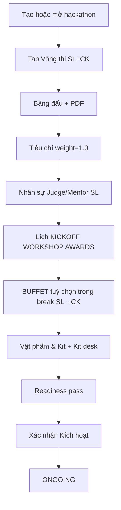

# GĐ1 — Defense Playbook: Setup & Kích hoạt (DRAFT → ONGOING)

> **Doc sync:** 2026-07-31 — Phases 0–11

> **Person 1** · ~17 phút · Slug: `seal-e2e-2026` (Mode B) · `seal-fall-2025-finished` (archive)  
> **Gate:** DRAFT → readiness pass → `ONGOING` · **Gate ra GĐ2:** status `ONGOING`, prelim inactive

---

## VÁCH NGĂN TRÌNH BÀY

### Điểm VÀO (Person 1 bắt đầu)

- **Trạng thái kỳ vọng:** Phase 0 xong — student `APPROVED`, login được.
- **Câu bàn giao:** «BTC đã duyệt tài khoản SV. Em bắt đầu từ **Tạo sự kiện** hoặc verify setup trên slug seed.»
- **Mode A:** Login Coord → `/hackathons` → mở `seal-e2e-2026` → **Thiết lập** (bỏ qua tạo mới).
- **Mode B:** Login Coord → **Tạo sự kiện** → setup đầy đủ từ DRAFT.

### Điểm RA (Person 1 → bàn giao Person 2)

- **Thao tác UI cuối:** **Xác nhận Kích hoạt** (header setup).
- **Verify:** Toast success; banner `EventContextBanner` tag **Đang diễn ra**; tab **Vòng thi** — Sơ loại **chưa** Active.
- **Câu chốt:** «Tới đây hackathon đã ONGOING, đăng ký mở — chưa kích hoạt vòng Sơ loại. Xin mời Person 2 phần đội và bốc thăm.»

---

## 1. Phạm vi & trình bày hội đồng

| Hạng mục | Nội dung |
|----------|----------|
| Phạm vi | Tạo/cấu hình hackathon: vòng, bảng, tiêu chí, nhân sự, lịch sự kiện (+ BUFFET trong break SL→CK), kit, `individual_ranking` / `appeal_window_minutes`, readiness, kích hoạt ONGOING |
| Gate vào | Student APPROVED (Phase 0) |
| Gate ra | `PATCH status → ONGOING` |
| Thời lượng | Bối cảnh 2p + Happy 12p + Sabotage 5p + Code map 3p |

---

## 2. Slug & tài khoản

| Slug | Mục đích | Account |
|------|----------|---------|
| `seal-e2e-2026` | Verify setup / Mode B continuous | `coord@fpt.edu.vn` |
| `seal-fall-2025-finished` | Archive read-only (cuối demo) | `student.archive.fall2025@fpt.edu.vn` |

---

## 3. DataInitializer & seeders

| Seeder | Vai trò |
|--------|---------|
| `DataInitializer` | Orchestrate **6** happy slugs (`DevSeedCatalog.ALL_DEV_HACKATHON_SLUGS`) |
| `Gd1DataSeeder` | Structure `seal-e2e-2026`: 2 rounds, 3 tracks, criteria, events |
| `E2eWorkflowDataSeeder` | 7 đội + 3 orphan (GĐ2, chưa chạy ở GĐ1) |
| `HackathonDevSeedHelper` | Repair timeline theo `LocalDate.now()` |

Restart BE → log `6 happy slugs: seal-e2e-2026, seal-fall-2025-finished, …`; `repairForFeTesting()` sync lịch; không hard-code ngày.

---

## 4. Userflow GĐ1

---

## 5. Bảng URL FE

| Việc | URL / nhãn |
|------|------------|
| Danh sách | `/hackathons` — **Tạo sự kiện** |
| Setup | `/hackathons/{id}/setup?tab=...` |
| Tabs | **Cấu hình chung**, **Vòng thi**, **Bảng đấu**, **Tiêu chí đánh giá**, **Nhân sự**, **Lịch trình & Sự kiện**, **Vật phẩm & Kit** (`setup?tab=kits`) |
| Tabs phụ (sau ONGOING / GĐ2+) | **Bốc thăm & khai mạc** (`?tab=lottery`), **Cấu hình Chung kết** (`?tab=final-config`) |
| Kit desk | `/coordinator/kit-desk` — phát / thu hồi kit |
| Kích hoạt | Header: **Xác nhận Kích hoạt** |
| Archive SV | `/student/results` |

---

## 6. Happy path (G1-H01 … G1-H13)

| ID | Loại | Role | URL / Màn hình | Thao tác UI | Kết quả UI kỳ vọng | ErrorCode | FE | BE |
|----|------|------|----------------|-------------|-------------------|-----------|----|----|
| G1-H01 | Happy | Coord | `/hackathons/create` | Điền tên, mùa, **năm editable**, slug → **Lưu** | Redirect setup; status **Bản nháp** | — | `HackathonCreatePage` | `HackathonController.create` |
| G1-H02 | Happy | Coord | `setup?tab=rounds` | **Thêm vòng thi** ×2: Sơ loại + Chung kết → **Lưu** | 2 vòng hiển thị; CK shell có criteria placeholder | — | `RoundManagementPage` | `RoundController` |
| G1-H03 | Happy | Coord | `setup?tab=tracks` | **Thêm bảng** + **Upload PDF** đề SL | Track list; PDF icon/link | — | `TrackManagementPage` | `TrackController` |
| G1-H04 | Happy | Coord | `setup?tab=criteria` | Thêm tiêu chí; Collapse mô tả; tổng **trọng số = 1.0** | Tag xanh 100%; **Lưu** OK | — | `CriteriaManagementPage` | `CriteriaController` |
| G1-H05 | Happy | Coord | `setup?tab=people` | Gán Judge **INTERNAL** + Mentor vào track SL | Bảng nhân sự cập nhật | — | `PeopleManagementPage` | `JudgeAssignmentController` |
| G1-H06 | Happy | Coord | `setup?tab=events` | **Thêm** KICKOFF → WORKSHOP → (khuyến nghị) AWARDS | Timeline 3 milestone; POST order đúng | — | `EventManagementPage` | `EventController` |
| G1-H07 | Happy | Coord | Setup header | Hover readiness → **Xác nhận Kích hoạt** | Toast success; banner **Đang diễn ra** | — | `HackathonSetupPage` | `HackathonStatusController` |
| G1-H08 | Happy | Student | `/student/results` | Login archive `student.archive.fall2025@` | BXH/giải read-only; không nút mutate | — | `StudentResultsPage` | `HackathonClosureController` (GET) |
| G1-H09 | Happy | Coord | `setup?tab=kits` | **Vật phẩm & Kit** — thêm món (+ dáng UNISEX cho áo) + upsert tồn kho theo `(fit,size)` + tạo **combo** mặc định | Inventory + combo list; stock theo dáng/size | — (`KIT_*` / `KIT_ITEM_NAME_REQUIRED`) | `KitInventoryPage` | `KitController` |
| G1-H10 | Happy | Coord | `/coordinator/kit-desk` | Chọn SV ACCEPTED → **Phát combo** (hoặc món lẻ) / **Thu hồi**; xem đối chiếu nhu cầu | Allocation cập nhật; toast issued/skipped | — (`KIT_OUT_OF_STOCK` / `KIT_ALREADY_ISSUED`) | `KitDistributionPage` | `KitController` (`issue` / `issue-bundle` / `reconciliation`) |
| G1-H11 | Happy | Coord | `setup?tab=events` | Tạo **BUFFET** trong [prelimEnd, final.examAt] + PUT thực đơn | Timeline buffet + menu | — (`EVENT_BUFFET_*`) | `EventManagementPage` | `EventController` / `BuffetMenuController` |
| G1-H12 | Happy | Coord | `setup?tab=general` | Bật/tắt **individual_ranking_enabled** (DRAFT) → **Lưu** | Flag lưu; GĐ6 mới tính BXH cá nhân nếu bật | — | `HackathonForm` / `HackathonGeneralConfig` | `HackathonController` |
| G1-H13 | Happy | Coord | `setup?tab=general` | Đặt **appeal_window_minutes** (default 30, min 10, **0 = tắt**) | Giá trị lưu; ONGOING: PATCH riêng trước prelim publish | — (`APPEAL_WINDOW_BELOW_MINIMUM`) | `HackathonForm` / `HackathonGeneralConfig` | `PATCH /hackathons/{id}/appeal-window-minutes` |

**Mode A shortcut:** G1-H02…H07 (+ H09–H13 verify) trên `seal-e2e-2026` — verify tab đã seed, chỉ demo H07 nếu cần.

---

## 7. Alternative path

| ID | Mô tả | Thao tác | Kỳ vọng |
|----|-------|----------|---------|
| G1-A01 | Nhân bản sự kiện | Card → **Nhân bản** → đổi năm/mùa | Clone DRAFT; lịch vòng = null |
| G1-A02 | Readiness tooltip | Thiếu 1 blocker → hover nút Kích hoạt | Tooltip liệt kê blockers |
| G1-A03 | Mode A verify | Mở `seal-e2e-2026` setup | Đủ tab; prelim inactive |
| G1-A04 | Appeal window ONGOING | Sau H07, trước publish SL: sửa phút cửa sổ khiếu nại | `PATCH …/appeal-window-minutes` OK; sau prelim publish → locked |

---

## 8. Bad path (G1-B01 … G1-B06)

| ID | Loại | Role | URL | Thao tác UI | Kết quả UI | ErrorCode | FE | BE |
|----|------|------|-----|-------------|------------|-----------|----|----|
| G1-B01 | Bad | Coord | `setup?tab=events` | POST WORKSHOP khi chưa KICKOFF | Toast 422 | `EVENT_KICKOFF_MISSING` | `EventManagementPage` | `EventController` |
| G1-B02 | Bad | Coord | `setup?tab=events` | POST AWARDS khi chỉ có KICKOFF | Toast 422 | `EVENT_ORDER_VIOLATION` | `EventManagementPage` | `EventController` |
| G1-B03 | Bad | Coord | Setup header | Thiếu KICKOFF → click Kích hoạt | Nút **disabled** + tooltip blockers | `READINESS_NOT_PASSED` | `HackathonSetupPage` | `ReadinessService` |
| G1-B04 | Bad | Coord | `setup?tab=criteria` | Tổng weight ≠ 1.0 → Lưu | Validation đỏ / không pass readiness | — | `CriteriaManagementPage` | `CriteriaController` |
| G1-B05 | Bad | Coord | `setup?tab=rounds` | Xóa vòng CK → readiness | Blocker `MISSING_FINAL_ROUND` | `MISSING_FINAL_ROUND` | `RoundManagementPage` | `ReadinessService` |
| G1-B06 | Bad | Coord | `setup?tab=events` | Đặt BUFFET ngoài khung nghỉ SL→CK | Toast 422 | `EVENT_BUFFET_OUT_OF_BREAK` | `EventManagementPage` | `EventController` / `BuffetWindowRule` |

---

## 9. Sabotage (G1-S01 … G1-S07)

| ID | Loại | Role | URL | Thao tác (cố ý phá) | Kết quả UI (chặn đúng) | ErrorCode | FE | BE |
|----|------|------|-----|---------------------|------------------------|-----------|----|----|
| G1-S01 | Sabotage | Coord | Events | Tạo AWARDS trước WORKSHOP | 422 toast | `EVENT_ORDER_VIOLATION` | `EventManagementPage` | `EventController` |
| G1-S02 | Sabotage | Coord | Events | WORKSHOP cùng ngày KICKOFF | 422 | `EVENT_ORDER_VIOLATION` | `EventManagementPage` | `EventController` |
| G1-S03 | Sabotage | Coord | Rounds | Xóa Final Round → activate | Disabled / 422 | `MISSING_FINAL_ROUND` | `RoundManagementPage` | `HackathonStatusController` |
| G1-S04 | Sabotage | Coord | Setup | Activate khi DRAFT thiếu track | Disabled + tooltip | `READINESS_NOT_PASSED` | `HackathonSetupPage` | `ReadinessService` |
| G1-S05 | Sabotage | Coord | People | Gán **guest** vào track SL | Toast reject | `EXTERNAL_JUDGE_NOT_ALLOWED_IN_PRELIM` | `PeopleManagementPage` | `JudgeAssignmentController` |
| G1-S06 | Sabotage | Coord | People | Gán FINAL_EXTERNAL ở GĐ1 | Toast reject | `JUDGE_FINAL_AT_PHASE1` | `PeopleManagementPage` | `JudgeAssignmentController` |
| G1-S07 | Sabotage | Coord | Rounds | Xóa CK rồi cố publish round | Gate fail | `MISSING_FINAL_ROUND` | `RoundManagementPage` | `RoundController` |

---

## 10. Map source FE + BE

| Layer | File chính |
|-------|------------|
| FE Setup | `features/hackathons/pages/HackathonSetupPage.jsx` |
| FE General / form | `HackathonForm.jsx`, `HackathonGeneralConfig.jsx` (`individual_ranking_enabled`, `appeal_window_minutes`) |
| FE Events | `features/events/pages/EventManagementPage.jsx` (EventType.BUFFET + menu) |
| FE Rounds/Tracks/Criteria | `RoundManagementPage`, `TrackManagementPage`, `CriteriaManagementPage` |
| FE People | `PeopleManagementPage` |
| FE Kits | `KitInventoryPage` (`?tab=kits` — combo + reconciliation), `KitDistributionPage` (`/coordinator/kit-desk` — phát combo) |
| BE Hackathon | `HackathonController` (create/update + `PATCH /{id}/appeal-window-minutes`), `HackathonStatusController` |
| BE Readiness | `ReadinessService` / `GET .../readiness?target=ONGOING` → `READINESS_NOT_PASSED` |
| BE Events | `EventController` + `BuffetMenuController` + `BuffetWindowRule` (`EVENT_BUFFET_OUT_OF_BREAK`, `EVENT_BUFFET_DUPLICATE`, `BUFFET_LOCKED_AFTER_PUBLISH`); thay đổi event → `StakeholderBroadcastService` |
| BE Kits | `KitController` (`issue` / `issue-bundle` / `reconciliation`; `KIT_OUT_OF_STOCK`, `KIT_ALREADY_ISSUED`, `KIT_BUNDLE_EMPTY`, `KIT_ITEM_IN_BUNDLE`, `KIT_ITEM_NAME_REQUIRED`) |
| BE Rounds/Tracks/Criteria | `RoundController`, `TrackController`, `CriteriaController` |

---

## 11. Checklist smoke trước bục

- [ ] BE log `6 happy slugs`
- [ ] FE `localhost:5173` OK
- [ ] Coord login + banner hiện đúng kỳ
- [ ] `seal-e2e-2026` setup mở được
- [ ] Tab **Vật phẩm & Kit** + `/coordinator/kit-desk` mở được (nếu `app.kits.enabled`); seed có combo + tồn UNISEX
- [ ] Nút **Xác nhận Kích hoạt** sáng (hoặc biết blocker để demo B03)
- [ ] Ghi `hackathonId` lên phiếu
- [ ] Person 2 đã login sẵn tab `/teams`

---

## 12. FAQ hội đồng

| Câu hỏi | Trả lời / File |
|---------|----------------|
| ONGOING có cần AWARDS event? | Không — chỉ cần KICKOFF (+ WS khuyến nghị). AWARDS cho GĐ6. |
| Khác gì «Kích hoạt Vòng thi» GĐ2? | ONGOING = mở đăng ký; activate round = mở thi Sơ loại (Gate 2). |
| Guest judge ở GĐ1? | Chỉ INTERNAL trên SL; guest chỉ CK (GĐ4). |
| Archive demo khi nào? | Cuối phần P1, không chặn handoff GĐ2. |
| Readiness API? | `gd1-full-test-matrix-and-seeds.md` §1.2 Gate G1–G5; ErrorCode `READINESS_NOT_PASSED` |
| Certificates còn không? | **Không** — đã xóa (Phase 9). Không còn phát/certificate API. |
| Ranking cá nhân / giải năm? | **Còn** — `individual_ranking_enabled` (GĐ1 config) + annual awards (portal SV); không phụ thuộc certificates. |
| `appeal_window_minutes`? | Cấu hình độ dài cửa sổ khiếu nại DQ **sau publish SL (GĐ4)**. Default **30**; min **10** khi bật; **0 = tắt**. ONGOING: `PATCH /hackathons/{id}/appeal-window-minutes` trước prelim publish. |
| Buffet? | `EventType.BUFFET` trong [prelimEnd, final.examAt]; max 1/hackathon; khóa sau prelim publish (`BUFFET_LOCKED_AFTER_PUBLISH`). |
