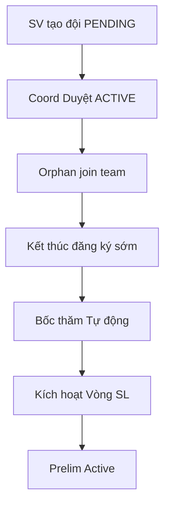

# GĐ2 — Defense Playbook: Đăng ký · Đội · Bốc thăm · Kích hoạt Sơ loại

> **Doc sync:** 2026-07-31 — Phases 0–11

> **Person 2** · ~15 phút · Slug: `seal-e2e-2026` (duy nhất — không có slug GĐ2 riêng)  
> **Gate vào:** ONGOING, prelim inactive · **Gate ra GĐ3:** prelim `is_active=true`

---

## VÁCH NGĂN TRÌNH BÀY

### Điểm VÀO (Person 2 bắt đầu)

- **Trạng thái kỳ vọng:** Person 1 vừa **Xác nhận Kích hoạt** — hackathon `ONGOING`, đăng ký mở, vòng SL chưa active.
- **Câu bàn giao:** «Hackathon đã ONGOING. Em tiếp từ **Quản lý đội** — duyệt đội, đóng đăng ký, bốc thăm, kích hoạt Sơ loại.»
- **Mode A:** Tiếp `seal-e2e-2026` (7 đội ACTIVE seed sẵn).
- **Mode B:** Cùng hackathon Person 1 vừa tạo — hoặc `seal-e2e-2026`.

### Điểm RA (Person 2 → bàn giao Person 3)

- **Thao tác UI cuối:** Tab **Vòng thi** → **Kích hoạt Vòng thi** (Sơ loại) → modal xác nhận **KEEP** (examAt ≤ now; nếu còn future thì dùng «Dời lịch thi» trước). → Xác nhận.
- **Verify:** Round Sơ loại badge **Active**; đội `is_locked=true`; lottery đã gán track/bảng.
- **Câu chốt:** «Vòng Sơ loại đã active — chưa phát đề / chưa nộp bài. Xin mời Person 3 phần thi Sơ loại.»  
- **Mode A Person 3:** Mở slug `seal-gd3-prelim-open`.

---

## 1. Phạm vi & trình bày

| Hạng mục | Nội dung |
|----------|----------|
| Phạm vi | SV tạo đội, mời thành viên, Coord duyệt, orphan, đóng ĐK sớm, dời hạn ĐK, lottery, activate prelim |
| Gate vào | G-2.1 ONGOING; G-2.2 registration mở; G-2.3 prelim chưa active |
| Gate ra | G-3.2 `PATCH /rounds/{prelimId}/activate` |
| Thời lượng | 2p + 12p + 5p + 3p |

---

## 2. Slug & tài khoản

| Slug | Teams | Account |
|------|-------|---------|
| `seal-e2e-2026` | `E2E-T01`…`T07` ACTIVE; 3 orphan | Coord: `coord@fpt.edu.vn` |
| | | SV leader: `student.e2e.t01.leader@fpt.edu.vn` |
| | | Orphan: `student.e2e.orphan1@fpt.edu.vn` |

Password: `Coordinator@dev1` / `Student@dev1`.

---

## 3. DataInitializer & seeders

| Seeder | Vai trò |
|--------|---------|
| `E2eWorkflowDataSeeder` | 7 đội + 3 orphan; chưa lock, chưa lottery |
| `HackathonRegistrationCloseServiceImpl` | Close-reg + preview lịch |
| `HackathonRegistrationExtensionServiceImpl` | Dời hạn đăng ký (+ cascade tùy chọn) |
| `CompetitionScheduleAdjustService` | Dời lịch thi (optional) |

`repairForGd2Testing()` — registration còn mở sau restart.

---

## 4. Userflow GĐ2

---

## 5. Bảng URL FE

| Việc | URL / nhãn |
|------|------------|
| Quản lý đội | `/teams?hackathonId={id}` — **Duyệt** |
| Đóng ĐK | Setup → **Cấu hình chung** → **Kết thúc đăng ký sớm** |
| Dời hạn đăng ký | Setup → **Cấu hình chung** → **Dời hạn đăng ký** (cạnh nút đóng ĐK sớm) |
| Lottery | Tab **Bốc thăm & khai mạc** → **Bốc thăm Tự động** |
| Activate | Tab **Vòng thi** → **Kích hoạt Vòng thi** |
| SV portal | `/student/...` tạo đội, accept invite |

---

## 6. Happy path (G2-H01 … G2-H11)

| ID | Loại | Role | URL | Thao tác UI | Kết quả UI | ErrorCode | FE | BE |
|----|------|------|-----|-------------|------------|-----------|----|----|
| G2-H01 | Happy | Student | Student portal | **Tạo đội** → điền tên | Status **Chờ duyệt** (PENDING) | — | `StudentTeamPage` | `StudentTeamController` |
| G2-H02 | Happy | Student | Invite flow | Mời email thành viên → member **Chấp nhận** | Roster đủ người | — | `InvitationCard` / student invitations | `InvitationController` |
| G2-H03 | Happy | Coord | `/teams` | Chọn đội PENDING → **Duyệt** | Tag **ACTIVE** | — | `CoordinatorTeamPage` | `TeamController` |
| G2-H04 | Happy | Student | Orphan login | Orphan accept invite vào `E2E-T01` | Vào roster đội | — | `InvitationCard` / student invitations | `InvitationController` |
| G2-H05 | Happy | Coord | `setup?tab=general` | **Kết thúc đăng ký sớm** → chọn giờ SL → preview (Collapse quy tắc) → **Xác nhận** | Modal kết quả; thẻ số đội | — | `HackathonGeneralConfig` | `HackathonRegistrationCloseServiceImpl` |
| G2-H06 | Happy | Coord | Modal kết quả | **Xử lý N đội đang chờ** (nếu có) → duyệt/từ chối | Không còn PENDING blocking | — | inline `Modal` trong `HackathonGeneralConfig` | `TeamController` |
| G2-H07 | Happy | Coord | Tab **Bốc thăm** | **Bốc thăm Tự động** (Cho đội chưa có) | Track + `assignedGroup` hiển thị | — | `LotteryManagementPage` | `HackathonLotteryServiceImpl` |
| G2-H08 | Happy | Coord | Tab **Vòng thi** | **Kích hoạt Vòng thi** (Sơ loại) → `ActivateScheduleModal` xác nhận KEEP (examAt ≤ now; dời lịch trước nếu cần) | Round SL **Active** | — | `RoundManagementPage` / `ActivateScheduleModal` | `RoundActivationService` |
| G2-H09 | Happy | Coord | Radar panel | `/teams` — **Radar & Giải cứu đội thi** | Orphan + đội thiếu/thừa người | — | `TeamRadarPanel` | `TeamQueryService` |
| G2-H10 | Happy | Coord | Tab **Vòng thi** | (Tuỳ chọn) **Dời lịch thi** nếu chưa `scheduleAdjustedAt` | Preview adjust OK | — | `CompetitionScheduleAdjustModal` | `CompetitionScheduleAdjustService` |
| G2-H11 | Happy | Coord | `setup?tab=general` | **Dời hạn đăng ký** → `CompetitionScheduleAdjustModal` mode `extend-reg` → preview → xác nhận | `registrationEnd` mới; (tuỳ chọn) cascade lịch | — | `HackathonGeneralConfig` / `CompetitionScheduleAdjustModal` | `HackathonRegistrationExtensionServiceImpl` — `POST /hackathons/{id}/registration/extension/preview` + `/extension` |

**Ghi chú broadcast:** `StakeholderBroadcastService` fan-out khi **dời hạn ĐK** (`/extension`), **dời lịch thi** (`CompetitionScheduleAdjustService`), và cascade lịch khi **đóng ĐK sớm** (`apply` qua close-reg).

**ErrorCodes dời hạn ĐK:** `REGISTRATION_EXTENSION_LIMIT_REACHED`, `REGISTRATION_EXTENSION_INVALID_DATE`, `REGISTRATION_EXTENSION_TIMELINE_CONFLICT`, `REGISTRATION_ALREADY_CLOSED`.

---

## 7. Alternative path

| ID | Mô tả | Kỳ vọng |
|----|-------|---------|
| G2-A01 | Re-lottery trước activate | Đổi track được |
| G2-A02 | Modal đóng ĐK — Collapse «Quy tắc lịch» | UX hiển thị quy tắc |
| G2-A03 | Seed 7 đội sẵn Mode A | Bỏ H01–H03, bắt từ H05 |
| G2-A04 | (Tuỳ chọn) Judge/Mentor decline assignment **trước** round active | `PATCH /me/judge/assignments/{id}/decline`, `/me/mentor/assignments/{id}/decline`, `/me/mentor/team-assignments/{id}/decline` — OK; sau activate → `ASSIGNMENT_DECLINE_TOO_LATE` |

---

## 8. Bad path (G2-B01 … G2-B05)

| ID | Loại | Role | URL | Thao tác | Kết quả UI | ErrorCode | FE | BE |
|----|------|------|-----|----------|------------|-----------|----|----|
| G2-B01 | Bad | Coord | Lottery | Lottery khi còn đội PENDING | Nút disabled / toast | `TEAMS_PENDING_APPROVAL` | `LotteryManagementPage` | `PendingTeamGateService` |
| G2-B02 | Bad | Coord | Close-reg | Đóng ĐK lần 2 | Toast đã đóng | `REGISTRATION_ALREADY_CLOSED` | `HackathonGeneralConfig` | `HackathonRegistrationCloseServiceImpl` |
| G2-B03 | Bad | Coord | Lottery | Re-lottery sau activate SL | 422 toast | `ROUND_ALREADY_ACTIVE` | `LotteryManagementPage` | `HackathonLotteryServiceImpl` |
| G2-B04 | Bad | Student | Portal | Tạo đội sau đóng ĐK | Toast reject | `REGISTRATION_CLOSED` | `StudentTeamPage` | `StudentTeamController` |
| G2-B05 | Bad | Coord | Lottery | Bốc thăm khi chưa lock roster ACTIVE | Gate message | `ACTIVE_TEAMS_NOT_LOCKED` | `LotteryManagementPage` | `HackathonLotteryServiceImpl` / `canRunLottery` |

**Lottery gates (tóm tắt):** `TEAMS_PENDING_APPROVAL` (còn PENDING), `ACTIVE_TEAMS_NOT_LOCKED` (ACTIVE chưa lock), `REGISTRATION_CLOSED` (giai đoạn ĐK chưa kết thúc — tên code lịch sử), `ROUND_ALREADY_ACTIVE` (re-lottery sau activate). Per-team unlock khi gửi assignment tay: `TEAM_NOT_LOCKED`.

---

## 9. Sabotage (G2-S01 … G2-S06)

| ID | Loại | Role | URL | Thao tác (cố ý) | Kết quả (chặn) | ErrorCode | FE | BE |
|----|------|------|-----|-----------------|----------------|-----------|----|----|
| G2-S01 | Sabotage | Coord | Lottery | Lottery trước close-reg | Disabled / 422 | `REGISTRATION_CLOSED` | `LotteryManagementPage` | `HackathonLotteryServiceImpl` |
| G2-S02 | Sabotage | Coord | Close-reg | Double close-reg | 422 | `REGISTRATION_ALREADY_CLOSED` | `HackathonGeneralConfig` | `HackathonRegistrationCloseServiceImpl` |
| G2-S03 | Sabotage | Coord | Lottery | Re-lottery sau activate | 422 | `ROUND_ALREADY_ACTIVE` | `LotteryManagementPage` | `HackathonLotteryServiceImpl` |
| G2-S04 | Sabotage | Student | Portal | Orphan tạo đội thứ 2 | 422 | `USER_IN_ANOTHER_TEAM` | `StudentTeamPage` | `StudentTeamController` |
| G2-S05 | Sabotage | Coord | Schedule | Adjust quá muộn (<4 ngày KO) | Toast reject | — | `CompetitionScheduleAdjustModal` | `CompetitionScheduleAdjustService` |
| G2-S06 | Sabotage | Coord | Activate | Activate khi chưa lottery / track trống đội | Readiness / 422 | `TRACK_EMPTY_TEAMS` / `NO_TEAMS_IN_ROUND` | `RoundManagementPage` / `ActivateScheduleModal` | `RoundActivationService` |

---

## 10. Map source FE + BE

| Layer | File |
|-------|------|
| FE Teams | `features/coordinator/` (`CoordinatorTeamPage`, `TeamRadarPanel`) |
| FE Close-reg / Extend-reg | `HackathonGeneralConfig` (inline result `Modal`); `CompetitionScheduleAdjustModal` (`close-reg` \| `extend-reg`) |
| FE Lottery | `LotteryManagementPage` |
| FE Activate | `RoundManagementPage`, `ActivateScheduleModal` |
| FE Schedule | `CompetitionScheduleAdjustModal` (`adjust`) |
| FE Invite | `InvitationCard`, student invitations |
| BE Teams | `TeamController`, `StudentTeamController` |
| BE Invite | `InvitationController` |
| BE Lottery | `HackathonLotteryServiceImpl`, `PendingTeamGateService` |
| BE Close-reg | `HackathonRegistrationCloseServiceImpl` |
| BE Extend-reg | `HackathonRegistrationExtensionServiceImpl` |
| BE Schedule | `CompetitionScheduleAdjustService.adjust` / `.apply` |
| BE Broadcast | `StakeholderBroadcastService` (extend / adjust / close-reg cascade) |
| BE Decline | `JudgeMeController` / `MentorMeController` → `AssignmentResponseService` |

---

## 11. Checklist smoke

- [ ] `seal-e2e-2026` ONGOING, prelim inactive
- [ ] 7 đội ACTIVE (hoặc demo tạo mới H01–H03)
- [ ] Tab Bốc thăm hiện sau close-reg
- [ ] Person 3 đã mở `seal-gd3-prelim-open` (Mode A)
- [ ] Ghi `prelimRoundId`

---

## 12. FAQ hội đồng

| Câu hỏi | Trả lời |
|---------|---------|
| Tại sao không slug GĐ2 riêng? | GĐ1–2 cùng `seal-e2e-2026`; E2eWorkflowDataSeeder tách state GĐ2. |
| Track vs Bảng? | Track = chủ đề; `assignedGroup` = bảng trong track. |
| KEEP vs «Dời lịch thi»? | KEEP = kích hoạt giữ lịch đã xếp (examAt ≤ now). Muốn giờ sớm hơn → toolbar «Dời lịch thi» (1 lần). ~~START_NOW đã gỡ (phase 2).~~ |
| Close-reg có hoàn tác? | Không — modal cảnh báo trước khi xác nhận. |
| Dời hạn ĐK khác close-reg? | **Dời hạn** = kéo `registrationEnd` (giới hạn số lần + gap lịch). **Đóng sớm** = khóa cổng + cascade giờ SL. Đã đóng → `REGISTRATION_ALREADY_CLOSED`. |
| Ai nhận email khi đổi lịch/ĐK? | `StakeholderBroadcastService` trên extend / adjust / cascade close-reg. |

**Docs:** `gd2-full-test-matrix-and-seeds.md`, `qa-test-cases` Feature A.
