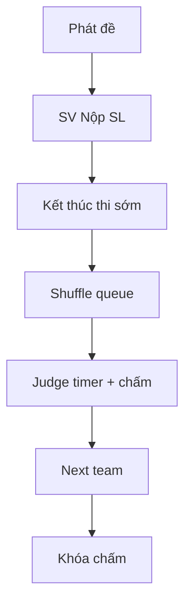

# GĐ3 — Defense Playbook: Sơ loại Live (Nộp · Queue · Timer · Chấm · Khóa)

> **Doc sync:** 2026-07-31 — Phases 0–11

> **Person 3** · ~18 phút · Slug: `seal-e2e-2026` (continuous sau activate SL)  
> **Gate vào:** lottery xong, round SL active, đề có thể release · **Gate ra GĐ4:** SL `scoring_locked=true`

---

## VÁCH NGĂN TRÌNH BÀY

### Điểm VÀO (Person 3 bắt đầu)

- **Trạng thái kỳ vọng:** Person 2 vừa **Kích hoạt Vòng thi (Sơ loại)** — round Active, đội locked, lottery xong.
- **Câu bàn giao:** «Vòng Sơ loại đã active. Em bắt từ **Phát đề** / SV **Nộp bài Sơ loại**, rồi queue, chấm, khóa.»
- **Mode A / Mode B:** Cả hai trên **`seal-e2e-2026` continuous** (sau GĐ2). ~~`seal-gd3-prelim-open` / `Gd3PrelimOpenDataSeeder`~~ — **đã gỡ**.

### Điểm RA (Person 3 → bàn giao Person 4)

- **Thao tác UI cuối:** Tab **Vòng thi** → **Khóa chấm điểm** → **Xác nhận Khóa**.
- **Verify:** SL scoring locked; nút lock disabled; không còn chấm mới.
- **Câu chốt:** «Sơ loại đã khóa chấm — chưa công bố kết quả. Xin mời Person 4 phần chuyển vòng và Chung kết.»  
- **Mode A Person 4:** Tiếp **cùng** `seal-e2e-2026` sau lock SL.

---

## 1. Phạm vi & trình bày

| Hạng mục | Nội dung |
|----------|----------|
| Phạm vi | Phát đề, nộp SL, end-early / close-submission-early, queue shuffle, timer, judge chấm/chốt, mentor, late review, GitHub metadata, lock scoring |
| Gate vào | G-3.4 prelim `is_active=true`; teams locked |
| Gate ra | `PATCH .../lock-scoring` prelim |
| Thời lượng | 2p + 12p + 5p + 3p |

**Lưu ý demo:** Pre-record queue/timer nếu mạng chậm; WebSocket STOMP cho live scoring.

**Fallback:** `superadmin@fpt.edu.vn` — **Mở lại khóa chấm** nếu demo kẹt (chỉ SUPERADMIN).

---

## 2. Slug & tài khoản

| Slug | State | Account |
|------|-------|---------|
| `seal-e2e-2026` | Prelim active (sau GĐ2); 6 đội × 2 track | Coord: `coord@fpt.edu.vn` |
| | Leaders nộp | `student.e2e.t01.leader@` … `t06` |
| | Judges | `judge1@`…`judge4@` / `Judge@dev1` |
| | Mentors | `mentor@`…`mentor3@` / `Mentor@dev1` |

---

## 3. DataInitializer & seeders

| Seeder | Vai trò |
|--------|---------|
| *(không seeder GĐ3 riêng)* | State GĐ3 = continuous trên `seal-e2e-2026` sau activate SL |
| `E2eDevFlowGuard` | Bảo vệ không reset về GĐ2 khi restart |

~~`Gd3PrelimOpenDataSeeder`~~ / ~~`app.seed.gd3.enabled`~~ — **đã gỡ**.

---

## 4. Userflow GĐ3

---

## 5. Bảng URL FE

| Việc | URL / nhãn |
|------|------------|
| Phát đề | Tab **Vòng thi** — **Phát đề bài** / **Phát tất cả** |
| Nộp SV | `/student/submit` tab **Sơ loại** — **Nộp bài Sơ loại** |
| End-early | **Kết thúc thời gian thi sớm** → confirm khi **mọi đội đã nộp** (`POST /rounds/{id}/close-submission-early`); notify SV/judge/mentor |
| Queue | `/presentation/queue?roundId=` — **Khởi Động Máy Quay Số** |
| Controller | **Chuyển quyền điều phối đồng hồ** |
| Judge | `/judge/dashboard` — **Vào phòng chấm thi** |
| Chấm | **Bắt đầu tính giờ** → TT → Hỏi đáp → **HOÀN TẤT & CHỐT SỔ ĐIỂM** |
| Next | **Kết thúc & gọi đội kế tiếp** |
| Lock | **Khóa chấm điểm** |
| Late | `/coordinator/late-submissions?roundId=` |
| Mentor | `/mentor/support?roundId=` |

---

## 6. Happy path (G3-H01 … G3-H14)

| ID | Loại | Role | URL | Thao tác UI | Kết quả UI | ErrorCode | FE | BE |
|----|------|------|-----|-------------|------------|-----------|----|----|
| G3-H01 | Happy | Coord | Vòng thi | **Phát đề bài** / **Phát tất cả** | SV thấy đề; early-wait → disabled đến giờ | — | `RoundManagementPage` | `RoundProgressionController` |
| G3-H02 | Happy | Student | `/student/submit` | Tab **Sơ loại** → repo + PDF → **Nộp bài Sơ loại** | Toast success; status SUBMITTED | — | `StudentSubmissionPage` | `SubmissionController` |
| G3-H03 | Happy | Coord | Vòng thi | **Kết thúc thời gian thi sớm** → confirm (đủ nộp) | Modal KHÔNG HOÀN TÁC; cổng đóng; notify | — | `RoundManagementPage` | `RoundProgressionController` — `POST /rounds/{id}/close-submission-early` |
| G3-H04 | Happy | Coord | `/presentation/queue` | **Khởi Động Máy Quay Số** | Queue order hiển thị | — | `PresentationQueuePage` | `PresentationQueueController` |
| G3-H05 | Happy | Coord | Queue | **Chuyển quyền điều phối đồng hồ** | Judge nhận quyền controller | — | `PresentationQueuePage` | `PresentationTimerController` |
| G3-H06 | Happy | Judge | `/judge/dashboard` | **Vào phòng** → **Bắt đầu tính giờ** | Timer PRESENTING | — | `JudgeScoringWorkspace` | `PresentationTimerController` |
| G3-H07 | Happy | Judge | Workspace | TT → **Hỏi đáp** → chấm rubric Collapse | Progress X/Y GK chốt | — | `JudgeTimerAndControls` | `ScoreController` |
| G3-H08 | Happy | Judge | Workspace | **HOÀN TẤT & CHỐT SỔ ĐIỂM** | Slot chuyển ENDED | — | `JudgeScoringWorkspace` | `ScoreController` |
| G3-H09 | Happy | Judge | Workspace | **Kết thúc & gọi đội kế tiếp** | Queue next team | — | `JudgeTimerAndControls` | `PresentationQueueController` |
| G3-H10 | Happy | Coord | Vòng thi | **Khóa chấm điểm** → Xác nhận | Locked badge; hackathon vẫn ONGOING | — | `RoundManagementPage` | `RoundProgressionController` |
| G3-H11 | Happy | Mentor | `/mentor/support?roundId=` | Xem đội được gán — tab **Bài nộp** / **Điểm** | Read-only mentor view | — | `MentorSupportPage` | `MentorMeController` |
| G3-H12 | Happy | Coord | `/coordinator/late-submissions?roundId=` | Duyệt `LATE_PENDING` → Approve | SV submission gradable | — | `LateSubmissionReviewPage` | `SubmissionController.reviewLate` |
| G3-H13 | Happy | Student / Judge | Submit / Workspace | Sau nộp / khi chấm — panel GitHub repo | Metadata repo + commits | — | `GitHubRepoPanel` | `GET /submissions/{id}/github` — `SubmissionMetadataService` / `GitHubApiClient` |
| G3-H14 | Happy | Coord | Queue | Early-close rồi shuffle | Shuffle OK (window đóng qua `submissionClosedEarlyAt`) | — | `PresentationQueuePage` | `RoundSubmissionWindow` + `PresentationQueueController` |

---

## 7. Alternative path

| ID | Mô tả | Kỳ vọng |
|----|-------|---------|
| G3-A01 | Skip no-show | **Bỏ qua đội** trên queue |
| G3-A02 | Q&A warning | Alert khi ≤ 1/3 thời lượng Q&A còn lại |
| G3-A03 | Continuous skip nộp | Đã nộp một phần — chỉ demo leader còn lại |

---

## 8. Bad path (G3-B01 … G3-B07)

| ID | Loại | Role | URL | Thao tác | Kết quả UI | ErrorCode | FE | BE |
|----|------|------|-----|----------|------------|-----------|----|----|
| G3-B01 | Bad | Judge | Dashboard | Chấm trước end-early | Toast / disabled | `SCORING_NOT_OPEN` | `JudgeScoringWorkspace` | `ScoreController` |
| G3-B02 | Bad | Coord | Queue | Shuffle khi còn LATE_PENDING **hoặc** còn CODING | Nút disabled (FE late-pending gate) / 422 | `SUBMISSION_NOT_CLOSED_FOR_SHUFFLE` | `PresentationQueuePage` / `roundLifecycleGates` | `PresentationQueueController` via `RoundSubmissionWindow` + `RoundPhaseResolver` |
| G3-B03 | Bad | Judge | Workspace | Next khi chưa đủ GK chốt | Nút disabled / 422 nếu gọi tay | `SCORING_INCOMPLETE_BEFORE_NEXT` | `JudgeTimerAndControls` | `PresentationQueueController` |
| G3-B04 | Bad | Coord | Queue | Force-advance thiếu lý do | Validation / 422 | `VALIDATION_FAILED` | `PresentationQueuePage` | `PresentationQueueController` |
| G3-B05 | Bad | Student | Submit | Repo platform sai (drive.google) | Toast 422 | `INVALID_REPO_PLATFORM` | `StudentSubmissionPage` | `GitHubRepoValidator` |
| G3-B06 | Bad | Student | Submit | Thiếu PDF slide | Toast 422 | `SLIDE_FILE_REQUIRED` | `StudentSubmissionPage` | `SubmissionController` |
| G3-B07 | Bad | Coord | Timer | Trao quyền controller với expectedControllerJudgeId sai (race) | 409 | `CONTROLLER_CONFLICT` | `PresentationControllerCard` | `PresentationControllerServiceImpl#grantTrackController` |
| G3-B08 | Bad | Coord | Vòng thi | Kết thúc sớm khi còn đội chưa nộp | OK disabled / 422 | `TEAMS_NOT_ALL_SUBMITTED` | `RoundManagementPage` | `RoundProgressionServiceImpl#closeSubmissionEarly` |

---

## 9. Sabotage (G3-S01 … G3-S07)

| ID | Loại | Role | URL | Thao tác (cố ý) | Kết quả (chặn) | ErrorCode | FE | BE |
|----|------|------|-----|-----------------|----------------|-----------|----|----|
| G3-S01 | Sabotage | Judge | Dashboard | Chấm khi WAITING / chưa mở scoring | 422 | `SCORING_NOT_OPEN` | `JudgeScoringWorkspace` | `ScoreController` |
| G3-S02 | Sabotage | Student | Submit | SV đội khác xem submission | 403 / empty | IDOR | `StudentSubmissionPage` | `SubmissionController` |
| G3-S03 | Sabotage | Coord | People | Cùng user vừa mentor vừa judge conflict | Toast | `CONFLICT_MENTOR_JUDGE_SAME_TRACK` (assign) / `CONFLICT_SAME_TRACK` (activate) | `PeopleManagementPage` | `JudgeAssignmentController` / `RoundActivationService` |
| G3-S04 | Sabotage | Judge | Queue | Skip khi chưa ENDED | Disabled | — | `JudgeTimerAndControls` | `timerControlGates.js` |
| G3-S05 | Sabotage | Judge | Workspace | Pause timer abuse (non-controller) | Mất nút điều khiển | — | `JudgeTimerAndControls` | `PresentationTimerController` |
| G3-S06 | Sabotage | Coord | Activate | Mở coding khi chưa lottery (tay) | 422 | `TRACK_EMPTY_TEAMS` / `NO_TEAMS_IN_ROUND` | `RoundManagementPage` | `RoundActivationService` |
| G3-S07 | Sabotage | Judge | Dashboard | Guest judge login prelim | Không assignment SL | `EXTERNAL_JUDGE_NOT_ALLOWED_IN_PRELIM` | `JudgeDashboard` | `JudgeAssignmentController` |

---

## 10. Map source FE + BE

| Layer | File |
|-------|------|
| FE Judge | `JudgeScoringWorkspace`, `JudgeTimerAndControls`, `timerControlGates.js` |
| FE Queue | `PresentationQueuePage`, `roundLifecycleGates.js` (`canShuffleQueue`, `isSubmissionClosed`) |
| FE Submit | `StudentSubmissionPage`, `GitHubRepoPanel` |
| FE Rounds | `RoundManagementPage` |
| FE Mentor | `features/mentor/` |
| FE Late | `LateSubmissionReviewPage` |
| BE Submit | `SubmissionController` |
| BE GitHub metadata | `GitHubApiClient`, `SubmissionMetadata` / `SubmissionMetadataService` — `GET /submissions/{id}/github` |
| BE Queue/Timer | `PresentationQueueController`, `PresentationTimerController` |
| BE Phase gate | `RoundSubmissionWindow`, `RoundPhaseResolver` |
| BE Score | `ScoreController` |
| BE Mentor portal | `MentorMeController` |
| BE Controller grant | `PresentationControllerController` → `PresentationControllerServiceImpl` |
| BE Late review | `SubmissionController.reviewLate` |
| BE Lock / release / close-early | `RoundProgressionController` (`POST /rounds/{id}/close-submission-early`) |

---

## 11. Checklist smoke

- [ ] `seal-e2e-2026` prelim active (sau GĐ2)
- [ ] Leader E2E login OK (`student.e2e.t0N.leader@`)
- [ ] Judge1 login + dashboard có slot
- [ ] Queue URL có `roundId`
- [ ] Person 4 sẵn sàng tiếp cùng slug sau lock SL
- [ ] (Optional) superadmin unlock path tested

---

## 12. FAQ hội đồng

| Câu hỏi | Trả lời |
|---------|---------|
| Guest judge ở Sơ loại? | Không — chỉ INTERNAL; guest chỉ CK. |
| Khác CK scoring gate? | CK (`isFinal=true`) bỏ `SCORING_NOT_OPEN` — GĐ5. |
| WebSocket bắt buộc? | Queue/timer realtime; có thể pre-record. |
| Unlock ai được? | Chỉ SUPERADMIN — Coord 403. |
| Phase gate nộp / shuffle? | `RoundSubmissionWindow` — đóng khi **deadline** **hoặc** `submissionClosedEarlyAt`, không chỉ deadline. `RoundPhaseResolver`: còn mở → `CODING`; đã đóng → `JUDGING`. Shuffle lúc `CODING` → `SUBMISSION_NOT_CLOSED_FOR_SHUFFLE`. |
| Early-close rồi shuffle? | Có — G3-H14; FE + BE cùng nhìn `RoundSubmissionWindow`. |
| Judge/Mentor từ chối phân công? | Không còn — gán là mặc định tham gia; thay người bằng DELETE rồi gán mới. |

**Docs:** `gd3-full-test-matrix-and-seeds.md`, `qa-test-cases` Feature C/D.
