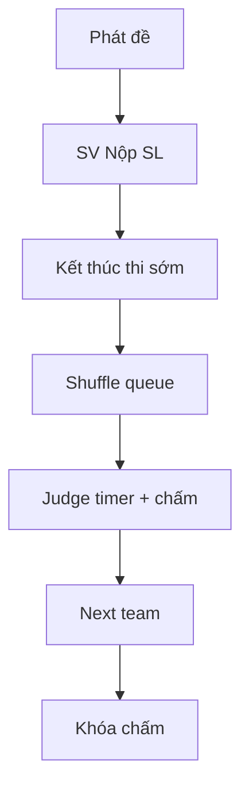

# GĐ3 — Defense Playbook: Sơ loại Live (Nộp · Queue · Timer · Chấm · Khóa)

> **Person 3** · ~18 phút · Slug: `seal-gd3-prelim-open`  
> **Gate vào:** lottery xong, round SL active, đề có thể release · **Gate ra GĐ4:** SL `scoring_locked=true`

---

## VÁCH NGĂN TRÌNH BÀY

### Điểm VÀO (Person 3 bắt đầu)

- **Trạng thái kỳ vọng:** Person 2 vừa **Kích hoạt Vòng thi (Sơ loại)** — round Active, đội locked, lottery xong.
- **Câu bàn giao:** «Vòng Sơ loại đã active. Em bắt từ **Phát đề** / SV **Nộp bài Sơ loại**, rồi queue, chấm, khóa.»
- **Mode A:** Mở `seal-gd3-prelim-open` (prelim active, 5/6 đã nộp, mentor gán).
- **Mode B:** Tiếp hackathon continuous sau GĐ2.

### Điểm RA (Person 3 → bàn giao Person 4)

- **Thao tác UI cuối:** Tab **Vòng thi** → **Khóa chấm điểm** → **Xác nhận Khóa**.
- **Verify:** SL scoring locked; nút lock disabled; không còn chấm mới.
- **Câu chốt:** «Sơ loại đã khóa chấm — chưa công bố kết quả. Xin mời Person 4 phần chuyển vòng và Chung kết.»  
- **Mode A Person 4:** Mở `seal-gd4-advance-ready`.

---

## 1. Phạm vi & trình bày

| Hạng mục | Nội dung |
|----------|----------|
| Phạm vi | Phát đề, nộp SL, end-early, queue shuffle, timer, judge chấm/chốt, mentor, late review, lock scoring |
| Gate vào | G-3.4 prelim `is_active=true`; teams locked |
| Gate ra | `PATCH .../lock-scoring` prelim |
| Thời lượng | 2p + 12p + 5p + 3p |

**Lưu ý demo:** Pre-record queue/timer nếu mạng chậm; WebSocket STOMP cho live scoring.

**Fallback:** `superadmin@fpt.edu.vn` — **Mở lại khóa chấm** nếu demo kẹt (chỉ SUPERADMIN).

---

## 2. Slug & tài khoản

| Slug | State | Account |
|------|-------|---------|
| `seal-gd3-prelim-open` | Prelim active, 5/6 SUBMITTED, chưa queue | Coord: `coord@fpt.edu.vn` |
| | GD3-06 chưa nộp (demo) | `student.gd3.leader06@fpt.edu.vn` |
| | Judges | `judge1@`…`judge4@` / `Judge@dev1` |
| | Mentors | `mentor@`…`mentor3@` / `Mentor@dev1` |

---

## 3. DataInitializer & seeders

| Seeder | Vai trò |
|--------|---------|
| `Gd3PrelimOpenDataSeeder` | 6 đội, prelim active, problem released, mentors gán |
| `repairForFeTesting()` | Deadline = now + 8h |

Flag: `app.seed.gd3.enabled=true`.

---

## 4. Userflow GĐ3

---

## 5. Bảng URL FE

| Việc | URL / nhãn |
|------|------------|
| Phát đề | Tab **Vòng thi** — **Phát đề bài** / **Phát tất cả** |
| Nộp SV | `/student/submit` tab **Sơ loại** — **Nộp bài Sơ loại** |
| End-early | **Kết thúc thời gian thi sớm** → Xác nhận KHÔNG HOÀN TÁC |
| Queue | `/presentation/queue?roundId=` — **Khởi Động Máy Quay Số** |
| Controller | **Chuyển quyền điều phối đồng hồ** |
| Judge | `/judge/dashboard` — **Vào phòng chấm thi** |
| Chấm | **Bắt đầu tính giờ** → TT → Hỏi đáp → **HOÀN TẤT & CHỐT SỔ ĐIỂM** |
| Next | **Kết thúc & gọi đội kế tiếp** |
| Lock | **Khóa chấm điểm** |
| Late | `/coordinator/late-submissions?roundId=` |
| Mentor | `/mentor/support?roundId=` |

---

## 6. Happy path (G3-H01 … G3-H12)

| ID | Loại | Role | URL | Thao tác UI | Kết quả UI | ErrorCode | FE | BE |
|----|------|------|-----|-------------|------------|-----------|----|----|
| G3-H01 | Happy | Coord | Vòng thi | **Phát đề bài** / **Phát tất cả** | SV thấy đề; early-wait → disabled đến giờ | — | `RoundsTab` | `ProblemReleaseController` |
| G3-H02 | Happy | Student | `/student/submit` | Tab **Sơ loại** → repo + PDF → **Nộp bài Sơ loại** | Toast success; status SUBMITTED | — | `SubmitPage` | `SubmissionController` |
| G3-H03 | Happy | Coord | Vòng thi | **Kết thúc thời gian thi sớm** → confirm | Modal KHÔNG HOÀN TÁC; cổng đóng | — | `RoundsTab` | `RoundProgressionController` |
| G3-H04 | Happy | Coord | `/presentation/queue` | **Khởi Động Máy Quay Số** | Queue order hiển thị | — | `PresentationQueuePage` | `PresentationQueueController` |
| G3-H05 | Happy | Coord | Queue | **Chuyển quyền điều phối đồng hồ** | Judge nhận quyền controller | — | `PresentationQueuePage` | `PresentationTimerController` |
| G3-H06 | Happy | Judge | `/judge/dashboard` | **Vào phòng** → **Bắt đầu tính giờ** | Timer PRESENTING | — | `JudgeScoringWorkspace` | `PresentationTimerController` |
| G3-H07 | Happy | Judge | Workspace | TT → **Hỏi đáp** → chấm rubric Collapse | Progress X/Y GK chốt | — | `JudgeTimerAndControls` | `ScoreController` |
| G3-H08 | Happy | Judge | Workspace | **HOÀN TẤT & CHỐT SỔ ĐIỂM** | Slot chuyển ENDED | — | `JudgeScoringWorkspace` | `ScoreController` |
| G3-H09 | Happy | Judge | Workspace | **Kết thúc & gọi đội kế tiếp** | Queue next team | — | `JudgeTimerAndControls` | `PresentationQueueController` |
| G3-H10 | Happy | Coord | Vòng thi | **Khóa chấm điểm** → Xác nhận | Locked badge; hackathon vẫn ONGOING | — | `RoundsTab` | `RoundProgressionController` |
| G3-H11 | Happy | Mentor | `/mentor/support` | Xem đội được gán — tab **Bài nộp** / **Điểm** | Read-only mentor view | — | `MentorSupportPage` | `MentorPortalController` |
| G3-H12 | Happy | Coord | `/coordinator/late-submissions` | Duyệt `LATE_PENDING` → Approve | SV submission gradable | — | `LateSubmissionReviewPage` | `LateSubmissionController` |

---

## 7. Alternative path

| ID | Mô tả | Kỳ vọng |
|----|-------|---------|
| G3-A01 | Skip no-show | **Bỏ qua đội** trên queue |
| G3-A02 | Q&A warning | Alert khi ≤ 1/3 thời lượng Q&A còn lại |
| G3-A03 | Mode A skip nộp | 5/6 đã nộp — chỉ demo leader06 |

---

## 8. Bad path (G3-B01 … G3-B06)

| ID | Loại | Role | URL | Thao tác | Kết quả UI | ErrorCode | FE | BE |
|----|------|------|-----|----------|------------|-----------|----|----|
| G3-B01 | Bad | Judge | Dashboard | Chấm trước end-early | Toast / disabled | `SCORING_NOT_OPEN` | `JudgeScoringWorkspace` | `ScoreController` |
| G3-B02 | Bad | Coord | Queue | Shuffle khi còn LATE_PENDING | Nút disabled | — | `PresentationQueuePage` | `PresentationQueueController` |
| G3-B03 | Bad | Judge | Workspace | Next khi chưa đủ GK chốt | Nút disabled | — | `JudgeTimerAndControls` | `timerControlGates.js` |
| G3-B04 | Bad | Coord | Queue | Force-advance thiếu lý do | Validation | — | `PresentationQueuePage` | `PresentationQueueController` |
| G3-B05 | Bad | Student | Submit | Repo platform sai (drive.google) | Toast 422 | `INVALID_REPO_PLATFORM` | `SubmitPage` | `GitHubRepoValidator` |
| G3-B06 | Bad | Student | Submit | Thiếu PDF slide | `INCOMPLETE` / `SLIDE_FILE_REQUIRED` | — | `SubmitPage` | `SubmissionController` |

---

## 9. Sabotage (G3-S01 … G3-S07)

| ID | Loại | Role | URL | Thao tác (cố ý) | Kết quả (chặn) | ErrorCode | FE | BE |
|----|------|------|-----|-----------------|----------------|-----------|----|----|
| G3-S01 | Sabotage | Judge | Dashboard | Chấm khi WAITING / chưa mở scoring | 422 | `SCORING_NOT_OPEN` | `JudgeScoringWorkspace` | `ScoreController` |
| G3-S02 | Sabotage | Student | Submit | SV đội khác xem submission | 403 / empty | IDOR | `SubmitPage` | `SubmissionController` |
| G3-S03 | Sabotage | Coord | People | Cùng user vừa mentor vừa judge conflict | Toast | `MENTOR_JUDGE_CONFLICT` | `PeopleTab` | `JudgeAssignmentController` |
| G3-S04 | Sabotage | Judge | Queue | Skip khi chưa ENDED | Disabled | — | `JudgeTimerAndControls` | `timerControlGates.js` |
| G3-S05 | Sabotage | Judge | Workspace | Pause timer abuse (non-controller) | Mất nút điều khiển | — | `JudgeTimerAndControls` | `PresentationTimerController` |
| G3-S06 | Sabotage | Coord | Activate | Mở coding khi chưa lottery (tay) | 422 | `LOTTERY_MISSING` | `RoundsTab` | `RoundActivationService` |
| G3-S07 | Sabotage | Judge | Dashboard | Guest judge login prelim | Không assignment SL | `EXTERNAL_JUDGE_NOT_ALLOWED_IN_PRELIM` | `JudgeDashboard` | `JudgeAssignmentController` |

---

## 10. Map source FE + BE

| Layer | File |
|-------|------|
| FE Judge | `JudgeScoringWorkspace`, `JudgeTimerAndControls`, `timerControlGates.js` |
| FE Queue | `PresentationQueuePage` |
| FE Submit | `features/submissions/` |
| FE Mentor | `features/mentor/` |
| FE Late | `LateSubmissionReviewPage` |
| BE Submit | `SubmissionController` |
| BE Queue/Timer | `PresentationQueueController`, `PresentationTimerController` |
| BE Score | `ScoreController` |
| BE Lock | `RoundProgressionController` |

---

## 11. Checklist smoke

- [ ] `seal-gd3-prelim-open` prelim active
- [ ] `student.gd3.leader06@` login OK
- [ ] Judge1 login + dashboard có slot
- [ ] Queue URL có `roundId`
- [ ] Person 4 mở `seal-gd4-advance-ready`
- [ ] (Optional) superadmin unlock path tested

---

## 12. FAQ hội đồng

| Câu hỏi | Trả lời |
|---------|---------|
| Guest judge ở Sơ loại? | Không — chỉ INTERNAL; guest chỉ CK. |
| Khác CK scoring gate? | CK (`isFinal=true`) bỏ `SCORING_NOT_OPEN` — GĐ5. |
| WebSocket bắt buộc? | Queue/timer realtime; có thể pre-record. |
| Unlock ai được? | Chỉ SUPERADMIN — Coord 403. |

**Docs:** `gd3-full-test-matrix-and-seeds.md`, `qa-test-cases` Feature C/D.
