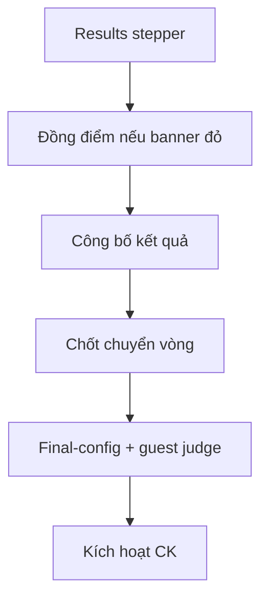

# GĐ4 — Defense Playbook: Kết quả Sơ loại · Top-N · Cấu hình & Kích hoạt CK

> **Doc sync:** Phase 9 — wildcard / certificates removed (`2026-07-31`). Advance = **Top-N only**.

> **Person 4** · ~16 phút · Slugs: `seal-gd4-advance-ready` + 3 tiebreak  
> **Gate vào:** SL `scoring_locked=true` · **Gate ra GĐ5:** CK `is_active=true`, SL published, teams ADVANCED

---

## VÁCH NGĂN TRÌNH BÀY

### Điểm VÀO (Person 4 bắt đầu)

- **Trạng thái kỳ vọng:** Person 3 vừa **Khóa chấm điểm** (SL) — scoring locked, chưa publish.
- **Câu bàn giao:** «Sơ loại đã khóa chấm. Em bắt từ trang **Kết quả Sơ loại** — stepper công bố, chuyển vòng, cấu hình CK, kích hoạt Chung kết.»
- **Mode A:** Mở `seal-gd4-advance-ready`.
- **Mode B:** Tiếp hackathon sau lock SL GĐ3.

### Điểm RA (Person 4 → bàn giao Person 5)

- **Thao tác UI cuối:** Tab **Vòng thi** / Cấu hình CK → **Kích hoạt Vòng thi** (Chung kết) → xác nhận KEEP → Xác nhận.
- **Verify:** CK **Active**; đội ADVANCED; SL `isPublished=true`; **không** cần Phát đề CK (tự release).
- **Câu chốt:** «Chung kết đã active — SV có thể nộp bài CK. Xin mời Person 5.»  
- **Mode A Person 5:** Mở `seal-gd5-final-active`.

**Lưu ý:** 3 slug tiebreak (`tiebreak-submission-time`, `tiebreak-manual`, `wildcard-gap` — slug name lịch sử, hành xử Top-N) demo **sau** happy trên `advance-ready` — **cùng Person 4**, không đổi người.

---

## Advance = Top-N only (wildcard đã xóa)

- **Đã xóa (Phase 9):** feature Vé vớt / Wildcard — bảng `wildcard_reviews`, endpoints wildcard, tab/route UI.
- **Còn:** advance theo Top-N mỗi bảng (`round.topNAdvance`) + optional `availableSlots` / `minTeamsFinal` (`RoundProgressionServiceImpl`).
- **UI tabs:** **Kết quả** / **Danh sách Chung kết & Bị loại** / **Kiểm tra chấm** / **Đồng điểm** — **không** tab Vé vớt.
- Sabotage G4-S07: `grep` UI = 0 label «Vé vớt».

---

## 1. Phạm vi & trình bày

| Hạng mục | Nội dung |
|----------|----------|
| Phạm vi | Publish SL, tiebreak, advance Top-N, final config, guest judge, activate CK |
| Stepper 6 bước | Khóa chấm → Xem trước → Đồng điểm → Công bố → Chốt CK → Cấu hình CK |
| Thời lượng | 2p + 12p (+ 3 slug phụ 5p) + 5p sabotage + 3p |

---

## 2. Slug & tài khoản

| Slug | Mục đích | Account |
|------|----------|---------|
| `seal-gd4-advance-ready` | Happy full flow | `coord@fpt.edu.vn`, `student.gd4a.leader01@`…`leader08@` |
| `seal-gd4-tiebreak-submission-time` | Auto SUBMISSION_TIME | Coord |
| `seal-gd4-tiebreak-manual` | `TIEBREAK_REQUIRED` manual | Coord |
| `seal-gd4-wildcard-gap` | `availableSlots=2`, Top-N gap (slug name lịch sử) | Coord |

Password: `Coordinator@dev1` / `Student@dev1`. Guest (cho CK): `guestjudge@gmail.com` / `GuestJudge@dev1`.

---

## 3. DataInitializer & seeders

| Seeder | Slug |
|--------|------|
| `Gd4AdvanceReadyDataSeeder` | `advance-ready` — SL locked, unpublished, 8 đội |
| `Gd4TiebreakWildcardDataSeeder` | 3 slug tiebreak / Top-N gap |

Flag: `app.seed.gd4.enabled=true`.

---

## 4. Userflow GĐ4

---

## 5. Bảng URL FE

| Việc | URL / nhãn |
|------|------------|
| Kết quả SL | `/hackathons/{id}/rounds/{prelimId}/results` |
| Stepper | **Khóa chấm** → **Xem trước xếp hạng** → **Đồng điểm** → **Công bố** → **Chốt CK** → **Cấu hình CK** |
| Tabs | **Kết quả** / **Danh sách Chung kết & Bị loại** / **Kiểm tra chấm** / **Đồng điểm** |
| Final config | `/coordinator/final-config?hackathonId=` hoặc `setup?tab=final-config` |
| Activate CK | Tab **Vòng thi** → **Kích hoạt Vòng thi** (Chung kết) |

---

## 6. Happy path — `advance-ready` (G4-H01 … G4-H08)

| ID | Loại | Role | URL | Thao tác UI | Kết quả UI | ErrorCode | FE | BE |
|----|------|------|-----|-------------|------------|-----------|----|----|
| G4-H01 | Happy | Coord | `/rounds/{prelimId}/results` | Mở stepper — bước **Khóa chấm** đã xanh | Stepper hiển thị 6 bước | — | `PreliminaryResultsPage` | `RoundProgressionController` |
| G4-H02 | Happy | Coord | Tab **Xem trước** | Xem BXH tạm / warning incomplete | BarChart hoặc warning vàng | — | `RankingPreviewPanel` | `RoundProgressionController` |
| G4-H03 | Happy | Coord | Tab **Đồng điểm** | (Nếu banner đỏ) kéo-thả biên Top-N → **Lưu** | Tiebreak resolved | — | `OfficialRankingPanel` | `RoundProgressionController.resolveTiebreak` |
| G4-H04 | Happy | Coord | Results | **Công bố kết quả** → confirm | `isPublished=true`; announcement WS | — | `PreliminaryResultsPage` | `RoundProgressionController.publish` |
| G4-H05 | Happy | Coord | Results | **Chốt chuyển vòng** → confirm | ADVANCED / ELIMINATED tags | — | `RankingTopSteps` | `RoundProgressionServiceImpl.advance` |
| G4-H06 | Happy | Coord | Tab **Danh sách CK & Bị loại** | Verify ADVANCED / ELIMINATED | 8 đội phân loại đúng Top-N | — | `AdvancementListPanel` | `RoundProgressionServiceImpl` |
| G4-H07 | Happy | Coord | `/coordinator/final-config` | Criteria CK + gán **Guest Judge** FINAL_EXTERNAL | Readiness FINAL_ROUND pass | — | `FinalRoundConfigPage` | `JudgeAssignmentController` |
| G4-H08 | Happy | Coord | Tab **Vòng thi** / Final config | **Kích hoạt Vòng thi** (CK) → KEEP | CK Active; **không** nút Phát đề CK | — | `RoundsTab` | `RoundActivationService` |

---

## 7. Happy path — tiebreak slugs (G4-H09 … G4-H11)

| ID | Loại | Slug | Thao tác UI | Kết quả UI | FE | BE |
|----|------|------|-------------|------------|----|----|
| G4-H09 | Happy | `tiebreak-submission-time` | Tab **Đồng điểm** → resolve auto | Team nộp sớm hơn thắng biên Top-2 | `OfficialRankingPanel` | `TiebreakService` SUBMISSION_TIME |
| G4-H10 | Happy | `tiebreak-manual` | Advance → banner `TIEBREAK_REQUIRED` → Coord chọn đội | Manual resolve OK | `OfficialRankingPanel` | `RoundProgressionController.resolveTiebreak` |
| G4-H11 | Happy | `wildcard-gap` | **Chốt chuyển vòng** với `availableSlots=2` | Top-N mỗi bảng; không tab/API Vé vớt | `PreliminaryResultsPage` | `RoundProgressionServiceImpl` |

---

## 8. Bad path (G4-B01 … G4-B05)

| ID | Loại | Role | URL | Thao tác | Kết quả UI | ErrorCode | FE | BE |
|----|------|------|-----|----------|------------|-----------|----|----|
| G4-B01 | Bad | Coord | Results | Preview khi còn submission chưa chấm | Warning vàng incomplete | — | `RankingPreviewPanel` | `RoundProgressionController.rankingPreview` |
| G4-B02 | Bad | Coord | Activate CK | Activate khi chưa publish SL | 422 toast | `RESULT_NOT_PUBLISHED` | `RoundsTab` | `RoundActivationService` |
| G4-B03 | Bad | Coord | Advance | Advance khi tiebreak chưa resolve | 422 | `TIEBREAK_REQUIRED` | `RankingTopSteps` | `RoundProgressionServiceImpl` |
| G4-B04 | Bad | Coord | Final-config | Activate thiếu criteria CK | Readiness fail | `FINAL_CRITERIA_MISSING` | `FinalRoundConfigPage` | `ReadinessService` |
| G4-B05 | Bad | Coord | People | Gán INTERNAL làm FINAL_EXTERNAL | Toast reject | `INVALID_ASSIGNMENT_TYPE` | `PeopleTab` | `JudgeAssignmentController` |

---

## 9. Sabotage (G4-S01 … G4-S07)

| ID | Loại | Role | URL | Thao tác (cố ý) | Kết quả (chặn) | ErrorCode | FE | BE |
|----|------|------|-----|-----------------|----------------|-----------|----|----|
| G4-S01 | Sabotage | Coord | Advance | Advance trước publish | 422 | `RESULT_NOT_PUBLISHED` | `RankingTopSteps` | `RoundProgressionServiceImpl` |
| G4-S02 | Sabotage | Coord | Advance | Tiebreak biên Top-N chưa resolve | 422 | `TIEBREAK_REQUIRED` | `OfficialRankingPanel` | `RoundProgressionController.resolveTiebreak` |
| G4-S03 | Sabotage | Coord | Activate | Activate CK unpublished SL | 422 | `RESULT_NOT_PUBLISHED` | `RoundsTab` | `RoundActivationService` |
| G4-S04 | Sabotage | Coord | Final-config | Xóa hết criteria CK → activate | Blocked | `FINAL_CRITERIA_MISSING` | `FinalRoundConfigPage` | `ReadinessService` |
| G4-S05 | Sabotage | Coord | People | Activate thiếu judge CK | Readiness fail | — | `FinalRoundConfigPage` | `JudgeAssignmentController` |
| G4-S06 | Sabotage | Coord | Publish | Publish lần 2 | 422 `INVALID_STATE` | — | `PreliminaryResultsPage` | `RoundProgressionController` |
| G4-S07 | Sabotage | QA | UI grep | Tìm label «Vé vớt» / Wildcard tab / wildcard API | **0 kết quả** — feature đã xóa | — | `PreliminaryResultsPage` | (no wildcard controller) |

---

## 10. Map source FE + BE

| Layer | File |
|-------|------|
| FE Results | `PreliminaryResultsPage`, `OfficialRankingPanel`, `RankingTopSteps` |
| FE Final config | `FinalRoundConfigPage` |
| BE Progression | `RoundProgressionServiceImpl`, `RoundProgressionController` |
| BE Ranking preview | `RoundProgressionController` + `RoundRankingQueryService` |
| BE Tiebreak / advance | `RoundProgressionController`, `RoundProgressionServiceImpl` |
| BE Judges | `JudgeAssignmentController` |

**Không còn:** `WildcardReviewController` / wildcard endpoints (Phase 9 deleted).

---

## 11. Checklist smoke

- [ ] `seal-gd4-advance-ready` SL locked, unpublished
- [ ] Stepper mở được
- [ ] Guest judge accounts login OK
- [ ] 3 slug tiebreak seed OK (switch nhanh trên `/hackathons`)
- [ ] Person 5 mở `seal-gd5-final-active`
- [ ] Verify 0 UI «Vé vớt»; advance chỉ Top-N

---

## 12. FAQ hội đồng

| Câu hỏi | Trả lời |
|---------|---------|
| Vé vớt còn không? | **Không** — đã xóa (Phase 9). Advance chỉ **Top-N** mỗi bảng (+ availableSlots nếu cấu hình). |
| Publish có hoàn tác? | One-way `isPublished=true`. |
| Phát đề CK? | Activate CK tự release — không bước Phát đề riêng. |
| Tiebreak slugs khi nào? | Sau happy `advance-ready`, cùng Person 4. |

**Docs:** `gd4-full-test-matrix-and-seeds.md`.
