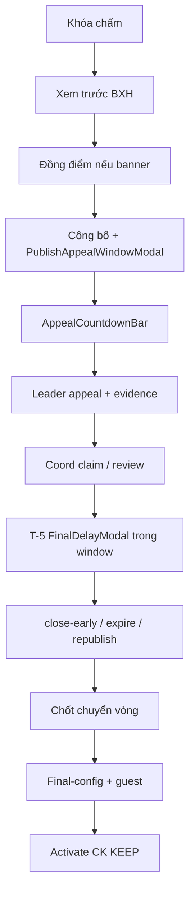

# GĐ4 — Defense Playbook: Kết quả Sơ loại · Appeal window · Top-N · Cấu hình & Kích hoạt CK

> **Doc sync:** 2026-07-31 — Phases 0–11

> **Person 4** · ~16–18 phút · Slug live: **`seal-e2e-2026`** (sau scoring lock SL)  
> **Gate vào:** SL `scoring_locked=true` · **Gate ra GĐ5:** CK `is_active=true`, SL published, teams ADVANCED (sau khi cửa sổ khiếu nại đóng / hết PENDING|UNDER_REVIEW)

---

## VÁCH NGĂN TRÌNH BÀY

### Điểm VÀO (Person 4 bắt đầu)

- **Trạng thái kỳ vọng:** Person 3 vừa **Khóa chấm điểm** (SL) — scoring locked, chưa publish.
- **Câu bàn giao:** «Sơ loại đã khóa chấm. Em bắt từ trang **Kết quả Sơ loại** — stepper công bố, cửa sổ khiếu nại, chuyển vòng, cấu hình CK, kích hoạt Chung kết.»
- **Mode A:** Tiếp `seal-e2e-2026` sau scoring lock (không mở snapshot riêng).
- **Mode B:** Tiếp hackathon sau lock SL GĐ3 (cùng slug).

### Điểm RA (Person 4 → bàn giao Person 5)

- **Thao tác UI cuối:** Tab **Vòng thi** / Cấu hình CK → **Kích hoạt Vòng thi** (Chung kết) → xác nhận **KEEP** → Xác nhận.
- **Verify:** CK **Active**; đội ADVANCED; SL `isPublished=true`; **không** cần Phát đề CK (tự release).
- **Câu chốt:** «Chung kết đã active — SV có thể nộp bài CK. Xin mời Person 5.»  
- **Mode A Person 5:** Tiếp **cùng** `seal-e2e-2026` sau activate CK.

**Không còn slug phụ live:** `seal-gd4-tiebreak-submission-time`, `seal-gd4-tiebreak-manual`, `seal-gd4-wildcard-gap` — **DEPRECATED / purged**. Seeder `Gd4TiebreakWildcardDataSeeder` **đã xóa**. Không dành thời gian Person cho «3 slug phụ».

**~~`seal-gd4-advance-ready` / `Gd4AdvanceReadyDataSeeder`~~** — **không còn primary seed**; GĐ4 chạy continuous trên `seal-e2e-2026`.

**Tiebreak:** nếu có đồng điểm biên Top-N → demo tab **Đồng điểm** (`TiebreakPanel`) khi banner xuất hiện; nếu không có tie → bỏ qua bước resolve. Hành vi Top-N gap (`availableSlots` / `minTeamsFinal`) vẫn trong `RoundProgressionServiceImpl` — **không** cần slug riêng.

---

## Advance = Top-N only (wildcard đã xóa)

- **Đã xóa (Phase 9):** feature Vé vớt / Wildcard — bảng `wildcard_reviews`, endpoints wildcard, tab/route UI.
- **Còn:** advance theo Top-N mỗi bảng (`round.topNAdvance`) + optional `availableSlots` / `minTeamsFinal` (`RoundProgressionServiceImpl`).
- **UI tabs (sau publish):** **Kết quả** / **Danh sách CK & Bị loại** / **Kiểm tra chấm** / **Đồng điểm** / **Khiếu nại**.
- Sabotage G4-S07: `grep` UI = 0 label «Vé vớt».

---

## 1. Phạm vi & trình bày

| Hạng mục | Nội dung |
|----------|----------|
| Phạm vi | Publish SL (+ preflight appeal), cửa sổ khiếu nại, review DQ, tiebreak (nếu có), advance Top-N, final config, guest judge, activate CK **KEEP only** |
| Stepper | Khóa chấm → Xem trước → Đồng điểm → Công bố → **Khiếu nại** → Chốt CK → Cấu hình CK |
| Thời lượng | 2p + 12–14p + 5p sabotage + 3p (không còn 3 slug phụ) |

---

## 2. Slug & tài khoản

| Slug | Mục đích | Account |
|------|----------|---------|
| `seal-e2e-2026` | Happy full flow sau lock SL (publish → appeal → advance → activate CK) | `coord@fpt.edu.vn`, leaders `student.e2e.t0N.leader@` |

~~`seal-gd4-advance-ready`~~ / ~~`seal-gd4-tiebreak-*` / `seal-gd4-wildcard-gap`~~ — **không dùng live demo** (purged).

Password: `Coordinator@dev1` / `Student@dev1`. Guest (cho CK): `guestjudge@gmail.com` / `GuestJudge@dev1`.

---

## 3. DataInitializer & seeders

| Seeder | Ghi chú |
|--------|---------|
| *(không seeder GĐ4 riêng)* | State = continuous trên `seal-e2e-2026` sau GĐ3 lock |

~~`Gd4AdvanceReadyDataSeeder`~~ — **đã gỡ** (không còn primary seed).  
~~`Gd4TiebreakWildcardDataSeeder`~~ — **deleted**.  
~~`app.seed.gd4.enabled`~~ — **đã gỡ**.

---

## 4. Userflow GĐ4 (thứ tự bắt buộc)

```
Khóa chấm → Xem trước → Đồng điểm → Công bố (+ PublishAppealWindowModal DELAY_FINAL|SHRINK|SKIP)
→ Appeal window (AppealCountdownBar 2 markers) → Leader appeal+evidence → Coord claim/review
→ T-5 FinalDelayModal DURING window (NOT after activate) → close-early / expire / republish
→ Chốt chuyển vòng (blocked PENDING|UNDER_REVIEW) → Final config + guest → Activate CK KEEP only
```



**Lưu ý T-5:** `FinalDelayModal` auto-open khi còn PENDING/UNDER_REVIEW và ≤5 phút tới `finalExamAt` — **trong** cửa sổ khiếu nại, **không** sau khi activate CK.

**START_NOW:** đã gỡ (phase 2). Activate CK / SL chỉ **KEEP**; dời lịch qua «Dời lịch thi» / close-reg-early / appeal-delay.

---

## 5. Bảng URL FE

| Việc | URL / nhãn |
|------|------------|
| Kết quả SL | `/hackathons/{id}/rounds/{prelimId}/results` |
| Stepper | **Khóa chấm** → **Xem trước** → **Đồng điểm** → **Công bố** → **Khiếu nại** → **Chốt CK** → **Cấu hình CK** |
| Tabs (sau publish) | **Kết quả** / **Danh sách CK & Bị loại** / **Kiểm tra chấm** / **Đồng điểm** / **Khiếu nại** |
| Final config | `/coordinator/final-config?hackathonId=` hoặc `setup?tab=final-config` |
| Activate CK | Tab **Vòng thi** → **Kích hoạt Vòng thi** (Chung kết) → **KEEP only** |

---

## 6. Happy path — `advance-ready` (G4-H01 … G4-H09)

| ID | Loại | Role | URL | Thao tác UI | Kết quả UI | ErrorCode | FE | BE |
|----|------|------|-----|-------------|------------|-----------|----|----|
| G4-H01 | Happy | Coord | `/rounds/{prelimId}/results` | Mở stepper — bước **Khóa chấm** đã xanh | Stepper: … Công bố → Khiếu nại → Chốt CK → Cấu hình CK | — | `PreliminaryResultsPage` | `RoundProgressionController` |
| G4-H02 | Happy | Coord | Tab **Xem trước** / BXH | Xem BXH tạm / warning incomplete | BarChart hoặc warning vàng | — | `RankingTopSteps` (preview only) / `OfficialRankingPanel` | `RoundProgressionController` |
| G4-H03 | Happy | Coord | Tab **Đồng điểm** | (Nếu banner đỏ) kéo-thả biên Top-N → **Lưu** | Tiebreak resolved | — | `TiebreakPanel` | `RoundProgressionController.resolveTiebreak` |
| G4-H04 | Happy | Coord | Results | **Công bố kết quả** → `PublishAppealWindowModal` (fits / DELAY_FINAL·SHRINK·SKIP) → confirm | `isPublished=true`; `appeal_window_ends_at` set (nếu window &gt; 0); countdown bắt đầu; announcement kèm buffet (location/giờ/menu) nếu có `EventType.BUFFET` | — | `PublishAppealWindowModal` | `GET/POST …/publish/preflight`; `PATCH …/publish` (+ `PublishWithAppealWindowRequest`) |
| G4-H04b | Happy | Coord / Leader | Results / Student | Cửa sổ mở — `AppealCountdownBar` **2 markers** (tới `finalExamAt` + tới `appealWindowEndsAt`); leader DQ nộp appeal + evidence | Status PENDING; advance blocked khi còn open/pending | — | `AppealCountdownBar`, `StudentAppealModal` | `GET …/appeal-window`; `POST /me/appeals`; `POST /me/appeals/evidence` |
| G4-H04c | Happy | Coord | Tab **Khiếu nại** | Claim → Approve/Reject (reject bắt buộc note); approve → `TeamReinstatementService` (pre-advance); hoặc chờ hết hạn → EXPIRED; optional close-early / republish | Reinstate / REJECTED / EXPIRED; republish **không** reset window | — | `AppealReviewPanel` | `PATCH /appeals/{id}/claim`; `PATCH /appeals/{id}/review`; `POST …/appeal-window/close`; `POST …/republish` |
| G4-H04d | Happy | Coord | Trong window (T-5) | Khi ≤5′ tới CK + còn pending → `FinalDelayModal` preview/apply | CK `examAt` dời; `appeal_delay_minutes_applied` tăng | — | `FinalDelayModal` | `POST …/appeal-delay/preview`; `POST …/appeal-delay` |
| G4-H05 | Happy | Coord | Results | **Chốt chuyển vòng** → confirm (sau khi không còn PENDING/UNDER_REVIEW) | ADVANCED / ELIMINATED tags | — | `PreliminaryResultsPage` | `RoundProgressionServiceImpl.advance` |
| G4-H06 | Happy | Coord | Tab **Danh sách CK & Bị loại** | Verify ADVANCED / ELIMINATED | 8 đội phân loại đúng Top-N | — | `AdvanceRosterPanel` | `RoundProgressionServiceImpl` |
| G4-H07 | Happy | Coord | `/coordinator/final-config` | Criteria CK + gán **Guest Judge** FINAL_EXTERNAL | Readiness FINAL_ROUND pass | — | `FinalRoundConfigPage` | `JudgeAssignmentController` |
| G4-H08 | Happy | Coord | Tab **Vòng thi** / Final config | **Kích hoạt Vòng thi** (CK) → **KEEP only** | CK Active; **không** nút Phát đề CK; **không** START_NOW | — | `RoundManagementPage` / `ActivateScheduleModal` | `RoundActivationService` |

**Student teams:** trang kết quả / appeal dùng `GET /me/teams?includeEliminated=true` để leader DQ vẫn thấy đội.

---

## 6b. Appeal window — endpoints

| Method | Path | Ai | Việc |
|--------|------|----|------|
| `PATCH` | `/api/v1/hackathons/{id}/appeal-window-minutes` | Coord | Sửa phút cửa sổ (DRAFT/ONGOING, **trước** prelim publish) |
| `GET`/`POST` | `/api/v1/rounds/{id}/publish/preflight` | Coord | Preflight — fits + available modes (`AppealController`) |
| `PATCH` | `/api/v1/rounds/{id}/publish` | Coord | Publish (+ optional `PublishWithAppealWindowRequest`) |
| `GET` | `/api/v1/rounds/{id}/appeal-window` | Coord/roles đọc | Status + `serverNow` (countdown) |
| `POST` | `/api/v1/rounds/{id}/appeal-window/close` | Coord | Đóng sớm (không còn PENDING/UNDER_REVIEW) |
| `GET` | `/api/v1/rounds/{id}/appeals` | Coord | List appeals (`?status=`) |
| `GET` | `/api/v1/appeals/{id}` | Coord | Chi tiết |
| `PATCH` | `/api/v1/appeals/{id}/claim` | Coord | PENDING → UNDER_REVIEW |
| `PATCH` | `/api/v1/appeals/{id}/review` | Coord | APPROVED / REJECTED |
| `POST` | `/api/v1/rounds/{id}/republish` | Coord | Công bố lại sau approve (**không** reset window) |
| `POST` | `/api/v1/rounds/{id}/appeal-delay/preview` | Coord | T-5 preview |
| `POST` | `/api/v1/rounds/{id}/appeal-delay` | Coord | T-5 apply (budget 30′) |
| `POST` | `/api/v1/me/appeals` | Leader | Nộp đơn (+ evidences) |
| `GET` | `/api/v1/me/appeals` | Student | List đơn của đội mình |
| `POST` | `/api/v1/me/appeals/evidence` | Student | Upload minh chứng (multipart) |
| `GET` | `/api/v1/me/teams?includeEliminated=true` | Student | Đội ELIMINATED (appeal / results) |

**UI demo tips:** `PublishAppealWindowModal` trước Công bố; `AppealCountdownBar` 2 markers khi OPEN; tab **Khiếu nại** sau publish; nút Chốt CK disabled khi còn PENDING/UNDER_REVIEW; T-5 **trong** window.

---

## 6c. ErrorCodes — Appeal window

| ErrorCode | Khi nào |
|-----------|---------|
| `APPEAL_WINDOW_DOES_NOT_FIT` | Cửa sổ cấu hình không vừa lịch CK — cần mode DELAY_FINAL / SHRINK / SKIP |
| `APPEAL_WINDOW_BELOW_MINIMUM` | Phút cửa sổ &lt; min (trừ 0 = tắt) |
| `APPEAL_WINDOW_SKIP_REASON_REQUIRED` | Mode SKIP thiếu lý do |
| `APPEAL_WINDOW_HAS_PENDING` | Close-early khi còn PENDING/UNDER_REVIEW |
| `APPEAL_WINDOW_NOT_OPEN` | Thao tác cần window OPEN nhưng không mở |
| `APPEAL_DEADLINE_EXPIRED` | Nộp/appeal sau `appealWindowEndsAt` |
| `APPEAL_EVIDENCE_REQUIRED` | Leader nộp thiếu minh chứng |
| `APPEAL_ALREADY_SUBMITTED` | Đội đã có đơn |
| `APPEAL_NOT_PENDING` | Claim/review sai trạng thái |
| `APPEAL_DECISION_NOTE_REQUIRED` | Reject thiếu `decisionNote` |
| `APPEAL_APPROVE_AFTER_ADVANCE` | Approve sau khi đã chốt ADVANCED |
| `APPEAL_DELAY_LIMIT_EXCEEDED` | Vượt ngân sách delay 30′ |
| `APPEAL_DELAY_NOT_APPLICABLE` | Delay không áp dụng (window đóng / không còn budget / …) |
| `APPEAL_PENDING_BLOCKS_ADVANCE` | Chốt CK khi còn PENDING/UNDER_REVIEW |
| `APPEAL_WINDOW_LOCKED_AFTER_PUBLISH` | Đổi `appealWindowMinutes` sau prelim publish |

---

## 6d. AuditAction (appeal)

| AuditAction | Việc |
|-------------|------|
| `APPEAL_SUBMIT` | Leader nộp đơn |
| `APPEAL_CLAIM` | Coord nhận đơn |
| `APPEAL_APPROVE` | Duyệt |
| `APPEAL_REJECT` | Từ chối |
| `APPEAL_EXPIRE` | Hết hạn / expire job |
| `APPEAL_WINDOW_OPEN` | Mở cửa sổ lúc publish |
| `APPEAL_WINDOW_SHRUNK` | Mode SHRINK |
| `APPEAL_WINDOW_SKIPPED` | Mode SKIP |
| `APPEAL_WINDOW_CLOSE_EARLY` | Đóng sớm |
| `APPEAL_FINAL_DELAY` | T-5 dời CK |
| `HACKATHON_APPEAL_WINDOW_UPDATE` | Đổi phút cửa sổ (pre-publish) |
| `TEAM_REINSTATE_APPEAL` | `TeamReinstatementService` sau approve |

---

## 6e. NotificationType (appeal)

| NotificationType | Việc |
|------------------|------|
| `APPEAL_WINDOW_OPENED` | Cửa sổ mở sau publish |
| `APPEAL_WINDOW_SKIPPED` | Publish bỏ qua window |
| `APPEAL_SUBMITTED` | Có đơn mới |
| `APPEAL_APPROVED` | Đơn được duyệt |
| `APPEAL_REJECTED` | Đơn bị từ chối |
| `APPEAL_EXPIRED` | Đơn hết hạn |

---

## 7. Tiebreak / Top-N gap (không slug riêng)

| ID | Loại | Ghi chú | Thao tác UI | Kết quả UI | FE | BE |
|----|------|---------|-------------|------------|----|----|
| G4-H10 | Happy / optional | Trên `advance-ready` nếu seed có tie | Tab **Đồng điểm** → resolve | Biên Top-N ổn định | `TiebreakPanel` | `TiebreakService` / `resolveTiebreak` |
| G4-H11 | Happy / optional | Banner `TIEBREAK_REQUIRED` | Coord chọn đội trên `TiebreakPanel` | Manual resolve OK | `TiebreakPanel` | `RoundProgressionController.resolveTiebreak` |
| G4-H12 | Note | ~~slug `wildcard-gap`~~ historical | Advance với `availableSlots` / `minTeamsFinal` nếu cấu hình | Top-N mỗi bảng; **không** tab Vé vớt | `PreliminaryResultsPage` | `RoundProgressionServiceImpl` |

---

## 8. Bad path (G4-B01 … G4-B06)

| ID | Loại | Role | URL | Thao tác | Kết quả UI | ErrorCode | FE | BE |
|----|------|------|-----|----------|------------|-----------|----|----|
| G4-B01 | Bad | Coord | Results | Preview khi còn submission chưa chấm | Warning vàng incomplete | — | `OfficialRankingPanel` / preview | `RoundProgressionController.rankingPreview` |
| G4-B02 | Bad | Coord | Activate CK | Activate khi chưa publish SL | 422 toast | `RESULT_NOT_PUBLISHED` | `RoundManagementPage` | `RoundActivationService` |
| G4-B03 | Bad | Coord | Advance | Advance khi tiebreak chưa resolve | 422 | `TIEBREAK_REQUIRED` | `PreliminaryResultsPage` | `RoundProgressionServiceImpl` |
| G4-B04 | Bad | Coord | Final-config | Activate thiếu criteria CK | Readiness fail | `FINAL_CRITERIA_MISSING` | `FinalRoundConfigPage` | `ReadinessService` |
| G4-B05 | Bad | Coord | People | Gán INTERNAL làm FINAL_EXTERNAL | Toast reject | `INVALID_ASSIGNMENT_TYPE` | `PeopleTab` | `JudgeAssignmentController` |
| G4-B06 | Bad | Coord | Advance | Advance khi còn appeal PENDING/UNDER_REVIEW | 422 toast | `APPEAL_PENDING_BLOCKS_ADVANCE` | `PreliminaryResultsPage` | `RoundProgressionServiceImpl.advanceTeams` |

---

## 9. Sabotage (G4-S01 … G4-S10)

| ID | Loại | Role | URL | Thao tác (cố ý) | Kết quả (chặn) | ErrorCode | FE | BE |
|----|------|------|-----|-----------------|----------------|-----------|----|----|
| G4-S01 | Sabotage | Coord | Advance | Advance trước publish | 422 | `RESULT_NOT_PUBLISHED` | `PreliminaryResultsPage` | `RoundProgressionServiceImpl` |
| G4-S02 | Sabotage | Coord | Advance | Tiebreak biên Top-N chưa resolve | 422 | `TIEBREAK_REQUIRED` | `TiebreakPanel` | `RoundProgressionController.resolveTiebreak` |
| G4-S03 | Sabotage | Coord | Activate | Activate CK unpublished SL | 422 | `RESULT_NOT_PUBLISHED` | `RoundManagementPage` | `RoundActivationService` |
| G4-S04 | Sabotage | Coord | Final-config | Xóa hết criteria CK → activate | Blocked | `FINAL_CRITERIA_MISSING` | `FinalRoundConfigPage` | `ReadinessService` |
| G4-S05 | Sabotage | Coord | People | Activate thiếu judge CK | Readiness fail | — | `FinalRoundConfigPage` | `JudgeAssignmentController` |
| G4-S06 | Sabotage | Coord | Publish | Publish lần 2 (đã published) / publish khi không vừa lịch **không** chọn mode | 422 | `INVALID_STATE` / `APPEAL_WINDOW_DOES_NOT_FIT` | `PublishAppealWindowModal` | `RoundProgressionController` / `AppealWindowService` |
| G4-S07 | Sabotage | QA | UI grep | Tìm label «Vé vớt» / Wildcard tab / wildcard API | **0 kết quả** — feature đã xóa | — | `PreliminaryResultsPage` | (no wildcard controller) |
| G4-S08 | Sabotage | Coord | Hackathon | Đổi `appealWindowMinutes` sau prelim publish | 422 | `APPEAL_WINDOW_LOCKED_AFTER_PUBLISH` | Settings | `HackathonServiceImpl.updateAppealWindowMinutes` |
| G4-S09 | Sabotage | Coord | Appeal window | **Đóng sớm** khi còn PENDING/UNDER_REVIEW | 422 | `APPEAL_WINDOW_HAS_PENDING` | `AppealReviewPanel` | `AppealWindowService.closeEarly` |
| G4-S10 | Sabotage | Coord | Publish | Mode SKIP không nhập lý do | 422 | `APPEAL_WINDOW_SKIP_REASON_REQUIRED` | `PublishAppealWindowModal` | `AppealWindowService` |

---

## 10. Map source FE + BE

| Layer | File |
|-------|------|
| FE Results | `PreliminaryResultsPage`, `OfficialRankingPanel`, `AdvanceRosterPanel`, `TiebreakPanel` |
| FE Preview chart | `RankingTopSteps` (**chỉ** preview — advance không đi qua đây) |
| FE Final config | `FinalRoundConfigPage` |
| FE Appeal | `PublishAppealWindowModal`, `AppealCountdownBar`, `AppealReviewPanel`, `FinalDelayModal`, `StudentAppealModal` |
| BE Progression | `RoundProgressionServiceImpl`, `RoundProgressionController` |
| BE Appeal window | `AppealWindowServiceImpl`, `AppealController`, `AppealReviewServiceImpl` |
| BE Reinstate | `TeamReinstatementService` / `TeamReinstatementServiceImpl` (approve pre-advance) |
| BE Ranking preview | `RoundProgressionController` + `RoundRankingQueryService` |
| BE Tiebreak / advance | `RoundProgressionController`, `RoundProgressionServiceImpl` (`availableSlots` / `minTeamsFinal`) |
| BE Judges | `JudgeAssignmentController` |

**Không còn:** `WildcardReviewController` / wildcard endpoints (Phase 9). **Không còn:** `Gd4AdvanceReadyDataSeeder` / `Gd4TiebreakWildcardDataSeeder` / snapshot slug GĐ4. **Không còn:** START_NOW trên activate.

---

## 11. Checklist smoke

- [ ] `seal-e2e-2026` SL locked, unpublished (sau GĐ3)
- [ ] Stepper: Công bố → **Khiếu nại** → Chốt CK → Cấu hình CK
- [ ] Tabs sau publish gồm **Khiếu nại**
- [ ] Publish → `PublishAppealWindowModal` + `AppealCountdownBar` (2 markers nếu window &gt; 0)
- [ ] Advance blocked khi còn PENDING|UNDER_REVIEW; EXPIRED / close-early unlocks
- [ ] Approve → reinstate pre-advance (`TeamReinstatementService`)
- [ ] T-5 `FinalDelayModal` **trong** window (không sau activate)
- [ ] Activate CK **KEEP only** (không START_NOW)
- [ ] Guest judge accounts login OK
- [ ] Person 5 sẵn sàng tiếp cùng slug sau activate CK
- [ ] Verify 0 UI «Vé vớt»; advance chỉ Top-N
- [ ] **Không** mở 3 slug tiebreak/wildcard-gap

---

## 12. FAQ hội đồng

| Câu hỏi | Trả lời |
|---------|---------|
| Vé vớt còn không? | **Không** — đã xóa (Phase 9). Advance chỉ **Top-N** mỗi bảng (+ `availableSlots`/`minTeamsFinal` nếu cấu hình). |
| 3 slug tiebreak đâu? | **Purged** — demo tiebreak trên continuous `seal-e2e-2026` nếu có đồng điểm; không có slug phụ. |
| `seal-gd4-advance-ready`? | **Purged** — GĐ4 chạy continuous sau scoring trên `seal-e2e-2026`. |
| Publish có hoàn tác? | One-way `isPublished=true`. Republish sau approve **không** reset cửa sổ khiếu nại. |
| Cửa sổ khiếu nại? | Mở **một lần** lúc first publish; countdown 2 markers; advance chờ hết PENDING/UNDER_REVIEW. |
| T-5 khi nào? | Trong appeal window khi ≤5′ tới CK còn đơn pending — **không** sau activate. |
| Phát đề CK? | Activate CK tự release — không bước Phát đề riêng. |
| START_NOW? | Đã gỡ — activate chỉ KEEP. |
| Approve đơn làm gì? | `TeamReinstatementService` phục hồi đội (ACTIVE, clear DQ) **chỉ pre-advance**. |

**Docs:** `gd4-full-test-matrix-and-seeds.md`; BR catalog `BR-APPEAL-001`…`008`.
