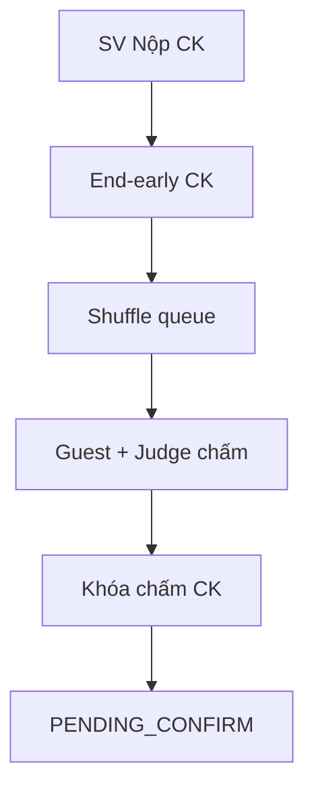
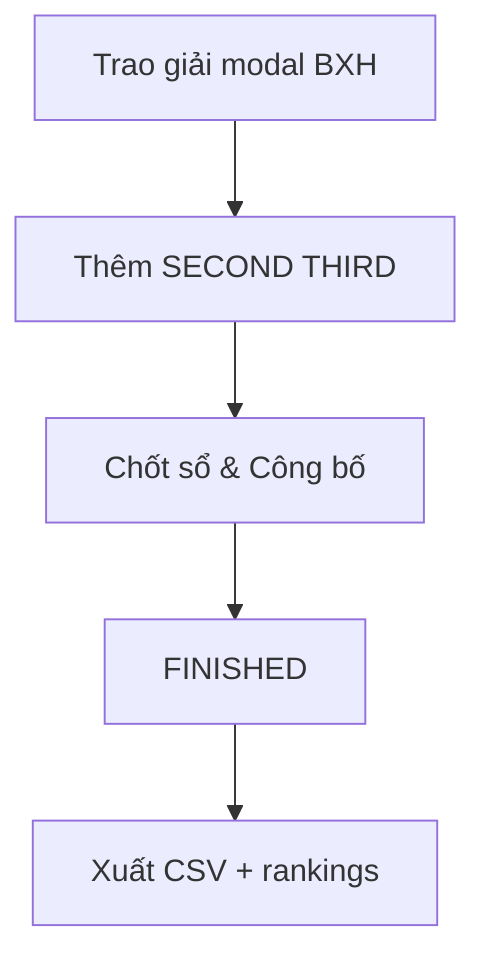

# GĐ5 + GĐ6 — Defense Playbook: Chung kết & Đóng giải

> **Person 5** · ~25 phút (Phần A ~12p + Phần B ~10p + handoff 3p)  
> **Slug A:** `seal-gd5-final-active` · **Slug B:** `seal-gd6-pending-confirm`

---

# PHẦN A — GĐ5: Chung kết Live

## VÁCH NGĂN — VÀO PHẦN A (Person 5 bắt đầu)

- **Trạng thái kỳ vọng:** Person 4 vừa **Kích hoạt Vòng thi (Chung kết)** — CK Active, đội ADVANCED, SL published.
- **Câu bàn giao:** «Chung kết đã active. Em bắt từ SV **Gửi Bài Dự Thi Chung Kết**, queue, guest chấm, khóa CK.»
- **Mode A:** Mở `seal-gd5-final-active`.
- **Mode B:** Tiếp hackathon sau activate CK GĐ4.

## VÁCH NGĂN — RA PHẦN A / VÀO PHẦN B (nội bộ Person 5)

- **Thao tác UI cuối Phần A:** **Khóa chấm điểm** (CK) → Xác nhận.
- **Verify:** Banner **Chờ chốt sổ** (`PENDING_CONFIRM`); CK `scoring_locked=true`.
- **Câu chốt:** «CK đã khóa — sang phần trao giải và đóng giải.»  
- **Mode A Phần B:** Đổi slug → `seal-gd6-pending-confirm` (hoặc reload `/results` nếu Mode B lock trên cùng slug).

**Khác biệt GĐ5 vs GĐ3:** Guest judge chấm CK **không** bị gate `SCORING_NOT_OPEN` (round `isFinal=true`).

---

## A.1 Phạm vi GĐ5

| Hạng mục | Nội dung |
|----------|----------|
| Phạm vi | Nộp CK, end-early, queue, guest + internal judge chấm, lock → PENDING_CONFIRM |
| Gate vào | G-5.1 ADVANCED; G-5.2 CK active; G-5.3 SL published |
| Gate ra | `lock-scoring` CK → `PENDING_CONFIRM` |

---

## A.2 Slug & tài khoản GĐ5

| Slug | State | Account |
|------|-------|---------|
| `seal-gd5-final-active` | CK active, 4 ADVANCED, mixed submit/score | `student.gd5.leader01@`…`leader04@` |
| | Guest judges | `guestjudge@gmail.com`, `guestjudge2@gmail.com` / `GuestJudge@dev1` |
| | HEAD CK | `judge1@fpt.edu.vn` / `Judge@dev1` |

---

## A.3 Seeders GĐ5

`Gd5FinalRoundDataSeeder` — flag `app.seed.gd5.enabled=true`.

---

## A.4 Userflow GĐ5

---

## A.5 Happy path GĐ5 (G5-H01 … G5-H08)

| ID | Loại | Role | URL | Thao tác UI | Kết quả UI | ErrorCode | FE | BE |
|----|------|------|-----|-------------|------------|-----------|----|----|
| G5-H01 | Happy | Student | `/student/submit` | Tab **Chung kết** → repo + PDF → **Gửi Bài Dự Thi Chung Kết** | SUBMITTED | — | `SubmitPage` | `SubmissionController` |
| G5-H02 | Happy | Coord | Vòng thi CK | **Kết thúc thời gian thi sớm** (CK) | Cổng nộp đóng | — | `RoundsTab` | `RoundProgressionController` |
| G5-H03 | Happy | Coord | `/presentation/queue` | **Khởi Động Máy Quay Số** (CK pool chung) | Queue CK hiển thị | — | `PresentationQueuePage` | `PresentationQueueController` |
| G5-H04 | Happy | Guest | `/judge/dashboard` | Login guest → **Vào phòng** → chấm rubric | 201 score (không SCORING_NOT_OPEN) | — | `JudgeScoringWorkspace` | `ScoreController` |
| G5-H05 | Happy | Judge | Dashboard | HEAD judge timer + **HOÀN TẤT & CHỐT SỔ ĐIỂM** | Progress X/Y | — | `JudgeScoringWorkspace` | `ScoreController` |
| G5-H06 | Happy | Judge | Workspace | **Kết thúc & gọi đội kế tiếp** | Next team CK | — | `JudgeTimerAndControls` | `PresentationQueueController` |
| G5-H07 | Happy | Coord | Vòng thi | **Khóa chấm điểm** (CK) | Banner **Chờ chốt sổ** | — | `RoundsTab` | `RoundProgressionController` |
| G5-H08 | Happy | Coord | Teams/results | Xem **Các đội vào Chung kết** + **Điểm thành phần** | BXH component scores | — | `HackathonResultsPage` | `RoundRankingQueryService` |

---

## A.6 Bad path GĐ5 (G5-B01 … G5-B03)

| ID | Loại | Role | URL | Thao tác | Kết quả UI | ErrorCode | FE | BE |
|----|------|------|-----|----------|------------|-----------|----|----|
| G5-B01 | Bad | Student | Submit | Nộp sau HARD_LOCK deadline | REJECTED toast | `HARD_LOCK_LATE` | `SubmitPage` | `SubmissionController` |
| G5-B02 | Bad | Student | Submit | Đội không ADVANCED | 422 | `TEAM_NOT_IN_ROUND` | `SubmitPage` | `SubmissionController` |
| G5-B03 | Bad | Coord | Queue | Mở scoring thiếu guest judge | Warning / blocked | `FINAL_JUDGE_MISSING` | `PresentationQueuePage` | `JudgeAssignmentController` |

---

## A.7 Sabotage GĐ5 (G5-S01 … G5-S05)

| ID | Loại | Role | URL | Thao tác (cố ý) | Kết quả (chặn) | ErrorCode | FE | BE |
|----|------|------|-----|-----------------|----------------|-----------|----|----|
| G5-S01 | Sabotage | Student | Submit | Nộp sau deadline CK | REJECTED | `HARD_LOCK_LATE` | `SubmitPage` | `SubmissionController` |
| G5-S02 | Sabotage | Student | Submit | Token đội ELIMINATED | 422 | `TEAM_NOT_IN_ROUND` | `SubmitPage` | `SubmissionController` |
| G5-S03 | Sabotage | Coord | Judges | Xóa hết guest judge → queue | Blocked | `FINAL_JUDGE_MISSING` | `FinalRoundConfigPage` | `JudgeAssignmentController` |
| G5-S04 | Sabotage | Student | Submit | CK chưa active (tay) | 422 | `ROUND_NOT_ACTIVE` | `SubmitPage` | `SubmissionController` |
| G5-S05 | Sabotage | Judge INTERNAL | Dashboard | Judge SL-only chấm CK không assigned | 403 | `JUDGE_NOT_ASSIGNED` | `JudgeScoringWorkspace` | `ScoreController` |

---

# PHẦN B — GĐ6: Trao giải · Confirm · Export

## VÁCH NGĂN — VÀO PHẦN B

- **Trạng thái:** `PENDING_CONFIRM`, CK locked, ≥1 prize (seed có FIRST).
- **Mode A:** `seal-gd6-pending-confirm`.
- **Mode B:** Sau G5-H07 trên cùng hackathon.

## VÁCH NGĂN — KẾT THÚC DEMO (Person 5 dừng)

- **Thao tác UI cuối:** **Chốt sổ & Công bố kết quả** → confirm.
- **Verify:** Banner **Đã kết thúc**; **Xuất CSV** enabled; SV `/student/results` banner lifecycle.
- **Câu chốt:** «Hackathon FINISHED — demo full chain GĐ1→GĐ6 hoàn tất.»

---

## B.1 Phạm vi GĐ6

| Hạng mục | Nội dung |
|----------|----------|
| Phạm vi | Trao giải modal BXH, confirm FINISHED, chapter/individual rankings, export CSV |
| Gate vào | G-6.1 PENDING_CONFIRM; G-6.2 CK locked; G-6.3 SL published |
| Gate ra | `PATCH /confirm` → FINISHED |

---

## B.2 Slug & tài khoản GĐ6

| Slug | State | Account |
|------|-------|---------|
| `seal-gd6-pending-confirm` | PENDING_CONFIRM, 3 ADVANCED, FIRST prize seed | `coord@fpt.edu.vn` |
| | Students | `student.gd6.leader01@`…`leader03@` |

---

## B.3 Seeders GĐ6

`Gd6PendingConfirmDataSeeder` — flag `app.seed.gd6.enabled=true`. Restart BE reset về PENDING_CONFIRM.

---

## B.4 Userflow GĐ6

---

## B.5 Happy path GĐ6 (G6-H01 … G6-H06)

| ID | Loại | Role | URL | Thao tác UI | Kết quả UI | ErrorCode | FE | BE |
|----|------|------|-----|-------------|------------|-----------|----|----|
| G6-H01 | Happy | Coord | `/hackathons/{id}/results` | Xem BXH CK | Bảng hạng + điểm | — | `HackathonResultsPage` | `RoundRankingQueryService` |
| G6-H02 | Happy | Coord | Results | **Trao giải mới** → modal BXH (chỉ finalist) → chọn đội → **Lưu** | Prize list cập nhật | — | `AwardPrizeModal` | `PrizeController` |
| G6-H03 | Happy | Coord | Results | **Chốt sổ & Công bố kết quả** → confirm | Status **Đã kết thúc**; async rankings | — | `HackathonResultsPage` | `HackathonClosureController` |
| G6-H04 | Happy | Coord | Results | Xem **Chapter rankings** (sau confirm) | Tab/chart chapter | — | `TeamRankingTable` | `ChapterRankingService` |
| G6-H05 | Happy | Coord | Results | **Individual rankings** (nếu enabled + FINISHED) | BXH cá nhân | — | `IndividualRankingPanel` | `IndividualRankingService` |
| G6-H06 | Happy | Coord | Results | **Xuất CSV xếp hạng** | File download BOM+DQ | — | `HackathonResultsPage` | `ExportJobController` |

---

## B.6 Alternative GĐ5+6

| ID | Mô tả | Kỳ vọng |
|----|-------|---------|
| G56-A01 | SV `/student/results` sau FINISHED | Banner lifecycle + CTA |
| G56-A02 | Announcement WS sau confirm | SV toast không F5 |
| G56-A03 | Mode B continuous | Lock GĐ5 → results không đổi slug |

---

## B.7 Bad path GĐ6 (G6-B01 … G6-B03)

| ID | Loại | Role | URL | Thao tác | Kết quả UI | ErrorCode | FE | BE |
|----|------|------|-----|----------|------------|-----------|----|----|
| G6-B01 | Bad | Coord | Results | Confirm khi 0 prize | 422 toast | `NO_PRIZES_RECORDED` | `HackathonResultsPage` | `HackathonClosureController` |
| G6-B02 | Bad | Coord | Award | Trao giải đội không finalist | Toast reject | `PRIZE_TEAM_NOT_FINALIST` | `AwardPrizeModal` | `PrizeController` |
| G6-B03 | Bad | Coord | Export | Export trước FINISHED | Nút disabled / 422 | — | `HackathonResultsPage` | `ExportJobController` |

---

## B.8 Sabotage GĐ6 (G6-S01 … G6-S05)

| ID | Loại | Role | URL | Thao tác (cố ý) | Kết quả (chặn) | ErrorCode | FE | BE |
|----|------|------|-----|-----------------|----------------|-----------|----|----|
| G6-S01 | Sabotage | Coord | Confirm | Confirm trước lock (dùng slug GĐ5) | 422 | `CONFIRM_BEFORE_LOCK` | `HackathonResultsPage` | `HackathonClosureServiceImpl` |
| G6-S02 | Sabotage | Coord | Confirm | Confirm khi 0 prizes | 422 | `NO_PRIZES_RECORDED` | `HackathonResultsPage` | `HackathonClosureController` |
| G6-S03 | Sabotage | Coord | Award | Duplicate prize rank | 422 | `PRIZE_DUPLICATE` | `AwardPrizeModal` | `PrizeController` |
| G6-S04 | Sabotage | Coord | Award | Prize team ELIMINATED | 422 | `PRIZE_TEAM_NOT_FINALIST` | `AwardPrizeModal` | `PrizeController` |
| G6-S05 | Sabotage | Coord | Export | Export khi PENDING_CONFIRM | Disabled | — | `HackathonResultsPage` | `ExportJobController` |

---

## B.9 Handoff 2 mode (tóm tắt)

| Mode | GĐ5 → GĐ6 |
|------|-----------|
| **Live (B)** | Lock trên `seal-gd5-final-active` → navigate `/results` cùng hackathon |
| **Snapshot (A)** | Mở sẵn `seal-gd6-pending-confirm` (đã PENDING_CONFIRM + FIRST prize) |

---

## B.10 Map source FE + BE

| Layer | File |
|-------|------|
| FE Submit CK | `features/submissions/SubmitPage` |
| FE Judge | `JudgeScoringWorkspace`, `LiveScoringPage` |
| FE Results/Prizes | `HackathonResultsPage`, `AwardPrizeModal`, `PrizeListPanel`, `TeamRankingTable` |
| BE Submissions | `SubmissionController` |
| BE Scores | `ScoreController` |
| BE Closure | `HackathonClosureController`, `HackathonClosureServiceImpl` |
| BE Prizes | `PrizeController`, `HackathonPrizeController` |
| BE Export | `ExportJobController` |

---

## B.11 Checklist smoke (cả GĐ5+6)

- [ ] `seal-gd5-final-active` CK active
- [ ] Guest judges login OK
- [ ] `seal-gd6-pending-confirm` PENDING_CONFIRM
- [ ] Modal **Trao giải** hiện BXH finalist only
- [ ] Export chỉ sau FINISHED
- [ ] Ghi `finalRoundId`

---

## B.12 FAQ hội đồng

| Câu hỏi | Trả lời |
|---------|---------|
| Guest chấm CK cần timer? | Không bắt buộc PRESENTING như SL — `isFinal=true`. |
| PENDING_CONFIRM là gì? | Side-effect lock CK — chờ BTC trao giải + confirm. |
| Individual ranking khi nào? | `individual_ranking_enabled` + FINISHED. |
| Confirm có hoàn tác? | One-way → FINISHED + async calculate. |
| 2 guest judges? | `guestjudge@` + `guestjudge2@` seed active. |

**Docs:** `gd5-full-test-matrix-and-seeds.md`, `gd6-full-test-matrix-and-seeds.md`.
