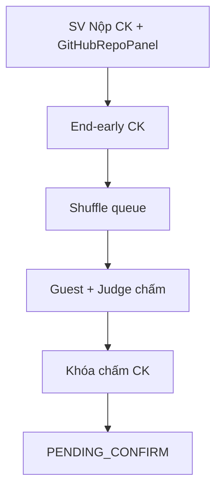
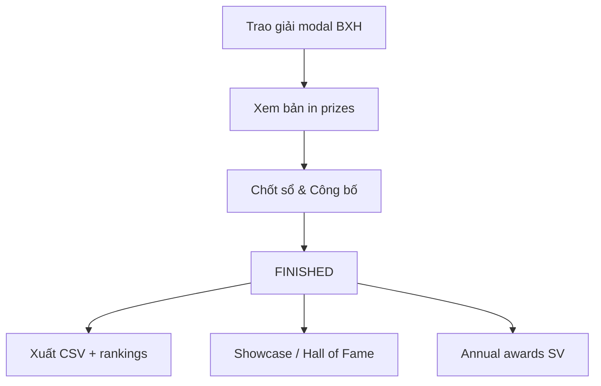

# GĐ5 + GĐ6 — Defense Playbook: Chung kết & Đóng giải

> **Doc sync:** 2026-07-31 — Phases 0–11

> **Person 5** · ~25 phút (Phần A ~12p + Phần B ~10p + handoff 3p)  
> **Slug:** `seal-e2e-2026` continuous (GĐ5 → GĐ6 trên cùng kỳ)

---

# PHẦN A — GĐ5: Chung kết Live

## VÁCH NGĂN — VÀO PHẦN A (Person 5 bắt đầu)

- **Trạng thái kỳ vọng:** Person 4 vừa **Kích hoạt Vòng thi (Chung kết)** — CK Active, đội ADVANCED, SL published.
- **Câu bàn giao:** «Chung kết đã active. Em bắt từ SV **Gửi Bài Dự Thi Chung Kết**, queue, guest chấm, khóa CK.»
- **Mode A / Mode B:** Tiếp `seal-e2e-2026` sau activate CK (**KEEP only** — START_NOW đã gỡ phase 2). ~~`seal-gd5-final-active`~~ — purged.

## VÁCH NGĂN — RA PHẦN A / VÀO PHẦN B (nội bộ Person 5)

- **Thao tác UI cuối Phần A:** **Khóa chấm điểm** (CK) → Xác nhận.
- **Verify:** Banner **Chờ chốt sổ** (`PENDING_CONFIRM`); CK `scoring_locked=true`.
- **Câu chốt:** «CK đã khóa — sang phần trao giải và đóng giải.»  
- **Mode A / B Phần B:** Reload `/results` trên **cùng** `seal-e2e-2026` (không đổi slug). ~~`seal-gd6-pending-confirm`~~ — purged.

**Khác biệt GĐ5 vs GĐ3:** Guest judge chấm CK **không** bị gate `SCORING_NOT_OPEN` (round `isFinal=true`).

**START_NOW:** đã gỡ — không demo «Bắt đầu sớm» trên activate; CK đã active từ GĐ4 KEEP.

---

## A.1 Phạm vi GĐ5

| Hạng mục | Nội dung |
|----------|----------|
| Phạm vi | Nộp CK (+ GitHub repo panel), end-early, queue, guest + internal judge chấm, lock → PENDING_CONFIRM |
| Gate vào | G-5.1 ADVANCED; G-5.2 CK active; G-5.3 SL published |
| Gate ra | `lock-scoring` CK → `PENDING_CONFIRM` |

---

## A.2 Slug & tài khoản GĐ5

| Slug | State | Account |
|------|-------|---------|
| `seal-e2e-2026` | CK active (sau GĐ4), đội ADVANCED | Leaders `student.e2e.t0N.leader@` (finalists) |
| | Guest judges | `guestjudge@gmail.com`, `guestjudge2@gmail.com` / `GuestJudge@dev1` |
| | HEAD CK | `judge1@fpt.edu.vn` / `Judge@dev1` |

---

## A.3 Seeders GĐ5

*(không seeder GĐ5 riêng)* — continuous trên `seal-e2e-2026`.  
~~`Gd5FinalRoundDataSeeder` / `app.seed.gd5.enabled`~~ — **đã gỡ**.

---

## A.4 Userflow GĐ5

---

## A.5 Happy path GĐ5 (G5-H01 … G5-H08)

| ID | Loại | Role | URL | Thao tác UI | Kết quả UI | ErrorCode | FE | BE |
|----|------|------|-----|-------------|------------|-----------|----|----|
| G5-H01 | Happy | Student | `/student/submit` | Tab **Chung kết** → repo + PDF → **Gửi Bài Dự Thi Chung Kết**; xem `GitHubRepoPanel` | SUBMITTED | — | `StudentSubmissionPage`, `FinalSubmissionPanel`, `GitHubRepoPanel` | `SubmissionController` |
| G5-H02 | Happy | Coord | Vòng thi CK | **Kết thúc thời gian thi sớm** (CK) | Cổng nộp đóng | — | `RoundManagementPage` | `RoundProgressionController` |
| G5-H03 | Happy | Coord | `/presentation/queue` | **Khởi Động Máy Quay Số** (CK pool chung) | Queue CK hiển thị | — | `PresentationQueuePage` | `PresentationQueueController` |
| G5-H04 | Happy | Guest | `/judge/dashboard` | Login guest → **Vào phòng** → chấm rubric | 201 score (không SCORING_NOT_OPEN) | — | `JudgeScoringWorkspace` | `ScoreController` |
| G5-H05 | Happy | Judge | Dashboard | HEAD judge timer + **HOÀN TẤT & CHỐT SỔ ĐIỂM**; `GitHubRepoPanel` trên controls | Progress X/Y | — | `JudgeScoringWorkspace`, `JudgeTimerAndControls`, `GitHubRepoPanel` | `ScoreController` |
| G5-H06 | Happy | Judge | Workspace | **Kết thúc & gọi đội kế tiếp** | Next team CK | — | `JudgeTimerAndControls` | `PresentationQueueController` |
| G5-H07 | Happy | Coord | Vòng thi | **Khóa chấm điểm** (CK) | Banner **Chờ chốt sổ** | — | `RoundManagementPage` | `RoundProgressionController` |
| G5-H08 | Happy | Coord | Teams/results | Xem **Các đội vào Chung kết** + **Điểm thành phần** | BXH component scores | — | `HackathonResultsPage` | `RoundRankingQueryService` |

**`GitHubRepoPanel` xuất hiện trên:** `StudentSubmissionPage`, `FinalSubmissionPanel`, `JudgeTimerAndControls`.

---

## A.6 Bad path GĐ5 (G5-B01 … G5-B03)

| ID | Loại | Role | URL | Thao tác | Kết quả UI | ErrorCode | FE | BE |
|----|------|------|-----|----------|------------|-----------|----|----|
| G5-B01 | Bad | Student | Submit | Nộp sau HARD_LOCK deadline | REJECTED toast | `HARD_LOCK_LATE` | `StudentSubmissionPage` | `SubmissionController` |
| G5-B02 | Bad | Student | Submit | Đội không ADVANCED | 422 | `TEAM_NOT_IN_ROUND` | `StudentSubmissionPage` | `SubmissionController` |
| G5-B03 | Bad | Coord | Queue | Mở scoring thiếu guest judge | Warning / blocked | `FINAL_JUDGE_MISSING` | `PresentationQueuePage` | `JudgeAssignmentController` |

---

## A.7 Sabotage GĐ5 (G5-S01 … G5-S05)

| ID | Loại | Role | URL | Thao tác (cố ý) | Kết quả (chặn) | ErrorCode | FE | BE |
|----|------|------|-----|-----------------|----------------|-----------|----|----|
| G5-S01 | Sabotage | Student | Submit | Nộp sau deadline CK | REJECTED | `HARD_LOCK_LATE` | `StudentSubmissionPage` | `SubmissionController` |
| G5-S02 | Sabotage | Student | Submit | Token đội ELIMINATED | 422 | `TEAM_NOT_IN_ROUND` | `StudentSubmissionPage` | `SubmissionController` |
| G5-S03 | Sabotage | Coord | Judges | Xóa hết guest judge → queue | Blocked | `FINAL_JUDGE_MISSING` | `FinalRoundConfigPage` | `JudgeAssignmentController` |
| G5-S04 | Sabotage | Student | Submit | CK chưa active (tay) | 422 | `ROUND_NOT_ACTIVE` | `StudentSubmissionPage` | `SubmissionController` |
| G5-S05 | Sabotage | Judge INTERNAL | Dashboard | Judge SL-only chấm CK không assigned | 403 | `JUDGE_NOT_ASSIGNED` | `JudgeScoringWorkspace` | `ScoreController` |

---

# PHẦN B — GĐ6: Trao giải · Confirm · Export · Showcase

## VÁCH NGĂN — VÀO PHẦN B

- **Trạng thái:** `PENDING_CONFIRM`, CK locked, ≥1 prize (sau trao giải demo).
- **Mode A / B:** Sau G5-H07 trên cùng `seal-e2e-2026`.

## VÁCH NGĂN — KẾT THÚC DEMO (Person 5 dừng)

- **Thao tác UI cuối:** **Chốt sổ & Công bố kết quả** → confirm → (optional) print prizes / showcase / export.
- **Verify:** Banner **Đã kết thúc**; **Xuất CSV** enabled; SV `/student/results` banner lifecycle; **không** certificates.
- **Câu chốt:** «Hackathon FINISHED — demo full chain GĐ1→GĐ6 hoàn tất.»

---

## B.1 Phạm vi GĐ6

| Hạng mục | Nội dung |
|----------|----------|
| Phạm vi | Trao giải + bản in, confirm FINISHED, chapter/individual rankings, showcase/hall-of-fame, export CSV (Results + Analytics), annual awards |
| Gate vào | G-6.1 PENDING_CONFIRM; G-6.2 CK locked; G-6.3 SL published |
| Gate ra | `PATCH /confirm` → FINISHED |

**Certificates:** **REMOVED** — không còn `/me/certificates`; `MyHonorsPanel` chỉ prizes. Sabotage: `grep` route/API certificates = 0.

---

## B.2 Slug & tài khoản GĐ6

| Slug | State | Account |
|------|-------|---------|
| `seal-e2e-2026` | PENDING_CONFIRM sau lock CK | `coord@fpt.edu.vn` |
| | Students finalists | `student.e2e.t0N.leader@` |

---

## B.3 Seeders GĐ6

*(không seeder GĐ6 riêng)* — continuous; restart **không** reset về PENDING_CONFIRM nếu `force-gd2-reset=false` (`E2eDevFlowGuard`).  
~~`Gd6PendingConfirmDataSeeder` / `app.seed.gd6.enabled`~~ — **đã gỡ**.

---

## B.4 Userflow GĐ6

---

## B.5 Happy path GĐ6 (G6-H01 … G6-H12)

| ID | Loại | Role | URL | Thao tác UI | Kết quả UI | ErrorCode | FE | BE |
|----|------|------|-----|-------------|------------|-----------|----|----|
| G6-H01 | Happy | Coord | `/hackathons/{id}/results` | Xem BXH CK | Bảng hạng + điểm | — | `HackathonResultsPage` | `RoundRankingQueryService` |
| G6-H02 | Happy | Coord | Results · tab **Giải thưởng** | **Trao giải mới** → modal BXH (chỉ finalist) → chọn đội → **Lưu** | Prize list cập nhật | — | `AwardPrizeModal` | `PrizeController` |
| G6-H02b | Happy | Coord | Giải thưởng | **Xem bản in** → `/hackathons/{id}/prizes/print` | Trang in giải thưởng | — | `PrizePrintPage` | `PrizeController` / prizes API |
| G6-H03 | Happy | Coord | Results | **Chốt sổ & Công bố kết quả** → confirm | Status **Đã kết thúc**; async rankings | — | `HackathonResultsPage` | `HackathonClosureController` |
| G6-H04 | Happy | Coord | Results | Xem **Chapter rankings** (sau confirm) | Tab/chart chapter | — | `TeamRankingTable` | `ChapterRankingService` |
| G6-H05 | Happy | Coord | Results | Tab **Individual rankings** (flag on + FINISHED) | BXH cá nhân | — | `IndividualRankingTable` | `IndividualRankingService` |
| G6-H06 | Happy | Coord | Results | **Xuất CSV** | Download **CSV_RANKINGS only** (BOM+DQ) | — | `HackathonResultsPage` | `ExportJobController` type=`CSV_RANKINGS` |
| G6-H07 | Happy | Coord | Analytics | Chọn type + xuất | `CSV_SCORES` / `CSV_RANKINGS` / `ANONYMIZED_RBL` / `FULL_REPORT` (enriched labels) | — | `AnalyticsPage` | `ExportJobController` |
| G6-H08 | Happy | Coord | Results · **Bài viết & Vinh danh** | Chỉnh showcase (FINISHED) | Draft/publish article | — | `ShowcaseEditorPanel` | `ShowcaseCoordinatorController` |
| G6-H09 | Happy | Public | `/hall-of-fame` | Xem hall of fame | Danh sách champion public | — | `HallOfFamePage` | `GET /api/v1/public/hall-of-fame` |
| G6-H10 | Happy | Public | `/news/:slug` | Đọc bài champion | Nội dung article | — | `ChampionArticlePage` | `GET /api/v1/public/articles`, `/articles/{slug}` |
| G6-H11 | Happy | Student | `/student/annual-awards` | Xem giải thường niên | List awards theo năm | — | Annual awards page | `GET /api/v1/me/annual-awards` |
| G6-H12 | Happy | Student | `/student/results` | Tab honors | Chỉ prizes — **không** certificates | — | `MyHonorsPanel` | prizes API (no certificates) |

---

## B.5b Export — types, labels, headers

### Results page

- Nút **Xuất CSV** = **`CSV_RANKINGS` only**.

### Analytics page

| Type | Label (enriched) |
|------|------------------|
| `CSV_SCORES` | Điểm chi tiết (đội / giám khảo / tiêu chí) |
| `CSV_RANKINGS` | Bảng xếp hạng (thành viên / chapter / DQ) |
| `ANONYMIZED_RBL` | Dataset RBL ẩn danh dạng dài (nghiên cứu) |
| `FULL_REPORT` | Báo cáo tổng hợp đa phần (đội, TV, tiêu chí, phân công, nộp bài, xếp hạng, giải, kháng cáo) |

(`EXPORT_JOB_TYPE_LABELS` trong `labels.js`; Select trên Analytics có thể rút gọn copy «(CSV)».)

### HEADER columns (tóm tắt)

| Type / section | Columns chính |
|----------------|---------------|
| `CSV_SCORES` | hackathon_*, round_*, track_*, team_*, chapter_*, submission_*, judge_*, criterion_*, score_value, weighted_value, score_type, comment, scored_at |
| `CSV_SCORES` anonymized | như trên nhưng `anonymized_judge_id` (không judge_name/email) |
| `CSV_RANKINGS` | section, round_*, track_*, rank, team_*, chapter_*, weighted_avg_score, judge_count, leader_*, members, is_disqualified, elimination_reason, submitted_at, is_late, status, note |
| `ANONYMIZED_RBL` | long-form RBL (mean/stdDev per criterion × anonymized judge) |

### `FULL_REPORT` — thứ tự section

1. `TEAMS`
2. `TEAM_MEMBERS`
3. `CRITERIA`
4. `JUDGE_ASSIGNMENTS`
5. `SUBMISSIONS`
6. `RANKINGS`
7. `CHAPTER_RANKINGS`
8. `INDIVIDUAL_RANKINGS`
9. `PRIZES`
10. `APPEALS`
11. `SCORES_ANONYMIZED`
12. `ANONYMIZED_RBL_LONG`
13. `RBL_VARIANCE_AGGREGATE`

---

## B.6 Alternative GĐ5+6

| ID | Mô tả | Kỳ vọng |
|----|-------|---------|
| G56-A01 | SV `/student/results` sau FINISHED | Banner lifecycle + CTA; honors = prizes only |
| G56-A02 | Announcement WS sau confirm | SV toast không F5 |
| G56-A03 | Mode B continuous | Lock GĐ5 → results không đổi slug |
| G56-A04 | Public hall-of-fame / news | Không login; API `/api/v1/public/*` |

---

## B.7 Bad path GĐ6 (G6-B01 … G6-B03)

| ID | Loại | Role | URL | Thao tác | Kết quả UI | ErrorCode | FE | BE |
|----|------|------|-----|----------|------------|-----------|----|----|
| G6-B01 | Bad | Coord | Results | Confirm khi 0 prize | 422 toast | `NO_PRIZES_RECORDED` | `HackathonResultsPage` | `HackathonClosureController` |
| G6-B02 | Bad | Coord | Award | Trao giải đội không finalist | Toast reject | `PRIZE_TEAM_NOT_FINALIST` | `AwardPrizeModal` | `PrizeController` |
| G6-B03 | Bad | Coord | Export | Export trước FINISHED | Nút disabled / 422 | — | `HackathonResultsPage` / `AnalyticsPage` | `ExportJobController` |

---

## B.8 Sabotage GĐ6 (G6-S01 … G6-S07)

| ID | Loại | Role | URL | Thao tác (cố ý) | Kết quả (chặn) | ErrorCode | FE | BE |
|----|------|------|-----|-----------------|----------------|-----------|----|----|
| G6-S01 | Sabotage | Coord | Confirm | Confirm trước lock (dùng slug GĐ5) | 422 | `CONFIRM_BEFORE_LOCK` | `HackathonResultsPage` | `HackathonClosureServiceImpl` |
| G6-S02 | Sabotage | Coord | Confirm | Confirm khi 0 prizes | 422 | `NO_PRIZES_RECORDED` | `HackathonResultsPage` | `HackathonClosureController` |
| G6-S03 | Sabotage | Coord | Award | Duplicate prize rank | 422 | `PRIZE_DUPLICATE` | `AwardPrizeModal` | `PrizeController` |
| G6-S04 | Sabotage | Coord | Award | Prize team ELIMINATED | 422 | `PRIZE_TEAM_NOT_FINALIST` | `AwardPrizeModal` | `PrizeController` |
| G6-S05 | Sabotage | Coord | Export | Export khi PENDING_CONFIRM | Disabled | — | `HackathonResultsPage` | `ExportJobController` |
| G6-S06 | Sabotage | QA | API/UI | `grep` `/me/certificates` · route certificates | **0 kết quả** — feature đã xóa | — | `MyHonorsPanel` | (no certificates controller) |
| G6-S07 | Sabotage | Coord | Activate (lịch sử) | Tìm START_NOW / «Bắt đầu sớm» trên modal activate | **Không còn** — chỉ KEEP | — | `ActivateScheduleModal` | `RoundActivationService` |

---

## B.9 Handoff 2 mode (tóm tắt)

| Mode | GĐ5 → GĐ6 |
|------|-----------|
| **Live / Continuous** | Lock CK trên `seal-e2e-2026` → navigate `/results` cùng hackathon |

~~Snapshot slug `seal-gd5-final-active` / `seal-gd6-pending-confirm`~~ — purged.

---

## B.10 Map source FE + BE

| Layer | File |
|-------|------|
| FE Submit CK | `student/features/submission/pages/StudentSubmissionPage`, `FinalSubmissionPanel`, `GitHubRepoPanel` |
| FE Judge | `JudgeScoringWorkspace`, `JudgeTimerAndControls` (+ `GitHubRepoPanel`), `LiveScoringPage` |
| FE Results/Prizes | `HackathonResultsPage`, `AwardPrizeModal`, `PrizeListPanel`, `PrizePrintPage`, `TeamRankingTable`, `IndividualRankingTable` |
| FE Showcase | `ShowcaseEditorPanel`, `HallOfFamePage`, `ChampionArticlePage` |
| FE Analytics export | `AnalyticsPage` + `EXPORT_JOB_TYPE_LABELS` |
| FE Student honors | `MyHonorsPanel` (prizes only); `/student/annual-awards` |
| BE Submissions | `SubmissionController` |
| BE Scores | `ScoreController` |
| BE Closure | `HackathonClosureController`, `HackathonClosureServiceImpl` |
| BE Prizes | `PrizeController`, `HackathonPrizeController` |
| BE Export | `ExportJobController`, `ExportCsvBuilder` |
| BE Showcase public | `PublicShowcaseController` — `/api/v1/public/hall-of-fame`, `/articles`, `/articles/{slug}` |
| BE Annual awards | `StudentMeController` — `GET /me/annual-awards` |

**Không còn:** certificates entity/API/UI; START_NOW trên activate.

---

## B.11 Checklist smoke (cả GĐ5+6)

- [ ] `seal-e2e-2026` CK active (sau GĐ4)
- [ ] `GitHubRepoPanel` trên submit SV + judge controls
- [ ] Guest judges login OK
- [ ] Sau lock CK → PENDING_CONFIRM trên cùng slug
- [ ] Modal **Trao giải** hiện BXH finalist only
- [ ] **Xem bản in** → `PrizePrintPage`
- [ ] Confirm → FINISHED → tab **Bài viết & Vinh danh** (`ShowcaseEditorPanel`)
- [ ] Public `/hall-of-fame`, `/news/:slug`
- [ ] Results **Xuất CSV** = CSV_RANKINGS; Analytics đủ 4 types
- [ ] Individual ranking tab khi flag on + FINISHED
- [ ] `/student/annual-awards` + `GET /me/annual-awards`
- [ ] `grep /me/certificates` = 0; `MyHonorsPanel` không certificates
- [ ] Ghi `finalRoundId`

---

## B.12 FAQ hội đồng

| Câu hỏi | Trả lời |
|---------|---------|
| Guest chấm CK cần timer? | Không bắt buộc PRESENTING như SL — `isFinal=true`. |
| PENDING_CONFIRM là gì? | Side-effect lock CK — chờ BTC trao giải + confirm. |
| Individual ranking khi nào? | `individual_ranking_enabled` + FINISHED → tab `IndividualRankingTable`. |
| Results Xuất CSV ra gì? | Chỉ **CSV_RANKINGS**. Đủ 4 type nằm ở **Analytics**. |
| FULL_REPORT gồm gì? | 13 section: TEAMS → … → RBL_VARIANCE_AGGREGATE (có APPEALS, SCORES_ANONYMIZED). |
| Certificates? | **Đã xóa** — honors = prizes; annual awards riêng `/student/annual-awards`. |
| Confirm có hoàn tác? | One-way → FINISHED + async calculate. |
| START_NOW còn không? | **Không** — activate KEEP only (phase 2). |
| 2 guest judges? | `guestjudge@` + `guestjudge2@` seed active. |

**Docs:** `gd5-full-test-matrix-and-seeds.md`, `gd6-full-test-matrix-and-seeds.md`.
