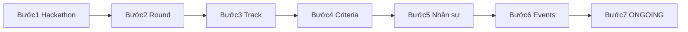

# MF-01 GĐ1 — Mainflow (7 bước)

**Phạm vi:** Giai đoạn Chuẩn bị sự kiện — Coordinator only. Kiến trúc **Hackathon → Round → Track**.

| Tài liệu | Vai trò |
|----------|---------|
| [01-business-rules.md](01-business-rules.md) | Gate G1–G5, actor, XOR, conflict |
| [04-quy-trinh-van-hanh.md](04-quy-trinh-van-hanh.md) | Runbook API từng bước |
| [05-test-data.md](05-test-data.md) | JSON mẫu, Postman, seed |
| [06-qa-uat.md](06-qa-uat.md) | Ma trận TC UAT |

**Thứ tự bắt buộc:** Bước 2 (Round) trước Bước 3 (Track). Không bỏ bước khi chưa đủ gate G1–G5.

## Bảng 7 bước

| Bước | Hành động | Đầu ra DB |
|------|-----------|-----------|
| 1 | Tạo Hackathon | `hackathons` (status=DRAFT) |
| 2 | Tạo Rounds (Sơ loại + Chung kết) | `rounds` |
| 3 | Tạo Tracks trong Round Sơ loại | `tracks` |
| 4 | Thiết lập Criteria (XOR) | `criteria` |
| 5 | Quản lý nhân sự | `users`, `invitations`, `mentor_assignments`, `judge_assignments` |
| 6 | Lên lịch sự kiện | `events`, `notifications` |
| 7 | Chuyển DRAFT → ONGOING | `hackathons.status=ONGOING` |

## Gate G1–G5 (tóm tắt)

| Gate | Điều kiện |
|------|-----------|
| G1 | ≥1 Round PRELIMINARY + ≥1 Track con |
| G2 | Đúng 1 Round FINAL |
| G3 | Mọi Track Sơ loại: có Criteria, SUM(weight)=1.0 |
| G4 | Round FINAL: có Criteria, SUM(weight)=1.0 |
| G5 | ≥1 event type=KICKOFF hợp lệ |

Chi tiết: [01-business-rules.md](01-business-rules.md) §1.4.
