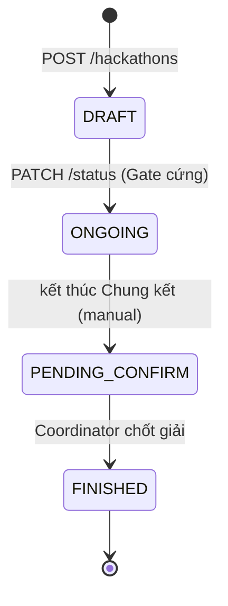

# FR-06 — Chuyển trạng thái Hackathon + Readiness Dry-run

> Workflow v3.1 ref: GĐ1 — Bước 7 | GĐ5 — Bước 6 | GĐ6 — Bước 3
> DB v2.1 ref: `hackathons.status`

> **GATE CỨNG v2.2**: Đây là điểm validate **DUY NHẤT** thực sự block tổng weight Criteria
> = 1.0 cho mọi Round. Bước 4 chỉ warn mềm; FR-06B là safety net per-round.

## Endpoint table

| # | Method | Path | Note |
|---|---|---|---|
| 1 | GET | `/api/v1/hackathons/{id}/readiness` | Dry-run gate — không mutation |
| 2 | PATCH | `/api/v1/hackathons/{id}/status` | State machine + Gate cứng |

---

## State Machine



| Transition | Pre-condition bắt buộc |
|---|---|
| `DRAFT → ONGOING` | ≥ 1 Track; mỗi Track ≥ 2 Round; mỗi Round ≥ 1 Criteria; **tổng weight mọi Round = 1.0**; ≥ 1 KICKOFF event; lịch sự kiện Lớp 1+2 hợp lệ |
| `ONGOING → PENDING_CONFIRM` | Round Chung kết `scoring_locked=TRUE`; BTC xác nhận thủ công |
| `PENDING_CONFIRM → FINISHED` | Coordinator xác nhận; prizes đã ghi |
| Bất kỳ → quay lui | **KHÔNG cho phép** |

> Quy ước tuyến tính 1 chiều — vi phạm trả 409 `STATUS_TRANSITION_INVALID`.

---

## 1. GET `/api/v1/hackathons/{id}/readiness`

Endpoint dry-run gate — chạy mọi rule của transition mục tiêu, KHÔNG mutation. Cho UI hiển thị
preview trước khi bấm "Mở cổng đăng ký".

### Query params
- `target` (default `ONGOING`) — `ONGOING` | `FINAL_ROUND` | `AWARDS` | `PENDING_CONFIRM`

### Response 200
```json
{
  "success": true,
  "data": {
    "ready": false,
    "targetStatus": "ONGOING",
    "blockers": [
      { "code": "ROUND_WEIGHT_NOT_ONE", "message": "Track A - Round Sơ loại: tổng weight 0.75", "details": { "trackId": 4, "roundId": 11, "total": 0.75 } },
      { "code": "EVENT_KICKOFF_MISSING", "message": "Thiếu sự kiện KICKOFF" }
    ],
    "warnings": [
      { "code": "READINESS_WARNING", "message": "Chưa có Mentor cho Track A", "details": { "trackId": 4 } }
    ],
    "summary": {
      "tracksCount": 2,
      "roundsCount": 4,
      "criteriaCount": 12,
      "tempJudgesCount": 6,
      "mentorAssignmentsCount": 3,
      "judgeAssignmentsCount": 6,
      "eventsCount": 3
    }
  }
}
```

### Logic
```
readiness(hackathonId, target=ONGOING):
  blockers = []; warnings = []
  if target == ONGOING:
    if !tracksRepo.existsByHackathonId(hackathonId):
        blockers.add(MISSING_TRACK)
    for track in tracks:
        if roundRepo.countByTrackId(track.id) < 2:
            blockers.add({code: ROUND_COUNT_INSUFFICIENT, trackId, current})
        for round in tracks→rounds:
            total = criteriaRepo.sumWeightExcludingPenalty(round.id)
            if total.isEmpty():
                blockers.add({code: ROUND_NO_CRITERIA, roundId})
            elif abs(total - 1.0) > 0.001:
                blockers.add({code: ROUND_WEIGHT_NOT_ONE, roundId, total})
    if !eventRepo.existsByHackathonIdAndType(hackathonId, KICKOFF):
        blockers.add(EVENT_KICKOFF_MISSING)
    # Soft warnings
    for track in tracks:
        if !mentorAssignRepo.existsByTrackId(track.id):
            warnings.add(READINESS_WARNING, "Track {name} chưa có Mentor")
  ready = blockers.isEmpty()
  audit.log(HACKATHON_READINESS_CHECK, hackathonId, {ready, blockerCount, target})
  return Readiness(ready, target, blockers, warnings, summary)
```

---

## 2. PATCH `/api/v1/hackathons/{id}/status`

### Request
```json
{ "targetStatus": "ONGOING", "note": "Mở cổng đăng ký" }
```

### Logic
```
@Transactional
changeStatus(hackathonId, req, currentUser):
  h = hackathonRepo.findById(hackathonId) or 404
  if !isAllowedTransition(h.status, req.targetStatus):
      throw 409 STATUS_TRANSITION_INVALID

  if req.targetStatus == ONGOING:
      readiness = readinessService.check(hackathonId, ONGOING)
      if !readiness.ready:
          throw 422 READINESS_NOT_PASSED with details = readiness.blockers

  oldStatus = h.status
  h.status = req.targetStatus
  hackathonRepo.save(h)
  audit.log(HACKATHON_STATUS_CHANGE, "hackathons", h.id,
            {from: oldStatus, to: req.targetStatus, note: req.note,
             validatedAt: NOW, validatedBy: currentUser.id})

  if req.targetStatus == ONGOING:
      enqueueNotificationFanout(HACKATHON_OPEN, hackathonId)   # cho mọi user APPROVED

  return mapper.toResponse(h)
```

### Response 200
```json
{
  "success": true,
  "data": { "id": 42, "status": "ONGOING", ... },
  "message": "Status changed: DRAFT → ONGOING"
}
```

### Errors
| Status | Code | Trigger |
|---|---|---|
| 409 | `STATUS_TRANSITION_INVALID` | Sai chiều (ONGOING → DRAFT, FINISHED → ...) |
| 422 | `READINESS_NOT_PASSED` | Gate cứng fail; details có array blockers |

### Audit
- `HACKATHON_STATUS_CHANGE` snapshot {from, to, validatedAt, validatedBy, note}

---

## Bảng liên quan
- `tracks`, `rounds`, `criteria`, `events`, `mentor_assignments`, `users` — readiness validate.
- `notifications` — fan-out `HACKATHON_OPEN` khi ONGOING.
- `audit_logs`

## Test cases
1. Readiness khi mới tạo Hackathon → blockers nhiều (no track, no round...).
2. Readiness khi đủ → `ready=true`.
3. PATCH ONGOING khi 1 Round weight 0.9 → 422 `READINESS_NOT_PASSED` + details.
4. PATCH ONGOING → ONGOING (idem) → 409 `STATUS_TRANSITION_INVALID`.
5. PATCH ONGOING khi thiếu KICKOFF → 422 `READINESS_NOT_PASSED` blockers chứa `EVENT_KICKOFF_MISSING`.
6. PATCH FINISHED → DRAFT → 409 `STATUS_TRANSITION_INVALID`.
