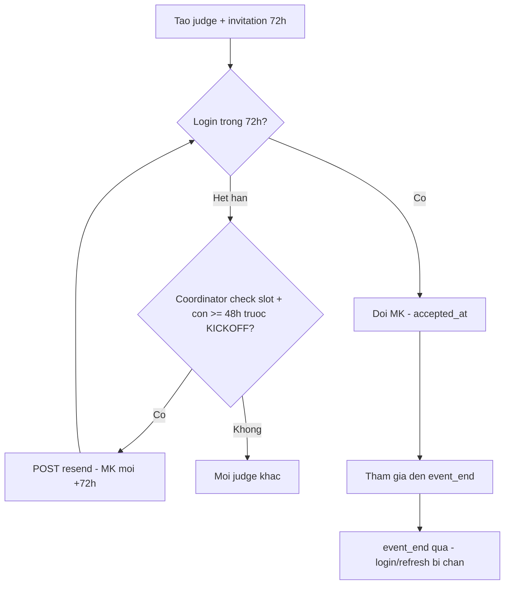
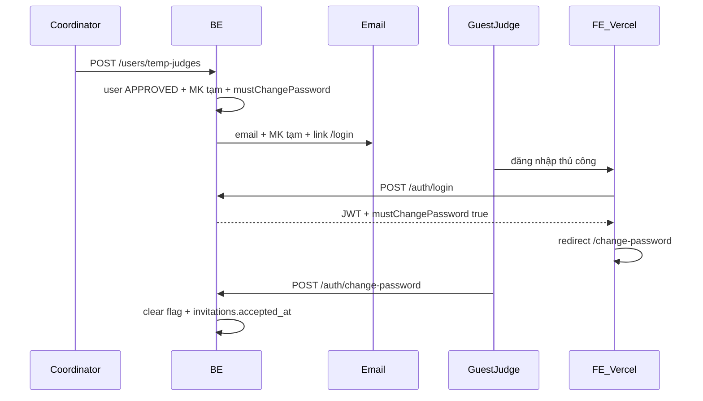

# MF-02 — Invitation judge khách (canonical)

**Source of truth** cho judge khách mời (FR-05a). Sự kiện công khai trên FE — **không** còn API “mời chia sẻ sự kiện” qua email.

**Liên quan:** [01-auth-users.md](./01-auth-users.md) · [fr-05-personnel.md](../mf01/api/fr-05-personnel.md) · [04-test-data.md](./04-test-data.md)

**FE production:** [https://seal-hackathon-fe.vercel.app](https://seal-hackathon-fe.vercel.app) — cấu hình BE: `app.frontend-url`.

---

## Nghiệp vụ vòng đời (đã implement trên BE)

> **Lưu ý thuật ngữ:** “Hết hạn 72h” là **`invitations.expires_at`** (cửa sổ đăng nhập lần đầu bằng MK tạm), **không** phải TTL của JWT access token. Sau khi judge **đổi mật khẩu** (`accepted_at` được set), hết hạn invitation **không** chặn login nữa.

| Giai đoạn | Hành vi nghiệp vụ | BE (code) |
|-----------|-------------------|-----------|
| **Mời lần đầu** | Coordinator tạo judge khách gắn **một hackathon** (`hackathonId` bắt buộc). Email gửi MK tạm + link `/login`. Invitation **+72h**. | `POST /users/temp-judges`, `InvitationConstants.INVITATION_EXPIRY_HOURS = 72` |
| **Quá 72h, chưa đổi MK** | Judge **không** login được → Coordinator có thể **resend** nếu còn trong cửa sổ trước KICKOFF. | `401 INVITATION_EXPIRED` — `AuthService.assertGuestJudgeInvitationValid` |
| **Resend (gia hạn)** | Chỉ khi invitation **đã hết hạn**, chưa `accepted_at`. Phải còn **≥ 48h trước KICKOFF** và KICKOFF **chưa bắt đầu**. Coordinator **tự kiểm tra còn slot judge** (ngoài hệ thống); nếu còn slot → `POST /invitations/{id}/resend` → MK tạm mới + **+72h**. Nếu judge từ chối / hết slot, ban tổ chức mời người khác — **không** resend. | `GuestJudgeLifecycleService.assertResendAllowed`, `InvitationServiceImpl.resend` |
| **Đã tham gia thi** | Sau đổi MK, judge login bình thường cho đến hết cuộc thi. | `accepted_at` set tại `POST /auth/change-password` |
| **Sau `event_end`** | Tài khoản judge khách **không dùng lại** cho cuộc thi khác (dùng **một lần**). BE **không xóa** row `users` — **khóa mềm**: chặn `login` / `refresh`. | `401 TEMP_JUDGE_HACKATHON_ENDED` — `GuestJudgeLifecycleService.assertHackathonNotEndedForTempJudge` |
| **Chưa có** | Xóa cứng user, job revoke session hàng ngày, API đếm slot tự động. | Xem [Backlog](#backlog) |

---

## Phạm vi

| Loại | Trạng thái |
|------|------------|
| Judge khách (GUEST_JUDGE) | **Đã implement** — email MK tạm + login + đổi MK lần đầu |
| Mời vào đội (TEAM, FR-12) | **Backlog** GĐ2 — mọi thành viên đội |
| Chia sẻ sự kiện (EVENT_SHARE) | **Đã bỏ** — copy link trang sự kiện công khai trên FE |

---

## Judge khách — flow

### Ai làm gì

| Vai trò | Hành vi |
|---------|---------|
| **Coordinator** | `POST /api/v1/users/temp-judges` (bắt buộc `hackathonId`) |
| **Judge khách** | Nhận email → đăng nhập tại `{frontend}/login` → FE chuyển đổi MK |

### Email

- Địa chỉ đăng nhập (email tài khoản).
- **Mật khẩu tạm** (plaintext một lần trong email).
- Link đăng nhập: `{app.frontend-url}/login`
- Thời hạn invitation: **3 ngày (72h)** từ lúc tạo / resend.

**Không** gửi link `/invitations/accept?token=...`. Token trong DB chỉ phục vụ audit / unique constraint.

### Đăng nhập & đổi mật khẩu

| Bước | API | Ghi chú |
|------|-----|---------|
| Login | `POST /api/v1/auth/login` | Response `mustChangePassword: true` nếu judge chưa đổi MK |
| Hết hạn invitation (chưa đổi MK) | — | `401` `INVITATION_EXPIRED` — Coordinator **resend** (nếu đủ điều kiện 48h/KICKOFF) |
| Đổi MK | `POST /api/v1/auth/change-password` | Bearer token; body `currentPassword`, `newPassword` |
| Profile | `GET /api/v1/users/me` | Field `mustChangePassword` |

### API GĐ1

| Method | Path | Auth |
|--------|------|------|
| POST | `/api/v1/users/temp-judges` | COORDINATOR |
| GET | `/api/v1/users/temp-judges` | COORDINATOR |
| POST | `/api/v1/invitations/{id}/resend` | COORDINATOR — chỉ `role=JUDGE`, sau khi **hết hạn** |

### Resend

- Chỉ khi invitation **đã hết hạn** và chưa `accepted_at`.
- Invitation phải gắn `hackathon_id` — thiếu → `422 INVITATION_HACKATHON_REQUIRED`.
- Hackathon phải có sự kiện **KICKOFF** đã lên lịch (`starts_at`) — thiếu → `422 EVENT_KICKOFF_NOT_FOUND`.
- Chỉ resend khi **còn ≥ 48 giờ trước KICKOFF** và KICKOFF **chưa bắt đầu** — vi phạm → `422 INVITATION_RESEND_AFTER_KICKOFF_CUTOFF`.
- Coordinator **tự kiểm tra slot judge** trước khi resend (không có API đếm slot).
- Tạo **MK tạm mới**, `mustChangePassword=true`, gia hạn +72h, gửi lại email.

### Vòng đời tài khoản

- `is_temp_account=true`, `status=APPROVED` khi tạo.
- Sau `hackathon.event_end` (ngày kết thúc đã qua): **login / refresh** → `401 TEMP_JUDGE_HACKATHON_ENDED`.
- Không tạo judge khách mới hoặc resend cho hackathon đã kết thúc (`422 TEMP_JUDGE_HACKATHON_ENDED`).
- Sau khi judge đã `accepted_at` (đổi MK), hết hạn invitation **không** chặn đăng nhập — chỉ áp dụng rule `event_end`.
- Job deactivate hàng ngày / cột `deactivated_at`: **chưa** (chỉ khóa mềm qua auth).

---

## Ma trận API

| API | Mô tả |
|-----|--------|
| `POST /users/temp-judges` | Tạo judge + invitation + email |
| `POST /invitations/{id}/resend` | Resend judge hết hạn |
| `POST /auth/login` | `mustChangePassword` trong response |
| `POST /auth/change-password` | Bắt buộc judge lần đầu |
| `GET /users/me` | `mustChangePassword` |

---

## Backlog

| # | Hạng mục |
|---|----------|
| 1 | FR-12 team invite (mọi member đội) |
| 2 | Scheduled deactivate + `deactivated_at` (tùy chọn) |
| 3 | `invitation_type` column (optional) |
| 4 | SMTP thay `NoOpEmailServiceImpl` |
| 5 | API xác nhận slot judge trước resend (tùy chọn) |

---

*Cập nhật: resend cửa sổ 48h trước KICKOFF; chặn login sau `event_end`; `hackathonId` bắt buộc khi tạo.*
