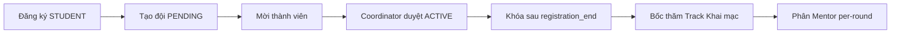

# MF-02 GĐ2 — Main flow (7 bước vận hành)

Luồng nghiệp vụ đội sau khi đã có **Hackathon GĐ1** (timeline, rounds, tracks). Auth xem [01-auth-users.md](01-auth-users.md).

---

## Bước 1–4 — Tài khoản (đã có trên BE)

| Bước | FR | Mô tả |
|------|-----|--------|
| 1 | FR-07 | Đăng ký mở (không invitation) |
| 2 | FR-08 | INTERNAL/EXTERNAL qua `chapterId` |
| 3 | FR-09 | Coordinator duyệt user → APPROVED |
| 4 | FR-10 | Judge khách (invitation 72h) — tách luồng |

**FE:** màn hình đăng ký / chờ duyệt / login JWT.

---

## Bước 5 — Tạo đội (FR-11)

**Actor:** Sinh viên APPROVED.

1. Chọn hackathon đang mở đăng ký.
2. `POST /api/v1/teams` — `teamName`, `hackathonId`.
3. Trạng thái đội: **PENDING**; user trở thành **Leader**.

**FE gợi ý:**

- Form: tên đội, preview chapter (read-only từ profile).
- Badge **Chờ duyệt** trên dashboard đội.
- Chặn tạo thêm đội nếu đã có đội PENDING/ACTIVE cùng hackathon.

---

## Bước 6 — Mời thành viên (FR-12)

1. Leader `POST .../members/invite` (email).
2. Invitee thấy notification → `PATCH .../members/{userId}` `action: ACCEPT | REJECT`.
3. Leader có thể `DELETE .../members/{userId}` nếu vẫn PENDING.

**FE gợi ý:**

- Tab **Thành viên**: Leader / Member / Pending (màu vàng).
- Invitee: modal Accept/Reject.
- Counter `acceptedMemberCount` / `pendingInviteCount` (từ `TeamDetailResponse`).

---

## Bước 7 — Coordinator duyệt (FR-13)

1. Danh sách `GET /teams?hackathonId=&status=PENDING`.
2. `PATCH /teams/{id}/status` → `ACTIVE` hoặc `REJECTED` (+ lý do).
3. Shortcut: `PATCH /teams/{id}/approve` (= ACTIVE).
4. Tùy chọn: `POST /teams/bulk-approve`.

**FE gợi ý:**

- Bảng đội chờ duyệt: tên, leader, số ACCEPTED, chapter.
- Nút Duyệt / Từ chối (modal lý do).
- Sau ACTIVE: khóa chỉnh sửa tên đội (policy FE).

---

## Bước 8 — Khóa thành viên (FR-13A)

- Hệ thống tự chạy sau `registration_end`.
- UI: icon khóa, disable nút Mời / Transfer / Hủy invite.

---

## Bước 9 — Bốc thăm (FR-13B)

**Coordinator** tại sự kiện Khai mạc:

`PATCH /api/v1/hackathons/{hackathonId}/lottery` với danh sách `{ teamId, trackId, assignedGroup? }`.

**FE gợi ý:**

- Màn hình drag-drop hoặc bảng gán đội → track (preview capacity).
- Sau gán: hiển thị track trên thẻ đội.

**Re-lottery (FR-13B-R):** đổi track trước khi round chạy — `PATCH /teams/{id}/rounds/{roundId}/track`.

---

## Bước 10 — Mentor (FR-13C)

1. `POST /teams/{id}/rounds/{roundId}/mentor` — `mentorId`.
2. `GET /teams/{id}/mentors` — lịch sử theo vòng.
3. `DELETE .../mentor` — trước khi chấm điểm.

**FE gợi ý:**

- Matrix: đội × vòng → dropdown mentor.
- Mentor login: chỉ xem đội được gán vòng hiện tại.

---

## Phân quyền tóm tắt

| Endpoint nhóm | STUDENT | COORDINATOR | MENTOR |
|---------------|---------|-------------|--------|
| Tạo đội | ✅ APPROVED | — | — |
| Invite / member patch | ✅ (leader/invitee) | — | — |
| List / get team | ✅ (own) | ✅ all | ✅ assigned |
| Duyệt / lottery / mentor assign | — | ✅ | — |
| Mentor history | — | ✅ | ✅ |

---

## Liên kết

- API chi tiết + JSON mẫu: [03-api-reference-gd2.md](03-api-reference-gd2.md), [05-test-data-gd2-teams.md](05-test-data-gd2-teams.md)
- Envelope HTTP: [mf01/api/_conventions.md](../mf01/api/_conventions.md)
