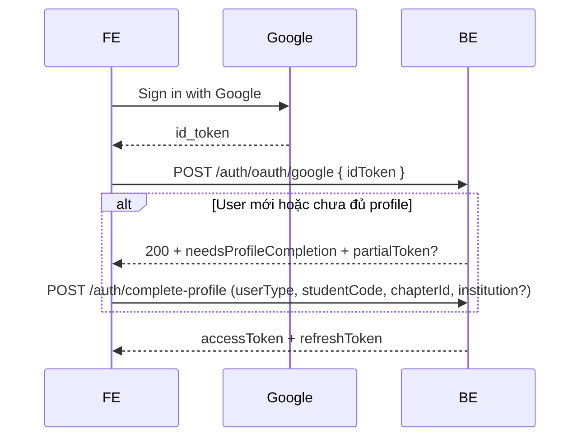

# MF-02 — Chuẩn bị đợt 2: Google OAuth & hoàn thiện hồ sơ

**Phạm vi đợt 2 (chưa code):** `POST /api/v1/auth/oauth/google`, liên kết tài khoản Google với hồ sơ STUDENT (userType, chapter, institution), SMTP thật.

**Invitation:** 3 loại tách bạch — [mf02-invitations-spec.md](./mf02-invitations-spec.md). Đăng ký **mở**; mời **đội** = FR-12 (chưa code); không nhầm với judge khách GĐ1.

Tài liệu này liệt kê **những gì team cần chuẩn bị trước khi implement** — tương tự checklist DevOps/QA cho FR-07 OAuth.

---

## 1. Google Cloud — OAuth client

| Hạng mục | Ghi chú |
|----------|---------|
| **Google Cloud Project** | Tạo project riêng cho SEAL (dev/staging/prod tách project hoặc tách OAuth client) |
| **OAuth consent screen** | External / Internal tùy policy FPT; khai báo app name, logo, domain |
| **OAuth 2.0 Client ID** | Loại **Web application** (backend verify `id_token`) + **nếu có SPA** thêm client cho redirect FE |
| **Authorized JavaScript origins** | VD `http://localhost:5173`, `https://seal.fpt.edu.vn` |
| **Authorized redirect URIs** | Khớp FE callback sau đăng nhập Google (VD `/auth/google/callback`) |
| **Client ID + Client Secret** | Lưu env: `GOOGLE_OAUTH_CLIENT_ID`, `GOOGLE_OAUTH_CLIENT_SECRET` — **không** commit vào git |

**Backend đợt 2:** verify `id_token` với Google (issuer `accounts.google.com`, audience = client id), map `sub` + `email` → `oauth_accounts` + `users`.

---

## 2. Tài khoản Gmail / email dùng để test

Không bắt buộc “một Gmail chính thức” duy nhất — cần **vài mailbox** để test đủ luồng:

| Vai trò test | Gợi ý | Dùng để |
|--------------|-------|---------|
| **Coordinator** | `coord@fpt.edu.vn` (seed) hoặc Gmail dev | Login JWT, duyệt user |
| **User APPROVED bất kỳ** | Judge / student đã duyệt | Register / login JWT |
| **Sinh viên INTERNAL** | Gmail cá nhân K19+ (VD `sv.test.fpt@gmail.com`) | Register INTERNAL + chapterId — **không** bắt `@fpt.edu.vn` |
| **Sinh viên EXTERNAL** | Gmail thứ 2 | Register EXTERNAL + `institution` — **không** `invitationToken` |
| **Google OAuth-only** | Gmail chưa register email/password | Test `POST /auth/oauth/google` → bước **complete profile** |
| **Judge khách** | Gmail BTC mời judge (tách luồng FR-05a) | Không trùng token STUDENT |

**Lưu ý FPT K19+:** Sinh viên dùng **mail cá nhân** (@gmail.com, …) cho INTERNAL — coordinator **duyệt tay** sau khi user hoàn thiện hồ sơ (đã tắt auto-approve).

---

## 3. Dữ liệu & môi trường cần có sẵn

| Thành phần | Mục đích |
|------------|----------|
| MySQL + seed GĐ1 | Hackathon ONGOING (public trên FE) |
| Chapter ACTIVE | `chapterId` khi register INTERNAL / complete profile |
| JWT APPROVED | `POST /auth/login` → Bearer |
| `app.frontend-url` | Link email judge: `/login` |

---

## 4. Bảng DB liên quan (đã có schema)

| Bảng | Đợt 2 |
|------|--------|
| `users` | Tạo/cập nhật user; `password_hash` NULL nếu chỉ OAuth |
| `oauth_accounts` | `provider=GOOGLE`, `provider_user_id`, FK `user_id` |
| `invitations` | Judge khách (FR-05a). Team invite = FR-12 sau |
| `user_sessions` | Refresh token sau OAuth login (cùng flow JWT hiện tại) |

---

## 5. API / luồng cần implement (đợt 2)

| API (dự kiến) | Mô tả |
|---------------|--------|
| `POST /api/v1/auth/oauth/google` | Body `{ "idToken": "..." }` |
| `POST /api/v1/auth/complete-profile` hoặc mở rộng register | Sau OAuth: điền FR-08 (INTERNAL/EXTERNAL, chapter, institution) |
| Liên kết account | Email Google trùng user đã có → merge hoặc từ chối (quyết định product) |

---

## 6. SMTP / email thật (đợt 2)

| Hạng mục | Ghi chú |
|----------|---------|
| SMTP relay / SendGrid / SES | Thay `NoOpEmailServiceImpl` |
| Template email | Judge khách (MK tạm + link login) |
| SPF/DKIM domain | Gửi từ domain BTC (VD `noreply@seal...`) |

Hiện tại: MK tạm judge ở log DEBUG.

---

## 7. Checklist QA trước khi bật OAuth

- [ ] Google OAuth client dev + secret trong `.env`
- [ ] Ít nhất 2 Gmail test (INTERNAL, EXTERNAL)
- [ ] Judge khách: `POST /users/temp-judges` → login → `change-password`
- [ ] Register EXTERNAL **không** token → hoàn thiện hồ sơ → coordinator `PATCH .../status` APPROVED
- [ ] Register INTERNAL Gmail + chapter → hoàn thiện hồ sơ → **duyệt tay** (không auto)
- [ ] Document quy tắc “SV tốt nghiệp”: coordinator reject + `rejectionReason` (không có API tự động)
- [ ] FE redirect URI khớp Google Console
- [ ] Quyết định: 1 Google `sub` ↔ 1 `users` row; xử lý email Google ≠ email đã register password

---

## 8. Tham chiếu

- Đợt 1 đã làm: [01-auth-users.md](./01-auth-users.md)
- Invitation: [mf02-invitations-spec.md](./mf02-invitations-spec.md)
- Spec: `GD02_SEAL_MF02_v3.4_FINAL.docx` (FR-07 OAuth, `oauth_accounts`) — một số điểm đã lệch product (xem §Deviations trong invitations spec)
