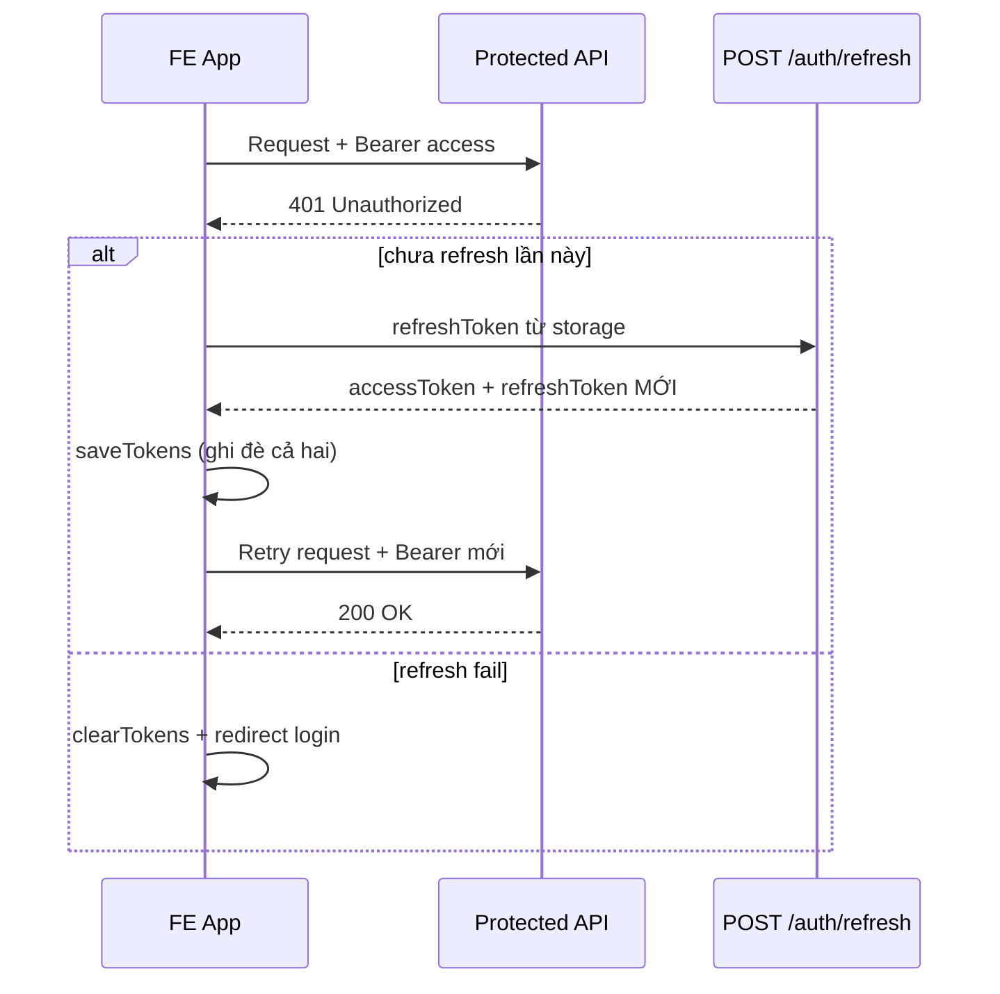
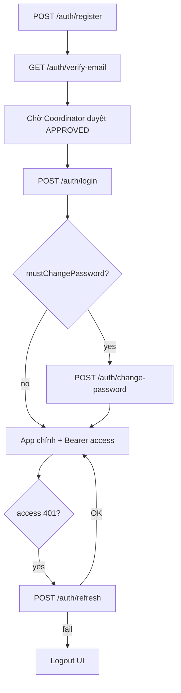

# Hướng dẫn tích hợp Auth cho Frontend

Tài liệu này mô tả **những gì FE cần làm** khi tích hợp login, register, refresh token, forgot password và các luồng liên quan với backend Seal Hackathon API.

**Base URL:** `{API_HOST}/api/v1` (ví dụ `http://localhost:8080/api/v1`)

**Tham chiếu backend (đọc khi cần chi tiết):**

| File | Vai trò |
|------|---------|
| `auth/controller/AuthController.java` | Toàn bộ endpoint `/auth/*` |
| `auth/service/AuthService.java` | Login, refresh, logout, change-password |
| `auth/service/UserSessionService.java` | Refresh rotation, revoke session |
| `auth/service/JwtTokenService.java` | Tạo/parse JWT access |
| `auth/service/RegistrationService.java` | Register, verify-email |
| `auth/service/PasswordResetService.java` | Forgot / reset password |
| `auth/security/JwtAuthenticationFilter.java` | Đọc Bearer access token |
| `auth/dto/request/*`, `auth/dto/response/*` | Shape request/response |
| `config/JwtSecurityConfig.java` | `/auth/**` public; API khác cần Bearer |
| `docs/mf02/01-auth-users.md` | Spec nghiệp vụ + dev accounts |

---

## 1. Mô hình token (bắt buộc hiểu)

| Token | Lưu ở đâu (FE) | Dùng khi nào | Hết hạn (mặc định dev) |
|-------|-----------------|--------------|-------------------------|
| **accessToken** | `localStorage` / `sessionStorage` / memory + persist | Header mọi API protected: `Authorization: Bearer {accessToken}` | **30 phút** (`expiresInSeconds` trong response login/refresh) |
| **refreshToken** | Cùng storage (khuyến nghị `httpOnly cookie` nếu sau này BE hỗ trợ; hiện tại BE trả body JSON) | Chỉ gọi `POST /auth/refresh` | **7 ngày** (session server-side) |

**Quan trọng — Refresh rotation:**

- Mỗi lần `POST /auth/refresh` thành công, BE **revoke refresh cũ** và trả **`accessToken` + `refreshToken` mới**.
- FE **phải ghi đè cả hai** trong storage. Giữ refresh cũ → lần refresh sau **401** `REFRESH_TOKEN_INVALID`.
- Access token hết hạn **không** tự logout: FE phải **chủ động** gọi refresh hoặc redirect login khi refresh fail.

**Sau logout / đổi MK / reset MK / logout-all:**

- Refresh session trên server bị revoke.
- Access JWT vẫn có thể dùng được đến khi hết TTL (~30 phút) — đây là JWT stateless. FE nên **xóa token local ngay** và coi user đã logout.

---

## 2. Envelope response chung

### Thành công (2xx)

```json
{
  "success": true,
  "data": { },
  "message": "Optional",
  "traceId": "...",
  "timestamp": "2026-05-27T06:00:00Z"
}
```

### Lỗi (4xx/5xx)

```json
{
  "success": false,
  "error": {
    "code": "INVALID_CREDENTIALS",
    "message": "Email hoặc mật khẩu không đúng",
    "status": 401,
    "details": { }
  },
  "traceId": "...",
  "timestamp": "..."
}
```

FE nên branch theo `error.code`, không parse `message` để logic.

---

## 3. Danh sách API Auth

| Method | Path | Auth | Mô tả |
|--------|------|------|--------|
| POST | `/auth/register` | Không | Đăng ký STUDENT |
| GET | `/auth/verify-email?token=` | Không | Xác thực email (link) |
| POST | `/auth/login` | Không | Login → tokens |
| POST | `/auth/refresh` | Không (body refresh) | Làm mới access + **refresh mới** |
| POST | `/auth/logout` | Không (body refresh tùy chọn) | Revoke 1 refresh session |
| POST | `/auth/forgot-password` | Không | Yêu cầu reset MK |
| POST | `/auth/reset-password` | Không | Đặt MK mới bằng token |
| POST | `/auth/change-password` | **Bearer** + APPROVED | Đổi MK (judge khách bắt buộc lần đầu) |
| POST | `/auth/logout-all` | **Bearer** + APPROVED | Revoke mọi phiên |
| GET | `/users/me` | **Bearer** + APPROVED | Profile sau login |

Mọi API khác (hackathon, team, …) cần `Authorization: Bearer {accessToken}` trừ `/auth/**` và Swagger.

---

## 4. Chi tiết từng luồng

### 4.1 Đăng ký (`POST /auth/register`)

**Request:**

```json
{
  "fullName": "Nguyen Van A",
  "email": "sv@fpt.edu.vn",
  "password": "password12",
  "userType": "INTERNAL",
  "studentCode": "SE123456",
  "chapterId": 1,
  "institution": null
}
```

| `userType` | Bắt buộc thêm |
|------------|----------------|
| `INTERNAL` | `studentCode`, `chapterId` |
| `EXTERNAL` | `studentCode`, `institution` |

**Response `201` — `data`:**

```json
{
  "userId": 42,
  "email": "sv@fpt.edu.vn",
  "status": "PENDING",
  "message": "Đăng ký thành công. Vui lòng xác thực email và chờ duyệt tài khoản.",
  "devVerifyToken": "jwt-...",
  "devVerifyUrl": "/api/v1/auth/verify-email?token=jwt-..."
}
```

`devVerifyToken` / `devVerifyUrl` chỉ có khi BE bật `security.jwt.dev-expose-verify-token=true` (dev).

**FE cần làm:**

1. Sau register → màn hình “Chờ xác thực email & duyệt” — **không** cho login.
2. Dev: có thể mở `devVerifyUrl` hoặc gọi `GET /auth/verify-email?token=...`.
3. Verify email **không** đổi `PENDING` → `APPROVED`. User vẫn chờ Coordinator duyệt mới login được.

**Lỗi thường gặp:**

| `error.code` | HTTP | FE |
|--------------|------|-----|
| `ACCOUNT_DUPLICATE_EMAIL` | 409 | Email đã tồn tại |
| `STUDENT_CODE_DUPLICATE` | 409 | Mã SV trùng |
| `STUDENT_CODE_REQUIRED` | 400 | Thiếu mã SV |
| `INSTITUTION_REQUIRED` | 400 | EXTERNAL thiếu institution |
| `INVALID_CHAPTER` | 400 | chapterId sai / chapter không ACTIVE |

---

### 4.2 Verify email (`GET /auth/verify-email?token={jwt}`)

- Gọi từ link email (hoặc dev URL).
- Thành công: `200`, `message`: "Email đã xác thực".
- Token sai/hết hạn: `400` `EMAIL_VERIFY_TOKEN_INVALID`.

**FE:** Trang `/verify-email?token=...` → gọi API → hiển thị success/fail → redirect login/register.

---

### 4.3 Đăng nhập (`POST /auth/login`)

**Request:**

```json
{
  "email": "coord@fpt.edu.vn",
  "password": "Coordinator@dev1"
}
```

**Response `200` — `data` (`AuthTokenResponse`):**

```json
{
  "accessToken": "eyJ...",
  "refreshToken": "base64url...",
  "tokenType": "Bearer",
  "expiresInSeconds": 1800,
  "mustChangePassword": false
}
```

**FE cần làm ngay sau login:**

```ts
// Pseudocode
saveTokens(data.accessToken, data.refreshToken);
scheduleRefresh(data.expiresInSeconds); // optional: refresh ~1–2 phút trước khi hết hạn

if (data.mustChangePassword) {
  navigate('/change-password'); // chặn app cho đến khi đổi MK
  return;
}
navigate('/dashboard');
```

**Lỗi login:**

| `error.code` | HTTP | Ý nghĩa |
|--------------|------|---------|
| `INVALID_CREDENTIALS` | 401 | Sai email/MK |
| `ACCOUNT_PENDING` | 401 | Chưa được Coordinator duyệt |
| `REJECTED_NOT_ALLOWED_LOGIN` | 401 | Tài khoản bị từ chối |
| `INVITATION_EXPIRED` | 401 | Judge khách — lời mời hết hạn |
| `TEMP_JUDGE_HACKATHON_ENDED` | 401 | Hackathon đã kết thúc (judge tạm) |

---

### 4.4 Refresh token (`POST /auth/refresh`) — **FE bắt buộc implement**

**Request:**

```json
{
  "refreshToken": "<stored_refresh_token>"
}
```

**Response:** Cùng shape `AuthTokenResponse` như login — **luôn lưu lại cả `accessToken` và `refreshToken` mới**.

**Lỗi:**

| `error.code` | HTTP | FE xử lý |
|--------------|------|----------|
| `REFRESH_TOKEN_INVALID` | 401 | `clearTokens()` + redirect `/login` |

**Khi nào gọi refresh:**

1. **Proactive:** Trước khi access hết hạn (~2 phút), timer gọi refresh.
2. **Reactive:** API protected trả `401` (access hết hạn / invalid) → thử refresh **1 lần** → retry request gốc.

**Không** gọi refresh cho:

- Request tới `/auth/login`, `/auth/register`, `/auth/refresh` (tránh loop).

#### Sơ đồ interceptor (Axios)



#### Gợi ý code (TypeScript / Axios)

```ts
let isRefreshing = false;
let refreshQueue: Array<(token: string) => void> = [];

api.interceptors.request.use((config) => {
  const access = getAccessToken();
  if (access && !config.url?.includes('/auth/login') && !config.url?.includes('/auth/refresh')) {
    config.headers.Authorization = `Bearer ${access}`;
  }
  return config;
});

api.interceptors.response.use(
  (res) => res,
  async (error) => {
    const original = error.config;
    const status = error.response?.status;
    const code = error.response?.data?.error?.code;

    if (status !== 401 || original._retry) {
      return Promise.reject(error);
    }
    // Không refresh nếu đang gọi auth public
    if (original.url?.includes('/auth/')) {
      return Promise.reject(error);
    }

    if (isRefreshing) {
      return new Promise((resolve) => {
        refreshQueue.push((newAccess) => {
          original.headers.Authorization = `Bearer ${newAccess}`;
          resolve(api(original));
        });
      });
    }

    original._retry = true;
    isRefreshing = true;

    try {
      const refreshToken = getRefreshToken();
      if (!refreshToken) throw new Error('no refresh');

      const { data } = await axios.post(`${API}/auth/refresh`, { refreshToken });
      const tokens = data.data; // ApiResponse wrapper
      saveTokens(tokens.accessToken, tokens.refreshToken);

      refreshQueue.forEach((cb) => cb(tokens.accessToken));
      refreshQueue = [];

      original.headers.Authorization = `Bearer ${tokens.accessToken}`;
      return api(original);
    } catch {
      clearTokens();
      window.location.href = '/login';
      return Promise.reject(error);
    } finally {
      isRefreshing = false;
    }
  }
);
```

**Lưu ý race 2 tab:** Tab A refresh xong, tab B vẫn dùng refresh cũ → `401` và có thể bị revoke **tất cả** session. Nên đồng bộ storage qua `storage` event hoặc refresh từ tab leader (BroadcastChannel).

---

### 4.5 Logout

#### Logout một thiết bị (`POST /auth/logout`)

```json
{ "refreshToken": "<optional>" }
```

**FE:**

```ts
await api.post('/auth/logout', { refreshToken: getRefreshToken() });
clearTokens();
navigate('/login');
```

#### Logout mọi thiết bị (`POST /auth/logout-all`)

- Header: `Authorization: Bearer {accessToken}`
- User phải `APPROVED`.

**FE:** Sau success → `clearTokens()` + login.

---

### 4.6 Quên mật khẩu

#### Bước 1 — `POST /auth/forgot-password`

```json
{ "email": "user@fpt.edu.vn" }
```

**Luôn `200`** với message chung (không tiết lộ email có tồn tại hay không):

```json
{
  "success": true,
  "data": {
    "message": "Nếu email tồn tại trong hệ thống, hướng dẫn đặt lại mật khẩu sẽ được gửi.",
    "devResetToken": "jwt-...",
    "devResetUrl": "http://localhost:5173/reset-password?token=jwt-..."
  }
}
```

`devResetToken` / `devResetUrl` chỉ khi dev bật `dev-expose-password-reset-token`.

**FE:**

- Form forgot password → luôn hiện “Kiểm tra email” (cùng message).
- Dev: có thể redirect thẳng `devResetUrl` hoặc copy token.
- Prod (chưa SMTP): cần quy trình nội bộ / chờ BE gửi mail sau.

#### Bước 2 — Trang reset (`POST /auth/reset-password`)

Route FE gợi ý: `/reset-password?token={jwt}`

```json
{
  "token": "<from query string>",
  "newPassword": "newPass123"
}
```

- MK: `8–100` ký tự.
- Thành công: `200` — **mọi session bị revoke** → redirect login, không giữ token cũ.
- Token sai/hết hạn: `400` `PASSWORD_RESET_TOKEN_INVALID`.
- MK trùng MK cũ: `400` `NEW_PASSWORD_SAME_AS_CURRENT`.

---

### 4.7 Đổi mật khẩu (`POST /auth/change-password`)

**Bearer bắt buộc.** Dùng khi `mustChangePassword === true` (judge khách) hoặc user tự đổi MK.

```json
{
  "currentPassword": "oldPass12",
  "newPassword": "newPass123"
}
```

**Sau success:** BE revoke **tất cả** refresh session → FE `clearTokens()` + login lại (hoặc auto-login nếu product yêu cầu).

**Lỗi:** `PASSWORD_MISMATCH`, `NEW_PASSWORD_SAME_AS_CURRENT`.

---

### 4.8 Profile sau login (`GET /users/me`)

- Cần Bearer + user `APPROVED`.
- Dùng để hydrate user (role, status, `mustChangePassword`, chapter, …).
- Gọi sau login/refresh khi vào app lần đầu.

---

## 5. Checklist implement FE

### Bắt buộc (MVP auth ổn định)

- [ ] Lưu `accessToken` + `refreshToken` sau login
- [ ] Gắn `Authorization: Bearer` cho mọi API (trừ `/auth/*` public)
- [ ] Interceptor: `401` → refresh 1 lần → retry; fail → clear + `/login`
- [ ] Sau **mỗi** refresh thành công: **ghi đè cả hai token**
- [ ] Logout: gọi `/auth/logout` + clear storage
- [ ] Register + verify-email + thông báo chờ duyệt
- [ ] Xử lý `mustChangePassword` → block app → `/change-password`
- [ ] Map `error.code` cho login/register (PENDING, REJECTED, …)

### Nên có

- [ ] Timer refresh proactive trước `expiresInSeconds` (~2 phút)
- [ ] Trang `/forgot-password` + `/reset-password?token=`
- [ ] `GET /users/me` khi boot app (nếu còn token)
- [ ] Nút “Đăng xuất tất cả thiết bị” → `POST /auth/logout-all`
- [ ] Đồng bộ token giữa nhiều tab (`storage` event)

### Chưa cần (đợt sau)

- Google OAuth — xem `docs/mf02/03-oauth-prep.md`
- httpOnly cookie cho refresh (BE chưa hỗ trợ)

---

## 6. Tài khoản dev để test

Khi chạy BE profile `dev`, xem log `[Gd1DataSeeder] Dev login`:

| Email | Password | Ghi chú |
|-------|----------|---------|
| `coord@fpt.edu.vn` | `Coordinator@dev1` | Login OK |
| `judge1@fpt.edu.vn` | `Judge@dev1` | Login OK |
| `guestjudge@gmail.com` | `GuestJudge@dev1` | `mustChangePassword: true` lần đầu |
| `pending.judge@fpt.edu.vn` | `PendingJudge@dev1` | Login fail — `ACCOUNT_PENDING` |

User **tự register** → verify email → Coordinator duyệt trong admin → mới login.

---

## 7. Mã lỗi Auth (tra cứu nhanh)

| `error.code` | HTTP | Khi nào |
|--------------|------|---------|
| `INVALID_CREDENTIALS` | 401 | Login sai |
| `ACCOUNT_PENDING` | 401 | Chưa duyệt |
| `REJECTED_NOT_ALLOWED_LOGIN` | 401 | Bị từ chối |
| `REFRESH_TOKEN_INVALID` | 401 | Refresh sai/hết hạn/reuse |
| `EMAIL_VERIFY_TOKEN_INVALID` | 400 | Link verify email |
| `PASSWORD_RESET_TOKEN_INVALID` | 400 | Link reset MK |
| `PASSWORD_MISMATCH` | 400 | Đổi MK — MK cũ sai |
| `NEW_PASSWORD_SAME_AS_CURRENT` | 400 | MK mới trùng MK cũ |
| `ACCOUNT_DUPLICATE_EMAIL` | 409 | Register trùng email |
| `STUDENT_CODE_DUPLICATE` | 409 | Register trùng mã SV |
| `INVITATION_EXPIRED` | 401 | Judge khách |
| `TEMP_JUDGE_HACKATHON_ENDED` | 401 | Judge tạm — hackathon ended |

---

## 8. Cấu hình TTL (tham khảo)

| Key | Mặc định dev | Ý nghĩa |
|-----|--------------|---------|
| `security.jwt.access-ttl-minutes` | 30 | Access JWT |
| `security.jwt.refresh-ttl-days` | 7 | Refresh session DB |
| `security.jwt.password-reset-ttl-hours` | 1 | Link reset MK |
| `security.jwt.email-verify-ttl-hours` | 24 | Link verify email |
| `app.frontend-url` | `http://localhost:5173` | Base URL cho link reset (dev log) |

---

## 9. Luồng tổng thể (onboarding user mới)



---

*Tài liệu BE chi tiết nghiệp vụ: [`01-auth-users.md`](./01-auth-users.md). Cập nhật khi API auth thay đổi.*
