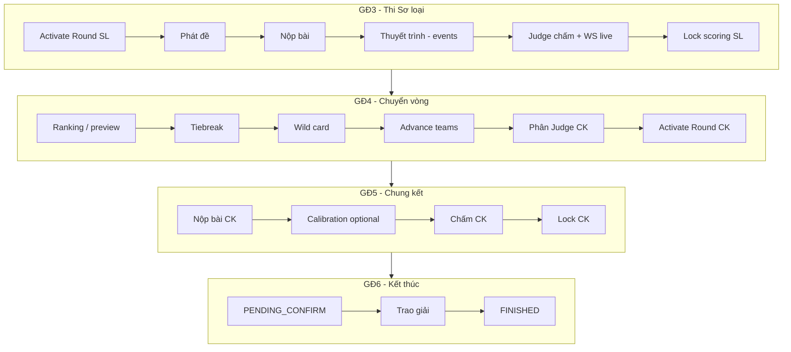

# MF-03 — Main flow (GĐ3 → GĐ6)

Luồng sau khi đã hoàn thành **MF-02** (đội ACTIVE, lottery, mentor). Auth: [mf02/01-auth-users.md](../mf02/01-auth-users.md).

---

## GĐ3 — Vòng Sơ loại (6 bước)

| Bước | FR | Actor | API chính |
|------|-----|-------|-----------|
| 1 | FR-15 | Coordinator | `PATCH /rounds/{id}/activate` |
| 2 | FR-15A | Coordinator | `PATCH /rounds/{id}/release-problem` |
| 3 | FR-16 | Student | `POST /submissions` (upsert) |
| 3b | FR-16A | Coordinator | `PATCH /submissions/{id}/review-late` |
| 4 | FR-23 | — | Events (presentation) |
| 5 | FR-18/18A | Judge | `POST /scores` + WS `/topic/rounds/{id}/*` |
| 6 | FR-20A | Coordinator | `PATCH /rounds/{id}/lock-scoring` |

**FE gợi ý (Sơ loại):**

- Dashboard đội: trạng thái round active, nút nộp bài (repo/demo/report/slide).
- Countdown `submission_deadline`.
- Badge `LATE_PENDING` + màn Coordinator duyệt muộn.
- Judge: form chấm theo criteria track; disable khi `scoring_locked`.

---

## GĐ4 — Chuyển vòng & công bố Sơ loại (6 bước)

**Điều kiện:** Round Sơ loại `scoring_locked = true`.

| Bước | FR | API |
|------|-----|-----|
| 1 | FR-27 | `GET /rounds/{id}/ranking`, `.../ranking/preview` |
| 2 | FR-28 | `GET .../tiebreak`, `POST .../tiebreak/resolve` |
| 3 | FR-29 | `GET .../wildcard/candidates`, `POST .../wildcard/approve|reject` |
| 4 | FR-30 | `POST .../advance-teams` |
| 5 | FR-31 | `POST .../judge-assignments` |
| 6 | FR-32 | `PATCH /rounds/{finalId}/activate` |

**FE gợi ý:**

- Màn ranking theo track + bảng (`assigned_group`).
- Wizard tiebreak khi có cảnh báo đồng điểm.
- Wild card: danh sách ứng viên + approve/reject.
- Checkbox advance/eliminate → confirm batch.

---

## GĐ5 — Chung kết (4 bước)

| Bước | FR | API |
|------|-----|-----|
| 1 | FR-33 | `POST /submissions` (không `trackId`) |
| 2 | FR-34 | `POST /scores/calibration` |
| 3 | FR-35 | `POST /scores` |
| 4 | FR-36 | `PATCH /rounds/{id}/lock-scoring` → `PENDING_CONFIRM` |

**FE gợi ý:**

- Nộp bài CK: một form / đội (round FINAL).
- Không hiển thị flow duyệt muộn (HARD_LOCK).
- Sau lock: chuyển Coordinator sang màn “chờ xác nhận BTC”.

---

## GĐ6 — Kết thúc (MF-06)

**Luồng FE:** [10-fe-api-flow-gd6.md](10-fe-api-flow-gd6.md) · **API:** [03-api-reference-gd3.md §6](03-api-reference-gd3.md#6-hackathon--kết-thúc--trao-giải-gđ6--mf-06) · **Backlog BE:** [09-be-backlog-gd4-gd5.md](09-be-backlog-gd4-gd5.md)

| Bước | API | Trạng thái |
|------|-----|------------|
| Xem XH Team CK | `GET /hackathons/{id}/team-rankings` | ⏳ stub |
| Trao giải | `POST /hackathons/{id}/prizes` | ✅ |
| Xem / thu hồi giải | `GET /hackathons/{id}/prizes`, `DELETE /prizes/{id}` | ⏳ stub |
| Confirm FINISHED | `PATCH /hackathons/{id}/confirm` | ⏳ stub |
| XH Chapter / Cá nhân | `GET .../chapter-rankings`, `GET .../individual-rankings` | ⏳ stub (async sau confirm) |
| Xuất báo cáo / RBL | `POST /hackathons/{id}/export-jobs`, `GET /export-jobs/{id}` | ⏳ stub |
| Bảng điểm công khai (GĐ4) | `GET /rounds/{id}/scoreboard` | ⏳ stub, public không JWT |

> Đóng sự kiện GĐ6 dùng **`/confirm`** (FR-33), không khuyến nghị `PATCH /status → FINISHED` trực tiếp.

---

## Hành trình đội (cross-cutting)

`GET /api/v1/teams/{teamId}/journey` — timeline các round + track + `participationStatus`.

Dùng cho màn “Lịch sử thi” phía student / coordinator.

---

## Phân quyền tóm tắt

| Nhóm API | STUDENT | JUDGE | COORDINATOR | Public |
|----------|---------|-------|-------------|--------|
| POST submission | ✅ | — | — | — |
| GET submissions | ✅* | ✅* | ✅ | — |
| POST scores | — | ✅ | — | — |
| Round progression | — | — | ✅ | — |
| GET scoreboard | — | — | — | ✅ |
| POST prizes | — | — | ✅ | — |
| GET prizes / confirm / export GĐ6 | — | — | ✅ | — |
| GET journey | ✅** | ✅** | ✅** | — |

\* Student: bắt buộc `teamId`; Judge: bắt buộc `roundId` + đã phân công.  
\** Mọi user đã đăng nhập (`AuthenticatedOnly`).

---

## Liên kết

- API chi tiết: [03-api-reference-gd3.md](03-api-reference-gd3.md)
- Business rules: [01-business-rules-gd3.md](01-business-rules-gd3.md) · GĐ6: [01-business-rules-gd6.md](01-business-rules-gd6.md)
- Backlog BE GĐ4–6: [09-be-backlog-gd4-gd5.md](09-be-backlog-gd4-gd5.md)
- Test: [04-test-data.md](04-test-data.md)
