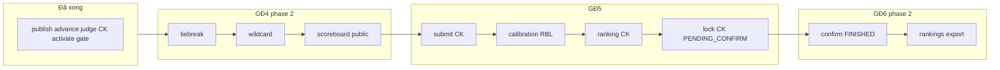

# BE Backlog — GĐ4, GĐ5 & GĐ6 (checklist triển khai)

**Mục đích:** Một file ngắn để team BE biết **đã làm gì**, **còn thiếu gì**, tránh trùng lặp khi đọc doc tổng (`01-business-rules`, `03-api-reference`, docx v4.1).

**Nguồn spec:** `GD03_05_SEAL_MF_v4_1.docx` · **Schema:** [schema-v3.0-mysql.md](../db/schema-v3.0-mysql.md)  
**Luồng FE:** [08-fe-api-flow-gd4.md](08-fe-api-flow-gd4.md) · **GĐ3 (xong):** [07-fe-api-flow-gd3.md](07-fe-api-flow-gd3.md)

**Ký hiệu**

| Ký hiệu | Ý nghĩa |
|---------|---------|
| ✅ | Logic nghiệp vụ đã có — **không implement lại** |
| 🔶 | Route/DTO/entity có; logic một phần |
| ⏳ | Stub / TODO — **cần làm** |
| 📝 | Docs/tests cần cập nhật |
| ➖ | Cố ý không làm / out of scope sprint |

---

## Phụ lục A — Re-audit GĐ3 (Sơ loại)

**Kết luận: GĐ3 đủ cho demo end-to-end Sơ loại.** Không còn gap blocker so với spec v4.1 cho FR-15 … FR-21 + FR-18A.

### ✅ Đã khớp spec

| FR | API / hành vi | Package / file chính |
|----|---------------|----------------------|
| FR-15 | Activate, deactivate round khác, criteria/weight/judge/track, `NO_TEAMS_IN_ROUND`, `JUDGE_NOT_ASSIGNED` | `rounds/service/impl/RoundActivationServiceImpl.java` |
| FR-15A | Release problem one-way + notify | `RoundProgressionServiceImpl.releaseProblem` |
| FR-16 | Submit upsert Sơ loại, cross-hackathon, eliminated, REJECTED block | `submissions/service/impl/SubmissionServiceImpl.java` |
| FR-16A | Review late APPROVE/REJECT | cùng file — `reviewLate` |
| FR-18/19 | Score upsert, guards, pessimistic lock, `SCORING_LOCKED` | `scores/service/impl/ScoreServiceImpl.java` |
| FR-18A | WebSocket 3 topic + debounce | `live_scoring/LiveScoringPublisher.java` |
| FR-20A | Lock scoring, warnings, finalize `is_final` | `RoundProgressionServiceImpl.lockScoring` |
| FR-20 | Ranking preview + ranking sau lock, BUG-4 COALESCE | `rounds/query/RoundRankingQueryService.java` |
| FR-21 | Eliminate team + `participation_status` ELIMINATED | `teams/service/impl/TeamServiceImpl.java` |
| — | GET `/submissions` lọc role | `SubmissionServiceImpl.list` |
| G-3.2 | Cron khóa đội sau `registration_end` | `teams/service/impl/TeamLockServiceImpl.java` + `TeamLockScheduler` |

**Không có REST (đúng spec):** FR-17 metadata (enqueue nội bộ), FR-23 presentation (`events` GĐ1).

### 🔶 / ➖ GĐ3 — còn lại nhưng **không chặn demo**

| Hạng mục | Trạng thái | Ghi chú |
|----------|------------|---------|
| FR-17 metadata fetch | 🔶 enqueue `PENDING` only | `SubmissionMetadataServiceImpl` — chưa worker GitHub/API. **Optional** theo spec. |
| `PATCH /submissions/{id}/resubmit`, `/review` | ➖ deprecated | FE dùng `POST /submissions` + `review-late`. Xóa sau 1 sprint. |
| `GET /teams/{id}/journey` | ⏳ stub | Không thuộc GĐ3 bắt buộc — làm sau GĐ4 nếu cần UI timeline. |
| Gate `TIEBREAK_REQUIRED` trước advance | ⏳ | Thuộc GĐ4 tiebreak — hiện Coordinator tự chọn list advance. |
| API gợi ý top-N từ `top_n_advance` | ➖ | Field round có; BE chưa auto-suggest — FE/Coord chọn tay qua ranking. |
| `03-api-reference-gd3.md` bảng trạng thái | 📝 | Một số dòng GĐ4 vẫn ghi ⏳ stub — xem mục **Docs cần sync** bên dưới. |

---

## Đã làm — GĐ4 phase 1 (đừng làm lại)

| FR | Endpoint | File |
|----|----------|------|
| FR-24 | `PATCH /rounds/{prelimId}/publish` | `RoundProgressionServiceImpl.publish` — gate lock + persist `is_published` + audit `ROUND_PUBLISH` |
| FR-30 | `POST /rounds/{prelimId}/advance` | `RoundProgressionServiceImpl.advanceTeams` — `team_round_tracks` ADVANCED/ELIMINATED + upsert `team_round_participation` CK |
| FR-27 | `POST /rounds/{finalId}/judge-assignments` | `RoundProgressionServiceImpl.assignFinalJudges` → `JudgeAssignmentService.assignFinalRoundG4` |
| FR-25 (gate) | `PATCH /rounds/{finalId}/activate` | `RoundActivationServiceImpl` — `RESULT_NOT_PUBLISHED`, `JUDGE_NOT_ASSIGNED` CK |
| FR-15 (bổ sung) | activate Sơ loại | Mỗi track ≥1 judge → `JUDGE_NOT_ASSIGNED` |

**Test:** `RoundActivationServiceImplTest` — activate fail khi track không có judge.

**GĐ1 vẫn block:** `POST /judge-assignments` với `roundId` FINAL → `JUDGE_FINAL_AT_PHASE1` (đúng thiết kế).

---

## GĐ4 — Còn phải làm

### Phase 2 — Progression & công bố (ưu tiên cao)

| # | FR | Endpoint | Trạng thái | Việc cần làm | File gợi ý |
|---|-----|----------|------------|--------------|------------|
| G4-1 | FR-22B | `GET /rounds/{id}/tiebreak` | ⏳ `List.of()` | Phát hiện đồng điểm tại ranh giới `top_n_advance` theo `tiebreak_rule` (PENALTY_SCORE / SUBMISSION_TIME / COORDINATOR_DECISION). Trả danh sách nhóm cần xử lý. | `RoundProgressionServiceImpl.tiebreak`, query mới hoặc mở rộng `RoundRankingQueryService` |
| G4-2 | FR-22B | `POST /rounds/{id}/tiebreak/resolve` | ⏳ | Ghi `tiebreak_evaluations`; cập nhật thứ hạng; clear `TIEBREAK_REQUIRED`. | `RoundProgressionServiceImpl.resolveTiebreak`, `tiebreak_evaluations/` |
| G4-3 | FR-22B | Gate advance | ⏳ | Trước `advance`: nếu còn tiebreak chưa resolve → `TIEBREAK_REQUIRED` (422). | `RoundProgressionServiceImpl.advanceTeams` |
| G4-4 | FR-22A | `GET /rounds/{id}/wildcard-candidates` | ⏳ | Khi `advancedCount < min_teams_final` && `wildcard_enabled`: liệt kê ứng viên (từ ranking + rule). Warning `MIN_TEAMS_NOT_REACHED`. | `RoundProgressionServiceImpl.wildcardCandidates` |
| G4-5 | FR-22A | `PATCH /wildcard-reviews/{id}` | ⏳ echo | Approve/reject → cập nhật `wildcard_reviews`; approve thì team vào pool advance. | `RoundProgressionServiceImpl.decideWildcardReview`, `wildcard_reviews/entity` |
| G4-6 | FR-22A | Deprecated wildcard routes | ⏳ | `POST .../wildcard/approve|reject` — redirect logic sang wildcard-reviews hoặc xóa. | `RoundProgressionController` |
| G4-7 | FR-20 | `GET /rounds/{id}/scoreboard` | ⏳ | Bảng điểm **public** (no JWT): ranking sau publish, ẩn chi tiết nhạy cảm. | `RoundProgressionServiceImpl.scoreboard` + security permit |

**Acceptance GĐ4 phase 2:** Happy path đầy đủ: lock SL → ranking → (tiebreak nếu có) → (wildcard nếu thiếu đội) → publish → advance → assign judges → activate CK — **không** cần FE workaround stub `[]`.

### Phase 2 — Readiness & polish (ưu tiên trung bình)

| # | Hạng mục | Việc cần làm |
|---|----------|--------------|
| G4-8 | Readiness CK | `GET /hackathons/{id}/readiness` — cảnh báo panel CK &lt; min (3), thiếu guest judge ([playbook §13](01-business-rules-gd3.md)). |
| G4-9 | Notification | Sau publish / advance: notify team ADVANCED/ELIMINATED (pattern `NotificationService` GĐ3). |
| G4-10 | Integration tests | IT: publish → advance → assign → activate FINAL; negative `RESULT_NOT_PUBLISHED`. |
| G4-11 | Journey (optional) | `GET /teams/{id}/journey` — đọc `team_round_tracks` + publish/advance state. **Không blocker GĐ4.** |

---

## GĐ5 — Chung kết (chưa làm — ưu tiên sau GĐ4 phase 2)

### Nộp bài & chấm CK

| # | FR | Endpoint / hành vi | Trạng thái | Việc cần làm | File gợi ý |
|---|-----|-------------------|------------|--------------|------------|
| G5-1 | FR-26 | `POST /submissions` **không** `trackId` | ⏳ block | Round FINAL active; team có `team_round_participation` CK; HARD_LOCK deadline; UNIQUE `(team_id, scoring_key)` round FINAL. | `SubmissionServiceImpl.submit` |
| G5-2 | FR-35 | `POST /scores` round FINAL | 🔶 guard có | `JudgeAssignmentGuard` đã hỗ trợ round scope; cần submission CK + criteria round FINAL. | `ScoreServiceImpl` |
| G5-3 | FR-18A | WebSocket CK | 🔶 | Broadcast round FINAL (`/topic/rounds/{finalId}/*`) — verify sau G5-1. | `LiveScoringPublisher` |
| G5-4 | FR-20 | Ranking CK | ⏳ | `RoundRankingQueryService` hiện **bỏ qua** `track_id NULL` — thêm nhánh ranking pool chung FINAL. | `RoundRankingQueryService` |
| G5-5 | FR-20A | `PATCH /rounds/{finalId}/lock-scoring` | 🔶 lock có | Side effect FR-30A: `hackathons.status → PENDING_CONFIRM` khi lock round FINAL. | `RoundProgressionServiceImpl.lockScoring` |

> **Lưu ý:** Confirm `PENDING_CONFIRM → FINISHED` thuộc **GĐ6 FR-33** (không phải GĐ5). Scaffold: `HackathonClosureServiceImpl.confirm` — xem mục GĐ6 bên dưới.

### Calibration & RBL (FR-29 / FR-30)

| # | FR | Endpoint | Trạng thái | Việc cần làm | File |
|---|-----|----------|------------|--------------|------|
| G5-7 | FR-29 | `POST /calibration-sessions` | ⏳ | Tạo session OPEN, gán sample submission, notify judges. | `CalibrationSessionServiceImpl` |
| G5-8 | FR-29 | `PATCH /calibration-sessions/{id}` | ⏳ | Close session — chặn thêm score CALIBRATION. | cùng file |
| G5-9 | FR-29 | `GET /calibration-sessions?roundId=` | ⏳ | List sessions. | cùng file |
| G5-10 | FR-29 | `POST /scores/calibration` | ⏳ empty DTO | Validate session OPEN; lưu `ScoreType.CALIBRATION`. | `ScoreServiceImpl.submitCalibrationScore` |
| G5-11 | FR-30 | `GET /rounds/{id}/rbl/variance` | ⏳ | Query view `v_judge_score_variance`. | `RblDashboardServiceImpl` |
| G5-12 | FR-30 | `GET /rounds/{id}/rbl/scoring-progress` | ⏳ | Query view `v_scoring_progress`. | cùng file |

**DB:** Views RBL + bảng `calibration_sessions` — kiểm tra migration `Gd03V41SchemaMigration` / SQL delta đã có trước khi query.

### GĐ5 — Tests & docs

| # | Việc |
|---|------|
| G5-13 | IT: activate CK → submit CK → score → lock → `PENDING_CONFIRM` |
| G5-14 | Doc `10-fe-api-flow-gd5.md` (tách tương tự GĐ4) khi bắt đầu implement |
| G5-15 | Cập nhật `03-api-reference-gd3.md` mục GĐ5 |

---

## GĐ6 — Scaffold TODO (MF-06 v3.2)

**Nguồn:** `GD06_SEAL_MF06_v3_2.docx` · **Chỉ khung route + service `// TODO`** — chưa gates/worker/query thật.

### Đã có (đừng làm lại)

| API | File |
|-----|------|
| `POST /hackathons/{id}/prizes` | [`PrizeServiceImpl.award`](../../src/main/java/com/sealhackathon/api/prizes/service/impl/PrizeServiceImpl.java) ✅ |

### Scaffold mới (TODO trong impl)

| Method | Path | Service |
|--------|------|---------|
| `PATCH` | `/hackathons/{id}/confirm` | `HackathonClosureServiceImpl.confirm` |
| `GET` | `/hackathons/{id}/team-rankings` | `HackathonClosureServiceImpl.teamRankings` |
| `GET` | `/hackathons/{id}/chapter-rankings` | `ChapterRankingServiceImpl` |
| `GET` | `/hackathons/{id}/individual-rankings` | `IndividualRankingServiceImpl` |
| `GET` | `/hackathons/{id}/prizes` | `PrizeServiceImpl.listByHackathon` |
| `DELETE` | `/prizes/{id}` | `PrizeServiceImpl.revoke` |
| `POST` | `/hackathons/{id}/export-jobs` | `ExportJobServiceImpl.create` |
| `GET` | `/export-jobs/{id}` | `ExportJobServiceImpl.getById` |
| `GET` | `/export-jobs/{id}/download` | `ExportJobServiceImpl.downloadUrl` |

Controller: [`HackathonClosureController`](../../src/main/java/com/sealhackathon/api/hackathons/controller/HackathonClosureController.java), [`ExportJobController`](../../src/main/java/com/sealhackathon/api/export_jobs/controller/ExportJobController.java), [`PrizeController`](../../src/main/java/com/sealhackathon/api/prizes/controller/PrizeController.java).

Query / event (scaffold):

| Thành phần | File |
|------------|------|
| `FinalRankingQueryService` | [`hackathons/query/`](../../src/main/java/com/sealhackathon/api/hackathons/query/) |
| `HackathonFinishedEvent` + listener | [`hackathons/event/`](../../src/main/java/com/sealhackathon/api/hackathons/event/), [`hackathons/listener/`](../../src/main/java/com/sealhackathon/api/hackathons/listener/) |

Docs: [01-business-rules-gd6.md](./01-business-rules-gd6.md), [10-fe-api-flow-gd6.md](./10-fe-api-flow-gd6.md).

### GĐ6 — Implement thật (phase 2)

| # | FR | Endpoint / hành vi | Việc cần làm | File gợi ý |
|---|-----|-------------------|--------------|------------|
| G6-1 | FR-33 | `PATCH /hackathons/{id}/confirm` | Gate `PENDING_CONFIRM`, round FINAL locked, `NO_PRIZES_RECORDED`, `SELECT FOR UPDATE`, status → FINISHED, audit IP/UA | `HackathonClosureServiceImpl.confirm` |
| G6-2 | FR-33 | Event async | Publish `HackathonFinishedEvent` → notify `RESULT_PUBLISHED` | `HackathonFinishedEventListener` |
| G6-3 | FR-31/33A | `GET .../team-rankings` | Query `v_round_leaderboard` round `is_final=TRUE`; gate `PENDING_CONFIRM`+ | `FinalRankingQueryServiceImpl` |
| G6-4 | FR-33B | Worker chapter | `calculateAsync` persist `chapter_rankings` + formula_snapshot | `ChapterRankingServiceImpl` |
| G6-5 | FR-33C/D | Worker individual | `calculateAsync` nếu `individual_ranking_enabled`; gate 404 | `IndividualRankingServiceImpl` |
| G6-6 | FR-32 | `GET .../prizes`, `DELETE /prizes/{id}` | List thật + revoke (chặn FINISHED) + audit | `PrizeServiceImpl` |
| G6-7 | FR-34/35 | Export jobs | INSERT job, worker S3, `expires_at`, download URL | `ExportJobServiceImpl` + worker |
| G6-8 | FR-32 | Migration BUG-7 | `scope`, `prize_type`, `user_id`; UNIQUE mới | SQL migration |
| G6-9 | — | Error codes | `NO_PRIZES_RECORDED`, `EXPORT_JOB_NOT_READY`, … | `ErrorCode.java` |
| G6-10 | — | Tests & docs | IT confirm + export; cập nhật `03-api-reference` §6 | tests + docs |

**Phụ thuộc GĐ5:** G5-5 phải set `PENDING_CONFIRM` trước khi G6-1 chạy được.

---

## Docs cần sync (tránh FE/BE lệch)

| File | Trạng thái | Việc còn lại |
|------|------------|--------------|
| [03-api-reference-gd3.md](03-api-reference-gd3.md) | ✅ | §6 GĐ6 đầy đủ endpoint scaffold + DTO mẫu |
| [01-business-rules-gd3.md](01-business-rules-gd3.md) dòng 5 | ✅ | Đã ghi GĐ4 phase 1 ✅ |
| [01-business-rules-gd6.md](01-business-rules-gd6.md) | ✅ | FR-31…36 map package |
| [10-fe-api-flow-gd6.md](10-fe-api-flow-gd6.md) | ✅ | Luồng FE GĐ6 scaffold |
| [02-mainflow-gd3.md](02-mainflow-gd3.md) | ✅ | GĐ6 bảng API + link backlog / 10-fe-api-flow |
| [10-fe-api-flow-gd5.md](10-fe-api-flow-gd5.md) | ⏳ | Tạo khi bắt đầu implement GĐ5 |
| Swagger `@Operation` | 📝 | Tag Round Progression / GĐ6 — ghi rõ endpoint ✅ / ⏳ |

---

## Thứ tự implement đề xuất (BE)

1. **G4-1 → G4-3** — Tiebreak (block advance nếu chưa xong).
2. **G4-4 → G4-6** — Wild card (chỉ khi `wildcard_enabled`).
3. **G4-7** — Scoreboard public (FE landing).
4. **G5-1 → G5-5** — Core CK: nộp → chấm → ranking → lock → `PENDING_CONFIRM`.
5. **G5-7 → G5-12** — Calibration + RBL (có thể song song sau G5-2).
6. **G6-1 → G6-10** — Confirm, rankings workers, export, BUG-7 migration.
7. **G4-8 → G4-11, G5-13 → G5-15** — Polish, tests, docs.

---

## Tra cứu nhanh — Controller → Service

| Controller | Service impl | Phase |
|------------|--------------|-------|
| `RoundProgressionController` | `RoundProgressionServiceImpl` | GĐ3 ✅ + GĐ4 🔶 |
| `WildcardReviewController` | delegate `RoundProgressionService` | GĐ4 ⏳ |
| `SubmissionController` | `SubmissionServiceImpl` | GĐ3 ✅ / GĐ5 ⏳ submit CK |
| `ScoreController` | `ScoreServiceImpl` | GĐ3 ✅ / GĐ5 ⏳ calibration |
| `CalibrationSessionController` | `CalibrationSessionServiceImpl` | GĐ5 ⏳ |
| `RblDashboardController` | `RblDashboardServiceImpl` | GĐ5 ⏳ |
| `HackathonClosureController` | `HackathonClosureService` + rankings + export | GĐ6 🔶 scaffold |
| `HackathonPrizeController` / `PrizeController` | `PrizeServiceImpl` | GĐ6 — `award` ✅; list/revoke ⏳ |
| `ExportJobController` | `ExportJobServiceImpl` | GĐ6 ⏳ |
| `TeamJourneyController` | `TeamJourneyServiceImpl` | Optional ⏳ |

---

## Liên kết

- README MF-03: [README.md](README.md)
- Business rules đầy đủ: [01-business-rules-gd3.md](01-business-rules-gd3.md)
- API reference: [03-api-reference-gd3.md](03-api-reference-gd3.md)
