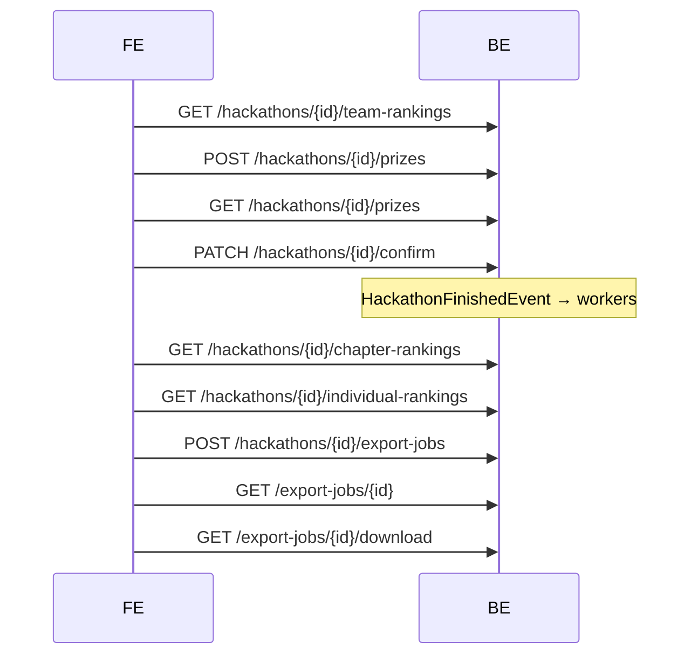

# FE API Flow — GĐ6 (MF-06 v3.2)

**Trạng thái:** scaffold — response shape có thể thay khi implement phase 2.

## Luồng Coordinator

## Endpoints

| Method | Path | FR | Ghi chú |
|--------|------|-----|---------|
| GET | `/hackathons/{id}/team-rankings` | FR-31/33A | `[]` stub |
| POST | `/hackathons/{id}/prizes` | FR-32 | ✅ logic thật |
| GET | `/hackathons/{id}/prizes` | FR-32 | `[]` stub |
| DELETE | `/prizes/{id}` | FR-32 | no-op stub |
| PATCH | `/hackathons/{id}/confirm` | FR-33 | body `ConfirmHackathonRequest` (`confirm` bắt buộc) |
| GET | `/hackathons/{id}/chapter-rankings` | FR-33B | `[]` stub |
| GET | `/hackathons/{id}/individual-rankings` | FR-33C | `[]` stub; 404 nếu cờ tắt (phase 2) |
| POST | `/hackathons/{id}/export-jobs` | FR-34/35 | 202 PENDING |
| GET | `/export-jobs/{id}` | FR-34 | status stub |
| GET | `/export-jobs/{id}/download` | FR-34/35 | URL stub |

## Precondition FE

- Hackathon `PENDING_CONFIRM` trước khi trao giải / confirm.
- Sau confirm: poll chapter/individual rankings (worker async).
- Export chỉ khi `FINISHED`.

Chi tiết request/response: [03-api-reference-gd3.md §6](03-api-reference-gd3.md#6-hackathon--kết-thúc--trao-giải-gđ6--mf-06) · Business rules: [01-business-rules-gd6.md](./01-business-rules-gd6.md).
