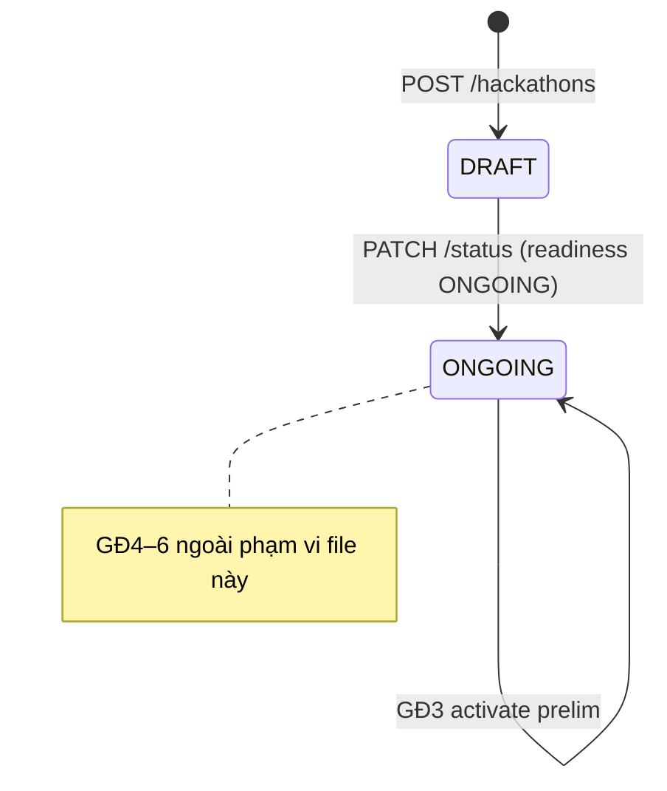
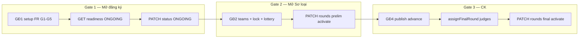
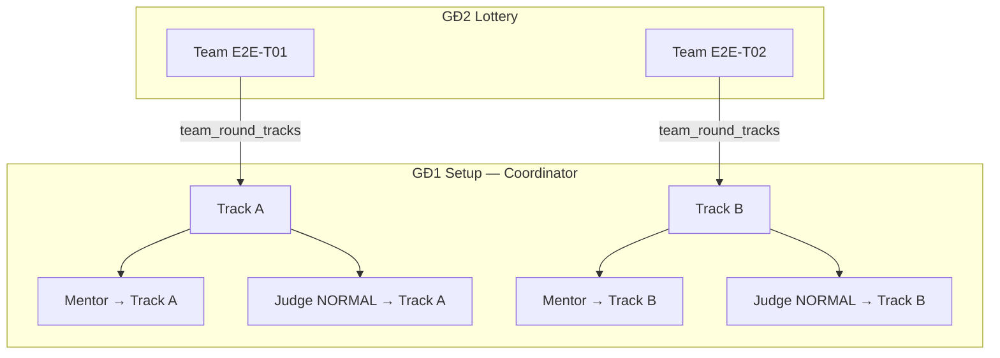

# FE GĐ1–GĐ3 Workflow mapping (BTC gate model)

> Tài liệu gửi **Frontend** để đối chiếu luồng Coordinator / Student GĐ1→3 với BE canonical.  
> Cập nhật: **2026-06-07** — đồng bộ với seed dev, readiness phased, lottery `PATCH`, events POST order vs lịch.

**Liên quan**

| Tài liệu | Nội dung |
|----------|----------|
| **[fe-gd1-gd2-structure-and-fields.md](fe-gd1-gd2-structure-and-fields.md)** | **Cấu trúc Round/Track/Bảng + field từng form GĐ1/GĐ2** |
| [fe-gd3-api-mapping.md](fe-gd3-api-mapping.md) | Portal GĐ3 — Student/Mentor/Coordinator (path `/api/v1/me/*`, submission, queue) |
| [full-workflow-api-test-gd1-gd6.md](full-workflow-api-test-gd1-gd6.md) | E2E tester — request/response JSON đầy đủ |
| [gate-regression-test-matrix-gd1-gd6.md](gate-regression-test-matrix-gd1-gd6.md) | Testcase gate & negative GĐ1–6 |
| [seed-coverage-audit.md](seed-coverage-audit.md) | Slug seed, SQL verify |

---

## 0. Quy ước API (FE bắt buộc tuân)

| Mục | BE canonical |
|-----|--------------|
| Base path | `/api/v1/` |
| Envelope success | `{ "success": true, "data": {…}, "timestamp": "…" }` |
| Envelope error | `{ "success": false, "error": { "code", "message", "status" }, "traceId", "timestamp" }` |
| JSON fields | **camelCase** trong `data` |
| Auth | `Authorization: Bearer <accessToken>` — claim JWT: `sub`/`userId`, `role` (`COORDINATOR`, `STUDENT`, `MENTOR`, `JUDGE`) |
| Role gate | Coordinator-only: setup hackathon, status, lottery, activate round, late review |

**Lỗi FE hay gặp (đã sửa trên BE, FE cần đối chiếu):**

| Sai | Đúng |
|-----|------|
| `POST /hackathons/{id}/lottery` | **`PATCH /hackathons/{id}/lottery`** |
| Body `{ "targetStatus": "ONGOING" }` only | Cả `"status"` và `"targetStatus"` đều được (`@JsonAlias`) — khuyến nghị `"status"` |
| Gán judge CK (`FINAL_EXTERNAL`) ở GĐ1 | Chỉ ở **GĐ4** — GĐ1 dùng `NORMAL` + `trackId` (Sơ loại) |
| UI gán mentor/judge **theo đội** ở GĐ1 | Gán **theo track** — xem §3.4 |
| POST WORKSHOP trước KICKOFF | POST order: **KICKOFF → WORKSHOP → AWARDS** (AWARDS chỉ GĐ6) |
| Bốc thăm trong ngày `registrationEnd` | Khóa đội + lottery từ **ngày hôm sau** `registrationEnd` |

---

## 1. State machine Hackathon (GĐ1–3 liên quan)



- Tạo hackathon luôn `DRAFT`.
- Chỉ Coordinator được `PATCH /hackathons/{id}/status`.
- Trước `DRAFT → ONGOING`: gọi `GET …/readiness?target=ONGOING` (dry-run, không block).

---

## 2. Ba gate kích hoạt (BTC)



| Gate | Giai đoạn | Điều kiện nghiệp vụ | API kích hoạt |
|------|-----------|---------------------|---------------|
| **1** | GĐ1 → GĐ2 | FR G1–G5; shell CK + criteria CK; **KICKOFF**; không cần AWARDS | `PATCH /hackathons/{id}/status` → `ONGOING` |
| **2** | GĐ2 → GĐ3 | Teams hợp lệ; `is_locked`; đã lottery prelim | `PATCH /rounds/{prelimId}/activate` |
| **3** | GĐ4 → GĐ5 | Publish SL + advance + gán judge CK | `PATCH /rounds/{finalId}/activate` |

> Gate 3 **không** thuộc GĐ1–3 — liệt kê để FE không gọi `activate` CK sớm.

---

## 3. GĐ1 — Chuẩn bị (FR G1–G5)

### 3.1 Checklist cấu trúc (trước ONGOING)

| # | Bước | Method | Path | Ghi chú |
|---|------|--------|------|---------|
| 1 | Tạo hackathon | POST | `/hackathons` | `status` luôn `DRAFT`; `eventStart`/`eventEnd` **optional** |
| 2 | Round Sơ loại | POST | `/hackathons/{id}/rounds` | `examAt` + `codingDurationHours` |
| 3 | Round Chung kết (shell) | POST | `/hackathons/{id}/rounds` | `isFinal: true` — **FR G2**, chưa activate |
| 4 | Tracks | POST | `/rounds/{prelimId}/tracks` | Chỉ round SL |
| 5 | Criteria SL | POST | `/tracks/{trackId}/criteria/batch` | Tổng weight = **1.0** / track — **FR G3** |
| 6 | Criteria CK | POST | `/rounds/{finalId}/criteria/batch` | Tổng weight = **1.0** — **FR G4** |
| 7 | Mentor | POST | `/mentor-assignments` | Warning nếu thiếu (không block ONGOING) |
| 8 | Judge SL | POST | `/judge-assignments` | `trackId` + `assignmentType: "NORMAL"` |
| 9a | Event KICKOFF | POST | `/hackathons/{id}/events` | **POST đầu tiên** — blocker readiness |
| 9b | Event WORKSHOP | POST | `/hackathons/{id}/events` | POST sau KICKOFF |
| 10 | Readiness dry-run | GET | `/hackathons/{id}/readiness?target=ONGOING` | `ready: true` trước khi mở kỳ |
| 11 | Mở kỳ | PATCH | `/hackathons/{id}/status` | `{ "status": "ONGOING" }` |

**Không làm ở GĐ1**

- `FINAL_EXTERNAL` judge → GĐ4 (`POST /rounds/{finalId}/assign-final-judges` hoặc flow advance)
- Event **AWARDS** → GĐ6 (`readiness?target=AWARDS`)
- `PATCH /rounds/{finalId}/activate`

### 3.2 Events — POST order vs lịch thực tế

| Khía cạnh | Quy tắc |
|-----------|---------|
| **Thứ tự POST** | `KICKOFF` → `WORKSHOP` → `AWARDS` (AWARDS tùy chọn ở GĐ1) |
| **Thứ tự trên lịch** | `WORKSHOP` → `KICKOFF` → `AWARDS` (WS **trước** KO, **khác ngày**) |
| **Readiness ONGOING** | Chỉ bắt buộc **KICKOFF** — không cần AWARDS |
| **Negative** | POST WORKSHOP trước KICKOFF → `422 EVENT_ORDER_VIOLATION` |
| **Negative** | WS và KO cùng ngày trên lịch → `422 EVENT_ORDER_VIOLATION` |

**Lịch mẫu seed dev:** đăng ký 24/05–05/06 · WS **06/06** · KO **07/06** · thi 10/06.

**Mẫu POST KICKOFF:**

```json
{
  "type": "KICKOFF",
  "title": "Kickoff SEAL E2E 2026",
  "scheduledAt": "2026-06-07T09:00:00",
  "location": "Online"
}
```

### 3.3 PATCH status — request/response

```http
PATCH /api/v1/hackathons/{id}/status
```

```json
{ "status": "ONGOING", "note": "Mở đăng ký" }
```

Response `data.status` phải là `"ONGOING"`. Field `note` optional (max 1000 ký tự).

> BE chấp nhận cả `"targetStatus"` (alias) — FE có thể dùng một trong hai, nhưng doc tester dùng `"status"`.

### 3.4 Phân công Mentor & Judge (theo Track — không theo đội)

> **Quy tắc cốt lõi cho FE:** Màn setup GĐ1 gán mentor/judge theo **Track**, không cần (và không nên) UI chọn từng đội.  
> Sau lottery, đội thuộc track nào thì tự động nằm trong phạm vi mentor/judge của track đó.

#### Tóm tắt mô hình

| Vai trò | Gán chính (GĐ1) | Gán phụ | Có gán theo đội? |
|---------|-----------------|---------|------------------|
| **Judge Sơ loại** | `trackId` | — | **Không** |
| **Judge Chung kết** | `roundId` (GĐ4) | — | **Không** |
| **Mentor** | `trackId` | team + round (GĐ2+, tùy chọn) | Chỉ khi BTC gọi API riêng |



#### Judge

| Vòng | FK gán | API | Body mẫu |
|------|--------|-----|----------|
| **Sơ loại** | `judge_assignments.track_id` | `POST /judge-assignments` | `{ "judgeId", "trackId", "assignmentType": "NORMAL" }` |
| **Chung kết** | `judge_assignments.round_id` | GĐ4 — `POST /rounds/{finalId}/assign-final-judges` | `FINAL_EXTERNAL` — **không** gán ở GĐ1 |

**Khi chấm điểm (`POST /scores`):** BE kiểm tra judge được gán **track** của submission (SL) hoặc **round** CK (final) — không có bảng gán judge ↔ team.

**Negative GĐ1:** gán judge CK (`roundId` + `FINAL_EXTERNAL`) → `422 JUDGE_FINAL_AT_PHASE1`.

**List judge theo track (Coordinator):**

```http
GET /api/v1/tracks/{trackId}/judges
```

**Portal judge — track đã gán:**

```http
GET /api/v1/me/judge-track-assignments
```

#### Mentor

**Gán chính — GĐ1 (theo track):**

```http
POST /api/v1/mentor-assignments
```

```json
{ "mentorId": 4, "trackId": 5 }
```

Bảng `mentor_assignments` — unique `(mentor_id, track_id)`. Readiness ONGOING chỉ **warning** nếu track thiếu mentor (không block gate).

**Gán phụ — tùy chọn GĐ2+ (theo đội + vòng):**

```http
POST /api/v1/teams/{teamId}/rounds/{roundId}/mentor
```

```json
{ "mentorId": 4 }
```

- Bảng `mentor_team_assignments` — dùng khi BTC muốn mentor cố định **từng đội** trong một vòng.
- **Không** tự sinh khi lottery — seed dev tạo thủ công cho test portal.
- **Không** áp dụng vòng Chung kết → `422 MENTOR_ASSIGNMENT_NOT_FOR_FINAL_ROUND`.

#### Quyền truy cập & Portal mentor

`MentorAccessGuard` cho phép mentor xem đội nếu **một trong hai**:

1. Có `mentor_team_assignments` trực tiếp với đội đó, **hoặc**
2. Có `mentor_assignments` với **track** mà đội đang tham gia (`team_round_tracks`).

| Endpoint portal | Nguồn dữ liệu hiện tại | Ghi chú FE |
|-----------------|------------------------|------------|
| `GET /me/mentor/rounds` | `mentor_team_assignments` | Nếu chỉ gán track (GĐ1) mà chưa gán team → `teams[]` có thể **trống** |
| `GET /me/mentor/rounds/{roundId}/assigned-teams` | `mentor_team_assignments` | Tương tự — cần derive từ track hoặc gọi thêm API |
| `GET /me/mentor-track-assignments` | `mentor_assignments` | Danh sách track mentor được gán ở GĐ1 |

**Gợi ý UI mentor portal:** Sau lottery, lấy danh sách đội bằng một trong hai cách:

- **Cách A (khuyến nghị):** FE derive — lấy `trackId` từ `mentor_assignments` → query teams thuộc track qua `team_round_tracks` / API teams-by-track.
- **Cách B:** BTC gọi `POST /teams/{id}/rounds/{roundId}/mentor` cho từng đội (nặng, không bắt buộc).

#### Xung đột Mentor ↔ Judge

DB trigger + BE enforce: **cùng một user không được vừa là Mentor vừa là Judge của cùng track** (Sơ loại). FE nên disable chọn user đã là mentor của track khi gán judge (và ngược lại).

---

### 3.5 Seed dev GĐ1

| Slug | Status | Mục đích FE |
|------|--------|-------------|
| `seal-gd1-incomplete` | DRAFT | Readiness `ready: false` — test blocker UI |
| `seal-e2e-2026` | DRAFT | Đủ G1–G5 — chỉ test bước readiness + PATCH ONGOING |
| `seal-e2e-2026` | ONGOING | GĐ2 shortcut (đội `E2E-T*`) |
| `seal-fall-2025-finished` | FINISHED | Archive read-only |

Login dev: `coord@fpt.edu.vn` / `Coordinator@dev1` · xem log `[Gd1DataSeeder]` khi start app (`profile=dev`).

---

## 4. GĐ2 — Đăng ký & bốc thăm

### 4.1 Điều kiện

| Mục | Chi tiết |
|-----|----------|
| Hackathon | `status = ONGOING` |
| Tạo đội | `POST /teams` — leader + members |
| Duyệt SV | `PATCH /users/{userId}/status` → `ACTIVE` |
| Khóa đội | `teams.is_locked = true` khi **ngày hệ thống > registrationEnd** (cùng ngày vẫn **chưa** khóa) |
| Bốc thăm | **`PATCH /hackathons/{id}/lottery`** |

### 4.2 Lottery — 2 chế độ

**Chọn tay (batch):**

```http
PATCH /api/v1/hackathons/{hackathonId}/lottery
```

```json
{
  "roundId": 12,
  "assignments": [
    { "teamId": 41, "trackId": 8, "assignedGroup": "A" },
    { "teamId": 42, "trackId": 8, "assignedGroup": "A" }
  ]
}
```

**Auto (BE chia ngẫu nhiên):**

```json
{ "roundId": 12, "assignments": [] }
```

hoặc bỏ hẳn `assignments`.

**Negative:** lottery khi team chưa `is_locked` → `422 TEAM_NOT_LOCKED`.

**Re-lottery (đổi track):** `PATCH /api/v1/me/teams/{teamId}/rounds/{roundId}/relottery` (student) hoặc endpoint team-scoped tương đương — xem catalog Phần III.

### 4.3 Luồng FE gợi ý GĐ2

1. Student register → upload thẻ SV → Coordinator duyệt `ACTIVE`
2. Leader `POST /teams` → mời members → submit đội
3. Coordinator duyệt đội (`PATCH /teams/{id}/status`)
4. **Sau** `registrationEnd`: đội tự khóa / hệ thống khóa → Coordinator lottery
5. Gate 2: `PATCH /rounds/{prelimId}/activate`

### 4.4 Seed shortcut

Slug **`seal-e2e-2026`** — ONGOING, 9 đội `E2E-T*`, lottery một phần.  
Student mẫu: `student.gd2.hcm.leader03@fpt.edu.vn` / `Student@dev1`.

---

## 5. GĐ3 — Thi Sơ loại

### 5.1 Luồng Coordinator

| # | API | Ghi chú |
|---|-----|---------|
| 1 | `PATCH /rounds/{prelimId}/activate` | Gate 2 — sau lottery |
| 2 | `POST /rounds/{prelimId}/release-problem` | Phát đề (nếu chưa seed) |
| 3 | `GET /submissions?status=LATE_PENDING` | Duyệt nộp trễ |
| 4 | `PATCH /submissions/{id}/approve` hoặc `/reject` | Late review |
| 5 | `GET /presentation/queue?roundId=` | Hàng chờ trình bày |
| 6 | `PATCH /presentation/queue/next?roundId=` | Chuyển team tiếp theo |
| 7 | `PATCH /rounds/{prelimId}/lock-scoring` | Khóa chấm SL → chuẩn bị GĐ4 |

### 5.2 Portal Student / Mentor

Chi tiết path, response map, status `LATE_PENDING` → xem **[fe-gd3-api-mapping.md](fe-gd3-api-mapping.md)**.

Tóm tắt path BE:

| FE cũ (Person B) | BE canonical |
|------------------|--------------|
| `GET /api/student/{id}/submission` | `GET /api/v1/me/submission?teamId=&roundId=` |
| `POST /api/student/{id}/submission` | `POST /api/v1/submissions` |
| `GET /api/round/current/deadline` | `GET /api/v1/me/rounds/current/deadline` |
| `GET /api/mentor/rounds` | `GET /api/v1/me/mentor/rounds` |
| `GET /api/mentor/{id}/assigned-teams` | `GET /api/v1/me/mentor/rounds/{roundId}/assigned-teams` |

**Submission status map (FE hiển thị):**

| BE `status` | FE label gợi ý |
|-------------|----------------|
| `SUBMITTED`, `LATE`, `LATE_APPROVED`, `ACCEPTED` | `ON_TIME` |
| `LATE_PENDING` | `LATE_PENDING` |
| `REJECTED` | `REJECTED` |

**Validation:** `slideUrl` phải `.pdf` → `400 INVALID_SLIDE_FORMAT`. BE tự set `LATE_PENDING` sau deadline — FE không gửi flag.

### 5.3 Timeline round

`PUT /rounds/{id}` với `examAt` + `codingDurationHours` → BE tính `submissionOpen` / `submissionDeadline` và cascade `presentation_slots` (trừ khi `scoringLocked` hoặc queue `DONE`).

### 5.4 Seed shortcut GĐ3

Slug **`seal-gd3-prelim-open`** — ONGOING, prelim **active**, 6 đội, late/score/queue có sẵn.

| Team | Email leader | Trạng thái test |
|------|--------------|-----------------|
| GD3-01 SUBMITTED + scored | `student.gd3.leader01@` | Đã chấm đủ |
| GD3-02 LATE_PENDING | `student.gd3.leader02@` | Duyệt trễ |
| GD3-04 chưa nộp | `student.gd3.leader04@` | POST submission |

Password: `Student@dev1` · Coord: `coord@fpt.edu.vn` / `Coordinator@dev1`.

---

## 6. Readiness targets

| `target` | Mục đích | Blocker chính |
|----------|----------|---------------|
| `ONGOING` | Gate 1 — mở đăng ký | Thiếu prelim/track/criteria, shell CK, criteria CK, KICKOFF, weight ≠ 1.0 |
| `FINAL_ROUND` | Trước activate CK (GĐ5) | `FINAL_EXTERNAL` judges, teams trong CK |
| `AWARDS` | Trước GĐ6 | `EVENT_AWARDS_MISSING` |
| `PENDING_CONFIRM` | Alias checklist GĐ6 | Giống `AWARDS` |

**Ví dụ — ONGOING (không cần AWARDS):**

```http
GET /api/v1/hackathons/2/readiness?target=ONGOING
```

```json
{
  "ready": true,
  "targetStatus": "ONGOING",
  "blockers": [],
  "warnings": [
    { "code": "READINESS_WARNING", "message": "Track 'A' chưa có Mentor" }
  ],
  "summary": {
    "tracksCount": 2,
    "roundsCount": 2,
    "criteriaCount": 8,
    "eventsCount": 2
  }
}
```

FE nên hiển thị `blockers[]` (đỏ, chặn gate) tách khỏi `warnings[]` (vàng, cho phép tiếp).

---

## 7. Error codes theo gate (GĐ1–3)

| Gate / vùng | Code | Ý nghĩa / hành vi FE |
|-------------|------|----------------------|
| ONGOING | `MISSING_PRELIMINARY_ROUND` | Thiếu round SL |
| ONGOING | `MISSING_FINAL_ROUND` | Thiếu shell CK |
| ONGOING | `TRACK_CRITERIA_WEIGHT` / `FINAL_CRITERIA_WEIGHT` | Tổng weight ≠ 1.0 |
| ONGOING | `EVENT_KICKOFF_MISSING` | Chưa POST KICKOFF |
| ONGOING | `ROUND_DEADLINE_INVALID` | Timeline round không hợp lệ |
| Events | `EVENT_ORDER_VIOLATION` | Sai thứ tự POST hoặc WS/KO cùng ngày |
| GĐ1 judge | `JUDGE_FINAL_AT_PHASE1` | Gán judge CK quá sớm |
| GĐ2 lottery | `TEAM_NOT_LOCKED` | Chưa qua ngày khóa đội |
| Activate prelim | `HACKATHON_NOT_ONGOING` | Hackathon chưa ONGOING |
| Activate CK | `RESULT_NOT_PUBLISHED` | Chưa publish SL (GĐ4) |
| Submission | `INVALID_SLIDE_FORMAT` | slideUrl không phải PDF |
| Auth | `401` / `403` | Token hết hạn / sai role |

Format lỗi đầy đủ: xem §0 và [fe-gd3-api-mapping.md §6](fe-gd3-api-mapping.md).

---

## 8. `eventStart` / `eventEnd` sync

- FE **không bắt buộc** gửi `eventStart`/`eventEnd` khi `POST /hackathons`.
- Sau `POST` / `PUT` / `DELETE` round, BE tự sync:
  - `eventStart` = min(`round.examAt`)
  - `eventEnd` = max(`submissionDeadline` hoặc `examAt`)
- FE dashboard timeline nên **đọc lại** hackathon sau khi CRUD round.

---

## 9. Checklist gửi FE (action items)

### GĐ1 UI

- [ ] Wizard setup: prelim + CK shell + criteria + events theo thứ tự §3.1
- [ ] Nút "Mở đăng ký": gọi readiness trước → hiển thị blockers/warnings → PATCH `status: ONGOING`
- [ ] Không hiện gán judge CK / activate CK ở GĐ1
- [ ] Form event: validate POST order KICKOFF → WORKSHOP; date picker WS trước KO
- [ ] Form gán **Mentor + Judge theo Track** (dropdown track, không chọn đội) — §3.4
- [ ] Disable user đã là mentor của track khi gán judge cùng track (và ngược lại)

### GĐ2 UI

- [ ] Lottery button gọi **`PATCH`** (không POST)
- [ ] Disable lottery khi `today <= registrationEnd` (tooltip: khóa đội ngày hôm sau)
- [ ] Hiển thị `is_locked` trên danh sách đội

### GĐ3 UI

- [ ] Migrate path sang `/api/v1/me/*` — bảng đầy đủ trong [fe-gd3-api-mapping.md](fe-gd3-api-mapping.md)
- [ ] Map submission status theo §5.2
- [ ] Late review dùng `/submissions/{id}/approve|reject`
- [ ] Presentation queue: `GET` + `PATCH …/next`

### Mentor portal

- [ ] Danh sách đội: derive từ **track assignment** sau lottery nếu `assigned-teams` trống — §3.4
- [ ] Không expect API gán mentor/judge theo từng đội ở wizard GĐ1

---

## 10. Phạm vi ngoài file này

| Giai đoạn | Tài liệu |
|-----------|----------|
| GĐ4 advance / publish | `docs/mf03/08-fe-api-flow-gd4.md` |
| GĐ5 Chung kết | Phần II §5 trong full-workflow |
| GĐ6 confirm / export | Phần II §6 — `PATCH /confirm` set `FINISHED`; export cần `FINISHED` |

---

*Revision: 2026-06-07 — lottery PATCH; events POST vs lịch; readiness phased; seed slugs; §3.4 mentor/judge theo track; link fe-gd3-api-mapping; FE checklist.*
