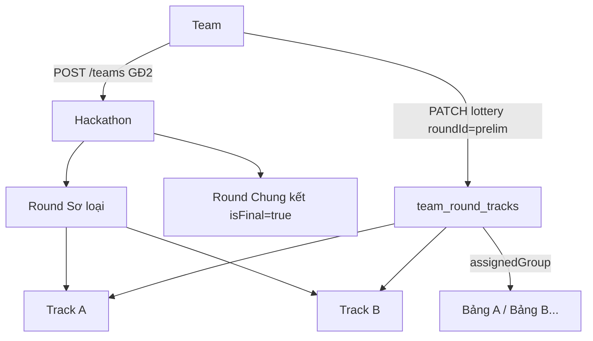

# FE xác nhận — Cấu trúc Hackathon & Field GĐ1/GĐ2

> Tài liệu ngắn gọn để FE đối chiếu **đúng layer** (Hackathon → Round → Track → Team).  
> Tránh nhầm: `topNAdvance` / `minTeamsFinal` **không** nằm ở form tạo Track.

**Liên quan:** [fe-gd1-gd2-gd3-workflow-mapping.md](fe-gd1-gd2-gd3-workflow-mapping.md)

---

## 1. Xác nhận mô hình (BE canonical)

### Câu hỏi thường gặp

| Câu hỏi | Trả lời BE |
|---------|------------|
| 1 Hackathon có mấy round? | **≥ 2** trong luồng chuẩn: **1 Sơ loại** (`isFinal=false`) + **1 Chung kết** (`isFinal=true`) |
| Track thuộc đâu? | **Chỉ round Sơ loại** — round CK **không có** track con |
| Track = Bảng? | **Không luôn đúng.** Track = **chủ đề/thể loại** bốc thăm. **Bảng đấu** = `assignedGroup` (vd. `"Bảng A"`) **trong** một track |
| Lottery theo gì? | Theo **`roundId` Sơ loại** — phân đội vào **track** + gán **bảng** (`assignedGroup`) |
| Student chọn track khi tạo đội? | **Không** — chỉ sau lottery (GĐ2) |

### Sơ đồ cấu trúc



### Hai mùa tham chiếu (nghiệp vụ)

| Mùa | Track vs Bảng | `maxTeamsPerGroup` | `topNAdvance` áp dụng |
|-----|---------------|--------------------|------------------------|
| **Spring 2026** | Mỗi track ≈ **1 bảng** (8 đội/track) | thường = `maxTeams` (8) | Top **2 đội / track** (= 2/bảng) |
| **Fall 2025** | Mỗi track có **nhiều bảng** (≤6 đội/bảng) | 6 | Top **2 đội / bảng** (`assigned_group`) |

BE ranking/advance (GĐ4) luôn tính **top N mỗi bảng** (`assigned_group`), không phải top N cả track.

---

## 2. Field theo từng màn hình FE

### 2.1 Tạo Hackathon — `POST /api/v1/hackathons`

| Field | Bắt buộc | Ghi chú |
|-------|----------|---------|
| `name` | ✅ | |
| `slug` | ✅ | `a-z0-9-` |
| `season` | ✅ | `Spring` / `Summer` / `Fall` |
| `year` | ✅ | ≥ 2024 |
| `description`, `rules`, `bannerUrl` | | |
| `registrationStart`, `registrationEnd` | | `registrationEnd >= registrationStart` |
| `eventStart`, `eventEnd` | | Optional lúc tạo — BE sync sau khi có round |
| `wildcardEnabled` | | Toggle **toàn kỳ** Wild Card (GĐ4) |
| `individualRankingEnabled` | | Fall=TRUE, Spring=FALSE (seed mẫu) |
| `chapterScoringFormula` | | Placeholder |

**Không gửi:** `status` (luôn `DRAFT`).

---

### 2.2 Tạo Round Sơ loại — `POST /api/v1/hackathons/{id}/rounds`

| Field | Bắt buộc | Ghi chú |
|-------|----------|---------|
| `name` | ✅ | vd. `"Vòng Sơ loại"` |
| `examAt` | ✅ | Ngày giờ thi — sắp xếp thứ tự vòng |
| `submissionDeadline` | ✅ | |
| `isFinal` | | `false` (mặc định) |
| `roundType` | | `PRELIMINARY` |
| `codingDurationHours` | | BE tính deadline/presentation nếu có |
| `submissionOpen` | | Optional |
| `lateSubmissionPolicy` | | `ALLOW_LATE_PENDING` (SL) |
| **`topNAdvance`** | | **Top N mỗi bảng** vào CK — vd. `2` |
| **`minTeamsFinal`** | | **Tối thiểu đội vào CK** — vd. `6` (thiếu → gợi ý Wild Card GĐ4) |
| `wildcardEnabled` | | Override round; cần `hackathon.wildcardEnabled=true` |
| `tiebreakRule` | | vd. `PENALTY_SCORE` |

**Không đặt trên Track:** `topNAdvance`, `minTeamsFinal` → thuộc **Round SL**.

---

### 2.3 Tạo Round Chung kết — cùng API, body khác

| Field | Giá trị |
|-------|---------|
| `isFinal` | `true` |
| `roundType` | `FINAL` |
| `lateSubmissionPolicy` | `HARD_LOCK` |
| `topNAdvance`, `minTeamsFinal` | **Không dùng** (NULL) |

**Không tạo Track** dưới round CK.

**Optional — thời lượng timer (GĐ5):** set qua `PUT /api/v1/rounds/{finalRoundId}` với `defaultPresentationMinutes`, `defaultQaMinutes` (≥1). Default DB: **10** phút thuyết trình + **5** phút Q&A.

---

### 2.4 Tạo Track — `POST /api/v1/rounds/{prelimRoundId}/tracks`

| Field | Bắt buộc | Ghi chú |
|-------|----------|---------|
| `name` | ✅ | Tên track / chủ đề — **không** phải tên bảng |
| `description` | | |
| `topic` | | Chủ đề bốc thăm — thường set **sau Kickoff** |
| `sequenceOrder` | | Optional — BE auto `max+1` |
| **`maxTeams`** | | Số đội tối đa **cả track** |
| **`maxTeamsPerGroup`** | | Số đội tối đa **mỗi bảng** trong track |
| **`minTeamSize`** | ✅ | Số thành viên tối thiểu/đội (vd. 3) |
| **`maxTeamSize`** | ✅ | Số thành viên tối đa/đội (vd. 5) |

**Validation BE:**

- `maxTeamSize >= minTeamSize`
- `maxTeamsPerGroup <= maxTeams` (nếu cả hai có giá trị)

**Không có trên Track:** `topNAdvance`, `minTeamsFinal`, `wildcardEnabled` (round/hackathon).

**Optional — thời lượng timer (GĐ3):** có thể set sớm qua `PUT /api/v1/tracks/{id}` với `presentationMinutes`, `qaMinutes` (≥1). Không gửi → dùng `defaultPresentationMinutes` / `defaultQaMinutes` của round SL.

**Mẫu Spring 2026 (1 bảng ≈ 1 track):**

```json
{
  "name": "Track 1 — RAG Pipeline",
  "maxTeams": 8,
  "maxTeamsPerGroup": 8,
  "minTeamSize": 3,
  "maxTeamSize": 5,
  "sequenceOrder": 1
}
```

**Mẫu Fall 2025 (nhiều bảng trong 1 track):**

```json
{
  "name": "Track Business Analysis",
  "maxTeams": 24,
  "maxTeamsPerGroup": 6,
  "minTeamSize": 3,
  "maxTeamSize": 5
}
```

---

### 2.5 GĐ2 — Tạo đội (Student) — `POST /api/v1/teams`

| Field | Bắt buộc | Ghi chú |
|-------|----------|---------|
| `hackathonId` | ✅ | |
| `teamName` | ✅ | |

**Không gửi khi tạo đội:** `trackId`, `assignedGroup`, `roundId`, `topNAdvance`, size limits (BE lấy từ track **sau lottery** khi duyệt/khóa đội).

Luồng tiếp theo (ngoài form tạo):

| Bước | API |
|------|-----|
| Mời thành viên | `POST /teams/{id}/members` |
| Duyệt đội | `PATCH /teams/{id}/status` → `ACTIVE` |
| Khóa đội | Tự động khi **ngày > registrationEnd** |
| Bốc thăm | `PATCH /hackathons/{id}/lottery` body `{ "roundId": prelimRoundId, ... }` |

**Lottery request (tối thiểu):**

```json
{
  "roundId": 12,
  "assignments": [
    {
      "teamId": 41,
      "trackId": 8,
      "assignedGroup": "Bảng A"
    }
  ]
}
```

Auto lottery: chỉ gửi `roundId` — BE chia track round-robin + tạo `assignedGroup` theo `maxTeamsPerGroup`.

---

## 3. Bảng đối chiếu nhanh — Field FE đang có vs BE

| Field FE (nếu có) | Đặt ở đâu trên BE | API |
|-------------------|-------------------|-----|
| Top N mỗi bảng | **Round Sơ loại** | `topNAdvance` |
| Tối thiểu vào CK | **Round Sơ loại** | `minTeamsFinal` |
| Wild Card | Hackathon + Round SL | `wildcardEnabled` (cả hai) |
| Số đội tối đa track | **Track** | `maxTeams` |
| Số đội tối đa mỗi bảng | **Track** | `maxTeamsPerGroup` |
| Size đội min/max | **Track** | `minTeamSize`, `maxTeamSize` |
| Chọn track lúc tạo đội | ❌ Không | Lottery GĐ2 |
| Bảng đấu | Lottery output | `assignedGroup` trong `team_round_tracks` |

---

## 4. Checklist FE — tránh làm sai

### Wizard GĐ1 (Coordinator)

- [ ] Step **Round SL**: có `topNAdvance`, `minTeamsFinal`, `wildcardEnabled`, `examAt`, `codingDurationHours` — **không** expose timer thuyết trình (fallback nội bộ 10/5)
- [ ] Step **Round CK**: `isFinal: true` — **không** field advance, **không** tạo track; có `defaultPresentationMinutes`, `defaultQaMinutes` (optional)
- [ ] Step **Track**: field §2.4 + optional `presentationMinutes`, `qaMinutes` (override theo bảng đấu)
- [ ] Hiển thị help text: *Track = chủ đề; Bảng = `assignedGroup` sau lottery*

### Màn GĐ2 (Student / Coordinator)

- [ ] Form tạo đội: chỉ `hackathonId` + `teamName`
- [ ] Lottery: `PATCH` + `roundId` = **prelimRoundId**
- [ ] Không lottery round CK

### Labels UI gợi ý (tiếng Việt)

| BE field | Label gợi ý |
|----------|--------------|
| `topNAdvance` | Số đội vào CK **mỗi bảng** |
| `minTeamsFinal` | Tối thiểu đội vào vòng CK (cả kỳ) |
| `maxTeams` | Số đội tối đa **trên track** |
| `maxTeamsPerGroup` | Số đội tối đa **mỗi bảng** trong track |
| `minTeamSize` / `maxTeamSize` | Số thành viên / đội (áp dụng sau khi vào track) |
| **`defaultPresentationMinutes`** | **Round CK** (GĐ1 UI) — thời lượng thuyết trình (phút); Round SL chỉ fallback API 10 |
| **`defaultQaMinutes`** | **Round CK** (GĐ1 UI) — thời lượng Q&A (phút); Round SL chỉ fallback API 5 |
| **`presentationMinutes`** | **Track SL** (optional) — override thuyết trình theo track; `null` = dùng default round |
| **`qaMinutes`** | **Track SL** (optional) — override Q&A theo track |

**Timer GĐ3/GĐ5:** Round CK dùng `defaultPresentationMinutes` / `defaultQaMinutes`. Round SL: default fallback; mỗi track có thể override. Coordinator chỉnh nhanh lúc vận hành qua `PUT /api/v1/presentation/duration` (xem [fe-gd3-api-mapping.md](fe-gd3-api-mapping.md) §9.4.1).

---

## 5. Response tham chiếu (GET)

**Round SL** — `GET /api/v1/rounds/{prelimId}`:

```json
{
  "id": 12,
  "hackathonId": 2,
  "name": "Vòng Sơ loại",
  "isFinal": false,
  "topNAdvance": 2,
  "minTeamsFinal": 6,
  "wildcardEnabled": true,
  "examAt": "2026-06-10T08:00:00",
  "codingDurationHours": 7,
  "defaultPresentationMinutes": 10,
  "defaultQaMinutes": 5
}
```

**Round CK** — `GET /api/v1/rounds/{finalRoundId}` (tương tự; thường chỉ cần `defaultPresentationMinutes` / `defaultQaMinutes` cho timer chung kết):

```json
{
  "id": 13,
  "hackathonId": 2,
  "name": "Vòng Chung kết",
  "isFinal": true,
  "defaultPresentationMinutes": 10,
  "defaultQaMinutes": 5
}
```

**Track** — `GET /api/v1/tracks/{id}`:

```json
{
  "id": 8,
  "roundId": 12,
  "hackathonId": 2,
  "name": "Track 1 — RAG Pipeline",
  "maxTeams": 8,
  "maxTeamsPerGroup": 8,
  "minTeamSize": 3,
  "maxTeamSize": 5,
  "status": "OPEN",
  "sequenceOrder": 1,
  "presentationMinutes": null,
  "qaMinutes": null
}
```

`presentationMinutes` / `qaMinutes` = `null` → timer dùng default của round SL.

---

*Revision: 2026-06-24 — thêm field thời lượng timer (`defaultPresentationMinutes`, `defaultQaMinutes`, `presentationMinutes`, `qaMinutes`).*
