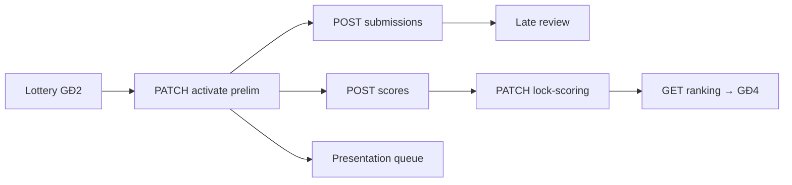

# FE GĐ3 — Tài liệu tích hợp (Vòng Sơ loại)

> **File gửi Frontend** — gom toàn bộ API, contract, seed, luồng GĐ3.  
> Đối chiếu gốc FE: [`BE_API_Requirements_PersonB.md`](../../../seal-hackathon-fe/src/docs/BE_API_Requirements_PersonB.md)  
> Cập nhật: **2026-06-07**

**Liên quan (ngoài GĐ3):** [fe-gd1-gd2-gd3-workflow-mapping.md](fe-gd1-gd2-gd3-workflow-mapping.md) (gate GĐ1→2) · [fe-gd1-gd2-structure-and-fields.md](fe-gd1-gd2-structure-and-fields.md) (Round/Track)

### Mục lục

| § | Nội dung |
|---|----------|
| 0 | Quy ước API |
| 1 | Bối cảnh & phạm vi GĐ3 |
| 2 | Luồng E2E + bootstrap IDs |
| 3 | Auth & JWT |
| 4 | Đối chiếu PersonB |
| 5 | Coordinator — vận hành round |
| 6 | Student portal |
| 7 | Mentor portal |
| 8 | Late submission |
| 9 | Presentation queue |
| 10 | Judge scoring |
| 11 | Calibration (tùy chọn) |
| 12 | Ma trận màn hình ↔ API |
| 13 | Error codes |
| 14 | Seed & tài khoản |
| 15 | Postman variables |
| 16 | Checklist FE |
| 17 | Backlog |
| 18 | **Hướng dẫn test FE (GĐ2 + GĐ3)** |
| 19 | **Mẫu test API — Request & Response JSON** |

---

## 0. Đọc trước khi code

| Quy ước | BE canonical |
|---------|--------------|
| Base URL | `http://localhost:8080/api/v1/` |
| Success envelope | `{ "success": true, "data": {…}, "message"?: "…", "timestamp": "…" }` |
| Error envelope | `{ "success": false, "error": { "code", "message", "status" }, "traceId", "timestamp" }` |
| JSON fields | **camelCase** trong `data` |
| ID | **number** (Integer), không string |
| Auth | `Authorization: Bearer <accessToken>` |

**FE PersonB dùng path `/api/...` (không v1) — BE không có alias. Phải migrate sang bảng §4.**

---

## 1. Bối cảnh GĐ3

**GĐ3 = Vòng Sơ loại đang thi** — nhận bài, chấm, late review, presentation queue, khóa chấm → ranking nội bộ.

### Phạm vi trong / ngoài GĐ3

| Trong GĐ3 (file này) | Ngoài GĐ3 (GĐ4+) |
|----------------------|------------------|
| Activate prelim, phát đề, nộp/chấm SL | `PATCH /rounds/{prelimId}/publish` |
| Late review, presentation queue | Wildcard, `POST /advance` |
| `lock-scoring` + `GET ranking` (preview) | Activate Chung kết |
| Portal student/mentor/judge SL | Trao giải, confirm FINISHED |

**Kết thúc GĐ3 (BTC):** sau `lock-scoring` + có ranking — chuyển sang GĐ4 publish/advance.

### Điều kiện tiên quyết (GĐ1 + GĐ2)

| # | Điều kiện | API / trạng thái |
|---|-----------|------------------|
| 1 | Hackathon `ONGOING` | Sau gate GĐ1 |
| 2 | Teams `ACTIVE`, `is_locked=true` | Sau `registrationEnd` |
| 3 | Đã lottery prelim | `PATCH /hackathons/{id}/lottery` + `roundId` prelim |
| 4 | **Gate 2** | `PATCH /rounds/{prelimId}/activate` |

### Cấu trúc dữ liệu liên quan

- **1 Hackathon** → **1 Round Sơ loại** + **1 Round CK** (CK không có track).
- **Round SL** có **nhiều Track** (chủ đề bốc thăm).
- **Bảng đấu** = `assignedGroup` trong `team_round_tracks` (vd. `"Bảng A"`) — khác **Track**.
- Lottery gán: `team` → `track` + `assignedGroup` theo **`roundId` prelim**.



---

## 2. Luồng E2E GĐ3 (Coordinator + portal)

| # | Role | Method | Path | Mục đích |
|---|------|--------|------|----------|
| 3.0 | COORD | GET | `/hackathons?q=seal-gd3-prelim-open` | Lấy IDs |
| 3.1 | COORD | PATCH | `/rounds/{prelimId}/activate` | Mở thi SL |
| 3.2 | COORD | PATCH | `/rounds/{prelimId}/release-problem` | Phát đề |
| 3.3 | STU | POST | `/submissions` | Nộp bài |
| 3.4 | JUDGE | POST | `/scores` | Chấm điểm |
| 3.4b | COORD | GET | `/rounds/{prelimId}/scoring-progress` | Tiến độ chấm |
| 3.5 | COORD | PATCH | `/rounds/{prelimId}/lock-scoring` | Khóa chấm |
| 3.6 | COORD | GET | `/rounds/{prelimId}/ranking` | Ranking → GĐ4 |
| 3.7 | MENTOR | GET | `/me/mentor/rounds` | Portal mentor |
| 3.8 | MENTOR | GET | `/me/mentor/rounds/{prelimId}/assigned-teams` | Đội + lịch |
| 3.9 | STU | GET | `/me/rounds/current/deadline` | Countdown |
| 3.10 | STU | GET | `/me/submission?teamId=&roundId=` | Trạng thái nộp |
| 3.11 | COORD | GET | `/submissions?status=LATE_PENDING` | List trễ |
| 3.12 | COORD | PATCH | `/submissions/{id}/approve` | Duyệt trễ |
| 3.12b | COORD | PATCH | `/submissions/{id}/reject` | Từ chối trễ |
| 3.13 | ANY* | GET | `/presentation/queue?roundId=` | Hàng đợi |
| 3.14 | COORD | PATCH | `/presentation/queue/next?roundId=` | Next team |

\* Queue GET: role `@ApprovedOnly` (đã duyệt tài khoản).

### 2.1 Bootstrap IDs (bước 3.0)

```http
GET /api/v1/hackathons?q=seal-gd3-prelim-open&size=5
GET /api/v1/hackathons/{hackathonId}/rounds
GET /api/v1/rounds/{prelimRoundId}/tracks
```

| Biến FE | Cách lấy |
|---------|----------|
| `hackathonId` | `data.items[0].id` từ search slug |
| `prelimRoundId` | round có `isFinal=false` |
| `track1Id`, `track2Id` | `GET .../tracks` theo `sequenceOrder` |
| `teamId` (student) | `GET /me/teams` → `teamId` + **`trackId`** |
| `criterionId` (judge) | `GET /tracks/{trackId}/criteria` hoặc criteria batch seed |

Seed shortcut: copy log `[Gd3DataSeeder]` khi start app `profile=dev`.

---

## 3. Auth & JWT

| # | Câu hỏi | Trả lời BE |
|---|---------|------------|
| 1 | `studentId` trong JWT? | Claim `sub` hoặc `userId` |
| 2 | `mentorId` trong JWT? | Cùng claim `sub`/`userId` — **không** truyền path `{mentorId}` |
| 3 | Role? | Claim `role`: `STUDENT`, `MENTOR`, `COORDINATOR`, `JUDGE` |
| 4 | `PRESENTING` lưu DB? | Có — `presentation_slots.queue_status` |
| 5 | `LATE_PENDING` ai set? | BE tự khi nộp sau `submissionDeadline` |
| 6 | Mentor stats (Efficiency, Avg Response)? | ❌ Chưa có — backlog |
| 7 | `slideUrl` `.pdf` reject? | Có — `INVALID_SLIDE_FORMAT` |

**Login dev:** `POST /api/v1/auth/login` `{ "email", "password" }` → `data.accessToken`.

---

## 4. Đối chiếu PersonB → BE (tóm tắt)

| PersonB (FE doc) | BE canonical | Trạng thái |
|------------------|--------------|------------|
| `GET /api/mentor/rounds` | `GET /api/v1/me/mentor/rounds` | ✅ |
| `GET /api/mentor/{id}/assigned-teams?roundId=` | `GET /api/v1/me/mentor/rounds/{roundId}/assigned-teams` | ✅ |
| `GET /api/student/{id}/submission` | `GET /api/v1/me/submission?teamId=&roundId=` | ✅ |
| `POST /api/student/{id}/submission` | `POST /api/v1/submissions` | ✅ |
| `GET /api/round/current/deadline` | `GET /api/v1/me/rounds/current/deadline` | ✅ |
| `GET /api/submissions?status=LATE_PENDING` | `GET /api/v1/submissions?status=LATE_PENDING` | ✅ |
| `PATCH /api/submissions/{id}/approve` | `PATCH /api/v1/submissions/{id}/approve` | ✅ |
| `PATCH /api/submissions/{id}/reject` | `PATCH /api/v1/submissions/{id}/reject` | ✅ |
| `GET /api/presentation/queue` | `GET /api/v1/presentation/queue?roundId=` | ✅ |
| `PATCH /api/presentation/queue/next` | `PATCH /api/v1/presentation/queue/next?roundId=` | ✅ |

**Khác biệt bắt buộc FE sửa:**

- Bọc response trong `data`.
- camelCase (`roundId`, không `round_id`).
- POST submit: thêm `teamId`, `trackId`.
- Queue: query **`roundId`**.
- Approve response: BE `LATE_APPROVED` → FE map `ON_TIME`.

---

## 5. Coordinator — Vận hành round Sơ loại

### 5.1 Activate round (Gate 2)

```http
PATCH /api/v1/rounds/{prelimRoundId}/activate
Authorization: Bearer {coordToken}
```

```json
{ "note": "Start prelim round" }
```

Response `data.isActive`: `true`.

**Lỗi thường gặp khi activate:**

| Code | Ý nghĩa |
|------|---------|
| `NO_TEAMS_IN_ROUND` | Chưa lottery / chưa có đội trong prelim |
| `JUDGE_NOT_ASSIGNED` | Track chưa có judge NORMAL |
| `HACKATHON_NOT_ONGOING` | Hackathon không ONGOING |

### 5.2 Phát đề

```http
PATCH /api/v1/rounds/{prelimRoundId}/release-problem
```

```json
{ "problemStatementUrl": "https://example.com/debai.pdf" }
```

### 5.3 Khóa chấm

```http
PATCH /api/v1/rounds/{prelimRoundId}/lock-scoring
```

```json
{ "force": false, "reason": null }
```

Response `data.scoringLocked`: `true` → chuẩn bị GĐ4 ranking/publish.

### 5.4 Tiến độ chấm & Ranking

```http
GET /api/v1/rounds/{prelimRoundId}/scoring-progress
GET /api/v1/rounds/{prelimRoundId}/ranking
```

Prelim chưa lock: scores đếm `isFinal=false`.

**Response `scoring-progress` mẫu:**

```json
{
  "roundId": 12,
  "totalSubmissions": 4,
  "scoredSubmissions": 3,
  "pendingSubmissions": 1,
  "scoringLocked": false
}
```

> `LATE_PENDING` chưa duyệt thường **không** tính vào scored (seed GD3-02).

### 5.5 Timeline round (nếu chỉnh lịch)

`PUT /api/v1/rounds/{id}` — `examAt` + `codingDurationHours` → BE sync `submissionOpen`/`submissionDeadline` và cascade `presentation_slots` (trừ khi `scoringLocked` hoặc queue `DONE`).

---

## 6. Student Portal

### 6.1 Lấy teamId & trackId (bắt buộc trước submit)

```http
GET /api/v1/me/teams
Authorization: Bearer {studentToken}
```

```json
[
  {
    "teamId": 42,
    "teamName": "GD3-04 chưa nộp bài",
    "hackathonId": 3,
    "trackId": 8,
    "trackName": "Track 1 — RAG Pipeline",
    "lotteryStatus": "ASSIGNED"
  }
]
```

FE lưu `teamId` + `trackId` — dùng cho POST submission và GET submission.

### 6.2 Deadline countdown

```http
GET /api/v1/me/rounds/current/deadline
Authorization: Bearer {studentToken}
```

```json
{
  "roundId": 12,
  "deadline": "2026-06-07T15:00:00"
}
```

Vòng prelim `isActive=true` của hackathon user đang thi.

### 6.3 GET submission

```http
GET /api/v1/me/submission?teamId={teamId}&roundId={prelimRoundId}
```

- **404** nếu chưa nộp.
- `roundId` optional — lọc theo vòng.

```json
{
  "submissionId": 15,
  "roundId": 12,
  "repoUrl": "https://github.com/org/repo",
  "demoUrl": "https://demo.example.com",
  "slideUrl": "https://docs.google.com/presentation/d/abc",
  "status": "LATE_PENDING",
  "submittedAt": "2026-06-07T16:30:00"
}
```

**Status map (portal):**

| BE `status` | FE hiển thị |
|-------------|-------------|
| `SUBMITTED`, `LATE`, `LATE_APPROVED`, `ACCEPTED` | `ON_TIME` |
| `LATE_PENDING` | `LATE_PENDING` |
| `REJECTED` | `REJECTED` |

### 6.4 POST nộp bài (upsert)

```http
POST /api/v1/submissions
Authorization: Bearer {studentToken}
```

```json
{
  "teamId": 42,
  "trackId": 8,
  "repoUrl": "https://github.com/org/repo",
  "demoUrl": "https://demo.example.com",
  "slideUrl": "https://docs.google.com/presentation/d/abc"
}
```

| Field | Ghi chú |
|-------|---------|
| `teamId` | **Bắt buộc** |
| `trackId` | **Bắt buộc** prelim (từ lottery) |
| `roundId` | Optional — BE suy từ track |
| `reportUrl` | Optional |

**Validation:**

- `slideUrl` kết thúc `.pdf` → `400` `INVALID_SLIDE_FORMAT`
- `repoUrl` chứa `drive.google.com` → `400` `INVALID_REPO_PLATFORM`
- Nộp sau deadline → BE tự `LATE_PENDING` (không gửi flag)

**Response `201`:**

```json
{
  "id": 15,
  "teamId": 42,
  "trackId": 8,
  "status": "LATE_PENDING",
  "submittedAt": "2026-06-07T16:30:00"
}
```

### 6.5 Xem đề bài (sau release-problem)

```http
GET /api/v1/me/rounds/{prelimRoundId}/problem
Authorization: Bearer {studentToken}
```

```json
{
  "roundId": 12,
  "problemStatement": null,
  "problemUrl": "https://example.com/debai-so-loai.pdf",
  "released": true
}
```

### 6.6 Resubmit (cập nhật bài)

`POST /api/v1/submissions` là **upsert** — gửi lại cùng `teamId` + `trackId` với URL mới.  
Không dùng `PATCH /submissions/{id}/resubmit` (deprecated).

Điều kiện: round chưa `scoringLocked`; team là member; sau deadline có thể thành `LATE_PENDING`.

### 6.7 Danh sách submission theo đội (optional)

```http
GET /api/v1/me/teams/{teamId}/submissions?roundId={prelimRoundId}
```

---

## 7. Mentor Portal

### 7.1 Gán mentor — context quan trọng

- GĐ1: mentor gán **theo track** (`POST /mentor-assignments`).
- Portal đọc đội từ **`mentor_team_assignments`** (gán team/round, seed hoặc `POST /teams/{id}/rounds/{roundId}/mentor`).
- Nếu chỉ có gán track → `teams[]` có thể **trống** dù mentor vẫn có quyền xem qua track.

**Workaround FE:** `GET /me/mentor-track-assignments` → derive teams từ `team_round_tracks` theo `trackId`.

### 7.2 Danh sách vòng thi

```http
GET /api/v1/me/mentor/rounds
Authorization: Bearer {mentorToken}
```

```json
[
  {
    "roundId": 12,
    "roundName": "Vòng Sơ loại",
    "status": "ACTIVE",
    "description": "Vòng đấu loại trực tiếp...",
    "teamCount": 4,
    "teams": [
      { "teamId": 41, "teamName": "GD3-01 SUBMITTED + scored" }
    ]
  }
]
```

`status`: `ACTIVE` | `UPCOMING` | `ENDED` (logic: có assignment / `isActive` / `scoringLocked`).

### 7.3 Đội được phân công + lịch thuyết trình

```http
GET /api/v1/me/mentor/rounds/{prelimRoundId}/assigned-teams
```

```json
{
  "roundName": "Vòng Sơ loại",
  "roundStatus": "ACTIVE",
  "teams": [
    {
      "teamId": 41,
      "teamName": "GD3-01 SUBMITTED + scored",
      "groupNumber": 1,
      "status": "ACTIVE",
      "presentationSchedule": "08:00 - 08:15 ngày 07/06",
      "location": "Online (Teams) - Phòng 2"
    }
  ]
}
```

### 7.4 API mentor bổ sung (ngoài PersonB)

| Method | Path | Mục đích |
|--------|------|----------|
| GET | `/me/mentor-track-assignments` | Track mentor được gán GĐ1 |
| GET | `/me/mentor-team-assignments?roundId=` | Gán team theo vòng |
| GET | `/me/mentor/teams/{teamId}/submissions?roundId=` | Xem bài nộp đội |
| GET | `/me/mentor/teams/{teamId}/scores?roundId=` | Điểm sau lock |

---

## 8. Late Submission Review (Coordinator)

### 8.1 List

```http
GET /api/v1/submissions?status=LATE_PENDING
Authorization: Bearer {coordToken}
```

```json
[
  {
    "id": 16,
    "teamId": 42,
    "teamName": "GD3-02 LATE_PENDING",
    "repoUrl": "https://github.com/seed/gd3-42",
    "slideUrl": "https://docs.google.com/presentation/d/seed-gd3-42",
    "status": "LATE_PENDING",
    "submittedAt": "2026-06-07T16:00:00"
  }
]
```

### 8.2 Approve

```http
PATCH /api/v1/submissions/{id}/approve
```

Body: không cần (hoặc `{}`).

Response `data.status`: `LATE_APPROVED` — FE map `ON_TIME`.

### 8.3 Reject

```http
PATCH /api/v1/submissions/{id}/reject
```

```json
{ "reason": "Nộp quá hạn không có lý do chính đáng" }
```

`reason` **@NotBlank**. Response `data.status`: `REJECTED`.

**Canonical (vẫn hỗ trợ):**

```http
PATCH /api/v1/submissions/{id}/review-late
{ "decision": "APPROVE" | "REJECT", "note": "..." }
```

---

## 9. Presentation Queue

Lịch + trạng thái lưu bảng **`presentation_slots`** (`starts_at`, `ends_at`, `location`, `queue_status`).

### 9.1 GET queue

```http
GET /api/v1/presentation/queue?roundId={prelimRoundId}
Authorization: Bearer {token}
```

```json
{
  "groups": [
    {
      "groupName": "Bảng A",
      "teams": [
        {
          "teamId": 41,
          "teamName": "GD3-01 SUBMITTED + scored",
          "order": 1,
          "status": "PRESENTING",
          "presentationSchedule": "08:00 - 08:15 ngày 07/06",
          "location": "Online (Teams) - Phòng 2"
        }
      ]
    }
  ],
  "roomStats": { "total": 4, "done": 0, "absent": 0 }
}
```

`status`: `WAITING` | `PRESENTING` | `DONE` | `ELIMINATED`.

### 9.2 PATCH next (Coordinator)

```http
PATCH /api/v1/presentation/queue/next?roundId={prelimRoundId}
```

Body optional:

```json
{ "currentTeamId": 41 }
```

Response:

```json
{ "nextTeamId": 42 }
```

FE có thể fire-and-forget; refresh bằng GET queue.

---

## 10. Judge — Chấm Sơ loại (GĐ3)

Judge gán **theo track** (GĐ1) — không theo đội.

```http
POST /api/v1/scores
Authorization: Bearer {judgeToken}
```

```json
{
  "submissionId": 15,
  "criterionId": 3,
  "scoreValue": 8.5,
  "comment": "Good demo",
  "scoreType": "NORMAL"
}
```

Judge phải được gán track của submission → nếu không: `403 JUDGE_NOT_ASSIGNED_TO_TRACK`.

Prelim: scores `isFinal=false` cho đến khi lock CK (GĐ5).

**Lấy `criterionId`:** `GET /api/v1/tracks/{trackId}/criteria` (Coordinator/Judge đã gán track).

**Judge portal bổ sung:**

```http
GET /api/v1/me/judge-track-assignments
```

---

## 11. Calibration (tùy chọn — nếu UI có phiên hiệu chuẩn)

| Method | Path | Role |
|--------|------|------|
| GET | `/calibration-sessions?roundId=` | COORD |
| POST | `/calibration-sessions` | COORD |
| PATCH | `/calibration-sessions/{id}` | COORD |
| POST | `/scores/calibration` | JUDGE/MENTOR đã phân công |

PersonB **không** yêu cầu — chỉ tích hợp nếu FE có màn calibration.

---

## 12. Ma trận màn hình FE ↔ API

| Màn hình (PersonB) | API chính | Role |
|--------------------|-----------|------|
| `/mentor/rounds` | `GET /me/mentor/rounds` | MENTOR |
| Mentor team list | `GET /me/mentor/rounds/{roundId}/assigned-teams` | MENTOR |
| Student submission | `GET /me/submission`, `POST /submissions` | STUDENT |
| Countdown timer | `GET /me/rounds/current/deadline` | STUDENT |
| Đề bài | `GET /me/rounds/{roundId}/problem` | STUDENT |
| Late review list | `GET /submissions?status=LATE_PENDING` | COORDINATOR |
| Late approve/reject | `PATCH /submissions/{id}/approve\|reject` | COORDINATOR |
| Presentation queue | `GET /presentation/queue?roundId=` | APPROVED+ |
| Queue next | `PATCH /presentation/queue/next?roundId=` | COORDINATOR |
| BTC lock/ranking | `PATCH .../lock-scoring`, `GET .../ranking` | COORDINATOR |
| Judge chấm | `POST /scores` | JUDGE |

---

## 13. Error codes GĐ3 thường gặp

| Code | HTTP | Khi nào |
|------|------|---------|
| `INVALID_SLIDE_FORMAT` | 400 | slideUrl `.pdf` |
| `INVALID_REPO_PLATFORM` | 400 | repo Google Drive |
| `SUBMISSION_NOT_LATE_PENDING` | 422 | Approve/reject sai status |
| `JUDGE_NOT_ASSIGNED_TO_TRACK` | 403 | Judge chưa gán track |
| `TEAM_NOT_LOCKED` | 422 | Lottery sớm (GĐ2) |
| `ROUND_ALREADY_ACTIVE` | 422 | Lottery sau activate |
| `INVALID_STATE` | 422 | Queue chưa có slots |

**Error body mẫu:**

```json
{
  "success": false,
  "error": {
    "code": "INVALID_SLIDE_FORMAT",
    "message": "slideUrl không chấp nhận file PDF...",
    "status": 400
  },
  "traceId": "uuid",
  "timestamp": "2026-06-07T10:00:00Z"
}
```

HTTP: 200/201 OK · 400 validation · 401/403 auth · 404 not found · 409 conflict · 422 business rule · 500 server.

---

## 14. Seed dev & tài khoản test

### Tự động repair mỗi lần start (`profile=dev`)

BE **không dùng ngày cố định** nữa. Mỗi lần khởi động app:

| Seeder | Slug | Hành vi |
|--------|------|---------|
| `Gd1DataSeeder.repairSeededTimeline()` | `seal-spring-2026` (GĐ1/GĐ2) | `registrationEnd = today + 14` — đăng ký **đang mở** |
| `Gd2DataSeeder.repairForFeTesting()` | `seal-spring-2026` | Prelim **inactive**; unlock teams (trừ `GD2-05` demo locked) |
| `Gd3DataSeeder.repairForFeTesting()` | `seal-gd3-prelim-open` | Sơ loại thi **hôm nay** 08:00; sync deadline + LATE_PENDING timestamps |

**FE không cần sửa DB.** Chỉ cần restart Spring Boot và đọc log `[Gd2DataSeeder]` / `[Gd3DataSeeder]`.

### GĐ3 — slug riêng

**Slug:** `seal-gd3-prelim-open` — không cần chạy GĐ1/GĐ2 trước.  
Start app `profile=dev` → log `[Gd3DataSeeder]` (hackathonId, prelimRoundId, trackIds, teamIds).

| Thành phần | Giá trị |
|------------|---------|
| Hackathon | `ONGOING` |
| Sơ loại | **active**, đề đã phát, chưa lock/publish |
| Teams | 6 đội, 2 track, lottery + mentor + queue |

| Vai trò | Email | Password |
|---------|-------|----------|
| Coordinator | `coord@fpt.edu.vn` | `Coordinator@dev1` |
| Mentor | `mentor@fpt.edu.vn` | `Mentor@dev1` |
| Judge 1/2 | `judge1@fpt.edu.vn` / `judge2@` | `GuestJudge@dev1` / seed |
| Student | `student.gd3.leader01@` … `leader06@fpt.edu.vn` | `Student@dev1` |

| Team seed | Leader | Dùng test |
|-----------|--------|-----------|
| GD3-01 SUBMITTED + scored | `leader01@` | GET submission, scoring progress |
| GD3-02 LATE_PENDING | `leader02@` | Late list + approve |
| GD3-03 LATE_APPROVED | `leader03@` | Resubmit |
| GD3-04 chưa nộp | `leader04@` | POST submission |
| GD3-05 Track2 scored | `leader05@` | Track 2 |
| GD3-06 Track2 chấm dở | `leader06@` | Bổ sung score |

**Luồng test tối thiểu:** login coord 3.0 → leader04 **3.3** → judge **3.4** → mentor **3.7–3.8** → coord **3.11–3.12** (team 02) → **3.13–3.14** → **3.5–3.6**.

---

## 15. Postman / env variables

| Variable | Nguồn |
|----------|--------|
| `baseUrl` | `http://localhost:8080` |
| `coordToken` | Login coord |
| `studentToken` | Login student leader |
| `mentorToken` | Login mentor |
| `judgeToken` | Login judge |
| `gd3HackathonSlug` | `seal-gd3-prelim-open` |
| `hackathonId` | GET hackathons?q=slug |
| `prelimRoundId` | GET hackathons/{id}/rounds |
| `track1Id`, `track2Id` | GET rounds/{prelimId}/tracks |
| `gd3TeamId` | GET me/teams hoặc seed log |
| `lateSubmissionId` | GET submissions?status=LATE_PENDING (team 02) |
| `submissionId` | POST submissions hoặc GET me/submission |

---

## 16. Checklist FE (action items)

### Path & contract

- [ ] Đổi tất cả path sang `/api/v1/...`
- [ ] Parse `response.data`, không dùng body trực tiếp
- [ ] camelCase fields; ID là number
- [ ] Bootstrap: `GET /me/teams` lấy `teamId` + `trackId` trước submit
- [ ] POST submit: gửi `teamId` + `trackId`
- [ ] Presentation queue: luôn truyền `roundId`

### Student

- [ ] Countdown: `GET /me/rounds/current/deadline`
- [ ] Map status §6.3 (`LATE_APPROVED` → `ON_TIME`)
- [ ] Không gửi flag late — BE tự set

### Mentor

- [ ] `GET /me/mentor/rounds` — không path mentorId
- [ ] Nếu `teams[]` trống: fallback `mentor-track-assignments` + derive teams
- [ ] Stats §3 Q6 — chưa có API, ẩn UI hoặc mock

### Coordinator

- [ ] Late: approve/reject đúng path §8
- [ ] Queue next: `PATCH` + `roundId` query

### Error handling

- [ ] Parse `error.code` + `error.message`
- [ ] Hiển thị `INVALID_SLIDE_FORMAT` khi user dán link PDF

---

## 17. Chưa có / backlog

| Mục | Ghi chú |
|-----|---------|
| Mentor stats API | PersonB §5 Q6 |
| Alias `/api/mentor/*` không v1 | FE migrate |
| Student leaderboard GĐ3 | `GET /me/rounds/{id}/leaderboard` trả `[]` stub |

---

## 18. Hướng dẫn test FE (GĐ2 + GĐ3)

### 18.0 Chuẩn bị (bắt buộc)

1. Chạy BE: `spring.profiles.active=dev` (port 8080).
2. Đợi log startup — xác nhận:
   - `[Gd1DataSeeder] Repair timeline` (nếu có thay đổi)
   - `[Gd2DataSeeder] FE repair` — `registration: … → … (today=…)` và `đăng ký ĐANG MỞ`
   - `[Gd3DataSeeder] FE repair` — `examAt` = hôm nay 08:00, `deadline` theo coding hours
3. Login API: `POST /api/v1/auth/login` → lấy `data.accessToken`.

Nếu GĐ2 báo `đăng ký ĐÃ ĐÓNG` hoặc teams bị khóa hàng loạt → **restart app** (repair chạy lại), không sửa MySQL thủ công.

---

### 18.1 Giai đoạn 2 — Teams & Lottery

**Hackathon:** `seal-spring-2026` (`ONGOING`)  
**Password SV:** `Student@dev1` · **Coord:** `coord@fpt.edu.vn` / `Coordinator@dev1`

| # | Kịch bản | Tài khoản / đội | API / kỳ vọng |
|---|----------|-----------------|---------------|
| 2.1 | Đăng ký đội mới (reg mở) | SV bất kỳ chưa có đội | `POST /api/v1/me/teams` → 201 |
| 2.2 | Duyệt đội PENDING | Coord | `PATCH /api/v1/teams/{id}/approve` — đội `GD2-01`, `GD2-02`, `GD2-03` |
| 2.3 | Mời thành viên | Leader `GD2-02` | `POST /api/v1/teams/{id}/invites` |
| 2.4 | Đội ACTIVE chưa lottery | `GD2-07` (leader07) | `GET /me/teams` → chưa có `trackId` |
| 2.5 | Bốc thăm (coord) | Coord + `prelimRoundId` | `PATCH /api/v1/hackathons/{id}/lottery` body `{ roundId }` — đội **đã locked** |
| 2.6 | Demo đội đã khóa + đã lottery | `GD2-05` | `isLocked=true`, đã có track/group |
| 2.7 | Mentor theo track | `mentor@fpt.edu.vn` | `GET /api/v1/me/mentor/rounds` → teams theo track đã gán |

**Lưu ý GĐ2:**

- Sau repair, **đăng ký còn mở** ~14 ngày → đội mới tạo **không** bị auto-lock.
- Chỉ `GD2-05 ACTIVE đã khóa + bốc thăm` giữ `isLocked=true` để demo UI “đội đã khóa”.
- Lottery yêu cầu `isLocked=true` — dùng `GD2-05` hoặc đợi hết hạn đăng ký (sau repair tiếp theo vẫn mở).
- Vòng sơ loại **chưa active** — không test nộp bài SL trên slug này (dùng GĐ3 slug).

Chi tiết gate GĐ1→2: [fe-gd1-gd2-gd3-workflow-mapping.md](fe-gd1-gd2-gd3-workflow-mapping.md).

---

### 18.2 Giai đoạn 3 — Vòng Sơ loại (E2E theo team)

**Hackathon:** `seal-gd3-prelim-open`  
**Bootstrap:** `GET /api/v1/hackathons?q=seal-gd3-prelim-open` → `hackathonId` → `GET …/rounds` → `prelimRoundId`, `track1Id`.

#### Bước 0 — Coordinator xác nhận round

| Bước | API | Kỳ vọng |
|------|-----|---------|
| 0.1 | `GET /api/v1/hackathons/{id}/rounds` | Prelim `isActive=true`, `problemReleasedAt` có giá trị |
| 0.2 | `GET /api/v1/rounds/{prelimId}` | `submissionDeadline` = hôm nay (sau 08:00 + 7h) |

#### Bước 1 — Student portal (từng team)

| Team | Login | Màn hình / API | Kỳ vọng |
|------|-------|----------------|---------|
| **04 chưa nộp** | `student.gd3.leader04@fpt.edu.vn` | `GET /me/teams` → `teamId`, `trackId` | Có track lottery |
| | | `GET /me/rounds/current/deadline` | Countdown > 0 hoặc đã qua deadline |
| | | `POST /api/v1/submissions` + `teamId`, `trackId`, slide Google Slides URL | 201 `SUBMITTED` hoặc `LATE_PENDING` nếu sau deadline |
| **01 đã nộp** | `leader01@` | `GET /me/submission?roundId=` | `status=SUBMITTED`, đã có scores seed |
| **02 LATE_PENDING** | `leader02@` | `GET /me/submission` | `status=LATE_PENDING`, `isLate=true` |
| **03 LATE_APPROVED** | `leader03@` | `GET /me/submission` | `status=LATE_APPROVED` — test resubmit §6.6 |
| **05 Track2** | `leader05@` | `GET /me/submission` | Track 2, đã chấm đủ |
| **06 chấm dở** | `leader06@` | Coordinator `GET …/scoring-progress` | Thiếu score 1 judge |

**slideUrl:** dùng link Google Slides (không `.pdf`) — xem §13 `INVALID_SLIDE_FORMAT`.

#### Bước 2 — Judge chấm bài

| Bước | API | Ghi chú |
|------|-----|---------|
| 2.1 | Login `judge1@fpt.edu.vn` | |
| 2.2 | `GET /api/v1/me/judge/assignments` | Track 1 + Track 2 |
| 2.3 | `POST /api/v1/scores` | `submissionId`, `criterionId`, `scoreValue` — team 06 bổ sung điểm |

#### Bước 3 — Mentor

| Bước | API | Kỳ vọng |
|------|-----|---------|
| 3.1 | Login `mentor@fpt.edu.vn` | |
| 3.2 | `GET /api/v1/me/mentor/rounds` | 6 teams, có presentation slot |
| 3.3 | `GET /api/v1/me/mentor/rounds/{prelimRoundId}/assigned-teams` | Danh sách đội được gán |

#### Bước 4 — Coordinator: late + queue + lock

| Bước | API | Team / data |
|------|-----|-------------|
| 4.1 | `GET /api/v1/submissions?status=LATE_PENDING&roundId=` | Thấy bài team **02** |
| 4.2 | `PATCH /api/v1/submissions/{lateSubmissionId}/approve` | Body `{}` hoặc không body |
| 4.3 | `GET /api/v1/presentation/queue?roundId={prelimRoundId}` | Slot 1 `PRESENTING` |
| 4.4 | `PATCH /api/v1/presentation/queue/next?roundId={prelimRoundId}` | Chuyển queue |
| 4.5 | `GET /api/v1/rounds/{prelimId}/scoring-progress` | `gradable=4` (loại LATE_PENDING chưa duyệt) |
| 4.6 | `PATCH /api/v1/rounds/{prelimId}/lock-scoring` | Khóa chấm → ranking preview |

#### Luồng tối thiểu (smoke, ~15 phút)

```
coord login → leader04 POST submit → judge1 POST score (team06)
→ mentor GET rounds → coord late approve (team02) → coord queue next → coord lock-scoring
```

#### Troubleshooting

| Triệu chứng | Nguyên nhân | Cách xử lý |
|-------------|-------------|------------|
| GĐ2: không tạo được đội / bị lock | `registrationEnd` cũ trong DB | Restart app `dev` |
| GĐ3: team02 không LATE_PENDING | `submittedAt` trước deadline | Restart → `repairForFeTesting` |
| Submit 422 `ROUND_NOT_ACTIVE` | Nhầm slug `seal-spring-2026` | Dùng `seal-gd3-prelim-open` |
| Judge 403 `JUDGE_NOT_ASSIGNED` | Chấm track chưa gán | Dùng judge1 + đúng `criterionId` track |

---

## 19. Mẫu test API — Request & Response JSON

> Copy-paste vào Postman / Thunder Client. Thay `{{accessToken}}`, `{{hackathonId}}`, `{{prelimRoundId}}`, `{{teamId}}`, `{{trackId}}`, `{{submissionId}}`, `{{criterionId}}` bằng giá trị thật từ log `[Gd3DataSeeder]` hoặc response bootstrap.

### 19.0 Quy ước đọc mẫu

| Quy tắc | Chi tiết |
|---------|----------|
| Envelope | Mọi 2xx đều bọc `{ "success": true, "data": …, "timestamp": "…" }` |
| Parse FE | **Luôn đọc `response.data`**, không dùng body gốc |
| ID | Number (`42`), không string `"42"` |
| Ngày giờ | ISO-8601 local: `"2026-06-07T15:00:00"` (không timezone suffix) |
| 201 Created | POST submit trả `message: "Created"` trong envelope |

**Biến mẫu (thay sau bootstrap):**

```text
hackathonId     = 5        ← data.items[0].id
prelimRoundId   = 12       ← log [Gd3DataSeeder] hoặc GET .../rounds (coord)
track1Id        = 8
teamId (leader04)= 46
submissionId    = 88       ← team02 LATE_PENDING
criterionId     = 3        ← GET /tracks/{trackId}/criteria
```

---

### 19.1 Auth — Login

```http
POST /api/v1/auth/login
Content-Type: application/json
```

**Request (student leader04 — nộp bài mới):**

```json
{
  "email": "student.gd3.leader04@fpt.edu.vn",
  "password": "Student@dev1"
}
```

**Response `200` đúng:**

```json
{
  "success": true,
  "data": {
    "accessToken": "eyJhbGciOiJIUzI1NiIsInR5cCI6IkpXVCJ9...",
    "refreshToken": "a1b2c3d4-...",
    "tokenType": "Bearer",
    "expiresInSeconds": 3600,
    "mustChangePassword": false
  },
  "timestamp": "2026-06-07T08:00:00Z"
}
```

**Request (coordinator):**

```json
{
  "email": "coord@fpt.edu.vn",
  "password": "Coordinator@dev1"
}
```

Gọi API tiếp theo: `Authorization: Bearer <data.accessToken>`.

---

### 19.2 Bootstrap IDs (Coordinator)

#### T-01 — Tìm hackathon GĐ3

```http
GET /api/v1/hackathons?q=seal-gd3-prelim-open&size=5
Authorization: Bearer {{coordToken}}
```

**Response `200` đúng:**

```json
{
  "success": true,
  "data": {
    "items": [
      {
        "id": 5,
        "name": "SEAL GĐ3 Prelim Open",
        "slug": "seal-gd3-prelim-open",
        "season": "Spring",
        "year": 2026,
        "status": "ONGOING",
        "registrationStart": "2026-05-08",
        "registrationEnd": "2026-06-06",
        "eventStart": "2026-06-21",
        "eventEnd": "2026-07-21"
      }
    ],
    "page": 0,
    "size": 5,
    "totalElements": 1,
    "totalPages": 1
  },
  "timestamp": "2026-06-07T08:01:00Z"
}
```

→ Lưu `data.items[0].id` = `hackathonId`.

#### T-02 — Danh sách round (coord only)

```http
GET /api/v1/hackathons/5/rounds
Authorization: Bearer {{coordToken}}
```

**Response `200` đúng:**

```json
{
  "success": true,
  "data": [
    {
      "id": 12,
      "name": "Vòng Sơ loại",
      "examAt": "2026-06-07T08:00:00",
      "submissionDeadline": "2026-06-07T15:00:00",
      "isActive": true,
      "scoringLocked": false,
      "isPublished": false,
      "trackCount": 2,
      "criteriaCount": 4,
      "currentWeightTotal": 1.0
    },
    {
      "id": 13,
      "name": "Vòng Chung kết",
      "examAt": "2026-06-21T08:00:00",
      "submissionDeadline": "2026-06-21T16:30:00",
      "isActive": false,
      "scoringLocked": false,
      "isPublished": false,
      "trackCount": 0,
      "criteriaCount": 1,
      "currentWeightTotal": 1.0
    }
  ],
  "timestamp": "2026-06-07T08:02:00Z"
}
```

→ `prelimRoundId` = phần tử **không** phải chung kết (`isFinal` không có trong summary — chọn round tên "Vòng Sơ loại" / `trackCount > 0`).

#### T-03 — Danh sách track

```http
GET /api/v1/rounds/12/tracks
Authorization: Bearer {{coordToken}}
```

**Response `200` đúng:**

```json
{
  "success": true,
  "data": [
    {
      "id": 8,
      "roundId": 12,
      "name": "Track 1 — RAG Pipeline",
      "description": "Seed track 1",
      "topic": "Seed topic 1",
      "status": "OPEN",
      "sequenceOrder": 1,
      "minTeamSize": 3,
      "maxTeamSize": 5,
      "maxTeams": 8,
      "maxTeamsPerGroup": 8
    },
    {
      "id": 9,
      "roundId": 12,
      "name": "Track 2 — AI Agent",
      "status": "OPEN",
      "sequenceOrder": 2,
      "minTeamSize": 3,
      "maxTeamSize": 5,
      "maxTeams": 8,
      "maxTeamsPerGroup": 8
    }
  ],
  "timestamp": "2026-06-07T08:03:00Z"
}
```

---

### 19.3 Student portal

#### T-10 — Lấy teamId + trackId (bắt buộc trước submit)

```http
GET /api/v1/me/teams
Authorization: Bearer {{studentToken}}
```

**Response `200` đúng (leader04):**

```json
{
  "success": true,
  "data": [
    {
      "teamId": 46,
      "teamName": "GD3-04 chưa nộp bài",
      "hackathonId": 5,
      "trackId": 8,
      "trackName": "Track 1 — RAG Pipeline",
      "lotteryStatus": "ASSIGNED"
    }
  ],
  "timestamp": "2026-06-07T08:10:00Z"
}
```

#### T-11 — Countdown deadline

```http
GET /api/v1/me/rounds/current/deadline
Authorization: Bearer {{studentToken}}
```

**Response `200` đúng:**

```json
{
  "success": true,
  "data": {
    "roundId": 12,
    "deadline": "2026-06-07T15:00:00"
  },
  "timestamp": "2026-06-07T08:11:00Z"
}
```

#### T-12 — GET submission (chưa nộp → 404)

```http
GET /api/v1/me/submission?teamId=46&roundId=12
Authorization: Bearer {{studentToken}}
```

**Response `404` (leader04 chưa nộp):**

```json
{
  "success": false,
  "error": {
    "code": "RESOURCE_NOT_FOUND",
    "message": "Submission not found",
    "status": 404
  },
  "traceId": "f47ac10b-58cc-4372-a567-0e02b2c3d479",
  "timestamp": "2026-06-07T08:12:00Z"
}
```

**Response `200` đúng (leader02 — LATE_PENDING):**

```json
{
  "success": true,
  "data": {
    "submissionId": 88,
    "roundId": 12,
    "repoUrl": "https://github.com/seed/gd3-43",
    "demoUrl": "https://demo.example.com/gd3-43",
    "slideUrl": "https://docs.google.com/presentation/d/seed-gd3-43",
    "status": "LATE_PENDING",
    "submittedAt": "2026-06-07T16:00:00"
  },
  "timestamp": "2026-06-07T08:13:00Z"
}
```

#### T-13 — POST nộp bài (đúng — Google Slides)

```http
POST /api/v1/submissions
Authorization: Bearer {{studentToken}}
Content-Type: application/json
```

**Request:**

```json
{
  "teamId": 46,
  "trackId": 8,
  "repoUrl": "https://github.com/my-team/gd3-demo",
  "demoUrl": "https://demo.example.com/gd3",
  "slideUrl": "https://docs.google.com/presentation/d/1abcXYZ/edit"
}
```

**Response `201` đúng (trong deadline → SUBMITTED):**

```json
{
  "success": true,
  "data": {
    "id": 95,
    "teamId": 46,
    "teamName": "GD3-04 chưa nộp bài",
    "trackId": 8,
    "roundId": 12,
    "repoUrl": "https://github.com/my-team/gd3-demo",
    "demoUrl": "https://demo.example.com/gd3",
    "slideUrl": "https://docs.google.com/presentation/d/1abcXYZ/edit",
    "status": "SUBMITTED",
    "isLate": false,
    "submittedAt": "2026-06-07T10:30:00"
  },
  "message": "Created",
  "timestamp": "2026-06-07T10:30:00Z"
}
```

**Response `201` đúng (sau deadline → LATE_PENDING, BE tự set):**

```json
{
  "success": true,
  "data": {
    "id": 95,
    "teamId": 46,
    "trackId": 8,
    "roundId": 12,
    "status": "LATE_PENDING",
    "isLate": true,
    "submittedAt": "2026-06-07T16:30:00"
  },
  "message": "Created",
  "timestamp": "2026-06-07T16:30:00Z"
}
```

#### T-14 — POST nộp bài (sai — slide PDF)

**Request:**

```json
{
  "teamId": 46,
  "trackId": 8,
  "slideUrl": "https://example.com/deck.pdf",
  "repoUrl": "https://github.com/my-team/repo"
}
```

**Response `400` sai:**

```json
{
  "success": false,
  "error": {
    "code": "INVALID_SLIDE_FORMAT",
    "message": "slideUrl không chấp nhận file PDF — dùng Google Slides hoặc link tương đương",
    "status": 400
  },
  "traceId": "a1b2c3d4-e5f6-7890-abcd-ef1234567890",
  "timestamp": "2026-06-07T10:35:00Z"
}
```

#### T-15 — Xem đề bài

```http
GET /api/v1/me/rounds/12/problem
Authorization: Bearer {{studentToken}}
```

**Response `200` đúng:**

```json
{
  "success": true,
  "data": {
    "roundId": 12,
    "problemStatement": null,
    "problemUrl": "https://example.com/seed/debai-so-loai.pdf",
    "released": true
  },
  "timestamp": "2026-06-07T08:14:00Z"
}
```

---

### 19.4 Coordinator — Vận hành round

> Seed GĐ3: round **đã active + đã phát đề**. Các API dưới dùng khi test gate GĐ2 hoặc tạo hackathon mới.

#### T-20 — Activate round (Gate 2)

```http
PATCH /api/v1/rounds/12/activate
Authorization: Bearer {{coordToken}}
Content-Type: application/json
```

**Request (body optional):**

```json
{
  "note": "Mở vòng sơ loại GĐ3"
}
```

**Response `200` đúng:**

```json
{
  "success": true,
  "data": {
    "id": 12,
    "hackathonId": 5,
    "name": "Vòng Sơ loại",
    "examAt": "2026-06-07T08:00:00",
    "isFinal": false,
    "roundType": "PRELIMINARY",
    "lateSubmissionPolicy": "ALLOW_LATE_PENDING",
    "submissionOpen": "2026-06-07T12:40:00",
    "submissionDeadline": "2026-06-07T15:00:00",
    "codingDurationHours": 7,
    "problemStatementUrl": "https://example.com/seed/debai-so-loai.pdf",
    "problemReleasedAt": "2026-06-07T07:00:00",
    "isActive": true,
    "activatedAt": "2026-06-07T08:20:00",
    "scoringLocked": false,
    "isPublished": false
  },
  "message": "Round activated",
  "timestamp": "2026-06-07T08:20:00Z"
}
```

#### T-21 — Phát đề

```http
PATCH /api/v1/rounds/12/release-problem
Authorization: Bearer {{coordToken}}
Content-Type: application/json
```

**Request:**

```json
{
  "problemStatementUrl": "https://example.com/debai-so-loai.pdf"
}
```

**Response `200` đúng:** `data` là `RoundSummaryResponse` (id, name, isActive, …).

#### T-22 — Tiến độ chấm

```http
GET /api/v1/rounds/12/scoring-progress
Authorization: Bearer {{coordToken}}
```

**Response `200` đúng (seed GĐ3):**

```json
{
  "success": true,
  "data": {
    "roundId": 12,
    "totalSubmissions": 4,
    "scoredSubmissions": 3,
    "pendingSubmissions": 1,
    "scoringLocked": false
  },
  "timestamp": "2026-06-07T09:00:00Z"
}
```

> `LATE_PENDING` (team 02) **không** tính vào `scoredSubmissions` cho đến khi coord approve.

#### T-23 — Khóa chấm

```http
PATCH /api/v1/rounds/12/lock-scoring
Authorization: Bearer {{coordToken}}
Content-Type: application/json
```

**Request:**

```json
{
  "force": false,
  "reason": null
}
```

**Response `200` đúng:**

```json
{
  "success": true,
  "data": {
    "id": 12,
    "name": "Vòng Sơ loại",
    "examAt": "2026-06-07T08:00:00",
    "submissionDeadline": "2026-06-07T15:00:00",
    "isActive": true,
    "scoringLocked": true,
    "isPublished": false,
    "trackCount": 2,
    "criteriaCount": 4,
    "currentWeightTotal": 1.0
  },
  "timestamp": "2026-06-07T17:00:00Z"
}
```

#### T-24 — Ranking (sau lock)

```http
GET /api/v1/rounds/12/ranking
Authorization: Bearer {{coordToken}}
```

**Response `200` đúng:**

```json
{
  "success": true,
  "data": [
    {
      "rank": 1,
      "teamId": 45,
      "teamName": "GD3-05 Track2 SUBMITTED+scored",
      "trackId": 9,
      "assignedGroup": "Bảng C",
      "totalScore": 9.0,
      "tiebreakRequired": false
    },
    {
      "rank": 2,
      "teamId": 41,
      "teamName": "GD3-01 SUBMITTED + scored",
      "trackId": 8,
      "assignedGroup": "Bảng A",
      "totalScore": 8.2,
      "tiebreakRequired": false
    }
  ],
  "timestamp": "2026-06-07T17:05:00Z"
}
```

---

### 19.5 Late submission (Coordinator)

#### T-30 — List LATE_PENDING

```http
GET /api/v1/submissions?status=LATE_PENDING&roundId=12
Authorization: Bearer {{coordToken}}
```

**Response `200` đúng:**

```json
{
  "success": true,
  "data": [
    {
      "id": 88,
      "teamId": 43,
      "teamName": "GD3-02 LATE_PENDING",
      "trackId": 8,
      "roundId": 12,
      "repoUrl": "https://github.com/seed/gd3-43",
      "demoUrl": "https://demo.example.com/gd3-43",
      "slideUrl": "https://docs.google.com/presentation/d/seed-gd3-43",
      "status": "LATE_PENDING",
      "isLate": true,
      "submittedAt": "2026-06-07T16:00:00"
    }
  ],
  "timestamp": "2026-06-07T16:30:00Z"
}
```

#### T-31 — Approve late

```http
PATCH /api/v1/submissions/88/approve
Authorization: Bearer {{coordToken}}
```

**Request:** không body (hoặc `{}`).

**Response `200` đúng:**

```json
{
  "success": true,
  "data": {
    "id": 88,
    "teamId": 43,
    "teamName": "GD3-02 LATE_PENDING",
    "trackId": 8,
    "roundId": 12,
    "status": "LATE_APPROVED",
    "isLate": true,
    "reviewedBy": 1,
    "reviewedAt": "2026-06-07T16:45:00",
    "submittedAt": "2026-06-07T16:00:00"
  },
  "timestamp": "2026-06-07T16:45:00Z"
}
```

→ FE map `LATE_APPROVED` → hiển thị `ON_TIME`.

#### T-32 — Reject late

```http
PATCH /api/v1/submissions/88/reject
Authorization: Bearer {{coordToken}}
Content-Type: application/json
```

**Request:**

```json
{
  "reason": "Nộp quá hạn không có lý do chính đáng"
}
```

**Response `200` đúng:**

```json
{
  "success": true,
  "data": {
    "id": 88,
    "status": "REJECTED",
    "reviewNote": "Nộp quá hạn không có lý do chính đáng",
    "reviewedAt": "2026-06-07T16:50:00"
  },
  "timestamp": "2026-06-07T16:50:00Z"
}
```

**Response `422` (approve khi không phải LATE_PENDING):**

```json
{
  "success": false,
  "error": {
    "code": "SUBMISSION_NOT_LATE_PENDING",
    "message": "Bài nộp không ở trạng thái LATE_PENDING",
    "status": 422
  },
  "traceId": "...",
  "timestamp": "2026-06-07T16:55:00Z"
}
```

---

### 19.6 Mentor portal

#### T-40 — Danh sách vòng

```http
GET /api/v1/me/mentor/rounds
Authorization: Bearer {{mentorToken}}
```

**Response `200` đúng:**

```json
{
  "success": true,
  "data": [
    {
      "roundId": 12,
      "roundName": "Vòng Sơ loại",
      "status": "ACTIVE",
      "description": "Vòng đấu loại trực tiếp...",
      "teamCount": 6,
      "teams": [
        { "teamId": 41, "teamName": "GD3-01 SUBMITTED + scored" },
        { "teamId": 43, "teamName": "GD3-02 LATE_PENDING" }
      ]
    }
  ],
  "timestamp": "2026-06-07T09:30:00Z"
}
```

#### T-41 — Đội được phân công + lịch

```http
GET /api/v1/me/mentor/rounds/12/assigned-teams
Authorization: Bearer {{mentorToken}}
```

**Response `200` đúng:**

```json
{
  "success": true,
  "data": {
    "roundName": "Vòng Sơ loại",
    "roundStatus": "ACTIVE",
    "teams": [
      {
        "teamId": 41,
        "teamName": "GD3-01 SUBMITTED + scored",
        "groupNumber": 1,
        "status": "ACTIVE",
        "presentationSchedule": "08:00 - 08:15 ngày 07/06",
        "location": "Online (Teams) - Phòng 2"
      },
      {
        "teamId": 43,
        "teamName": "GD3-02 LATE_PENDING",
        "groupNumber": 2,
        "status": "ACTIVE",
        "presentationSchedule": "08:15 - 08:30 ngày 07/06",
        "location": "Online (Teams) - Phòng 3"
      }
    ]
  },
  "timestamp": "2026-06-07T09:31:00Z"
}
```

---

### 19.7 Judge — Chấm điểm

#### T-50 — Nộp điểm

```http
POST /api/v1/scores
Authorization: Bearer {{judgeToken}}
Content-Type: application/json
```

**Request:**

```json
{
  "submissionId": 90,
  "criterionId": 3,
  "scoreValue": 8.5,
  "comment": "Demo ổn, thiếu edge case",
  "scoreType": "NORMAL"
}
```

**Response `200` đúng:**

```json
{
  "success": true,
  "data": {
    "id": 201,
    "submissionId": 90,
    "judgeId": 3,
    "criterionId": 3,
    "scoreValue": 8.5,
    "comment": "Demo ổn, thiếu edge case",
    "scoreType": "NORMAL",
    "isFinal": false,
    "scoredAt": "2026-06-07T11:00:00",
    "updatedAt": "2026-06-07T11:00:00"
  },
  "timestamp": "2026-06-07T11:00:00Z"
}
```

**Response `403` (judge chưa gán track):**

```json
{
  "success": false,
  "error": {
    "code": "JUDGE_NOT_ASSIGNED_TO_TRACK",
    "message": "Judge chưa được phân công track này",
    "status": 403
  },
  "traceId": "...",
  "timestamp": "2026-06-07T11:05:00Z"
}
```

---

### 19.8 Presentation queue

#### T-60 — GET queue

```http
GET /api/v1/presentation/queue?roundId=12
Authorization: Bearer {{coordToken}}
```

**Response `200` đúng:**

```json
{
  "success": true,
  "data": {
    "groups": [
      {
        "groupName": "Bảng A",
        "teams": [
          {
            "teamId": 41,
            "teamName": "GD3-01 SUBMITTED + scored",
            "order": 1,
            "status": "PRESENTING",
            "presentationSchedule": "08:00 - 08:15 ngày 07/06",
            "location": "Online (Teams) - Phòng 2"
          },
          {
            "teamId": 43,
            "teamName": "GD3-02 LATE_PENDING",
            "order": 2,
            "status": "WAITING",
            "presentationSchedule": "08:15 - 08:30 ngày 07/06",
            "location": "Online (Teams) - Phòng 3"
          }
        ]
      }
    ],
    "roomStats": {
      "total": 6,
      "done": 0,
      "absent": 0
    }
  },
  "timestamp": "2026-06-07T14:00:00Z"
}
```

#### T-61 — PATCH next team

```http
PATCH /api/v1/presentation/queue/next?roundId=12
Authorization: Bearer {{coordToken}}
Content-Type: application/json
```

**Request (optional):**

```json
{
  "currentTeamId": 41
}
```

**Response `200` đúng:**

```json
{
  "success": true,
  "data": {
    "nextTeamId": 43
  },
  "timestamp": "2026-06-07T14:15:00Z"
}
```

Sau đó GET queue lại — team 41 → `DONE`, team 43 → `PRESENTING`.

---

### 19.9 GĐ2 — Teams & Lottery (`seal-spring-2026`)

> Slug GĐ2 khác GĐ3. Prelim **chưa active** sau repair — chỉ test đăng ký / duyệt / lottery.

#### T-70 — Duyệt đội PENDING

```http
PATCH /api/v1/teams/101/approve
Authorization: Bearer {{coordToken}}
```

**Response `200` đúng:**

```json
{
  "success": true,
  "data": {
    "id": 101,
    "hackathonId": 3,
    "teamName": "GD2-03 Sẵn duyệt ACTIVE (4 người)",
    "leaderId": 25,
    "chapterId": 1,
    "status": "ACTIVE",
    "isLocked": false,
    "createdAt": "2026-06-07T08:00:00"
  },
  "timestamp": "2026-06-07T10:00:00Z"
}
```

#### T-71 — Bốc thăm (auto — BE chia bảng ngẫu nhiên)

```http
PATCH /api/v1/hackathons/3/lottery
Authorization: Bearer {{coordToken}}
Content-Type: application/json
```

**Request:**

```json
{
  "roundId": 8
}
```

> `roundId` = prelim của `seal-spring-2026`. Đội phải `ACTIVE` + `isLocked=true` (dùng `GD2-05` demo hoặc đợi hết hạn đăng ký).

**Response `200` đúng:**

```json
{
  "success": true,
  "data": {
    "hackathonId": 3,
    "roundId": 8,
    "assignedCount": 3,
    "teamIds": [104, 105, 107],
    "assignments": [
      {
        "teamId": 104,
        "trackId": 5,
        "trackName": "Track 1 — RAG Pipeline",
        "assignedGroup": "Bảng A"
      },
      {
        "teamId": 105,
        "trackId": 5,
        "trackName": "Track 1 — RAG Pipeline",
        "assignedGroup": "Bảng B"
      },
      {
        "teamId": 107,
        "trackId": 6,
        "trackName": "Track 2 — AI Agent",
        "assignedGroup": "Bảng A"
      }
    ]
  },
  "timestamp": "2026-06-07T10:30:00Z"
}
```

#### T-72 — Bốc thăm (chọn tay — batch)

**Request:**

```json
{
  "roundId": 8,
  "assignments": [
    { "teamId": 104, "trackId": 5, "assignedGroup": "Bảng A" },
    { "teamId": 107, "trackId": 6, "assignedGroup": "Bảng B" }
  ]
}
```

**Response `422` (lottery trước khi đội locked):**

```json
{
  "success": false,
  "error": {
    "code": "TEAM_NOT_LOCKED",
    "message": "Đội chưa bị khóa — chưa hết hạn đăng ký",
    "status": 422
  },
  "traceId": "...",
  "timestamp": "2026-06-07T10:35:00Z"
}
```

---

### 19.10 Bảng tra nhanh — HTTP status

| HTTP | Ý nghĩa | FE xử lý |
|------|---------|----------|
| 200 | OK | Parse `data` |
| 201 | Created (POST submit) | Parse `data`, có thể có `message: "Created"` |
| 400 | Validation (`INVALID_SLIDE_FORMAT`, …) | Hiện `error.message` |
| 401 | Chưa login / token hết hạn | Redirect login |
| 403 | Không đủ quyền role | Thông báo forbidden |
| 404 | Không tìm thấy (chưa nộp bài) | Empty state |
| 422 | Business rule | Hiện `error.code` + message |
| 500 | Server error | Retry / báo lỗi chung |

---

### Tự kiểm tra độ đủ (BE ↔ FE)

| Hạng mục | Trong file? |
|----------|-------------|
| PersonB 10 API portal | ✅ §4 |
| Coordinator activate → lock | ✅ §5 |
| Student teamId/trackId bootstrap | ✅ §6.1 |
| Đề bài + resubmit | ✅ §6.5–6.6 |
| Mentor track vs team | ✅ §7.1 |
| Judge + criterionId | ✅ §10 |
| Role từng màn | ✅ §12 |
| Seed 6 teams + passwords | ✅ §14 |
| Hướng dẫn test FE GĐ2+GĐ3 | ✅ §18 |
| Mẫu Request/Response JSON (GĐ2+GĐ3) | ✅ §19 |
| Auto-repair timeline (không sửa DB) | ✅ §14 |
| GĐ4 publish/advance | ❌ cố ý — ngoài phạm vi |

---

*Revision: 2026-06-07 — §19 mẫu JSON test API; §18 hướng dẫn luồng; seed repair GĐ2/GĐ3.*
