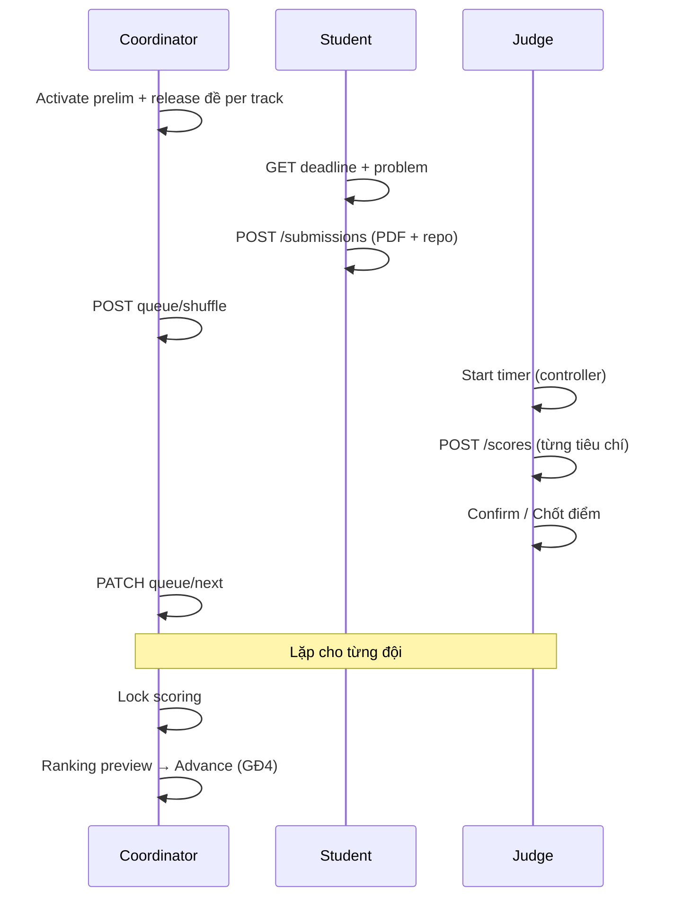

# Giai đoạn 3 (GĐ3) — Ma trận test đầy đủ & Seed dev

> **Mục đích:** Một tài liệu duy nhất để QA / FE / BE test GĐ3 — Sơ loại: nộp bài, duyệt trễ, hàng đợi thuyết trình, chấm điểm live, khóa chấm, đồng điểm & penalty tiebreak.  
> **Profile:** `dev` · **Password SV:** `Student@dev1` · **Coordinator:** `coord@fpt.edu.vn` / `Coordinator@dev1`  
> **Judge:** `judge1@fpt.edu.vn`, `judge2@fpt.edu.vn` / `Judge@dev1`

---

## Mục lục

1. [Phạm vi GĐ3 & điều kiện vào](#1-phạm-vi-gđ3--điều-kiện-vào)
2. [6 profile seed dev](#2-6-profile-seed-dev)
3. [Ma trận test theo chức năng (FR)](#3-ma-trận-test-theo-chức-năng-fr)
4. [Luồng end-to-end (workflow)](#4-luồng-end-to-end-workflow)
5. [Business rules (tóm tắt)](#5-business-rules-tóm-tắt)
6. [Kịch bản bad / happy / hybrid](#6-kịch-bản-bad--happy--hybrid)
7. [Checklist smoke sau restart BE](#7-checklist-smoke-sau-restart-be)
8. [Phụ lục — Mã lỗi & warning đầy đủ (BE)](#8-phụ-lục--mã-lỗi--warning-đầy-đủ-be)

---

## 1. Phạm vi GĐ3 & điều kiện vào

### 1.1 GĐ3 bao gồm

| Hạng mục | Mô tả |
|----------|--------|
| **Activate round sơ loại** | Coordinator bật vòng, auto-deactivate vòng khác |
| **Release đề** | Upload PDF per track → release (one-way) |
| **Nộp bài** | Student multipart: `repoUrl` + `slideFile` PDF |
| **Nộp trễ / duyệt trễ** | `LATE_PENDING` → Coordinator approve/reject |
| **Hàng đợi thuyết trình** | Shuffle → slot `PRESENTING` → timer → `queue/next` |
| **Chấm điểm live** | Judge chấm khi timer mở; đồng bộ tiến độ |
| **Khóa chấm** | `scoring_locked` → không POST score |
| **Ranking preview** | Per partition (`assigned_group`) trong track |
| **Tiebreak / penalty** | Đồng điểm ranh giới Top-N → HEAD vote penalty |
| **Presentation controller** | HEAD judge (hoặc Coordinator grant) điều khiển timer/next |
| **WebSocket queue** | Push realtime sau shuffle / next / timer |
| **Judge confirm scoring** | Chốt đủ tiêu chí → `canAdvanceQueue` |

### 1.2 Gate vào GĐ3 (từ GĐ2)

| Gate | Điều kiện | Cách verify |
|------|-----------|-------------|
| G-3.1 | Hackathon `ONGOING`, đội `ACTIVE` | `GET /hackathons/active` |
| G-3.2 | Có `team_round_participation` + `team_round_tracks` sau lottery | `GET /me/teams` |
| G-3.3 | `registration_end` đã qua, đội `is_locked` | Không thêm/xóa thành viên |
| G-3.4 | Round sơ loại `is_active=true` | `GET /rounds/{id}` |

### 1.3 Submission status (Sơ loại)

| Status | Gradable? | Ý nghĩa test |
|--------|-----------|--------------|
| `SUBMITTED` | Có | Nộp đúng hạn |
| `LATE_PENDING` | **Không** | Nộp sau deadline, chờ BTC |
| `LATE_APPROVED` | Có | BTC duyệt nộp trễ |
| `REJECTED` | Không | BTC từ chối / CK HARD_LOCK |
| *(chưa nộp)* | — | Student portal `NONE` / form mở |

**FE mapping:** `ON_TIME` | `LATE_PENDING` | `REJECTED` | `INCOMPLETE` (đã lưu submission nhưng thiếu `slideStorageKey`)

**Phân biệt:** `SLIDE_FILE_REQUIRED` = POST multipart **không gửi** `slideFile`; `INCOMPLETE` = đã có bản ghi nhưng thiếu file lưu trữ (BE/seed).

---

## 2. 6 profile seed dev

Sau `mvn spring-boot:run` (profile `dev`), `DataInitializer` tạo **6 hackathon GĐ3** độc lập:

### Profile 0 — Demo tương tác (happy path cơ bản)

| | |
|--|--|
| **Slug** | `seal-gd3-prelim-open` |
| **Seeder** | `Gd3PrelimOpenDataSeeder` |
| **Config** | `app.seed.gd3.enabled=true` |
| **Trạng thái** | Prelim **active**, problem released, **chưa** lock chấm |
| **Lịch** | Deadline = now + 8h (luôn test được sau restart) |

| Đội | Track | Submission | Queue | Score |
|-----|-------|------------|-------|-------|
| GD3-01..05 | T1/T2 | `SUBMITTED` | *(trống)* | Chưa chấm |
| GD3-06 | T2 | **Chưa nộp** | — | Demo: nộp → shuffle → chấm |

**Account:** `student.gd3.leader01@fpt.edu.vn` … `leader06@fpt.edu.vn`

**Dùng khi:** Demo E2E tay từ đầu (nộp file, xáo queue, start timer, chấm).

---

### Profile A — Bad / hybrid: Nộp trễ & duyệt

| | |
|--|--|
| **Slug** | `seal-gd3-late-review` |
| **Seeder** | `Gd3LateReviewDataSeeder` |
| **Config** | `app.seed.gd3.late-review.enabled=true` |

| Đội | Status | `isLate` | Mục đích test |
|-----|--------|----------|---------------|
| GD3-L01 On-time | `SUBMITTED` | false | Baseline đúng hạn |
| GD3-L02 Late-pending | `LATE_PENDING` | true | Coordinator duyệt/từ chối |
| GD3-L03 Late-approved | `LATE_APPROVED` | true | Vào queue sau shuffle |
| GD3-L04 No-submit | — | — | Student POST multipart sau deadline |
| GD3-L05 Late-rejected | `REJECTED` | true | Không nộp lại được |

**Account:** `student.gd3.late.leader01@fpt.edu.vn` … `leader05@fpt.edu.vn`

**API chính:**
- `GET /api/v1/submissions?status=LATE_PENDING` (Coordinator)
- `PATCH /api/v1/submissions/{id}/approve` | `/reject`
- `GET /api/v1/me/submission?teamId=&roundId=` (Student)

---

### Profile B — Happy / hybrid: Chấm live & queue

| | |
|--|--|
| **Slug** | `seal-gd3-scoring-live` |
| **Seeder** | `Gd3ScoringLiveDataSeeder` |
| **Config** | `app.seed.gd3.scoring-live.enabled=true` |

| Đội | Track | Queue | Score |
|-----|-------|-------|-------|
| GD3-S01 Scored-full | T1 | WAITING | Judge1+2 chấm **đủ** tiêu chí |
| GD3-S02 Scored-partial | T1 | WAITING | Chỉ judge1 chấm đủ |
| GD3-S03 Queue-presenting | T1 | **PRESENTING** | Chưa chấm — demo timer + POST score |
| GD3-S04 Track2-done | T2 | DONE | Chưa chấm |
| GD3-S05 Track2-presenting | T2 | **PRESENTING** | Chưa chấm |
| GD3-S06 No-score | T2 | WAITING | Chưa chấm |

**Account:** `student.gd3.live.leader01@fpt.edu.vn` … `leader06@fpt.edu.vn`

**API / FE chính:**
- `GET /api/v1/presentation/queue?roundId=`
- `POST /presentation/queue/shuffle`
- `POST /presentation/timer/start|pause|resume|qa|reset`
- `PATCH /presentation/queue/next` (+ `acknowledgeIncompleteScoring`)
- `GET|PUT /api/v1/presentation/tracks/{trackId}/controller`
- `POST /api/v1/scores`
- `GET /api/v1/me/judge/submissions/{id}/scoring-status` → `canAdvanceQueue`
- `POST /api/v1/me/judge/submissions/{id}/confirm-scoring`
- `GET /api/v1/me/judge-track-assignments` → `totalTeams`, `scoredTeams`
- Judge dashboard progress bar

---

### Profile C — Hybrid exit: Khóa chấm + đồng điểm + penalty

| | |
|--|--|
| **Slug** | `seal-gd3-tiebreak-hybrid` |
| **Seeder** | `Gd3TiebreakHybridDataSeeder` |
| **Config** | `app.seed.gd3.tiebreak-hybrid.enabled=true` |
| **Trạng thái** | Prelim **inactive**, **scoring_locked**, chưa publish, `topN=2` |

| Đội | Bảng | Điểm TB (2 judge) | Ghi chú |
|-----|------|-------------------|---------|
| GD3-T01 Tie-A rank1 | BANG-A | **8.0** | Hòa T02 tại ranh giới top 2 |
| GD3-T02 Tie-A rank2 | BANG-A | **8.0** | Penalty HEAD = 1 |
| GD3-T03 Tie-A rank3 | BANG-A | 6.0 | Bị loại trong bảng |
| GD3-T04 Clear-B rank1 | BANG-B | 9.0 | Vượt qua rõ ràng |
| GD3-T05 Clear-B rank2 | BANG-B | 5.0 | |
| GD3-T06 Track2 solo | BANG-C (T2) | 7.5 | Track 2 |

**Penalty seed:** HEAD judge (`judge1`) đã vote — T01 penalty=0, T02 penalty=1.

**Account:** `student.gd3.tie.leader01@fpt.edu.vn` … `leader06@fpt.edu.vn`

**API chính:**
- `GET /api/v1/rounds/{id}/ranking` hoặc `/ranking/preview`
- `POST /api/v1/me/tiebreak-evaluations` (HEAD)
- `POST /api/v1/rounds/{id}/tiebreak/resolve` (Coordinator)
- Chuẩn bị handoff GĐ4 (`seal-gd4-advance-ready`)

---

### Profile D — Bad path: Lỗi API & validation

| | |
|--|--|
| **Slug** | `seal-gd3-edge-errors` |
| **Seeder** | `Gd3EdgeErrorsDataSeeder` |
| **Config** | `app.seed.gd3.edge-errors.enabled=true` |
| **Trạng thái** | Prelim **inactive**, problem released, **chưa** lock chấm |

| Đội | Track | Submission | Mục đích test |
|-----|-------|------------|---------------|
| GD3-E01 Complete | T1 | `SUBMITTED` + slide seeded | Baseline khi activate round |
| GD3-E02 Incomplete-slide | T1 | `SUBMITTED`, **không** `slideStorageKey` | FE `INCOMPLETE`, bắt nộp lại slide |
| GD3-E03 No-submit | T1 | Chưa nộp | POST khi round inactive → `ROUND_NOT_ACTIVE` |
| GD3-E04 Track2-ready | T2 | `SUBMITTED` + slide | Track2 có judge (T1 **không** có judge) |

**Đặc biệt:** Track1 **không** có judge → activate round → `422 JUDGE_NOT_ASSIGNED`.

**Account:** `student.gd3.edge.leader01@fpt.edu.vn` … `leader04@fpt.edu.vn`

**API / FE chính:**
- `POST /api/v1/submissions` → `ROUND_NOT_ACTIVE` (round tắt)
- `GET /api/v1/me/submission` → E02 status `INCOMPLETE`
- `POST /api/v1/rounds/{id}/activate` → `JUDGE_NOT_ASSIGNED` (track1 thiếu judge)

---

### Profile E — Hybrid: Calibration + timer PAUSED/QA

| | |
|--|--|
| **Slug** | `seal-gd3-calibration-timer` |
| **Seeder** | `Gd3CalibrationTimerDataSeeder` |
| **Config** | `app.seed.gd3.calibration-timer.enabled=true` |
| **Trạng thái** | Prelim **active**, calibration session **OPEN** |

| Đội | Track | Queue / Timer | Mục đích test |
|-----|-------|---------------|---------------|
| GD3-CT01 Calib-sample | T1 | DONE | Bài mẫu calibration session |
| GD3-CT02 Queue-done | T1 | DONE | — |
| GD3-CT03 Timer-paused | T1 | **PRESENTING** + `PAUSED` | Pause / Resume UI |
| GD3-CT04 Timer-qa | T2 | **PRESENTING** + `QA` | Phase QA + chấm live |
| GD3-CT05 Waiting | T2 | WAITING | Next queue |

**Account:** `student.gd3.calib.leader01@fpt.edu.vn` … `leader05@fpt.edu.vn`

**API chính:**
- `GET /api/v1/rounds/{prelimId}/calibration-sessions` → session OPEN
- `POST /api/v1/scores/calibration` (không cần slot PRESENTING)
- `GET /api/v1/presentation/queue` → timer phase `PAUSED` / `QA`
- `POST /presentation/timer/resume` trên CT03

---

## 3. Ma trận test theo chức năng (FR)

### FR-20 / FR-32 — Activate round

| # | Case | Role | Kỳ vọng | Seed |
|---|------|------|---------|------|
| A1 | Activate prelim khi đủ criteria + judge | Coordinator | 200, `is_active=true` | Profile 0 (đã active) |
| A2 | Activate khi weight criteria ≠ 1 | Coordinator | 422 `ROUND_WEIGHT_NOT_ONE` | Tạo tay trên E2E |
| A2b | Activate khi track thiếu criteria | Coordinator | 422 `ROUND_NO_CRITERIA` | Tạo tay |
| A3 | Activate khi thiếu judge track | Coordinator | 422 `JUDGE_NOT_ASSIGNED` | Profile D |
| A4 | Activate round 2 → round 1 auto off | Coordinator | Chỉ 1 active | Profile 0 |
| A5 | Activate khi không có đội participation | Coordinator | 422 `NO_TEAMS_IN_ROUND` | Tạo tay (hackathon trống) |

### FR-21 — Release đề (upload track + release round)

Luồng BE: Coordinator upload PDF **từng track** → `PATCH /rounds/{id}/release-problem` (one-way).

| # | Case | API | Kỳ vọng | Seed |
|---|------|-----|---------|------|
| R1 | Upload PDF đề track | `POST /tracks/{id}/problem-statement` | `problemStatementStorageKey` set | Profile 0 (seed đã có) |
| R2 | Release round sau khi đủ track | `PATCH /rounds/{id}/release-problem` | `problem_released_at` set | Profile 0 |
| R3 | Release lần 2 (one-way) | `PATCH .../release-problem` | 422 / không sửa | Profile 0 |
| R4 | SV tải đề sau release | `GET /tracks/{id}/problem-statement` hoặc student portal | 200 + PDF/URL | Profile 0 |
| R5 | Release khi chưa upload đủ track | `PATCH .../release-problem` | 422 validation | Tạo tay |
| R6 | Upload đề khi round đã release | `POST /tracks/{id}/problem-statement` | 422 `INVALID_STATE` | Tạo tay |

### FR-22 / FR-33 — Nộp bài (Sơ loại)

| # | Case | Input | Kỳ vọng | Seed |
|---|------|-------|---------|------|
| S1 | Nộp đúng hạn | PDF + repo trước deadline | `SUBMITTED`, FE `ON_TIME` | Profile 0 (GD3-06) |
| S2 | Nộp sau deadline | PDF sau deadline | `LATE_PENDING` | Profile A (L04) hoặc tay |
| S3 | Nộp lại khi đã SUBMITTED | Upsert repo/slide | 201, giữ status | Profile 0 |
| S4 | Nộp khi REJECTED | POST | 422 không nộp lại | Profile A (L05) |
| S5 | Thiếu slide (đã nộp repo) | Chỉ repo / không `slideStorageKey` | FE `INCOMPLETE`, POST lại slide | Profile D (E02) |
| S5b | Multipart thiếu `slideFile` | Không gửi file | 400 `SLIDE_FILE_REQUIRED` | Tay |
| S6 | File không phải PDF thật | Đổi đuôi .pptx | 422 `INVALID_SLIDE_FILE` | Tay |
| S7 | Repo GitHub private | repoUrl | 400 `REPO_NOT_PUBLIC` / `INVALID_REPO_PLATFORM` | Tay (nếu bật check) |
| S8 | Đội chưa lottery / chưa track | POST | 422 `TEAM_NOT_IN_TRACK` | E2E GĐ2 |
| S9 | Round chưa active | POST | 422 `ROUND_NOT_ACTIVE` | Profile D (E03) |
| S10 | Xem slide đã nộp | GET slide + Bearer | 200 inline PDF | Profile 0 (FE modal) |

### FR-25 — Duyệt nộp trễ

| # | Case | Kỳ vọng | Seed |
|---|------|---------|------|
| L1 | List `LATE_PENDING` | Coordinator thấy L02 | Profile A |
| L2 | Approve L02 | → `LATE_APPROVED`, gradable | Profile A |
| L3 | Reject (ghi chú bắt buộc) | → `REJECTED` | Profile A (L05) |
| L3b | Reject không ghi chú | 422 `REVIEW_NOTE_REQUIRED` | Tay |
| L4 | Approve khi không LATE_PENDING | 422 `SUBMISSION_NOT_LATE_PENDING` | Tay |
| L5 | LATE_APPROVED sau shuffle | Append cuối queue | Profile A + shuffle tay |

### FR-23 — Hàng đợi, timer & controller

| # | Case | Kỳ vọng | Seed |
|---|------|---------|------|
| Q1 | Shuffle tạo slots | Slot #1 `PRESENTING`, còn lại `WAITING` | Profile 0 |
| Q1b | Shuffle khi `scoring_locked` | 422 `INVALID_STATE` | Profile C |
| Q2 | Start timer | `timer.phase=PRESENTING` | Profile B (S03/S05) |
| Q3 | Pause / Resume / QA | Phase đúng | Profile E (CT03/CT04) |
| Q3b | Timer reset | Phase `IDLE`, clear mốc thời gian | Profile B (tay) |
| Q3c | Start khi timer đã chạy | 422 `INVALID_STATE` | Tay |
| Q3d | Pause khi chưa PRESENTING/QA | 422 `INVALID_STATE` | Tay |
| Q4a | Next — chưa có điểm NORMAL | 422 `SCORING_INCOMPLETE_BEFORE_NEXT` (`reason: NO_SCORES`) | Profile B (S03) |
| Q4b | Next — thiếu judge (có điểm một phần) | 422 hoặc dialog → `acknowledgeIncompleteScoring: true` (`MISSING_JUDGE_SCORES`) | Profile B (S02) |
| Q5 | Next sau đủ judge chấm | Slot DONE, next `PRESENTING` + `SETUP` | Profile B |
| Q6 | HEAD judge = controller mặc định | `GET .../controller` → `source: HEAD` | Profile B |
| Q7 | Không HEAD → `source: UNASSIGNED` | Coordinator `PUT .../tracks/{id}/controller` | Tay (xóa HEAD hoặc grant) |
| Q8 | Judge chỉ thấy `displayCode` (`#submissionId`) | Không lộ tên đội | Profile B |
| Q9 | Judge không phải controller gọi timer/next | 403 `NOT_TRACK_CONTROLLER` | Profile B (judge2) |
| Q10 | Coordinator luôn được shuffle/next/timer | 200 | Profile B |
| Q11 | WebSocket push sau shuffle/next/timer | Client nhận payload queue mới | Tay (STOMP) |

**API controller:** `GET|PUT|DELETE /api/v1/presentation/tracks/{trackId}/controller`

### FR-24 / FR-35 — Chấm điểm & confirm

| # | Case | Kỳ vọng | Seed |
|---|------|---------|------|
| J1 | POST score khi timer `IDLE`/`SETUP` trên slot PRESENTING | 422 `SCORING_NOT_OPEN` | Profile B (S03 trước start) |
| J1b | POST score khi round phase `CODING` (trước `examAt`) | 422 `SCORING_NOT_OPEN` | Tay (đổi lịch) |
| J2 | POST score khi PRESENTING + timer mở | 201 | Profile B (S03 sau start) |
| J3 | Chấm LATE_PENDING (chưa duyệt) | 422 `SUBMISSION_NOT_GRADABLE` | Profile A (L02) |
| J4 | Điểm > max_score | 422 `SCORE_EXCEEDS_MAX` | Tay |
| J5 | Judge chưa phân công track | 403 `JUDGE_NOT_ASSIGNED_TO_TRACK` | Tay |
| J5b | Tiêu chí sai track submission | 422 `CRITERION_WRONG_ROUND` | Tay |
| J6 | Reload trang — giữ draft điểm | localStorage + autosave API | FE (mọi profile) |
| J7 | Chấm đủ tiêu chí → `canAdvanceQueue=true` | `GET .../judge/submissions/{id}/scoring-status` | Profile B |
| J7b | Judge confirm chốt điểm | `POST .../judge/submissions/{id}/confirm-scoring` → 204 | Profile B |
| J8 | `GET judge-track-assignments` | `totalTeams`, `scoredTeams` | Profile B |
| J9 | Mentor = Judge cùng track | 409 `CONFLICT_MENTOR_JUDGE_SAME_TRACK` | Tay |

### FR-26 — Khóa chấm

| # | Case | Kỳ vọng | Seed |
|---|------|---------|------|
| K1 | Lock scoring bình thường | `scoring_locked=true`, scores `is_final=1` | Profile C (đã lock) |
| K2 | POST score sau lock | 423 `SCORING_LOCKED` | Profile C |
| K3 | Force lock thiếu reason | 422 `FORCE_LOCK_REASON_REQUIRED` | Tay |
| K4 | Warning partial scoring | 200 + `PARTIAL_SCORING_BEFORE_LOCK`, vẫn lock | Tay |

### FR-27 / FR-28 — Ranking, preview & tiebreak

| # | Case | Kỳ vọng | Seed |
|---|------|---------|------|
| T1 | Ranking per BANG-A / BANG-B | Top 2 mỗi partition | Profile C |
| T2 | T01 = T02 điểm → `TIEBREAK_REQUIRED` | Cần resolve | Profile C |
| T3 | HEAD penalty vote | `tiebreak_evaluations` | Profile C (seeded) |
| T4 | Sau penalty T01 > T02 | Ranking đúng thứ tự | Profile C |
| T5 | Rule `SUBMISSION_TIME` / `COORDINATOR_DECISION` | Theo `tiebreak_rule` | Tay đổi round config |
| T6 | Ranking preview thiếu điểm | 200 + warning `INCOMPLETE_SCORING_IN_RANKING` | Tay (đội chưa chấm đủ) |

### FR-29 — Calibration (RBL)

| # | Case | Kỳ vọng | Seed |
|---|------|---------|------|
| C1 | Session OPEN + bài mẫu | `GET .../calibration-sessions` | Profile E |
| C2 | POST `/scores/calibration` không cần PRESENTING | 201 | Profile E |
| C3 | Chấm khi session CLOSED | 422 `INVALID_STATE` | Tay (đóng session) |
| C4 | Mở session thứ 2 khi đã OPEN | 422 `INVALID_STATE` | Tay |
| C5 | Mở session khi round đã lock chấm | 422 `INVALID_STATE` | Profile C |

### Warnings (2xx, không chặn)

| # | Code | Khi nào | Seed |
|---|------|---------|------|
| W1 | `PARTIAL_SCORING_BEFORE_LOCK` | Lock khi còn đội chưa chấm đủ | Tay |
| W2 | `INCOMPLETE_SCORING_IN_RANKING` | Preview ranking thiếu điểm | Tay |
| W3 | `JUDGE_PARTICIPATED_IN_PRELIM` | Assign judge CK đã chấm sơ loại | GĐ4 (ngoài GĐ3) |

---

## 4. Luồng end-to-end (workflow)

### 4.1 Happy path đầy đủ (Profile 0)



### 4.2 Hybrid — Nộp trễ vào queue (Profile A)

1. Student L04 nộp sau deadline → `LATE_PENDING`
2. Coordinator approve → `LATE_APPROVED`
3. Coordinator shuffle (nếu chưa) → đội append cuối queue
4. Judge chấm như happy path

### 4.3 Bad path — Từ chối & không gradable

1. L05 `REJECTED` — student không POST lại
2. L02 `LATE_PENDING` — judge `POST /scores` → 422
3. CK (GĐ5) sau deadline → `REJECTED` ngay (HARD_LOCK) — **không thuộc GĐ3 sơ loại**

---

## 5. Business rules (tóm tắt)

**Gradable policy (BE):** `SUBMITTED`, `LATE_APPROVED`, `ACCEPTED` only.

**Gate chấm NORMAL (`POST /scores`):**

| Điều kiện | Bắt buộc |
|-----------|----------|
| Round phase | `JUDGING` (`is_active` && `now >= examAt` && !`scoring_locked`) |
| Slot | `queue_status=PRESENTING` |
| Timer phase | ∉ `{IDLE, SETUP}` |

**Ngoại lệ:** `POST /scores/calibration` — không qua gate PRESENTING/timer.

**Queue/next:** Xem Q4a/Q4b — `PresentationNextScoringGuard` trả `reason` trong body.

Chi tiết mã lỗi & warning → [§8 Phụ lục](#8-phụ-lục--mã-lỗi--warning-đầy-đủ-be).

---

## 6. Kịch bản bad / happy / hybrid

### 6.1 Bảng tổng hợp

| Loại | Ví dụ | Profile seed |
|------|-------|--------------|
| **Happy** | Nộp đúng hạn → shuffle → chấm → next → lock | 0, B |
| **Bad** | Nộp trễ reject, chấm khi chưa timer, score sau lock, round inactive | A, C, D |
| **Hybrid** | LATE_APPROVED vào queue; một phần judge chấm; hòa điểm + penalty; calibration + timer | A, B, C, E |

### 6.2 Test “2 đội bằng điểm”

**Dùng Profile C (`seal-gd3-tiebreak-hybrid`):**

1. `GET /api/v1/rounds/{prelimId}/ranking?trackId={t1}`
2. Trong **BANG-A**: T01 và T02 cùng `weightedAvgScore = 8.0`
3. `topN=2` → ranh giới rank 2 có 2 đội → `TIEBREAK_REQUIRED`
4. Verify `tiebreak_evaluations`: T02 có penalty cao hơn
5. Coordinator resolve / advance (GĐ4)

### 6.3 Test penalty chấm (ScoreType.PENALTY)

- **Tiebreak penalty:** `tiebreak_evaluations.penalty_score` (HEAD vote) — Profile C
- **Discipline penalty:** `scores` với `score_type=PENALTY` — tạo tay qua API nếu có endpoint coordinator

### 6.4 Test nộp trễ / quá hạn

| Thuật ngữ | DB status | Test trên |
|-----------|-----------|-----------|
| Nộp trễ chờ duyệt | `LATE_PENDING` | Profile A — L02 |
| Nộp trễ đã duyệt | `LATE_APPROVED` | Profile A — L03 |
| Quá hạn bị từ chối | `REJECTED` | Profile A — L05 |
| Chưa nộp, còn deadline | — | Profile 0 — GD3-06 |
| Chưa nộp, quá deadline | POST → LATE_PENDING | Profile A — L04 |

---

## 7. Checklist smoke sau restart BE

```bash
# 1. Compile & start
cd BE && mvn spring-boot:run -Dspring-boot.run.profiles=dev

# 2. Verify 6 slug tồn tại (log DataInitializer)
# seal-gd3-prelim-open | seal-gd3-late-review | seal-gd3-scoring-live
# seal-gd3-tiebreak-hybrid | seal-gd3-edge-errors | seal-gd3-calibration-timer

# 3. Login coordinator → list hackathons active → 6+ entries

# 4. Profile A: GET submissions LATE_PENDING count >= 1

# 5. Profile B: GET presentation queue → có PRESENTING

# 6. Profile C: GET round → scoring_locked=true, topN=2

# 7. Judge: GET /me/judge-track-assignments → totalTeams/scoredTeams > 0 (profile B)

# 8. Profile D: GET round → is_active=false; E02 INCOMPLETE

# 9. Profile E: GET calibration-sessions → OPEN; queue CT03 PAUSED, CT04 QA

# 10. Profile B: judge2 POST timer/start → 403 NOT_TRACK_CONTROLLER
```

### Tắt từng seed (optional)

```properties
app.seed.gd3.enabled=false
app.seed.gd3.late-review.enabled=false
app.seed.gd3.scoring-live.enabled=false
app.seed.gd3.tiebreak-hybrid.enabled=false
app.seed.gd3.edge-errors.enabled=false
app.seed.gd3.calibration-timer.enabled=false
```

---

## 8. Phụ lục — Mã lỗi & warning đầy đủ (BE)

> Đồng bộ với `ErrorCode.java`, `WarningCode.java` và `fe-gd3-api-mapping.md` §13.  
> Chỉ liệt kê mã **liên quan GĐ3 sơ loại** (không gồm GĐ5 CK / GĐ6 trừ khi ghi chú).

### 8.1 Mã lỗi — Activate & round

| Mã | HTTP | Khi nào | Ma trận |
|----|------|---------|---------|
| `JUDGE_NOT_ASSIGNED` | 422 | Activate khi track thiếu judge | A3 |
| `ROUND_NO_CRITERIA` | 422 | Track không có criteria | A2b |
| `ROUND_WEIGHT_NOT_ONE` | 422 | Tổng weight ≠ 1 | A2 |
| `NO_TEAMS_IN_ROUND` | 422 | Không có participation | A5 |
| `ROUND_NOT_ACTIVE` | 422 | Nộp/chấm khi round tắt | S9 |
| `ROUND_NOT_SCORING_LOCKED` | 422 | Ranking/advance trước lock | GĐ4 |
| `ROUND_ALREADY_ACTIVE` | 422 | Lottery sau activate (GĐ2) | — |

### 8.2 Mã lỗi — Nộp bài & duyệt trễ

| Mã | HTTP | Khi nào | Ma trận |
|----|------|---------|---------|
| `SLIDE_FILE_REQUIRED` | 400 | Multipart thiếu `slideFile` | S5b |
| `INVALID_SLIDE_FILE` | 400/422 | File không phải PDF hợp lệ | S6 |
| `INVALID_SLIDE_FORMAT` | 400 | `slideUrl` legacy không hợp lệ | Tay |
| `INVALID_REPO_PLATFORM` | 400 | Repo không phải GitHub | S7 |
| `REPO_NOT_PUBLIC` | 400 | Repo private / 404 | S7 |
| `TEAM_NOT_IN_TRACK` | 422 | Chưa lottery / track | S8 |
| `SUBMISSION_NOT_GRADABLE` | 422 | LATE_PENDING, REJECTED | J3 |
| `SUBMISSION_NOT_LATE_PENDING` | 422 | Approve/reject sai status | L4 |
| `REVIEW_NOTE_REQUIRED` | 422 | Reject không ghi chú | L3b |
| `LATE_PENDING_NOT_ALLOWED` | 422 | Duyệt trễ ở CK HARD_LOCK | GĐ5 |

### 8.3 Mã lỗi — Queue, timer, controller

| Mã | HTTP | Khi nào | Ma trận |
|----|------|---------|---------|
| `SCORING_INCOMPLETE_BEFORE_NEXT` | 422 | Next thiếu điểm / thiếu judge | Q4a, Q4b |
| `NOT_TRACK_CONTROLLER` | 403 | Judge không phải controller | Q9 |
| `INVALID_STATE` | 422 | Shuffle khi locked; timer sai phase; queue trống | Q1b, Q3c, Q3d |

**`SCORING_INCOMPLETE_BEFORE_NEXT` — `reason` trong body:**

| `reason` | Ý nghĩa | FE |
|----------|---------|-----|
| `NO_SCORES` | Chưa có điểm NORMAL cho bài PRESENTING | Chặn Next |
| `MISSING_JUDGE_SCORES` | Có điểm nhưng chưa đủ judge track | Dialog → `acknowledgeIncompleteScoring: true` |

### 8.4 Mã lỗi — Chấm điểm

| Mã | HTTP | Khi nào | Ma trận |
|----|------|---------|---------|
| `SCORING_NOT_OPEN` | 422 | Phase/timer/slot chưa mở | J1, J1b |
| `SCORING_LOCKED` | 423 | Đã lock chấm | K2 |
| `SCORE_EXCEEDS_MAX` | 422 | Điểm > max_score | J4 |
| `JUDGE_NOT_ASSIGNED_TO_TRACK` | 403 | Judge sai track | J5 |
| `CRITERION_WRONG_ROUND` | 422 | Tiêu chí không thuộc track bài nộp | J5b |
| `CONFLICT_MENTOR_JUDGE_SAME_TRACK` | 409 | Mentor = Judge cùng track | J9 |

### 8.5 Mã lỗi — Lock, ranking, tiebreak, calibration

| Mã | HTTP | Khi nào | Ma trận |
|----|------|---------|---------|
| `FORCE_LOCK_REASON_REQUIRED` | 422 | Force lock thiếu `reason` | K3 |
| `TIEBREAK_REQUIRED` | 422 | Hòa điểm ranh giới Top-N | T2 |
| `INVALID_STATE` | 422 | Calibration: session trùng OPEN, round locked, session CLOSED | C3–C5 |

### 8.6 Warnings (HTTP 200/201, field `warnings[]`)

| Code | Khi nào | Ma trận |
|------|---------|---------|
| `PARTIAL_SCORING_BEFORE_LOCK` | Lock khi còn submission chưa chấm đủ | K4, W1 |
| `INCOMPLETE_SCORING_IN_RANKING` | Preview ranking thiếu điểm tiêu chí | T6, W2 |
| `JUDGE_PARTICIPATED_IN_PRELIM` | Judge sơ loại được gán CK | W3 (GĐ4) |
| `MIN_TEAMS_NOT_REACHED` | Advance < `min_teams_final` | GĐ4 wildcard |

### 8.7 WebSocket (realtime)

| Topic | Khi publish |
|-------|-------------|
| `/topic/rounds/{roundId}/tracks/{trackId}/presentation-queue` | Shuffle, next, timer (sơ loại) |
| `/topic/rounds/{roundId}/presentation-queue` | Round-level (CK / coordinator) |

Auth: judge phải được assign track/round tương ứng (`StompSubscribeAuthorizationInterceptor`).

### 8.8 API judge confirm (bổ sung)

| Method | Path | Mô tả |
|--------|------|--------|
| GET | `/api/v1/me/judge/submissions/{submissionId}/scoring-status` | `canAdvanceQueue`, criteria progress |
| POST | `/api/v1/me/judge/submissions/{submissionId}/confirm-scoring` | Judge chốt đã chấm đủ |

---

## Phụ lục — Map tài liệu liên quan

| Tài liệu | Nội dung |
|----------|----------|
| `mf03/01-business-rules-gd3.md` | Business rules chính thức |
| `mf03/02-mainflow-gd3.md` | Main flow |
| `testing/fe-gd3-api-mapping.md` | API ↔ FE mapping |
| `testing/e2e-gd2-gd3-v41-manual-test.md` | E2E manual từng bước |
| `testing/dev-seed-guide.md` | Hướng dẫn seed dev tổng |
| `testing/gd3-v41-implementation-changelog.md` | Changelog BE v4.1 (timer, WS, gate chấm) |
| `testing/gd4-full-test-matrix-and-seeds.md` | Ma trận test GĐ4 — 5 profile seed |
| `testing/gd5-full-test-matrix-and-seeds.md` | Ma trận test GĐ5 — 5 profile seed |
| `testing/gd6-full-test-matrix-and-seeds.md` | Ma trận test GĐ6 — 5 profile seed |
| `testing/gd4-gd5-e2e-seed-data.md` | Postman variables & handoff GĐ4/GĐ5 |

---

*Cập nhật: 2026-06 — 6 seed GĐ3 + ma trận đồng bộ BE (controller, confirm, warnings, mã lỗi đầy đủ).*
