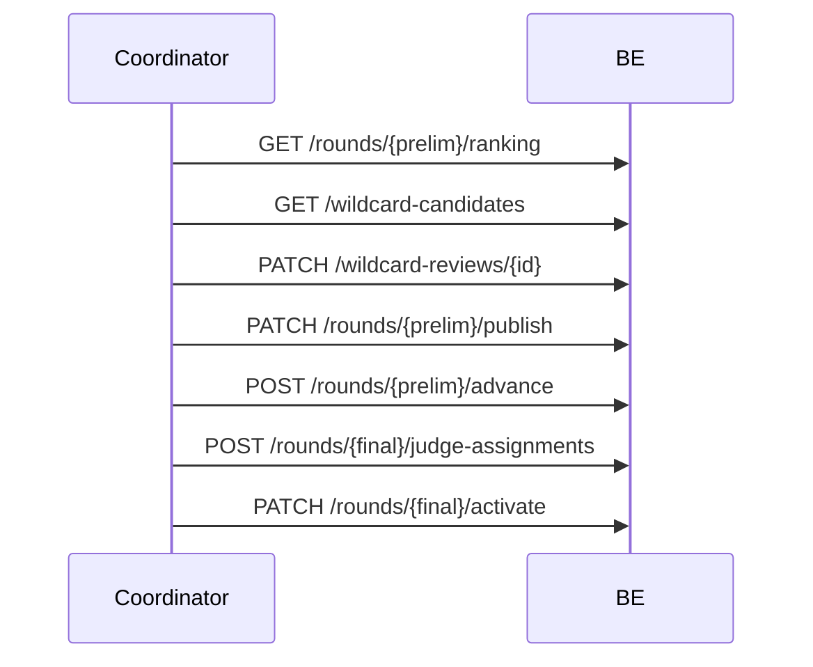

# Giai đoạn 4 (GĐ4) — Ma trận test đầy đủ & Seed dev

> **Mục đích:** Tài liệu QA / FE / BE cho **GĐ4 Chuyển vòng** — ranking, wildcard, publish, tiebreak, advance, phân judge CK, activate CK.  
> **Profile:** `dev` · **Password SV:** `Student@dev1` · **Coordinator:** `coord@fpt.edu.vn` / `Coordinator@dev1`  
> **Judge SL:** `judge1@fpt.edu.vn`, `judge2@fpt.edu.vn` / `Judge@dev1` · **Guest judge CK:** `guestjudge@gmail.com` / `GuestJudge@dev1`  
> **Liên quan:** [gd3-full-test-matrix-and-seeds.md](gd3-full-test-matrix-and-seeds.md) · **GĐ5:** [gd5-full-test-matrix-and-seeds.md](gd5-full-test-matrix-and-seeds.md)

---

## Mục lục

1. [Phạm vi GĐ4 & điều kiện vào](#1-phạm-vi-gđ4--điều-kiện-vào)
2. [10 profile seed dev](#2-10-profile-seed-dev)
3. [Ma trận test theo chức năng (FR)](#3-ma-trận-test-theo-chức-năng-fr)
4. [Luồng end-to-end](#4-luồng-end-to-end)
5. [Business rules](#5-business-rules)
6. [Checklist smoke](#6-checklist-smoke)
7. [Phụ lục — Mã lỗi & warning](#7-phụ-lục--mã-lỗi--warning)

---

## 1. Phạm vi GĐ4 & điều kiện vào

### 1.1 GĐ4 bao gồm

| Hạng mục | Mô tả |
|----------|--------|
| **Ranking sơ loại** | Chính thức (sau lock) / preview (trước lock) |
| **Wildcard** | Candidate rank2 khi thiếu slot `minTeamsFinal` |
| **Publish kết quả SL** | One-way `isPublished=true` |
| **Tiebreak gate** | Chặn advance khi còn đồng điểm ranh giới topN |
| **Advance teams** | ADVANCED / ELIMINATED + participation CK |
| **Phân judge CK** | `FINAL_EXTERNAL` (guest judge) |
| **Activate CK** | Gate: SL published + criteria CK + ≥1 judge CK |
| **Readiness** | `GET /hackathons/{id}/readiness?target=FINAL_ROUND` |

### 1.2 Gate vào GĐ4 (từ GĐ3)

| Gate | Điều kiện |
|------|-----------|
| G-4.1 | Sơ loại `scoring_locked=true` |
| G-4.2 | Mọi submission gradable đã có điểm `isFinal=true` (hoặc chấp nhận warning preview) |
| G-4.3 | Hackathon `ONGOING` |

---

## 2. 11 profile seed dev

Sau `mvn spring-boot:run` (profile `dev`), `DataInitializer` tạo **11 hackathon GĐ4** độc lập.

### Profile 0 — Advance ready (happy path đầy đủ)

| | |
|--|--|
| **Slug** | `seal-gd4-advance-ready` |
| **Seeder** | `Gd4AdvanceReadyDataSeeder` |
| **Config** | `app.seed.gd4.enabled=true` |

| Thành phần | Giá trị |
|------------|---------|
| Sơ loại | locked, **chưa publish**, `topN=1`, `minTeamsFinal=6`, wildcard on |
| CK | inactive, chưa advance |
| Đội | 8 đội, 4 bảng, điểm final |

| Đội | Bảng | Điểm | Vai trò |
|-----|------|------|---------|
| GD4-A01..A08 | A–D | 9/7 xen kẽ | Top1 + wildcard A02,A06 |

**Account:** `student.gd4a.leader01@fpt.edu.vn` … `leader08@`

**Dùng khi:** Full flow tay — publish → wildcard → advance → assign judge → activate CK.

---

### Profile A — Đã publish, chưa advance

| | |
|--|--|
| **Slug** | `seal-gd4-published` |
| **Seeder** | `Gd4PublishedDataSeeder` |
| **Config** | `app.seed.gd4.published.enabled=true` |

Giống Profile 0 nhưng **`isPublished=true`** — test `POST /advance` trực tiếp (không cần publish), `PATCH /publish` lần 2 → `INVALID_STATE`.

**Account:** `student.gd4p.leader01@fpt.edu.vn` … `leader08@`

---

### Profile B — Tiebreak gate (`TIEBREAK_REQUIRED`)

| | |
|--|--|
| **Slug** | `seal-gd4-tiebreak-gate` |
| **Seeder** | `Gd4TiebreakGateDataSeeder` |
| **Config** | `app.seed.gd4.tiebreak-gate.enabled=true` |

| Đội | Điểm | Ghi chú |
|-----|------|---------|
| GD4-TB01, GD4-TB02 | 9.0, 9.0 | Hòa tại ranh giới topN=1 |
| GD4-TB03, GD4-TB04 | 7.0, 6.0 | Loại rõ |

4 đội cùng bảng A, track1. `POST /advance` (sau publish) → **422 `TIEBREAK_REQUIRED`**.

**Account:** `student.gd4tb.leader01@fpt.edu.vn` … `leader04@`

> Tham chiếu thêm: `seal-gd3-tiebreak-hybrid` (GĐ3 § Profile C) cho penalty vote + resolve.

---

### Profile C — CK activate ready

| | |
|--|--|
| **Slug** | `seal-gd4-ck-activate-ready` |
| **Seeder** | `Gd4CkActivateReadyDataSeeder` |
| **Config** | `app.seed.gd4.ck-activate-ready.enabled=true` |

| Thành phần | Giá trị |
|------------|---------|
| Sơ loại | locked + **published** |
| Đội | **6 ADVANCED** (4 top1 + 2 wildcard), 2 ELIMINATED |
| CK | guest judge assigned, **chưa active** |

**Account:** `student.gd4k.leader01@fpt.edu.vn` … `leader08@`

**Dùng khi:** Chỉ test `PATCH /rounds/{finalId}/activate` + readiness (không cần advance tay).

---

### Profile D — Edge errors

| | |
|--|--|
| **Slug** | `seal-gd4-edge-errors` |
| **Seeder** | `Gd4EdgeErrorsDataSeeder` |
| **Config** | `app.seed.gd4.edge-errors.enabled=true` |

| Case | Seed state | API | Kỳ vọng |
|------|------------|-----|---------|
| Activate thiếu judge | 4 ADVANCED, published, **0 judge CK** | `PATCH /activate` | `JUDGE_NOT_ASSIGNED` |
| Advance chưa publish | Profile 0 (trước publish) | `POST /advance` | `RESULT_NOT_PUBLISHED` |
| Publish chưa lock | Tay trên GĐ3 | `PATCH /publish` | `ROUND_NOT_SCORING_LOCKED` |

**Account:** `student.gd4e.leader01@fpt.edu.vn` … `leader04@`

---

### Profile E — Wildcard resolved (approve + reject)

| | |
|--|--|
| **Slug** | `seal-gd4-wildcard-resolved` |
| **Seeder** | `Gd4WildcardResolvedDataSeeder` |
| **Config** | `app.seed.gd4.wildcard-resolved.enabled=true` |

| Thành phần | Giá trị |
|------------|---------|
| Sơ loại | locked + **published**, `topN=1`, `minTeamsFinal=6` |
| Wildcard | **W06 + W08 approved**, W04 rejected, W02 auto-rejected |
| CK | inactive, chưa advance |

8 đội giống Profile 0 (điểm 9/7). `GET /wildcard-candidates` → mọi review đã chốt. `POST /advance` ngay với 6 đội: W01,W03,W05,W07 + W06,W08.

**Account:** `student.gd4w.leader01@fpt.edu.vn` … `leader08@`

**Dùng khi:** Test advance sau wildcard mà không cần `PATCH /wildcard-reviews` tay; kiểm tra reject + auto-reject.

---

### Profile F — Tiebreak resolved (sẵn advance)

| | |
|--|--|
| **Slug** | `seal-gd4-tiebreak-resolved` |
| **Seeder** | `Gd4TiebreakResolvedDataSeeder` |
| **Config** | `app.seed.gd4.tiebreak-resolved.enabled=true` |

| Đội | Điểm | Ghi chú |
|-----|------|---------|
| GD4-TR01, GD4-TR02 | 9.0, 9.0 | Coordinator resolve — TR02 penalty 0.01 |
| GD4-TR03, GD4-TR04 | 7.0, 6.0 | Loại rõ |

Sơ loại **published + locked**. `GET /tiebreak` → rỗng. `POST /advance` → **200** (không `TIEBREAK_REQUIRED`).

**Account:** `student.gd4tr.leader01@fpt.edu.vn` … `leader04@`

> So sánh Profile B (`tiebreak-gate`) — chưa resolve, advance bị chặn.

---

### Profile G — Wildcard disabled

| | |
|--|--|
| **Slug** | `seal-gd4-wildcard-disabled` |
| **Seeder** | `Gd4WildcardDisabledDataSeeder` |
| **Config** | `app.seed.gd4.wildcard-disabled.enabled=true` |

Giống Profile 0 (8 đội, locked, chưa publish) nhưng `hackathon.wildcardEnabled=false`.

**API:** `GET /wildcard-candidates` → `candidates=[]`, `hackathonWildcardEnabled=false`

---

### Profile H — Judge assign warnings

| | |
|--|--|
| **Slug** | `seal-gd4-judge-assign-warnings` |
| **Seeder** | `Gd4JudgeAssignWarningsDataSeeder` |
| **Config** | `app.seed.gd4.judge-assign-warnings.enabled=true` |

Published + 6 ADVANCED, **0 judge CK**. `POST /rounds/{finalId}/judge-assignments` với `judge1` → warnings `JUDGE_PARTICIPATED_IN_PRELIM` + `MIN_FINAL_JUDGES_NOT_MET`.

---

### Profile I — CK thiếu criteria

| | |
|--|--|
| **Slug** | `seal-gd4-ck-no-criteria` |
| **Seeder** | `Gd4CkNoCriteriaDataSeeder` |
| **Config** | `app.seed.gd4.ck-no-criteria.enabled=true` |

Giống Profile C (published + 6 ADVANCED + guest judge) nhưng **xóa criteria CK**.

**API:** `PATCH /rounds/{finalId}/activate` → 422 `ROUND_NO_CRITERIA`

---

### Profile J — CK activate khi SL chưa publish

| | |
|--|--|
| **Slug** | `seal-gd4-ck-unpublished` |
| **Seeder** | `Gd4CkUnpublishedDataSeeder` |
| **Config** | `app.seed.gd4.ck-unpublished.enabled=true` |

Sơ loại **locked + chưa publish**, 6 đội ADVANCED, guest judge CK đã gán.

**API:** `PATCH /rounds/{finalId}/activate` → 422 **`RESULT_NOT_PUBLISHED`** (G4-N01).

---

## 3. Ma trận test theo chức năng (FR)

### FR-27 — Ranking sơ loại

| # | Case | API | Kỳ vọng | Seed |
|---|------|-----|---------|------|
| R1 | Ranking chính thức | `GET /rounds/{prelimId}/ranking` | 200, đủ dòng | Profile 0, A |
| R2 | Ranking khi chưa lock | `GET .../ranking` | 422 `ROUND_NOT_SCORING_LOCKED` | Tay GĐ3 |
| R3 | Preview khi chưa lock | `GET .../ranking/preview` | 200 | `seal-gd3-prelim-open` |
| R4 | Warning thiếu điểm | Preview | `INCOMPLETE_SCORING_IN_RANKING` | `seal-gd3-scoring-live` |

### FR-22A — Wildcard

| # | Case | API | Kỳ vọng | Seed |
|---|------|-----|---------|------|
| W1 | List candidates | `GET /rounds/{prelimId}/wildcard-candidates` | 2 candidate, `availableSlots=2` | Profile 0 |
| W2 | Approve wildcard | `PATCH /wildcard-reviews/{id}` | approved | Profile 0 |
| W3 | Reject wildcard | `PATCH ...` reject | rejected | Profile E (W04) |
| W4 | Wildcard tắt | `wildcardEnabled=false` | `candidates=[]` | Profile G |
| W5 | Đủ suất → auto-reject | Approve đủ 2 slot | pending còn lại → rejected | Profile E |
| W6 | Advance sau wildcard resolved | `POST /advance` | 6 ADVANCED | Profile E |

### FR-24 — Publish kết quả sơ loại

| # | Case | API | Kỳ vọng | Seed |
|---|------|-----|---------|------|
| P1 | Publish sau lock | `PATCH /rounds/{prelimId}/publish` | `isPublished=true` | Profile 0 |
| P2 | Publish khi chưa lock | `PATCH .../publish` | 422 `ROUND_NOT_SCORING_LOCKED` | Tay |
| P3 | Publish lần 2 | `PATCH .../publish` | 422 `INVALID_STATE` | Profile A |
| P4 | Publish round CK | `PATCH` trên final | 422 `INVALID_STATE` | Tay |

### FR-28 — Tiebreak

| # | Case | API | Kỳ vọng | Seed |
|---|------|-----|---------|------|
| T1 | List borderline | `GET /rounds/{prelimId}/tiebreak` | 2 đội hòa 9.0 | Profile B |
| T2 | Advance khi còn tiebreak | `POST .../advance` | 422 `TIEBREAK_REQUIRED` | Profile B |
| T3 | Resolve tiebreak | `POST .../tiebreak/resolve` | Ranking cập nhật penalty | Tay trên B |
| T4 | Advance sau resolve | `POST .../advance` | 200 | Profile F |

### FR-30 — Advance teams

| # | Case | API | Kỳ vọng | Seed |
|---|------|-----|---------|------|
| A1 | Advance + eliminate | `POST /rounds/{prelimId}/advance` | 6 ADVANCED | Profile 0, A |
| A2 | Advance chưa publish | `POST .../advance` | 422 `RESULT_NOT_PUBLISHED` | Profile 0 |
| A3 | Overlap advance/eliminate | Body trùng id | 422 `INVALID_STATE` | Tay |
| A4 | Team sai round | id lạ | 422 `TEAM_NOT_IN_ROUND` | Tay |
| A5 | Participation CK | `GET /me/teams` | ADVANCED trên CK | Sau A1 |

**Body mẫu (Profile 0):** 4 top1 + 2 wildcard approved → advanced: A01,A02,A03,A05,A06,A07; eliminated: A04,A08.

### FR-27 — Phân judge CK

| # | Case | API | Kỳ vọng | Seed |
|---|------|-----|---------|------|
| J1 | Assign guest | `POST /rounds/{finalId}/judge-assignments` | `FINAL_EXTERNAL` | Profile 0, C |
| J2 | Duplicate | POST lại | 409 `JUDGE_ASSIGN_DUPLICATE` | Tay |
| J3 | Warning judge SL | Response warnings | `JUDGE_PARTICIPATED_IN_PRELIM` | Profile H |
| J4 | Assign nhầm SL | POST prelim | 422 `INVALID_FINAL_ROUND` | Tay |
| J5 | API GĐ1 cũ | `POST /judge-assignments` | 422 `JUDGE_FINAL_AT_PHASE1` | E2E GĐ1 |

### FR-25 — Activate CK

| # | Case | API | Kỳ vọng | Seed |
|---|------|-----|---------|------|
| K1 | Activate đủ gate | `PATCH /rounds/{finalId}/activate` | `is_active=true` | Profile C |
| K2 | SL chưa publish | `PATCH .../activate` | 422 `RESULT_NOT_PUBLISHED` | Profile J (`ck-unpublished`) |
| K3 | Thiếu judge CK | `PATCH .../activate` | 422 `JUDGE_NOT_ASSIGNED` | Profile D |
| K4 | Thiếu criteria CK | | 422 `ROUND_NO_CRITERIA` | Profile I |
| K5 | Readiness | `GET /hackathons/{id}/readiness?target=FINAL_ROUND` | `ready: true` | Profile C |

### FR-20 — Scoring progress

| # | Case | API | Seed |
|---|------|-----|------|
| S1 | Tiến độ chấm SL | `GET /rounds/{prelimId}/scoring-progress` | Profile 0 |

---

## 4. Luồng end-to-end



| Bước | Slug gợi ý |
|------|------------|
| Happy path đầy đủ | `seal-gd4-advance-ready` |
| Wildcard đã xong | `seal-gd4-wildcard-resolved` |
| Tiebreak đã xong | `seal-gd4-tiebreak-resolved` |
| Chỉ activate CK | `seal-gd4-ck-activate-ready` |
| Tiebreak gate (chưa resolve) | `seal-gd4-tiebreak-gate` |
| Sang GĐ5 | `seal-gd5-final-active` hoặc `seal-gd5-submit-open` |

---

## 5. Business rules

| Bước | Điều kiện |
|------|-----------|
| `GET /ranking` | `scoring_locked=true` |
| `PATCH /publish` | locked + chưa published + round SL |
| `POST /advance` | locked + published + không còn tiebreak |
| `PATCH /activate` (CK) | mọi SL published + criteria CK + ≥1 `FINAL_EXTERNAL` |

---

## 6. Checklist smoke

```bash
cd BE && mvn spring-boot:run -Dspring-boot.run.profiles=dev
```

### Profile 0 — `seal-gd4-advance-ready`

```text
1. GET /rounds/{prelimId}/ranking → 8 items
2. GET /wildcard-candidates → availableSlots=2
3. PATCH /publish → isPublished=true
4. POST /advance → 6 ADVANCED
5. PATCH /rounds/{finalId}/activate → is_active=true
```

### Profile B — `seal-gd4-tiebreak-gate`

```text
1. PATCH /publish
2. POST /advance → 422 TIEBREAK_REQUIRED
3. GET /tiebreak → 2 items điểm 9.0
```

### Profile E — `seal-gd4-wildcard-resolved`

```text
1. GET /wildcard-candidates → 4 reviews, 2 approved / 2 rejected
2. POST /advance → 6 ADVANCED (không cần PATCH wildcard)
```

### Profile F — `seal-gd4-tiebreak-resolved`

```text
1. GET /tiebreak → []
2. POST /advance → 200
```

### Profile D — `seal-gd4-edge-errors`

```text
1. PATCH /rounds/{finalId}/activate → 422 JUDGE_NOT_ASSIGNED
```

### Profile J — `seal-gd4-ck-unpublished`

```text
1. PATCH /rounds/{finalId}/activate → 422 RESULT_NOT_PUBLISHED
```

### Tắt seed

```properties
app.seed.gd4.enabled=false
app.seed.gd4.published.enabled=false
app.seed.gd4.tiebreak-gate.enabled=false
app.seed.gd4.ck-activate-ready.enabled=false
app.seed.gd4.ck-unpublished.enabled=false
app.seed.gd4.edge-errors.enabled=false
app.seed.gd4.wildcard-resolved.enabled=false
app.seed.gd4.tiebreak-resolved.enabled=false
app.seed.gd4.wildcard-disabled.enabled=false
app.seed.gd4.judge-assign-warnings.enabled=false
app.seed.gd4.ck-no-criteria.enabled=false
```

---

## 7. Phụ lục — Mã lỗi & warning

### Error codes

| Mã | HTTP | Khi nào | Ma trận |
|----|------|---------|---------|
| `ROUND_NOT_SCORING_LOCKED` | 422 | Ranking/publish chưa lock | P2 |
| `RESULT_NOT_PUBLISHED` | 422 | Advance/activate khi SL chưa publish | A2, K2 |
| `TIEBREAK_REQUIRED` | 422 | Advance khi còn tiebreak | T2 |
| `TEAM_NOT_IN_ROUND` | 422 | Advance team sai | A4 |
| `INVALID_FINAL_ROUND` | 422 | Judge assign nhầm round | J4 |
| `JUDGE_NOT_ASSIGNED` | 422 | Activate CK thiếu judge | K3 |
| `JUDGE_FINAL_AT_PHASE1` | 422 | Assign CK qua API GĐ1 | J5 |
| `JUDGE_ASSIGN_DUPLICATE` | 409 | Trùng phân công | J2 |
| `INVALID_STATE` | 422 | Publish 2 lần; overlap advance | P3, A3 |

### Warnings (2xx)

| Code | Khi nào |
|------|---------|
| `JUDGE_PARTICIPATED_IN_PRELIM` | Assign judge CK đã chấm SL |
| `MIN_FINAL_JUDGES_NOT_MET` | Panel CK < 3 |
| `PARTIAL_SCORING_BEFORE_LOCK` | Lock khi chưa chấm đủ |
| `INCOMPLETE_SCORING_IN_RANKING` | Ranking preview thiếu điểm |

### API surface

| Method | Path |
|--------|------|
| GET | `/api/v1/rounds/{id}/ranking` |
| GET | `/api/v1/rounds/{id}/ranking/preview` |
| GET | `/api/v1/rounds/{id}/wildcard-candidates` |
| PATCH | `/api/v1/wildcard-reviews/{id}` |
| PATCH | `/api/v1/rounds/{id}/publish` |
| POST | `/api/v1/rounds/{id}/advance` |
| GET | `/api/v1/rounds/{id}/tiebreak` |
| POST | `/api/v1/rounds/{id}/judge-assignments` |
| PATCH | `/api/v1/rounds/{id}/activate` |
| GET | `/api/v1/hackathons/{id}/readiness?target=FINAL_ROUND` |

---

## Phụ lục — Map tài liệu

| Tài liệu | Nội dung |
|----------|----------|
| [gd5-full-test-matrix-and-seeds.md](gd5-full-test-matrix-and-seeds.md) | GĐ5 Chung kết |
| [gd4-gd5-e2e-seed-data.md](gd4-gd5-e2e-seed-data.md) | Postman variables |
| [fe-checklist-gd2-gd4-gd5-gd6.md](fe-checklist-gd2-gd4-gd5-gd6.md) | Checklist FE |

*Cập nhật: 2026-06 — 10 profile seed GĐ4 (Phase 2: wildcard-disabled, judge-assign-warnings, ck-no-criteria).*
