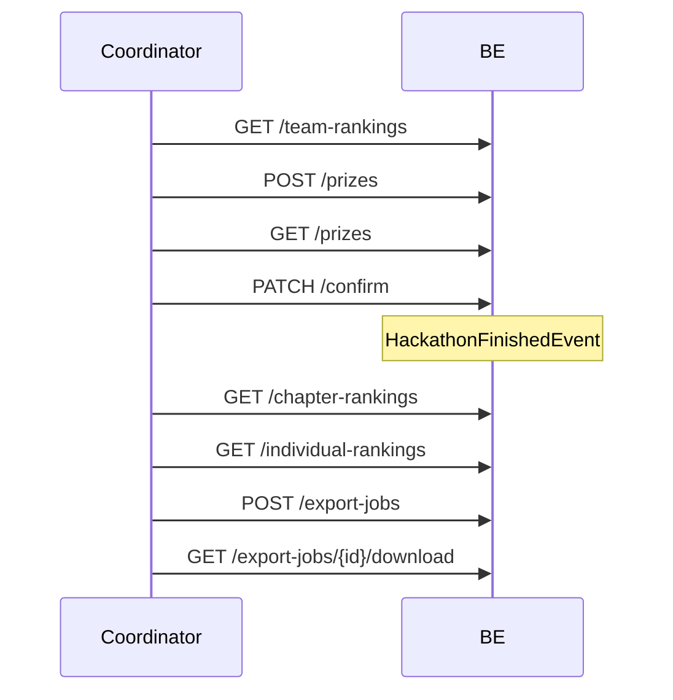

# Giai đoạn 6 (GĐ6) — Ma trận test đầy đủ & Seed dev

> **Mục đích:** Tài liệu QA / FE / BE cho **GĐ6 Đóng giải** — trao giải, confirm `FINISHED`, rankings, export CSV.  
> **Profile:** `dev` · **Password SV:** `Student@dev1` · **Coordinator:** `coord@fpt.edu.vn` / `Coordinator@dev1`  
> **Liên quan:** [gd5-full-test-matrix-and-seeds.md](gd5-full-test-matrix-and-seeds.md) · **Postman:** [gd6-e2e-seed-data.md](gd6-e2e-seed-data.md)

---

## Mục lục

1. [Phạm vi GĐ6 & điều kiện vào](#1-phạm-vi-gđ6--điều-kiện-vào)
2. [5 profile seed dev](#2-5-profile-seed-dev)
3. [Ma trận test theo chức năng (FR)](#3-ma-trận-test-theo-chức-năng-fr)
4. [Luồng end-to-end](#4-luồng-end-to-end)
5. [Business rules](#5-business-rules)
6. [Checklist smoke](#6-checklist-smoke)
7. [Phụ lục — Mã lỗi & warning](#7-phụ-lục--mã-lỗi--warning)

---

## 1. Phạm vi GĐ6 & điều kiện vào

### 1.1 GĐ6 bao gồm

| Hạng mục | Mô tả |
|----------|--------|
| **Team rankings (view)** | `GET /team-rankings` — tính live từ điểm CK, **không gate** hackathon status |
| **Trao giải** | `POST /prizes` khi `PENDING_CONFIRM` |
| **Thu hồi giải** | `DELETE /prizes/{id}` — không khi `FINISHED` |
| **Confirm đóng giải** | `PATCH /confirm` → `FINISHED` + event async |
| **Chapter rankings** | Persist sau `calculateAsync` (confirm/FINISHED); GET cần `PENDING_CONFIRM` hoặc `FINISHED` |
| **Individual rankings** | Cần `individual_ranking_enabled=true` **và** `FINISHED` |
| **Export CSV** | `POST /export-jobs` — chỉ `FINISHED` |
| **Readiness AWARDS** | `GET /readiness?target=AWARDS` |

### 1.2 Gate vào GĐ6 (từ GĐ5)

| Gate | Điều kiện |
|------|-----------|
| G-6.1 | `PATCH /rounds/{finalId}/lock-scoring` → `hackathon.status = PENDING_CONFIRM` |
| G-6.2 | Round CK `scoring_locked=true` |
| G-6.3 | Sơ loại đã `isPublished=true` |

---

## 2. 5 profile seed dev

Sau `mvn spring-boot:run` (profile `dev`), `DataInitializer` tạo **5 hackathon GĐ6** độc lập.

### Profile 0 — Pending confirm (happy path tương tác)

| | |
|--|--|
| **Slug** | `seal-gd6-pending-confirm` |
| **Seeder** | `Gd6PendingConfirmDataSeeder` |
| **Config** | `app.seed.gd6.enabled=true` |

| Thành phần | Giá trị |
|------------|---------|
| Hackathon | **`PENDING_CONFIRM`** |
| CK | active + **scoring_locked** |
| Đội | 3 đội ADVANCED, điểm CK final |
| Prizes | **FIRST** trên team 01 — thêm SECOND tay |

**Account:** `student.gd6.leader01@fpt.edu.vn` … `leader03@`

**Dùng khi:** Demo tay — thêm giải → confirm → `FINISHED`. Restart BE reset slug này về `PENDING_CONFIRM`.

---

### Profile A — Prizes empty

| | |
|--|--|
| **Slug** | `seal-gd6-prizes-empty` |
| **Seeder** | `Gd6PrizesEmptyDataSeeder` |
| **Config** | `app.seed.gd6.prizes-empty.enabled=true` |

`PENDING_CONFIRM`, CK locked, **0 prize** — test `PATCH /confirm` → `NO_PRIZES_RECORDED`, rồi `POST /prizes` + confirm.

**Account:** `student.gd6p.leader01@fpt.edu.vn` … `leader03@`

---

### Profile B — Confirm ready

| | |
|--|--|
| **Slug** | `seal-gd6-confirm-ready` |
| **Seeder** | `Gd6ConfirmReadyDataSeeder` |
| **Config** | `app.seed.gd6.confirm-ready.enabled=true` |

`PENDING_CONFIRM` + **FIRST + SECOND + THIRD** đã seed — một lần `PATCH /confirm` → `FINISHED`.

**Account:** `student.gd6r.leader01@fpt.edu.vn` … `leader03@`

---

### Profile C — Finished export

| | |
|--|--|
| **Slug** | `seal-gd6-finished-export` |
| **Seeder** | `Gd6FinishedExportDataSeeder` |
| **Config** | `app.seed.gd6.finished-export.enabled=true` |

| Thành phần | Giá trị |
|------------|---------|
| Hackathon | **`FINISHED`** |
| Prizes | 3 giải đầy đủ |
| Rankings | Chapter + Individual đã `calculateAsync` |

**Account:** `student.gd6f.leader01@fpt.edu.vn` … `leader03@`

**Dùng khi:** `POST /export-jobs`, `GET /chapter-rankings`, `GET /individual-rankings`, revoke/award bị chặn (`HACKATHON_ARCHIVED`).

---

### Profile D — Edge errors (confirm gate)

| | |
|--|--|
| **Slug** | `seal-gd6-edge-errors` |
| **Seeder** | `Gd6EdgeErrorsDataSeeder` |
| **Config** | `app.seed.gd6.edge-errors.enabled=true` |

`PENDING_CONFIRM` nhưng CK **`scoring_locked=false`** + có FIRST prize → `PATCH /confirm` → **`ROUND_NOT_SCORING_LOCKED`**.

**Account:** `student.gd6e.leader01@fpt.edu.vn` … `leader03@`

| Case khác | Slug / cách test |
|-----------|------------------|
| Trao giải khi `ONGOING` | `seal-gd5-final-active` → `HACKATHON_NOT_PENDING_CONFIRM` |
| Export khi chưa `FINISHED` | Profile A → `INVALID_STATE` |
| `PRIZE_DUPLICATE` | Profile 0 — POST trùng rank/team |

---

## 3. Ma trận test theo chức năng (FR)

### FR-31 / FR-33A — Team rankings

| # | Case | API | Kỳ vọng | Seed |
|---|------|-----|---------|------|
| R1 | XH team CK | `GET /hackathons/{id}/team-rankings` | 3 dòng, t1>t2>t3 | Profile 0, B |
| R2 | Khi `ONGOING` (chưa lock CK) | GET | **200** — có data nếu đã chấm CK | `seal-gd5-final-active` |
| R3 | Không có điểm CK | GET | **200** `[]` | Tay |

### FR-32 — Trao / thu hồi giải

| # | Case | API | Kỳ vọng | Seed |
|---|------|-----|---------|------|
| P1 | Trao FIRST | `POST /hackathons/{id}/prizes` | 201 | Profile A |
| P2 | Trao SECOND | POST team 02 | 201 | Profile 0 |
| P3 | Trùng rank | POST SECOND lại | 409 `PRIZE_DUPLICATE` | Sau P2 |
| P4 | Trùng team | POST cùng team | 409 `PRIZE_DUPLICATE` | Tay |
| P5 | List prizes | `GET /hackathons/{id}/prizes` | ≥1 item | Profile 0, C |
| P6 | List khi ONGOING | GET | 422 `INVALID_STATE` | GĐ5 |
| P7 | Trao khi ONGOING | POST | 422 `HACKATHON_NOT_PENDING_CONFIRM` | GĐ5 |
| P8 | Revoke | `DELETE /prizes/{id}` | 204 | Profile 0 |
| P9 | Revoke khi FINISHED | DELETE | 409 `HACKATHON_ARCHIVED` | Profile C |

**Body mẫu POST prize:**

```json
{
  "roundId": "{{finalRoundId}}",
  "teamId": "{{teamId}}",
  "prizeRank": "SECOND",
  "prizeName": "Giải Nhì",
  "prizeValue": "5000000"
}
```

### FR-33 — Confirm FINISHED

| # | Case | API | Kỳ vọng | Seed |
|---|------|-----|---------|------|
| C1 | Confirm happy | `PATCH /hackathons/{id}/confirm` `{ "confirm": true }` | `FINISHED` | Profile B |
| C2 | Chưa có prize | PATCH | 422 `NO_PRIZES_RECORDED` | Profile A |
| C3 | CK chưa lock | PATCH | 422 `ROUND_NOT_SCORING_LOCKED` | Profile D |
| C4 | Không PENDING_CONFIRM | PATCH | 422 `HACKATHON_NOT_PENDING_CONFIRM` | GĐ5 |
| C5 | `confirm: false` | PATCH | 422 `INVALID_STATE` | Tay |

### FR-33B — Chapter rankings

| # | Case | API | Kỳ vọng | Seed |
|---|------|-----|---------|------|
| CH1 | List chapter | `GET /hackathons/{id}/chapter-rankings` | ≥1 chapter | Profile C |
| CH2 | Trước `calculateAsync` | GET | **200** `[]` (chưa persist) | Profile B |
| CH3 | Khi `ONGOING` | GET | 422 `INVALID_STATE` | `seal-gd5-final-active` |

### FR-33C — Individual rankings

| # | Case | API | Kỳ vọng | Seed |
|---|------|-----|---------|------|
| I1 | List individual | `GET /hackathons/{id}/individual-rankings` | Rows SV | Profile C |
| I2 | Khi `PENDING_CONFIRM` | GET | 422 `INVALID_STATE` (chưa FINISHED) | Profile B |
| I3 | Cờ tắt | GET | 422 (message cờ individual) | Profile 0, A (`individual_ranking_enabled=false`) |

### FR-34 — Export

| # | Case | API | Kỳ vọng | Seed |
|---|------|-----|---------|------|
| E1 | Tạo export | `POST /export-jobs` `{ "type": "CSV_RANKINGS" }` | `DONE` | Profile C |
| E2 | Download | `GET /export-jobs/{id}/download` | CSV bytes | Sau E1 |
| E3 | Export chưa FINISHED | POST | 422 `INVALID_STATE` | Profile A |
| E4 | Download job chưa DONE | GET download | 422 `INVALID_STATE` (không dùng `EXPORT_JOB_NOT_READY`) | Tay |

### Readiness AWARDS

| # | Case | API | Seed |
|---|------|-----|------|
| A1 | Readiness | `GET /readiness?target=AWARDS` | Profile 0 (có event AWARDS) |

---

## 4. Luồng end-to-end



| Bước | Slug gợi ý |
|------|------------|
| Từ GĐ5 lock CK | `seal-gd5-final-active` → chuyển sang Profile 0 |
| Confirm một lần | `seal-gd6-confirm-ready` |
| Export / rankings | `seal-gd6-finished-export` |

---

## 5. Business rules

| Hành động | Điều kiện |
|-----------|-----------|
| `POST /prizes` | `PENDING_CONFIRM` |
| `PATCH /confirm` | `PENDING_CONFIRM` + CK locked + ≥1 prize |
| `GET /chapter-rankings` | `PENDING_CONFIRM` hoặc `FINISHED` |
| `GET /individual-rankings` | `FINISHED` + `individual_ranking_enabled` |
| `POST /export-jobs` | `FINISHED` |
| `DELETE /prizes` | Không `FINISHED` |

---

## 6. Checklist smoke

```bash
cd BE && mvn spring-boot:run -Dspring-boot.run.profiles=dev
```

### Profile 0 — `seal-gd6-pending-confirm`

```text
1. GET /hackathons/{id} → status=PENDING_CONFIRM
2. GET /team-rankings → 3 items
3. POST /prizes SECOND (team 02)
4. PATCH /confirm → FINISHED
5. Restart BE → slug reset PENDING_CONFIRM (repairForFullChainRetest)
```

### Profile A — `seal-gd6-prizes-empty`

```text
1. PATCH /confirm → 422 NO_PRIZES_RECORDED
2. POST /prizes FIRST
3. PATCH /confirm → FINISHED (hoặc dùng Profile B)
```

### Profile C — `seal-gd6-finished-export`

```text
1. GET /hackathons/{id} → FINISHED
2. GET /chapter-rankings → có data
3. POST /export-jobs type=CSV_RANKINGS → DONE
4. DELETE /prizes/{id} → 409 HACKATHON_ARCHIVED
```

### Tắt seed

```properties
app.seed.gd6.enabled=false
app.seed.gd6.prizes-empty.enabled=false
app.seed.gd6.confirm-ready.enabled=false
app.seed.gd6.finished-export.enabled=false
app.seed.gd6.edge-errors.enabled=false
```

---

## 7. Phụ lục — Mã lỗi & warning

### Error codes

| Mã | HTTP | Khi nào | Ma trận |
|----|------|---------|---------|
| `NO_PRIZES_RECORDED` | 422 | Confirm không có prize | C2 |
| `ROUND_NOT_SCORING_LOCKED` | 422 | Confirm CK chưa lock | C3 |
| `HACKATHON_NOT_PENDING_CONFIRM` | 422 | Prize/confirm sai status | P7, C4 |
| `HACKATHON_ARCHIVED` | 409 | Prize/revoke khi FINISHED | P9 |
| `PRIZE_DUPLICATE` | 409 | Trùng team hoặc rank | P3, P4 |
| `INVALID_STATE` | 422 | Export chưa FINISHED; confirm=false; individual/chapter sai status | E3, C5, I2, CH3 |
| `CROSS_HACKATHON_VIOLATION` | 422 | Team/round sai hackathon | Tay |

### Mã khai báo chưa dùng trong service

| Mã | Ghi chú |
|----|---------|
| `EXPORT_JOB_NOT_READY` | Download dùng `INVALID_STATE`; create sync → `DONE` ngay |
| `TEAM_NOT_ADVANCING` | Chỉ trong `ErrorCode.java` |
| `ELIMINATION_REASON_REQUIRED` | Chỉ trong `ErrorCode.java` |
| `DEPT_HEAD_NOT_CONFIRMED` | Chỉ trong `ErrorCode.java` |

### API surface

| Method | Path |
|--------|------|
| GET | `/api/v1/hackathons/{id}/team-rankings` |
| POST | `/api/v1/hackathons/{id}/prizes` |
| GET | `/api/v1/hackathons/{id}/prizes` |
| DELETE | `/api/v1/prizes/{id}` |
| PATCH | `/api/v1/hackathons/{id}/confirm` |
| GET | `/api/v1/hackathons/{id}/chapter-rankings` |
| GET | `/api/v1/hackathons/{id}/individual-rankings` |
| POST | `/api/v1/hackathons/{id}/export-jobs` |
| GET | `/api/v1/export-jobs/{id}` |
| GET | `/api/v1/export-jobs/{id}/download` |
| GET | `/api/v1/hackathons/{id}/readiness?target=AWARDS` |

---

## Phụ lục — Map tài liệu

| Tài liệu | Nội dung |
|----------|----------|
| [gd6-e2e-seed-data.md](gd6-e2e-seed-data.md) | Postman variables |
| [gd5-full-test-matrix-and-seeds.md](gd5-full-test-matrix-and-seeds.md) | GĐ5 → PENDING_CONFIRM |
| [fe-checklist-gd2-gd4-gd5-gd6.md](fe-checklist-gd2-gd4-gd5-gd6.md) | Checklist FE |

*Cập nhật: 2026-06 — 5 profile seed GĐ6; doc đồng bộ gate team/chapter/individual rankings với BE.*
