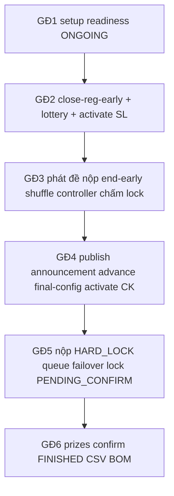

# Playbook Kiểm Thử Giao Diện GĐ1 - GĐ6 (Manual UI Test)

> **Mục đích:** hướng dẫn tester click-by-click trên FE thật, kèm expect UI / ErrorCode / seed đúng code.  
> **Cập nhật lần cuối:** **2026-07-21 (UX coordinator + nhân bản + trao giải + Q&A)** — 🟢 **Năm form tạo/nhân bản editable** (Fall 2026 → Spring 2027). 🟢 **Clone** không copy lịch vòng (`examAt`/`submissionOpen`/`submissionDeadline` = null) → vòng Bản nháp, **Sửa** được trên DRAFT. 🟢 **Trao giải:** modal hiện BXH CK (hạng·tên·điểm); chỉ đội vào Chung kết; BE `PRIZE_TEAM_NOT_FINALIST`. 🟢 **Quay lại** tường minh trên Đóng giải / Chuyển vòng / Final-config standalone / Late submissions / Queue (`?from=`). 🟢 **Post-lock** ẩn «Xếp hạng tạm» trùng `/results`; stepper GĐ4 bước «BXH chính thức». 🟢 **Cảnh báo Q&A = 1/3 thời gian còn lại** (không cố định 3 phút). 🟢 Lists admin **pageSize 10** + sort sớm→trễ; chữ dài → Tooltip; button coord `borderRadius` + `coord-page`. Chi tiết §0.4c + các mục GĐ1/3/4/6 bên dưới.  
> **Cập nhật trước:** **2026-07-19 (chiều — Full System Deep Test 3 làn + Zero-skip E2E)** — 🟢 Full pyramid L0–L6 / Zero-skip E2E / report deep-audit. Xem changelog dài ở phiên 19/07 trong [session-changelog](session-changelog-2026-07-15-16.md).  
> **Cập nhật trước:** **2026-07-19 (sáng — Global Event Scope + RBL Thesis Alignment)** — Global event selector; Coordinator Overview = action-center; RBL calibration cô lập.  
> **Cập nhật trước:** **2026-07-18 (Session — Audit Remediation)** — bỏ Vé vớt / HEAD; Personnel Guard.  
> **Trước đó (17/07):** early-wait Phát đề; Events không PRESENTATION; timer TT/Q&A theo Round.  
> **Changelog phiên:** [session-changelog-2026-07-15-16.md](session-changelog-2026-07-15-16.md) (15–17/07, gồm tối enterprise).  
> **Enterprise TC matrix:** [enterprise-regression-matrix-gd1-gd6.md](../../../docs/testing/enterprise-regression-matrix-gd1-gd6.md).  
> **Không phải tóm tắt:** mỗi happy path (đặc biệt **§3.3 / §5.3 / §6.3 / §7A**) ghi đủ nhãn nút/tab/toast/ErrorCode như trên FE.  
> **API catalog / Postman:** [full-workflow-api-test-gd1-gd6.md](full-workflow-api-test-gd1-gd6.md).  
> **Slug SSOT (9 happy):** [dev-seed-slugs-guide.md](dev-seed-slugs-guide.md), [master-slug-test-matrix.md](master-slug-test-matrix.md).  
> **Negative / gate (tái tạo tay):** [intentional-errors-catalog.md](intentional-errors-catalog.md).  
> **Gate matrix:** [gate-regression-test-matrix-gd1-gd6.md](gate-regression-test-matrix-gd1-gd6.md).  
> **Checklist lifecycle mới:** xem **Chương L** (cuối phần chính trước §7) + phiếu **Phiếu Lifecycle sync** ở Phụ lục B.  
> **Chương C (Calibration):** calibration **cũ ĐÃ GỠ/ARCHIVED**; flow **MỚI** là **RBL calibration cô lập** (`rbl_calibration_`*, banner **CHẤM THỬ**) — phân biệt rõ ở mục C bên dưới + §RBL.

---


## 0. Chuẩn bị


### 0.0 Hướng dẫn đọc Playbook (Tester / Non-IT)

Để test đúng, đọc từng bước theo cấu trúc:

- **Người thực hiện:** Ai đang đăng nhập (Coordinator, Student, Judge).
- **Đường dẫn:** URL / tab cần mở (vd `/hackathons`).
- **Thao tác:** Nhấn nút nào, chữ gì trên màn hình.
- **Kết quả kỳ vọng (Thấy gì):** Hệ thống phản hồi thế nào là đúng.

> **Lưu ý:** Nếu "Kết quả kỳ vọng" khác thực tế, chụp màn hình kèm mã lỗi (ErrorCode) gửi group bug. Không cần hiểu logic code.


### 0.1 Start BE

1. Mở terminal PowerShell.
2. `cd d:\FPT\SU26\SWP\ManageSealHackathon\BE`
3. Chạy:
  ```powershell
   .\mvnw.cmd spring-boot:run "-Dspring-boot.run.profiles=dev"
  ```
4. Đợi log seed xong, ví dụ:
  - `[DataInitializer] Dev seed sẵn sàng — 9 happy slugs: …`
5. Xác nhận BE lắng nghe: `http://localhost:8080` (API base thường là `http://localhost:8080/api/v1`).


### 0.2 Start FE

1. Terminal thứ hai:
  ```powershell
   cd d:\FPT\SU26\SWP\ManageSealHackathon\seal-hackathon-fe
   npm run dev
  ```
2. Mở trình duyệt: `http://localhost:5173`
3. Nếu FE báo mất kết nối API: kiểm tra `VITE_*` / proxy trỏ về `8080`.

**Playwright trên Windows (E2E):** nếu báo thiếu browser, cài `npx playwright install` rồi set trước khi chạy test:

```powershell
$env:PLAYWRIGHT_BROWSERS_PATH = "C:\Users\ASUS\AppData\Local\ms-playwright"
```

Đợi log seed BE xong (`Dev seed sẵn sàng — 9 happy slugs`) trước `npm run probe:seeds`.

### 0.3 Tài khoản dev (mật khẩu theo role)


| Role                            | Email gợi ý                                      | Password           |
| ------------------------------- | ------------------------------------------------ | ------------------ |
| SUPERADMIN (unlock chấm)        | `superadmin@fpt.edu.vn`                          | `SuperAdmin@dev1`  |
| Coordinator                     | `coord@fpt.edu.vn`                               | `Coordinator@dev1` |
| Student (chung)                 | các `student.*@fpt.edu.vn` theo seed             | `Student@dev1`     |
| Student GĐ3 leader (demo nộp)   | `student.gd3.leader06@fpt.edu.vn`                | `Student@dev1`     |
| Student GĐ5                     | `student.gd5.leader01@fpt.edu.vn`                | `Student@dev1`     |
| Judge                           | `judge1@fpt.edu.vn`                              | `Judge@dev1`       |
| Guest judge (seed đã kích hoạt) | `guestjudge@gmail.com` / `guestjudge2@gmail.com` | `GuestJudge@dev1`  |
| Mentor                          | `mentor@fpt.edu.vn`                              | `Mentor@dev1`      |


> **Guest judge login archive (2026-07-14):** tài khoản EXTERNAL temp bị `401 TEMP_JUDGE_HACKATHON_ENDED` chỉ khi **mọi** hackathon gắn assignment/invitation đã kết thúc. Có assignment trên kỳ **ONGOING** (vd `seal-gd5-final-active`) → vẫn login được dù archive `seal-fall-2025-finished` còn trong danh sách.
>
> **Guest judge onboard (2026-07-17):** mời mới → user `PENDING` + `mustChangePassword=true` (UI: **Chờ đổi mật khẩu**, **không** «Đã duyệt» ngay). Login bằng MK tạm trong email (ngoại lệ Auth) → **đổi mật khẩu bắt buộc** → `APPROVED`. Lời mời hết hạn **72h** → badge **Lời mời hết hạn** + Resend (**MK tạm mới**). Email gửi fail → **Email chưa gửi** + Resend ngay. Chỉ guest `APPROVED` mới vào pool gán Chung kết. Seed `guestjudge@gmail.com` đã activate sẵn — không cần đổi MK lại.

**Cách login FE (mọi giai đoạn):**

1. Vào trang login.
2. Nhập email + password tương ứng bảng trên.
3. Đăng nhập → vào đúng portal theo role (Coordinator / Student / Judge).


### 0.4 Bảng URL FE → chốt nghiệp vụ


| Việc                                | URL / tab / nhãn                                                                                                                                                                                                                                                                                                                                                       |
| ----------------------------------- | ---------------------------------------------------------------------------------------------------------------------------------------------------------------------------------------------------------------------------------------------------------------------------------------------------------------------------------------------------------------------- |
| Danh sách hackathon                 | `/hackathons` — nút **Tạo sự kiện**                                                                                                                                                                                                                                                                                                                                    |
| Setup wizard                        | `/hackathons/{id}/setup?tab=...`                                                                                                                                                                                                                                                                                                                                       |
| Tab setup (đúng label FE)           | **Cấu hình chung**, **Vòng thi**, **Bảng đấu**, **Bốc thăm & khai mạc**, **Tiêu chí đánh giá**, **Nhân sự**, **Lịch trình & Sự kiện**, **Phân tích & Dữ liệu**, **Cấu hình Chung kết** — **không** còn tab **Đánh giá & Kiểm tra** (17/07)                                                                                                                             |
| Kích hoạt hackathon (DRAFT→ONGOING) | Header setup: nút **Xác nhận Kích hoạt** (góc phải). Chưa đủ điều kiện → nút disabled + icon ℹ️ / tooltip liệt kê blockers. Đủ → nút sáng → click → ONGOING                                                                                                                                                                                                            |
| Quản lý đội                         | `/teams` hoặc `/teams?hackathonId={id}` — tab/nhãn **Duyệt đội**, nút **Duyệt**                                                                                                                                                                                                                                                                                        |
| Final config (dual entry)           | `/coordinator/final-config?hackathonId={id}` **hoặc** `setup?tab=final-config` (**Cấu hình Chung kết**)                                                                                                                                                                                                                                                                |
| Nộp bài SV                          | `/student/submit` — tiêu đề **Đề thi & Nộp bài dự thi**; tab **Sơ loại** | **Chung kết**                                                                                                                                                                                                                                                                               |
| Hàng đợi thuyết trình               | `/presentation/queue?roundId={id}` — **Điều phối lịch trình thuyết trình**, **Khởi Động Máy Quay Số** (chỉ bật sau hết hạn / end-early; **disabled** nếu còn LATE_PENDING), panel readiness, **Phân quyền điều phối đồng hồ thời gian** (**Chuyển quyền** TRANSFER — **không** còn Takeover tạm), skip no-show. Mentor vào không `roundId` → empty-state «Chọn vòng».  |
| Kết quả Sơ loại (GĐ4)               | `/hackathons/{id}/rounds/{roundId}/results` — **Công bố kết quả**, **Chốt chuyển vòng**; tabs: **Kết quả** / **Danh sách Chung kết & Bị loại** / **Kiểm tra chấm** / **Đồng điểm** (**KHÔNG** còn tab **Vé vớt** — advance = **Top-N mỗi bảng**); stepper 6 bước: **Khóa chấm** → **Xem trước xếp hạng** → **Đồng điểm** → **Công bố** → **Chốt CK** → **Cấu hình CK** |
| Kết quả / giải GĐ6                  | `/hackathons/{id}/results` — nút **Quay lại Cấu hình sự kiện**; **Trao giải mới** (modal BXH CK); **Chốt sổ & Công bố kết quả**; **Xuất CSV**                                                                                                                                                                                                                          |
| Chuyển vòng & công bố (GĐ4)         | `/hackathons/{id}/rounds/{prelimId}/results` — nút **Quay lại Cấu hình sự kiện**; post-lock không còn lối «Xếp hạng tạm» trùng                                                                                                                                                                                                                                         |
| Cấu hình CK (standalone)            | `/coordinator/final-config?hackathonId=` — **Quay lại** về `setup?tab=final-config` (embedded trong Setup **không** thêm Back riêng)                                                                                                                                                                                                                                   |
| Hàng đợi thuyết trình               | `/presentation/queue?roundId=&from=final-config` — Quay lại theo `from=` / setup rounds                                                                                                                                                                                                                                                                                |
| SV xem kết quả                      | `/student/results` — banner lifecycle + CTA                                                                                                                                                                                                                                                                                                                            |
| SV không gian đội / STT             | Tab đội / queue — **STT thuyết trình**, **Mã số đội** (chuẩn bị trước giờ thuyết trình)                                                                                                                                                                                                                                                                                |
| Coord đội vào CK                    | GĐ5 — danh sách **Các đội vào Chung kết**                                                                                                                                                                                                                                                                                                                              |
| Coord điểm thành phần               | GĐ5 — xem **Điểm thành phần** từng giám khảo                                                                                                                                                                                                                                                                                                                           |
| ~~Vé vớt~~                          | **ĐÃ BỎ (18/07)** — advance CK chỉ theo **Top-N mỗi bảng** (`round.topNAdvance`); tab Wildcard gỡ khỏi UI, API `wildcard-candidates` trả rỗng                                                                                                                                                                                                                          |
| Announcements (SV feed)             | API `GET /api/v1/hackathons/{id}/announcements` + WS `/topic/hackathons/{id}/announcements` (sau **Công bố kết quả** / Chốt sổ GĐ6) — student toast không cần F5                                                                                                                                                                                                       |
| Unlock chấm                         | Chỉ **SUPERADMIN**. Login `superadmin@fpt.edu.vn` → Round Management, vòng đã khóa → nút **Mở lại khóa chấm** (modal lý do bắt buộc → `PATCH …/unlock-scoring` + audit). Coord **không** thấy nút; gọi API trực tiếp → 403                                                                                                                                             |
| Ma trận nút theo gate               | Xem [gate-button-matrix-gd2-gd6.md](gate-button-matrix-gd2-gd6.md) — "nút nào hiện lúc nào" (GĐ2–GĐ6), tách SL/CK                                                                                                                                                                                                                                                      |
| Audit RO (Coord)                    | `GET /api/v1/audit-logs?hackathonId=` — chỉ Coord của hackathon mình                                                                                                                                                                                                                                                                                                   |
| Judge                               | `/judge/dashboard` — **Vào phòng chấm thi** → **HOÀN TẤT & CHỐT SỔ ĐIỂM**; banner *Chấm tuyệt đối theo rubric*; heartbeat 30s; mất nút điều khiển ngay khi nhận `CONTROLLER_CHANGED`                                                                                                                                                                                   |
| Mentor rounds                       | `/mentor/rounds` — **Vòng thi đang phụ trách**, **Chi tiết vòng thi →**                                                                                                                                                                                                                                                                                                |
| Mentor support                      | `/mentor/support?roundId=` — **Nhóm đội hỗ trợ**, **Xem bài nộp →**, tabs **Bài nộp** / **Điểm**                                                                                                                                                                                                                                                                       |
| Mentor history                      | `/mentor/history` — **Lịch sử mentor**                                                                                                                                                                                                                                                                                                                                 |
| Duyệt nộp muộn                      | `/coordinator/late-submissions?roundId={id}` (deep-link kèm `trackId` khi có)                                                                                                                                                                                                                                                                                          |
| Radar & giải cứu đội                | `/teams?hackathonId={id}` — panel **Radar & Giải cứu đội thi**: orphan + đội **thiếu/thừa** người (min–max động); **không** tự chuyển ACTIVE                                                                                                                                                                                                                           |
| Student Events                      | `/student/events` — **chỉ đọc** lịch sự kiện (GET); Coord giữ quyền ghi                                                                                                                                                                                                                                                                                                |
| Onboarding thẻ SV                   | Upload qua **BE sign** — FE **không** chứa Cloudinary API secret (`npm run test:sec:cloudinary`)                                                                                                                                                                                                                                                                       |


### 0.4b Global event context / Overview (bối cảnh sự kiện điều phối)

> **Mục tiêu:** đảm bảo Coordinator **luôn biết đang thao tác trên sự kiện nào** — không còn tình trạng mỗi trang chọn kỳ một kiểu.

**SSOT bối cảnh:** `HackathonScopeProvider` (`src/features/hackathons/context/HackathonScopeContext.jsx`). Ưu tiên chọn kỳ: **URL** `:hackathonId` **/** `:id` **→** `?hackathonId=` **→ localStorage** `seal-last-hackathon-id`. Đổi kỳ **chỉ ở bộ chọn Sự kiện trên header điều phối** (không mỗi trang một dropdown).


| Người thực hiện | Thao tác                                                                                                           | Kết quả kỳ vọng (Thấy gì)                                                                                                                                                          |
| --------------- | ------------------------------------------------------------------------------------------------------------------ | ---------------------------------------------------------------------------------------------------------------------------------------------------------------------------------- |
| Coordinator     | Login → mở bất kỳ trang cấu hình (`/hackathons/{id}/setup`, `/coordinator/final-config`, analytics, action-center) | **Banner** `EventContextBanner` trên đầu trang: «**Sự kiện: {tên}**» + tag trạng thái (Bản nháp / Đang diễn ra / Chờ chốt sổ / Đã kết thúc). `data-testid="event-context-banner"`. |
| Coordinator     | Đổi kỳ ở bộ chọn Sự kiện trên **header**                                                                           | Mọi trang cấu hình cập nhật theo kỳ mới; **Cấu hình Chung kết KHÔNG** còn dropdown chọn kỳ riêng (trước đây lệch pha).                                                             |
| Coordinator     | Chưa chọn kỳ nào                                                                                                   | Banner cảnh báo vàng «**Chưa chọn sự kiện**» + hướng dẫn dùng bộ chọn header (không crash, không trang trắng).                                                                     |
| Coordinator     | Mở **Overview** (trang chủ điều phối)                                                                              | = **action-center** (`CoordinatorActionCenter`): danh sách việc-cần-làm **theo đúng sự kiện đang chọn** (không trộn kỳ khác).                                                      |
| Mentor          | Login → Overview                                                                                                   | **Overview riêng của Mentor** (không dùng chung dashboard Coordinator).                                                                                                            |


**ID kiểm nhanh:** `UX-CTX-01` — mở ≥3 trang cấu hình khác nhau trên cùng 1 kỳ → cả 3 hiển thị **cùng** tên + trạng thái sự kiện trên `EventContextBanner`; đổi kỳ trên header → cả 3 đồng bộ.

### 0.4c UX / nhân bản / trao giải / Q&A (2026-07-21)


| Chủ đề                      | Expect UI / BE                                                                                                                                                                                                                                                                                                                   |
| --------------------------- | -------------------------------------------------------------------------------------------------------------------------------------------------------------------------------------------------------------------------------------------------------------------------------------------------------------------------------- |
| **Nhân bản sự kiện**        | Card → **Nhân bản** → form clone: **Năm editable** (Select ≥2024); đổi mùa+năm (vd Fall 2026 → Spring 2027) + slug mới. BE `POST …/clone` copy rounds/tracks/criteria nhưng **không** copy lịch (`examAt`/`submissionOpen`/`submissionDeadline` = null). Vòng trên bản DRAFT = **Bản nháp** + nút **Sửa** (không «Đã kết thúc»). |
| **Lists admin**             | Table/List coordinator: **tối đa 10 item/trang** (riêng **Cấu hình sự kiện** card grid: **9**/trang = 3×3, **mới nhất lên đầu**); list theo thời gian ASC sớm→trễ trừ danh sách sự kiện (DESC). Ranking theo điểm giữ thứ tự hạng, chỉ thêm pageSize 10.                                                                         |
| **Chữ dài**                 | Alert/subtitle dài rút ngắn trên trang; chi tiết đầy đủ trong **Tooltip** (hover). Không xóa nghiệp vụ.                                                                                                                                                                                                                          |
| **Button coord**            | Trang Results / PrelimResults bọc `coord-page`; secondary «Làm mới» / «Xuất CSV» bo góc (`whiteButtonStyle`); `borderRadius` ~10.                                                                                                                                                                                                |
| **Quay lại**                | Deep-link ops: luôn có **Quay lại Cấu hình sự kiện** (URL tường minh, không chỉ `history.back`).                                                                                                                                                                                                                                 |
| **Xếp hạng tạm vs Công bố** | **Trước khóa chấm:** BarChart → `/ranking-preview` («BXH tạm»). **Sau khóa:** chỉ Trophy → `/results` («Công bố & chuyển vòng»); stepper bước «BXH chính thức» (không mở lại preview).                                                                                                                                           |
| **Trao giải**               | Modal: bảng BXH CK phía trên; option `#rank · tên · điểm`; chỉ đội có TRP CK. Đội rớt SL **không** trong list. API reject → `PRIZE_TEAM_NOT_FINALIST`. Nút chỉ hiện khi `PENDING_CONFIRM`.                                                                                                                                       |
| **Cảnh báo Q&A**            | Khi còn **≤ 1/3** thời lượng Q&A đã cấu hình (1p→~~20s, 2p→~~40s, 3p→~60s) — Alert GK chưa chốt. Không còn ngưỡng cố định 180s.                                                                                                                                                                                                  |
| **Guest judge seed**        | Active guests: `guestjudge@` + `guestjudge2@` (**2** người). Không còn seed `guestjudge3`.                                                                                                                                                                                                                                       |


### 0.5 Hai chế độ test (bắt buộc chọn trước khi chạy)


| Mode               | Khi nào dùng                          | Cách làm                                                                                                                |
| ------------------ | ------------------------------------- | ----------------------------------------------------------------------------------------------------------------------- |
| **A — Snapshot**   | Kiểm happy từng giai đoạn trên 1 slug | Mở đúng slug trong `/hackathons` (bảng §0.6). Gate/lỗi: [intentional-errors-catalog.md](intentional-errors-catalog.md). |
| **B — Continuous** | Đi full 6 giai đoạn trên một kỳ       | Tiếp tục `seal-e2e-2026` hoặc **Tạo sự kiện** mới → GĐ1→GĐ6.                                                            |


**Mode A — dùng** `seal-e2e-2026`**:** nếu chỉ verify setup đã seed, **bỏ qua tạo sự kiện**; login Coord → `/hackathons` → mở `seal-e2e-2026` → **Thiết lập** → lần lượt kiểm các tab setup.

**Mode B — continuous từ Tạo sự kiện:** làm đủ happy GĐ1 (mục 1.3) rồi nối GĐ2→GĐ6 trên cùng hackathon vừa tạo (hoặc `seal-e2e-2026` nếu seed đã ONGOING và còn tiến tiếp được). Chi tiết E2E Playwright (khác chuỗi tay) xem **§7A**.

### 0.6 Newbie: chọn sự kiện & đọc timeline


#### Muốn test giai đoạn nào thì dùng sự kiện nấy


| Mục tiêu                      | Slug                                                            | Luồng UI ngắn                                                                                               |
| ----------------------------- | --------------------------------------------------------------- | ----------------------------------------------------------------------------------------------------------- |
| Setup & **GĐ1** (ĐK mở)       | `seal-e2e-2026`                                                 | Verify setup / readiness — **không** lottery/activate nếu chỉ test GĐ1                                      |
| **GĐ2** (đóng ĐK / chia bảng) | `seal-e2e-2026`                                                 | **Cùng slug** nhưng suite khác: `/teams?hackathonId=` → close-reg → lottery → activate SL                   |
| Sơ loại GĐ3                   | `seal-gd3-prelim-open`                                          | Nộp nốt → đóng cổng → readiness labels → shuffle (sau close) → controller + chấm → khóa (+ optional unlock) |
| Chuyển tiếp GĐ4               | `seal-gd4-advance-ready`                                        | Publish (+ announcement WS) → (Đồng điểm nếu có) → Advance **Top-N** (`canAdvance`) → Activate CK           |
| Chung kết GĐ5                 | `seal-gd5-final-active`                                         | Submit CK → đóng → HARD_LOCK queue → guest chấm + failover → khóa                                           |
| Trao giải GĐ6                 | `seal-gd6-pending-confirm`                                      | ≥1 giải → Confirm → FINISHED → CSV BOM+DQ + BXH cơ sở                                                       |
| Archive complete              | `seal-fall-2025-finished`                                       | Xem kết quả / export (read-only)                                                                            |
| GĐ4 Tiebreak demo             | `seal-gd4-tiebreak-submission-time`, `seal-gd4-tiebreak-manual` | QC **Đồng điểm** (Tiebreak) tại biên Top-N — reorder trước khi Chốt chuyển vòng                             |
| ~~GĐ4 Wildcard demo~~         | `seal-gd4-wildcard-gap`                                         | **Vé vớt đã bỏ (18/07)** — slug này giờ chỉ còn ý nghĩa Top-N; tab Vé vớt không hiện                        |


**Negative / gate:** không còn seed riêng (~47 slug deprecated) — tái tạo tay theo [intentional-errors-catalog.md](intentional-errors-catalog.md) trên **9 happy slug** (`DevSeedCatalog.ALL_DEV_HACKATHON_SLUGS`).

#### Timeline / create-drop (Quan trọng)

Khi chạy profile `dev` với `ddl-auto=create-drop`, mỗi lần start BE hệ thống sẽ seed lại data.

- **Seeder repair lịch theo** `LocalDate.now()`**:** Ví dụ ở `seal-e2e-2026`, đăng ký còn mở ~~14 ngày;~~ `eventStart` ~~=~~ `regEnd + 3` ~~ngày (đủ chỗ WORKSHOP + KICKOFF trong gap); CK có~~ `codingDurationHours=2`~~,~~ `examAt` ~~~18:00, mở nộp = examAt + 2/3 duration (~~19:20), hạn nộp = examAt + 2h. PDF đề (`HistAR_CP3Part2_EXE101.pdf`) seed sẵn trên mọi track Sơ loại + vòng CK. (Chi tiết: `E2eWorkflowDataSeeder.repairForGd2Testing` + `RoundScheduleSeedUtil` + `SeedProblemPdf`).
- **Newbie rule:** Tuyệt đối **không hard-code** ngày cũ từ phiếu test trước. Sau restart, mở tab **Lịch trình & Sự kiện** / **Cấu hình chung** trên UI và tin ngày seed (đăng ký còn mở nếu test GĐ2 happy). Checklist readiness không còn `EVENT_OUT_OF_HACKATHON` trên KICKOFF/WORKSHOP.

**Liên kết SSOT:**

- [dev-seed-guide.md](dev-seed-guide.md) (bảng orphan).
- [master-slug-test-matrix.md](master-slug-test-matrix.md).


### 0.7 Quy ước ghi chép khi test

- Ghi **slug**, **hackathonId**, **roundId** (Sơ loại / Chung kết) vào phiếu test.
- Mọi modal danger phải chụp / ghi đúng chữ đỏ irreversible nếu playbook yêu cầu.
- Mutating (end-early, lock scoring, confirm GĐ6) **làm sau** các kiểm non-mutating; sau mutating **restart BE** để seed sạch (xem mục 8).

**Template báo cáo audit — 8 cột (bắt buộc dùng khi ghi kết quả deep-audit):**


| # ID      | Kịch bản | Người thực hiện | Bước / Thao tác | Kết quả kỳ vọng | Kết quả thực tế | Pass/Fail | Ghi chú (ErrorCode / screenshot) |
| --------- | -------- | --------------- | --------------- | --------------- | --------------- | --------- | -------------------------------- |
| UX-CTX-01 | …        | Coordinator     | …               | …               | …               | ✅/❌       | …                                |


> Dùng đúng **8 cột** trên cho mọi nhóm ID deep-audit (`UX-CTX-01`, `BC1-6`, `IDOR-`*, `VALID-*`, `THESIS-RBL-*`, `RBL-BAD-*`, `RQ-SMOKE`). Cột **# ID** khớp acceptance ID (xem §RBL / §P / §0.4b).

---


## M. Mentor Portal (cross-cutting — Mode A)


### M.1 Mục đích

Verify mentor xem vòng / đội được gán, drawer bài nộp & điểm (chỉ sau `scoringLocked`), track-only bootstrap, và chặn IDOR / conflict mentor=judge.

### M.2 Điều kiện đầu


| Mục               | Giá trị                                                                                                                |
| ----------------- | ---------------------------------------------------------------------------------------------------------------------- |
| Seed happy        | `seal-gd3-prelim-open` (mentor đã gán mọi đội)                                                                         |
| Negative conflict | Tái tạo tay — [intentional-errors-catalog.md](intentional-errors-catalog.md) `MENTOR_JUDGE_CONFLICT`                   |
| Accounts          | `mentor@fpt.edu.vn` / `Mentor@dev1`; `mentor.trackonly@fpt.edu.vn` / `Mentor@dev1`; `judge1@fpt.edu.vn` / `Judge@dev1` |
| BE+FE             | đã start (§0)                                                                                                          |


### M.3 Happy path (click-by-click) — `seal-gd3-mentor-portal`

1. Login **Mentor** `mentor@fpt.edu.vn`.
2. Goto `/mentor/rounds`.
3. Expect heading/text **Vòng thi đang phụ trách**; thấy badge/card vòng Sơ loại.
4. Click **Chi tiết vòng thi →**.
5. Land `/mentor/support?roundId=*`.
6. Expect **Nhóm đội hỗ trợ**; thấy đội `GD3-MP-T01`, `GD3-MP-T02`.
7. Click **Làm mới** — danh sách refetch, không toast lỗi.
8. Click **Xem bài nộp →** trên một đội.
9. Drawer mở với tabs **Bài nộp** | **Điểm**.
10. Tab **Bài nộp**: list hoặc empty state (không crash).
11. Tab **Điểm**: nếu prelim chưa lock → **Chưa có điểm (có thể chưa khóa chấm).**
12. Panel **Phân công đội (FR-M-06)** visible trên support.
13. Goto `/mentor/history` → heading **Lịch sử mentor**; đổi year select (nếu có) → không 5xx.


### M.4 Bad / edge


| Seed / bước                                                                               | Expect                                                                                        |
| ----------------------------------------------------------------------------------------- | --------------------------------------------------------------------------------------------- |
| `seal-gd3-mentor-track-only` → `/mentor/rounds`                                           | Card **Bạn đã được gán track chuyên môn**; **không** liệt kê đội MP                           |
| Student token `GET /me/mentor/rounds`                                                     | **403**                                                                                       |
| Mentor `GET /me/mentor/teams/{teamIdPrelimOpen}/submissions` (đội `seal-gd3-prelim-open`) | **403** `FORBIDDEN`                                                                           |
| `seal-gd3-judge-mentor-conflict`: `judge1` `POST /scores` trên track conflict             | **409** `CONFLICT_MENTOR_JUDGE_SAME_TRACK`                                                    |
| `POST /scores/calibration`                                                                | **ĐÃ GỠ** — không còn endpoint calibration; conflict mentor↔judge vẫn kiểm qua `POST /scores` |


### M.5 API then chốt


| API                                                              | Chốt                               |
| ---------------------------------------------------------------- | ---------------------------------- |
| `GET /me/mentor/rounds`                                          | Mentor thấy rounds có team assign  |
| `GET /me/mentor/teams/{id}/scores?roundId=` khi `!scoringLocked` | `ROUND_NOT_SCORING_LOCKED`         |
| `POST /scores` conflict seed                                     | `CONFLICT_MENTOR_JUDGE_SAME_TRACK` |


### M.6 Đường tắt

```powershell
cd seal-hackathon-fe
$env:E2E_MUTATING=1
# Windows ExecutionPolicy: dùng npx.cmd nếu `npx` bị chặn
npx.cmd playwright test e2e/mentor-portal-mutating.spec.js --project=mutating-e2e --workers=1
```

Restart BE sau suite.

---


## C. Calibration — phân biệt CŨ (ARCHIVED) vs MỚI (RBL cô lập)

> **⚠ Đọc kỹ để không nhầm 2 khái niệm cùng tên «Calibration».**

**C.a — Calibration CŨ (ĐÃ GỠ / ARCHIVED, 2026-07-17 tối):** panel «Phiên Calibration», API `/calibration-sessions`, `POST /scores/calibration`, spec `calibration-gd5-mutating.spec.js`, `npm run test:unit:calib`, và seed slug `seal-gd5-calibration-timer` / `seal-gd3-calibration-timer` **đã loại khỏi vận hành** — **không** test nữa.

- **Thay thế giám sát công bằng luồng chính thức:** **Điểm thành phần** (`ScoreBreakdownDrawer`) trước Lock — highlight ô lệch > 2.0 so với TB các GK khác (tín hiệu thiên vị, không phải kết luận).
- **Regression check (**`CALIB-01`**):** Judge Dashboard / Official Ranking / People rules **không** còn label «Phiên Calibration» / «Chấm chéo» / «Điểm CALIBRATION» của luồng cũ.

**C.b — Calibration MỚI (RBL cô lập — flow** `rbl_calibration_`***):** đây là bước **chấm thử để đo độ nhất quán rubric (IRR)**, **HOÀN TOÀN TÁCH** khỏi kết quả chính thức.

- Panel: `JudgeCalibrationPanel` — banner đỏ/cam **«CHẤM THỬ — BÀI MẪU, không tính vào kết quả chính thức»**.
- Dữ liệu nằm ở bảng/flow riêng `rbl_calibration_*` (không ghi vào điểm chính thức của đội) → an toàn chạy song song vòng thật.
- Kiểm ở §RBL (ID `RBL-CALIB-01`, `THESIS-RBL-*`).

**Vẫn còn kiểm chung:** conflict mentor=judge cùng bảng → `CONFLICT_MENTOR_JUDGE_SAME_TRACK` (People / Mentor portal).

---


## E. Error UX (FE `resolveUserError`)


### E.1 Mục đích

Toast / message user-facing **không** lộ jargon IT (`teamId=`, `with id=`, `is_locked`, `PATCH /…`, enum thuần như `LATE_PENDING` khi không map). Lottery gate copy không chứa `ONGOING` / `is_locked` / `PATCH`.

### E.2 Unit (`node --test` — không Jest/Vitest)

```powershell
cd seal-hackathon-fe
npm run test:unit:errors
```


| File                                                               | Cover                                                                                                           |
| ------------------------------------------------------------------ | --------------------------------------------------------------------------------------------------------------- |
| `src/shared/errors/resolveUserError.test.js`                       | Map `RESOURCE_NOT_FOUND`; sanitize leak; enum-only; `resolveStatusLabel('PENDING_CONFIRM')`; VN sạch giữ nguyên |
| `src/features/hackathons/utils/hackathonRegistrationRules.test.js` | `getLotteryGateReason` — status ≠ ONGOING; đội chưa khóa; round active — không jargon                           |


Expect: **0 fail**.

### E.3 Manual smoke (Mode A)


| Kịch bản                                                               | Expect UI                                                           |
| ---------------------------------------------------------------------- | ------------------------------------------------------------------- |
| Lỗi BE có `code` đã map (vd `RESOURCE_NOT_FOUND`, `SCORING_NOT_OPEN`)  | Câu VN từ map — **không** lộ `teamId=` / `roundId=`                 |
| Message thô chứa `is_locked` / `PATCH /lottery` / `with id=`           | Fallback sanitize VN (không echo raw)                               |
| Lottery disabled (status ≠ ONGOING / còn đội chưa khóa / round active) | Tooltip/lý do VN — **không** có chữ `ONGOING`, `is_locked`, `PATCH` |
| Status badge `PENDING_CONFIRM`                                         | **Đang chờ chốt sổ điểm**                                           |


---


## 1. GĐ1 — Setup & readiness (DRAFT → ONGOING)


### 1.1 Mục đích

Cấu hình hackathon đủ rounds / tracks / criteria / people / events đến khi readiness cho phép nút header **Xác nhận Kích hoạt** sáng → click → status **ONGOING** (mở đăng ký). Không còn tab / bước **Đánh giá & Kiểm tra**.

### 1.2 Điều kiện đầu


| Mode  | Điều kiện                                                                                                                                                                                                            |
| ----- | -------------------------------------------------------------------------------------------------------------------------------------------------------------------------------------------------------------------- |
| **A** | BE+FE chạy; login `coord@fpt.edu.vn` / `Coordinator@dev1`. Primary happy: `seal-e2e-2026` (đã cấu hình). Bad: catalog [intentional-errors-catalog.md](intentional-errors-catalog.md) (thiếu round, thiếu KICKOFF, …) |
| **B** | Cùng tài khoản Coord; bắt đầu từ `/hackathons` → **Tạo sự kiện** (slug mới, không trùng seed).                                                                                                                       |


> **Dùng gì hôm nay (GĐ1)?**
>
> - **Snapshot happy:** Mở `seal-e2e-2026`
> - Gợi ý timeline sau seed: `KICKOFF`, `WORKSHOP`, `AWARDS` đã có sẵn trên `seal-e2e-2026`.

**Mode A (Nhanh — Khuyến nghị):**
Mở slug `seal-e2e-2026` → **Thiết lập** → Verify các tab đã seed đầy đủ (không cần tự tạo mới từ đầu).

**Mode B (Tự làm):**
Tạo slug sự kiện mới hoàn toàn như các step hiện tại của GĐ1.

### 1.3 Happy path (Mode B — tạo từ đầu; Mode A trên `seal-e2e-2026` chỉ verify tab)

> **Mode A shortcut:** nếu dùng `seal-e2e-2026`, bỏ bước tạo; chỉ **mở Thiết lập** và verify từng tab + readiness đã xanh / ONGOING.


#### Newbie click-by-click (Non-IT)

- **Bước 1**
  - **Người thực hiện:** Coordinator
  - **Đường dẫn:** `/hackathons/create` (hoặc **Tạo sự kiện** từ `/hackathons`)
  - **Thao tác:** Điền thông tin sự kiện. Không cần nhập Ngày bắt đầu/Kết thúc sự kiện (hệ thống tự tính). Không có công tắc BXH cá nhân. Nhấn **Tạo**.
  - **Kết quả kỳ vọng:** Chuyển sang màn hình Chi tiết / danh sách sự kiện vừa tạo.
- **Bước 2**
  - **Đường dẫn:** Tab **Vòng thi**
  - **Thao tác:** Tạo vòng **Sơ loại**, rồi tạo vòng **Chung kết**.
  - **Kết quả kỳ vọng:** Form CK **không** có nút Upload PDF đề mới. Trường Ngày Mở/Hạn nộp bị mờ (disabled) và có icon `(i)` giải thích. Có thể chỉnh **Thời lượng thi**.
- **Bước 3**
  - **Thao tác:** Trên header **Thiết lập**, nếu nút **Xác nhận Kích hoạt** xám → hover icon ℹ️ (hoặc nút) để xem điều kiện thiếu → bổ sung (vòng, sự kiện KICKOFF/AWARDS, …). Khi nút sáng → nhấn **Xác nhận Kích hoạt**.
  - **Kết quả kỳ vọng:** Toast *Đã mở đăng ký — sự kiện đang diễn ra.* Status **ONGOING**. (Kích hoạt **vòng** Sơ loại/CK sau này ở tab **Vòng thi** — modal KEEP only; dời lịch qua «Dời lịch thi» — là bước GĐ2+, khác nút này. START_NOW đã gỡ phase 2.)


#### Chi tiết đầy đủ (QA / regression)


#### A. Login & mở danh sách

1. Mở `http://localhost:5173`.
2. Login: `coord@fpt.edu.vn` / `Coordinator@dev1`.
3. Điều hướng `/hackathons` (menu danh sách sự kiện).
4. Nhìn góc trên / header danh sách: nút **Tạo sự kiện**.


#### B. Tạo sự kiện — điền form (đúng label FE)

1. Click **Tạo sự kiện**.
2. Trên form tạo, điền lần lượt:


| #    | Label FE                                      | Giá trị gợi ý (Mode B)              | Ghi chú                                          |
| ---- | --------------------------------------------- | ----------------------------------- | ------------------------------------------------ |
| 6.1  | **Mùa (FPT)**                                 | `Spring — Xuân` (value `Spring`)    | Bắt buộc                                         |
| 6.2  | **Năm**                                       | Select ≥ `2024` (vd `2026`, `2027`) | **Editable** — nhân bản Fall→Spring năm sau được |
| 6.3  | **Tên Hackathon**                             | vd `z`                              | Bắt buộc                                         |
| 6.4  | **Số lượng người tham gia tối đa**            | vd `100`                            | Số nguyên ≥ 1                                    |
| 6.5  | **Đường dẫn trên web** (slug)                 | vd `seal-manual-playbook-2026`      | Chỉ `a-z`, `0-9`, `-`                            |
| 6.6  | **Mô tả**                                     | text ngắn                           | Optional                                         |
| 6.7  | **Thể lệ**                                    | text ngắn                           | Optional                                         |
| 6.8  | **Ảnh Banner**                                | upload JPG/PNG/WebP ≤ 5MB           | Optional                                         |
| 6.9  | **Bắt đầu Đăng ký**                           | DateTime ≥ hôm nay                  | Bắt buộc                                         |
| 6.10 | **Kết thúc Đăng ký**                          | sau Bắt đầu Đăng ký                 | Bắt buộc                                         |
| 6.11 | **Bắt đầu Sự kiện** / **Kết thúc Sự kiện**    | để hệ thống tự tính (disabled)      | Không nhập                                       |
| 6.12 | *(Đã bỏ)* Cho phép Wild Card trên Tạo sự kiện | —                                   | Cấu hình WC trên **Vòng Sơ loại**                |
| 6.13 | *(Đã bỏ)* Bảng xếp hạng cá nhân               | —                                   | Không còn công tắc trên form tạo                 |


1. Submit form bằng nút tạo sự kiện trên trang (**Tạo sự kiện** / lưu tạo — theo UI trang Create).
2. Expect: toast thành công; quay về `/hackathons` hoặc vào chi tiết kỳ mới.
3. Trên card hackathon vừa tạo, click **Thiết lập**.
4. URL dạng `/hackathons/{id}/setup?tab=...`. Ghi lại `{id}`.


#### B′. Nhân bản sự kiện (Mode A — từ seed bất kỳ)

10a. `/hackathons` → card nguồn (vd `seal-gd6-pending-confirm`) → **Nhân bản**.
10b. Form clone: đổi **Mùa** + **Năm** (vd Fall 2026 → Spring 2027), sửa **slug** + ngày đăng ký mới → xác nhận sao chép.
10c. Expect: kỳ mới **DRAFT**; tab **Vòng thi** có đủ vòng đã copy cấu trúc (tên/type/topN/criteria) nhưng **chưa có lịch** → tag **Bản nháp**; nút **Sửa** hiện (không «Đã kết thúc» vì deadline cũ).
10d. Điền lại **Ngày giờ thi** / hạn nộp trên mỗi vòng trước khi activate.

#### C. Tab **Vòng thi** — tạo Sơ loại + Chung kết (UI — bắt buộc Mode B tay & E2E)

> **2026-07-15:** Mode B Continuous **tạo 2 vòng qua UI** nút **Thêm vòng thi** ×2 (`createPrelimAndFinalRoundsViaUi`) — **không** còn `POST /rounds` API cho GĐ1 trong E2E. Track / criteria / people / events vẫn có thể API (Ant Select flaky). Log E2E: `[ModeB] GĐ1 rounds via UI`.

1. Click tab **Vòng thi** (`?tab=rounds`).
2. Click **Thêm vòng thi**.
3. Modal **Thêm vòng thi** — vòng Sơ loại (`RoundFormModal`):


| Field          | Label FE                                             | Giá trị                                                                                                   |
| -------------- | ---------------------------------------------------- | --------------------------------------------------------------------------------------------------------- |
| Tên            | **Tên vòng thi**                                     | `Vòng Sơ loại`                                                                                            |
| Loại           | **Loại vòng thi**                                    | `Sơ loại (Preliminary)` — chọn cái này **tự tắt** **Là vòng chung kết** + set policy `ALLOW_LATE_PENDING` |
| Chung kết?     | **Là vòng chung kết**                                | Tắt (đồng bộ với Loại = Sơ loại)                                                                          |
| Lịch           | **Ngày giờ thi**                                     | hợp lệ theo rule form (sau `regEnd` + gap)                                                                |
| Thời lượng     | **Thời lượng thi** / **Thời gian thi (Giờ)**         | vd `1` (E2E Mode B) hoặc `6` (test tay dài)                                                               |
| Timer TT / Q&A | **Thời lượng thuyết trình / Q&A** (phút) nếu form có | Gửi `defaultPresentationMinutes` / `defaultQaMinutes` lên BE (Sơ loại + CK)                               |
| Advance        | **Vào chung kết mỗi bảng**                           | vd `5` (chỉ hiện khi Sơ loại)                                                                             |
| Cap            | **Tối đa vào chung kết**                             | vd `2`                                                                                                    |
| Policy         | late (hidden / auto)                                 | **ALLOW_LATE_PENDING**                                                                                    |


1. Các field **Mở nộp bài**, **Hạn nộp**: thường **disabled** + icon `(i)` — hệ thống tự tính theo `exam_at` + duration.
2. Click **Lưu** trên modal → dialog đóng. Expect dòng **Vòng Sơ loại** trên bảng.
3. Click **Thêm vòng thi** lần 2 — vòng Chung kết:


| Field      | Label FE                            | Giá trị                                                                                        |
| ---------- | ----------------------------------- | ---------------------------------------------------------------------------------------------- |
| Tên        | **Tên vòng thi**                    | `Vòng Chung kết`                                                                               |
| Loại       | **Loại vòng thi**                   | `Chung kết (Final)` — chọn cái này **tự bật** **Là vòng chung kết** + set policy **HARD_LOCK** |
| Chung kết? | **Là vòng chung kết**               | Bật                                                                                            |
| Lịch       | **Ngày giờ thi**                    | **cùng ngày** Sơ loại, sau buffer chấm SL (form validate đỏ nếu sớm)                           |
| Thời lượng | **Thời lượng thi**                  | cùng coding hours — đổi duration không được crash form                                         |
| Đề CK      | **Không** upload PDF đề mới lúc tạo | CK **tái sử dụng đề Track Sơ loại** (session 15–16/07)                                         |
| Policy     | late (hidden / auto)                | **HARD_LOCK**                                                                                  |


1. Click **Lưu**. Expect: danh sách có 2 vòng; tag vàng **Chung kết** trên vòng final.
2. Ghi `prelimRoundId`, `finalRoundId` (DevTools / Network `GET …/rounds`, hoặc inspect card).
  > **Lưu ý API list:** `GET /hackathons/{id}/rounds` summary **có thể bỏ** `isFinal` — phân biệt bằng **tên** (`Sơ loại` / `Chung kết`) hoặc GET từng round. E2E helper match theo tên.


#### D. Tab **Bảng đấu**

1. Click tab **Bảng đấu** (`?tab=tracks`).
2. Thêm ít nhất 1 bảng đấu cho vòng Sơ loại (theo UI: chọn round Sơ loại → thêm track).
3. Upload **PDF đề bài** cho từng bảng Sơ loại (bắt buộc trước **Phát đề** ở GĐ3). **Không** yêu cầu upload đề riêng cho CK.
4. Expect: Alert/mô tả tab nhắc: *Chỉ thêm trong vòng Sơ loại… Bấm "Phát đề"…* (Phát đề thường ở GĐ3 sau activate).


#### E. Tab **Tiêu chí đánh giá** — tổng trọng số 1.0

1. Click tab **Tiêu chí đánh giá** (`?tab=criteria`).
2. Chọn đúng scope: track Sơ loại và/hoặc vòng Chung kết.
3. Thêm tiêu chí (đơn / batch) với cột **Trọng số**.
4. Điều chỉnh sao cho **tổng trọng số = 1.0** (100%) mỗi bảng/vòng.
  - Expect UI hiển thị dạng `Trọng số: 1.00` (hoặc tương đương).
5. Lặp cho Chung kết nếu form tách riêng.


#### F. Tab **Nhân sự**

1. Click tab **Nhân sự** (`?tab=people`).
2. Phân công mentor / giám khảo Sơ loại — UI hiện **avatar**; người đã gán / conflict mentor↔judge cùng bảng = option **xám / disabled**; nút gán có spinner «Đang gán…».
3. Tab **Giám khảo khách mời** (tuỳ chọn Mode B): **Mời giám khảo** → expect badge **Chờ đổi mật khẩu** (hoặc **Email chưa gửi** nếu SMTP fail) — **không** «Đã duyệt» ngay. Guest phải login + đổi MK rồi mới **Đã duyệt** và vào pool CK.
4. **Chưa** gán guest judge Chung kết quá sớm nếu seed/gate `JUDGE_FINAL_AT_PHASE1` — chỉ gán CK khi đến GĐ4/GĐ5; pool CK cũng **ẩn** guest chưa APPROVED.
5. Expect: có ít nhất judge nội bộ cho Sơ loại khi sẵn sàng activate round sau này.

> **🔒 Personnel Guard (18/07) — bắt buộc kiểm khi gán GK/Mentor:** (nguồn: `JudgeAssignmentServiceImpl`, `PersonnelAssignmentRules`)
>
>
> | Luật                                        | Kịch bản tái tạo tay                                                                        | Expect (ErrorCode)                                                                                                                           |
> | ------------------------------------------- | ------------------------------------------------------------------------------------------- | -------------------------------------------------------------------------------------------------------------------------------------------- |
> | **Chống phân thân (Anti-Ubiquity)**         | Gán 1 giám khảo vào **bảng A**, rồi thử gán chính người đó vào **bảng B cùng vòng Sơ loại** | Chặn — `JUDGE_ASSIGN_DUPLICATE` «…đã được phân công vào bảng khác trong cùng vòng thi — mỗi giám khảo chỉ được chấm một bảng trong một vòng» |
> | **Trùng bảng**                              | Gán lại cùng GK vào đúng bảng đã gán                                                        | Chặn — `JUDGE_ASSIGN_DUPLICATE`                                                                                                              |
> | **Mentor ≡ Judge cùng bảng (đăng ký)**      | Người đang là **Mentor bảng X** → thử gán làm **Judge bảng X**                              | Chặn — `CONFLICT_SAME_TRACK`                                                                                                                 |
> | **Cô lập Mentor (Mentor-Isolation)**        | Người đang **mentor một ĐỘI thuộc bảng X** → thử gán làm **Judge bảng X**                   | Chặn — `CONFLICT_MENTOR_JUDGE_SAME_TRACK` «…đang là Mentor của một đội trong Bảng #X…»                                                       |
> | **Sơ loại chỉ NORMAL**                      | Cố gán Judge **EXTERNAL** vào Track Sơ loại                                                 | Chặn — «Judge EXTERNAL chỉ được phân công Chung kết (FINAL_EXTERNAL)…»                                                                       |
> | **Chung kết chỉ FINAL_EXTERNAL (EXTERNAL)** | Gán judge nội bộ / user không EXTERNAL làm `FINAL_EXTERNAL`                                 | Chặn — `INVALID_ASSIGNMENT_TYPE` / «FINAL_EXTERNAL yêu cầu Judge EXTERNAL»                                                                   |
>
>
> UI: các option vi phạm hiện **xám / disabled** trước khi bấm; nếu lách bằng API sẽ trả đúng ErrorCode ở trên. Cảnh báo mềm (không chặn): track thiếu Mentor / thiếu Judge nội bộ → `READINESS_WARNING`.


#### G. Tab **Lịch trình & Sự kiện** — KICKOFF → WORKSHOP → AWARDS

1. Click tab **Lịch trình & Sự kiện** (`?tab=events`).
2. Click thêm sự kiện → modal **Thêm sự kiện**.
3. **Lần 1 — bắt buộc trước:**
  - **Loại sự kiện** = Khai mạc / type **KICKOFF** (`Lễ khai mạc`).
  - Điền thời gian hợp lệ (trước ngày thi ~1 ngày theo hint UI).
  - **Lưu**.
4. **Lần 2 (khuyến nghị — E2E Mode B có bước này):**
  - **Loại sự kiện** = Workshop / type **WORKSHOP**.  
  - Thời gian sau `regEnd`, trước KICKOFF (≥1 ngày lịch theo rule FE).  
  - **Lưu**.
5. **Lần 3:**
  - **Loại sự kiện** = Trao giải / type **AWARDS** (`Lễ trao giải`).
  - Thời gian cuối kỳ, sau KICKOFF (và sau WORKSHOP nếu có). Min AWARDS theo FE: `publishedAt` → `scoringLockedAt` → planned CK end.
  - **Lưu**.
6. Expect: stepper Khai mạc (+ Workshop) + Trao giải. Modal **không** còn option tạo **PRESENTATION** (Buổi thuyết trình) — loại này không creatable (17/07). Không tạo AWARDS trước KICKOFF (lỗi thứ tự). Có thể sửa sự kiện qua modal edit.


#### H. Header setup — kích hoạt ONGOING (không còn tab Review)

1. Ở lại bất kỳ tab setup (thường **Cấu hình chung**). Nhìn **góc phải header**: nút **Xác nhận Kích hoạt**.
2. Nếu nút **disabled**: hover icon ℹ️ hoặc nút → tooltip **Chưa thể kích hoạt** + danh sách blockers (thiếu Sơ loại / CK / KICKOFF / …). **Không** còn Alert vàng full-width dưới header.
3. Bổ sung cấu hình đến khi nút **sáng** (readiness `ready: true`).
4. Click **Xác nhận Kích hoạt**.
5. Expect toast: *Đã mở đăng ký — sự kiện đang diễn ra.* Status hackathon = **ONGOING**.

> **Ghi chú E2E (2026-07-17):** Mode B — form **Tạo sự kiện** UI → **Vòng thi** UI ×2 → track / criteria / judge / events (API helper nếu Ant Select flaky) → click `[data-testid=hackathon-activate-btn]` trên header (không `?tab=review`). Xem bảng ánh xạ §7A.


### 1.4 Bad / edge (Mode A)

> Slug gate dedicated đã purge — tái tạo trên `seal-e2e-2026` (hoặc hackathon tạo tay thiếu cấu hình) theo catalog.


| Kịch bản (catalog)        | Bước FE click-by-click                                                     | Expect                                                                         |
| ------------------------- | -------------------------------------------------------------------------- | ------------------------------------------------------------------------------ |
| Incomplete setup          | **Thiết lập** → hover ℹ️ nút **Xác nhận Kích hoạt** (thiếu round/criteria) | Tooltip blockers / nút disabled                                                |
| No KICKOFF                | **Lịch trình & Sự kiện** / hover activate                                  | Blocker thiếu KICKOFF                                                          |
| No AWARDS                 | Hover activate                                                             | Blocker thiếu AWARDS                                                           |
| Judge final early         | **Nhân sự** gán guest CK sớm                                               | Blocker `JUDGE_FINAL_AT_PHASE1` / G1-N05; guest PENDING cũng không vào pool CK |
| Event order bad           | Thêm event sai thứ tự                                                      | `EVENT_KICKOFF_MISSING`                                                        |
| Event order violation     | Tạo AWARDS khi rule còn vi phạm                                            | `EVENT_ORDER_VIOLATION`                                                        |
| Prelim only               | Chỉ có Sơ loại → cố kích hoạt đủ CK                                        | `MISSING_FINAL_ROUND`                                                          |
| `seal-fall-2025-finished` | Mở **Thiết lập**                                                           | Archive read-only `FINISHED`                                                   |


### 1.5 API then chốt

```http
GET /api/v1/hackathons/{id}/readiness?targetStatus=ONGOING
```

- Expect body: `ready: true` trước khi nút header **Xác nhận Kích hoạt** sáng / click thành công.
- Sau kích hoạt: `GET /api/v1/hackathons/{id}` → `status: ONGOING`.


### 1.6 Đường tắt

- GĐ1 **không** có nút kết thúc giờ thi.
- Đảm bảo `examAt` / `submissionDeadline` hợp lệ trên form **Thêm vòng thi**.
- Mode A: dùng seed sẵn thay vì tạo mới.

---


## 2. GĐ2 — Đội, khóa đăng ký, lottery, kích hoạt Sơ loại


### 2.1 Mục đích

Duyệt đội PENDING → khóa đăng ký (tự nhiên hoặc sớm) → bốc thăm track → **Kích hoạt Vòng thi** Sơ loại.

> **Dùng gì hôm nay (GĐ2)?**
>
>
> | Trạng thái              | Thông tin sử dụng                                                                                                       |
> | ----------------------- | ----------------------------------------------------------------------------------------------------------------------- |
> | **Snapshot happy**      | Mở `seal-e2e-2026` — **không** cần tạo đội từ đầu nếu test lottery/chia bảng                                            |
> | **Đội sẵn (chia bảng)** | **7 đội** `E2E-T01` … `E2E-T07` — `ACTIVE`, 3 SV/đội, **chưa khóa**, **chưa lottery**. Coord `/teams` sẽ thấy đủ 7 đội. |
> | **Bảng đấu**            | Round Sơ loại đã có **3 track** (seed GĐ1) — **Bốc thăm Tự động** phân đội vào các bảng này                             |
> | **Orphan (mời thêm)**   | `student.e2e.orphan1@fpt.edu.vn` … `orphan3` / `Student@dev1`                                                           |
> | **Leader mẫu**          | `student.e2e.t01.leader@fpt.edu.vn` … `t07.leader@` / `Student@dev1`                                                    |
> | **Continuous**          | Cùng slug sau GĐ1; sau lottery + activate SL → tiếp GĐ3 trên `seal-e2e-2026` **hoặc** nhảy snapshot GĐ3                 |
>
>
> *Lưu ý:* Sau restart, `repairForGd2Testing` giữ đăng ký **còn mở** + prelim **inactive** — đúng state để close-reg → lottery. Không hard-code ngày cũ.


### 2.2 Điều kiện đầu vào (Tài khoản Test)


| Vai                             | Email                                         | Password           | Ghi chú                                           |
| ------------------------------- | --------------------------------------------- | ------------------ | ------------------------------------------------- |
| **Coord**                       | `coord@fpt.edu.vn`                            | `Coordinator@dev1` | Duyệt đội, kết thúc ĐK sớm, lottery, kích hoạt SL |
| **Leader** (có đội sẵn T01–T07) | `student.e2e.t01.leader@fpt.edu.vn` (đến t07) | `Student@dev1`     | Đã ACTIVE, chưa lock / chưa lottery               |
| **Orphan 1** (chưa có đội)      | `student.e2e.orphan1@fpt.edu.vn`              | `Student@dev1`     | Đã đăng ký hackathon, dùng để mời                 |
| **Orphan 2**                    | `student.e2e.orphan2@fpt.edu.vn`              | `Student@dev1`     | Như trên                                          |
| **Orphan 3**                    | `student.e2e.orphan3@fpt.edu.vn`              | `Student@dev1`     | Như trên                                          |


*(Nguồn: [dev-seed-guide.md](dev-seed-guide.md) § Hackathon E2E — 7 đội + 3 orphan).*

### 2.3 Happy path mới (Thứ tự thực hiện cho Newbie)

> **Lưu ý Timeline:** Sau restart `create-drop`, logic `repairForGd2Testing` giữ đăng ký **MỞ** và vòng prelim **INACTIVE** — trạng thái ĐÚNG để test GĐ2. Nếu prelim đã active → Mode B Continuous hoặc snapshot GĐ3.


#### Newbie click-by-click (Non-IT)

- **Bước 1**
  - **Người thực hiện:** Student A
  - **Đường dẫn:** `/teams/create` hoặc **Tạo đội** trên không gian đội
  - **Thao tác:** Điền tên đội → **Tạo đội**.
  - **Kết quả kỳ vọng:** Trình duyệt **tự chuyển** vào Không gian Đội — **không** cần F5.
- **Bước 2**
  - **Người thực hiện:** Student B
  - **Thao tác:** **Chấp nhận lời mời** từ email/thông báo.
  - **Kết quả kỳ vọng:** Tự chuyển vào không gian đội.
- **Bước 3**
  - **Người thực hiện:** Coordinator
  - **Đường dẫn:** Tab **Quản lý đội** / `/teams?hackathonId=`
  - **Thao tác:** **Duyệt hàng loạt** (batch approve). Checkbox đội thiếu/thừa người **disabled**.
  - **Kết quả kỳ vọng:** Hệ thống chỉ chọn đội **đủ điều kiện / READY** (bỏ qua đội thiếu hoặc thừa người theo min–max động).
- **Bước 3b (Radar)**
  - **Thao tác:** Mở panel **Radar & Giải cứu đội thi**.
  - **Kết quả kỳ vọng:** Copy nhắc «đủ điều kiện để Coordinator duyệt» — **không** nói tự chuyển ACTIVE. Danh sách gồm đội **thiếu** và **thừa** (nhãn «thừa»). Min–max theo cấu hình bảng đấu, không hard-code 3–5.
- **Bước 4**
  - **Thao tác:** **Đóng đăng ký** / **Kết thúc đăng ký sớm** → **Bốc thăm chia bảng**.
  - **Kết quả kỳ vọng:** Bốc thăm xong trong **vài giây** (không quay vòng ~5 phút). Nút kết thúc ĐK sớm **ẩn/disabled** khi đã đóng / đã sang GĐ3.


#### Lộ trình A — Dùng seed sẵn (Khuyến nghị lần đầu — có sẵn 7 đội để chia bảng)

1. **Coord** → `/hackathons` → mở `seal-e2e-2026` → `/teams?hackathonId={id}`: phải thấy `E2E-T01`**…**`E2E-T07` (ACTIVE). Đây là pool đội để test **Bốc thăm / phân bảng** (3 track đã seed).
2. (Tuỳ chọn) **Leader T01** → `/student/team` → **Mời thành viên** → `orphan1`/`orphan2`/`orphan3`; orphan chấp nhận lời mời → **auto navigate** vào trang đội.
3. **Coord** → Kết thúc đăng ký sớm → **Bốc thăm Tự động (Cho đội chưa có)** → kiểm từng đội đã có **bảng/track** → Kích hoạt Vòng Sơ loại (chi tiết FE: **Chi tiết nút Coord (B→D)**).


#### Lộ trình B — Tự tạo đội từ đầu (Đủ chuỗi sinh viên)

1. **Tạo TK student** (nếu cần account mới ngoài seed): đăng ký FE `/register` (hoặc dùng orphan chưa vào đội).
2. **Cập nhật hồ sơ:** `/profile` — điền đủ field bắt buộc trước khi tạo đội (theo label FE).
3. **Đăng ký tham gia:** đăng ký `seal-e2e-2026` (nút đăng ký trên card hackathon).
4. **Tạo đội:** `/student/team` → **Tạo đội mới** → expect **tự vào** trang đội (không F5).
5. **Mời thành viên:** invite email `orphan1` / `orphan2` / `orphan3`.
6. **Orphan** đăng nhập và chấp nhận lời mời → auto navigate.
7. **Coord duyệt đội:** `/teams` duyệt các đội `PENDING` — batch chỉ tick đội đủ điều kiện.
8. *(Giải tán)* Thành viên sau giải tán đội **tạo đội mới được** (không kẹt Accepted cũ).
9. Tiếp bước kết thúc ĐK sớm → Lottery → Kích hoạt Vòng Sơ loại (cùng **Chi tiết nút Coord (B→D)**).


#### Chi tiết nút Coord (B→D)


##### B. Kết thúc đăng ký sớm (đường tắt timeline)

1. Mở `/hackathons/{id}/setup?tab=general` (tab **Cấu hình chung**).
2. Tìm Alert **Kết thúc đăng ký sớm (trường hợp khẩn cấp)**.
3. Click nút danger **Kết thúc đăng ký sớm** (nút **ẩn/disabled** nếu ĐK đã đóng hoặc sự kiện đã sang GĐ3).
4. Modal **Kết thúc đăng ký sớm?** → xác nhận theo UI.
5. Expect modal kết quả: đội ACTIVE bị khóa. Nếu còn đội PENDING (đã confirm chờ duyệt **hoặc** còn 24h grace) → CTA primary **«Xử lý N đội đang chờ»** → `/teams?hackathonId=…&status=PENDING` (**không** hiện CTA Lottery). Khi hết PENDING → CTA **«Bốc thăm & Khai mạc»**.

5b. **Trình tự bắt buộc:** Kết thúc đăng ký sớm (chọn giờ SL + xem preview WS/KO/CK/Awards) → xử lý PENDING → Bốc thăm → Kích hoạt Sơ loại (KEEP; nếu examAt còn future dùng «Dời lịch thi» trước). ~~START_NOW đã gỡ (phase 2).~~
6. **Đóng ĐK sớm:** bắt buộc chọn `newPrelimExamAt` (≥ today+3); cascade WS/KO/SL/CK/Awards; `scheduleAdjustedAt` set (không dời lại). Notify mentor/GK/SV. Lottery không bị xóa.
7. **Dời lịch riêng** (tab Vòng thi): hiện khi ĐK đã đóng và chưa `scheduleAdjustedAt`; chỉ khi còn ≥4 ngày trước Kickoff; 1 lần.
8. **Kích hoạt vòng:** chỉ KEEP — **không** còn START_NOW / RESCHEDULE trong modal kích hoạt (dời lịch = «Dời lịch thi» / đóng ĐK sớm).

##### C. Bốc thăm (chia đội vào bảng đấu)

1. Click tab **Bốc thăm & khai mạc** (`?tab=lottery`) — hoặc nút **Bốc thăm & Khai mạc** khi không còn PENDING.
2. Nếu còn PENDING: banner tách **đã xác nhận chờ duyệt** / **còn grace** / **cần xem lại**; nút **Bốc thăm Tự động** **disabled** + tooltip; API trả `TEAMS_PENDING_APPROVAL` (details: `pendingTotal`, `awaitingApprovalCount`, `graceCount`, `blockedOtherCount`, `earliestGraceDeadlineAt`). CTA **«Xử lý danh sách đội thi»**. Coord có thể **từ chối sớm** đội trong 24h grace (kèm lý do) để mở khóa.
3. Khi PENDING = 0: Click **Bốc thăm Tự động (Cho đội chưa có)** — trên `seal-e2e-2026` thường có **7 đội** `E2E-T01`…`T07` được gán vào **3 bảng** Sơ loại.
4. Expect: hoàn tất trong **vài giây**; mỗi đội ACTIVE có track; `/teams` (hoặc UI lottery) không còn đội đủ điều kiện thiếu bảng; phân bố rải các track (không chỉ 1 bảng nếu seed đủ đội).


##### D. Kích hoạt vòng Sơ loại (Activate schedule)

1. Tab **Vòng thi** (`?tab=rounds`).
2. Trên hàng vòng Sơ loại (chưa active): click icon/tooltip **Kích hoạt Vòng thi** (`data-testid=round-activate-btn`).
3. Modal **Kích hoạt {tên vòng}?** — **Activate ≠ bắt đầu thi ngay**:
  - **Chỉ kích hoạt vòng thi — giữ nguyên lịch dự kiến** (`KEEP`) — mặc định an toàn.
    - ~~**Kích hoạt và bắt đầu thi ngay** (`START_NOW`)~~ — **đã gỡ (phase 2).** Muốn giờ sớm hơn: dùng «Dời lịch thi», rồi kích hoạt KEEP khi đã tới giờ thi.
    - **Kích hoạt và dời giờ thi sang mốc mới** (`RESCHEDULE`) — chọn `newExamAt` ≥ now và **≥ registrationEnd + 3 ngày** (đủ Workshop + Khai mạc); **không** bắt đầu ngay — chờ đến mốc đã đổi. BE **cascade**: Chung kết (cửa sổ 1–2h sau SL), `eventStart`/`eventEnd`, WORKSHOP/KICKOFF/AWARDS, presentation slots. Lottery / khóa đội **không** bị reset.
4. Click **Kích hoạt** (okText modal — **không** nhầm với nút header hackathon **Xác nhận Kích hoạt**).
5. Expect: với `KEEP` — vòng Sơ loại `isActive` (giữ lịch). Dời lịch = «Dời lịch thi» / close-reg-early (cascade CK + WS/KO/Awards). ~~START_NOW đã gỡ (phase 2).~~

> **Phân biệt hai “Kích hoạt”:** (1) Hackathon ONGOING = header setup → **Xác nhận Kích hoạt** (DRAFT→ONGOING). (2) Vòng Sơ loại/CK = tab **Vòng thi** → modal **ActivateScheduleModal** (`KEEP` only; START_NOW removed phase 2).


### 2.4 Bad / edge

> Gate slug dedicated đã gỡ — dùng [intentional-errors-catalog.md](intentional-errors-catalog.md) trên `seal-e2e-2026`.


| Kịch bản (catalog)             | Bước FE                                                           | Expect                                                                                   |
| ------------------------------ | ----------------------------------------------------------------- | ---------------------------------------------------------------------------------------- |
| Registration closed            | SV cố đăng ký / tạo đội sau close-reg                             | `REGISTRATION_CLOSED`                                                                    |
| Lottery not locked             | **Bốc thăm Tự động…** khi đội chưa lock                           | `TEAM_NOT_LOCKED` + message FE nhắc «Kết thúc đăng ký sớm»                               |
| Lottery / activate còn PENDING | Bốc thăm hoặc kích hoạt sơ loại khi còn đội chờ duyệt / grace     | `TEAMS_PENDING_APPROVAL` + banner FE phân bucket; Coord duyệt hoặc **từ chối sớm** grace |
| Lottery còn PENDING            | **Bốc thăm** / activate prelim khi còn đội chờ duyệt hoặc grace   | `TEAMS_PENDING_APPROVAL` + banner FE phân bucket; Coord duyệt hoặc **từ chối sớm** grace |
| Round already active           | Re-lottery sau khi round đã active                                | `ROUND_ALREADY_ACTIVE`                                                                   |
| Teams edge matrix              | Filter PENDING / REJECTED / ELIMINATED trên `/teams?hackathonId=` | Action đúng status; **Duyệt** chỉ trên PENDING                                           |


### 2.5 API then chốt

```http
POST /api/v1/hackathons/{id}/close-registration-early
PATCH /api/v1/rounds/{prelimId}/activate
  Body: { "note": "...", "scheduleMode": "KEEP" }  // START_NOW removed (phase 2); RESCHEDULE rejected on activate
```

- Sau close-reg: đội ACTIVE locked; registration closed; **timeline nén** (WS→KO→SL→CK); lottery không bị xóa; `timelineCompressed=true` trên response.
- Sau activate: `GET /api/v1/rounds/{prelimId}` → active; phase CODING/JUDGING tùy timeline + `scheduleMode`.


### 2.6 Đường tắt


| Nút                                    | Vị trí                                   |
| -------------------------------------- | ---------------------------------------- |
| **Kết thúc đăng ký sớm**               | `setup?tab=general` (**Cấu hình chung**) |
| **Bốc thăm Tự động (Cho đội chưa có)** | `setup?tab=lottery`                      |


---


## 3. GĐ3 — Sơ loại (phát đề → nộp → kết thúc sớm → shuffle → chấm → khóa)


### 3.1 Mục đích

Chạy đủ pipeline vòng Sơ loại. **Không có nút «Mở chấm»** — sau khi hết hạn nộp (`submissionDeadline` ≤ now) hoặc **Kết thúc thời gian thi sớm**, phase = `JUDGING`. Trong cửa sổ làm bài (còn trước hạn nộp) **không** mở hàng đợi thuyết trình / chấm.

> **Dùng gì hôm nay (GĐ3)?**
>
>
> | Trạng thái           | Thông tin sử dụng                                                                  |
> | -------------------- | ---------------------------------------------------------------------------------- |
> | **Snapshot happy**   | Mở `seal-gd3-prelim-open`                                                          |
> | **Continuous**       | Tiếp tục `seal-e2e-2026` (Mode B đi tiếp sau GĐ2)                                  |
> | **Account nộp/chấm** | Email leader/judge đã có trong mục này + password `Student@dev1` hoặc `Judge@dev1` |
>
>
> *Lưu ý Timeline:* Seed GĐ3–6 cũng relative `now` sau restart. Mở đúng slug; không copy deadline cũ từ lần chạy trước.


### 3.2 Điều kiện đầu


| Mode  | Điều kiện                                                                                                                                   |
| ----- | ------------------------------------------------------------------------------------------------------------------------------------------- |
| **A** | Happy primary: `seal-gd3-prelim-open` (nộp + LATE_PENDING + full flow sau end-early). Gate chấm sớm: catalog trên cùng slug khi còn CODING. |
| **B** | Sau GĐ2: Sơ loại đã **Kích hoạt Vòng thi**; track có PDF; SV thuộc đội ACTIVE đã lottery.                                                   |


### 3.3 Happy path (click-by-click) — chi tiết lifecycle sync

> **Slug Mode A:** `seal-gd3-prelim-open`.  
> **Ghi phiếu:** `hackathonId`, `prelimRoundId`, `trackId` (bảng đang test), `controllerJudgeId`.  
> **Đồng hồ:** FE dùng `GET /api/v1/system/time` (serverNow) — **không** tin đồng hồ máy tester khi kiểm gate hết hạn / shuffle.


#### Newbie click-by-click (Non-IT)

- **Bước 1**
  - **Người thực hiện:** Student
  - **Đường dẫn:** Tab **Không gian Đội** / thông tin bảng đấu
  - **Thao tác:** Xem thông tin bảng đấu.
  - **Kết quả kỳ vọng:** Thấy rõ **STT Thuyết trình** và **Mã số Đội** để chuẩn bị.
- **Bước 2**
  - **Người thực hiện:** Coordinator
  - **Thao tác:** **Phát đề** ở Vòng Sơ loại.
  - **Kết quả kỳ vọng:** Đề đồng bộ thẳng vào **Bảng đấu** của các đội. Cột **Trạng thái nộp bài** hiển thị `Chưa nộp` (hoặc tương đương) trước khi SV nộp.
- **Bước 3**
  - **Người thực hiện:** Judge
  - **Đường dẫn:** `/judges/scoring` hoặc `/judge/assignments` → phòng chấm
  - **Thao tác:** Tuần tự: **Bắt đầu thuyết trình** → Hết giờ / Kết thúc sớm → Chấm điểm → **Gọi đội kế tiếp** (sau hết Q&A).
  - **Kết quả kỳ vọng:** Nút **Reset Timer** biến mất sau chốt/đi tiếp. Form điểm đội mới **trắng** (không dính điểm đội cũ).


#### A. Coord — Phát đề

1. Login Coord `coord@fpt.edu.vn` / `Coordinator@dev1`.
2. `/hackathons` → mở card `seal-gd3-prelim-open` → **Thiết lập** → tab **Vòng thi** (`setup?tab=rounds`).
3. Trên vòng Sơ loại **Active**:
  - Nếu đang **early-wait** (đã activate KEEP nhưng chưa tới `examAt` — lịch seed/adjust; START_NOW đã gỡ phase 2): nút **Phát đề bài** **vẫn hiện** nhưng **disabled** + tooltip **«Chưa tới giờ thi»** (`EARLY-WAIT-01`). Countdown banner: «nút Phát đề đang khóa».
  - Khi đã tới giờ thi: nút **enabled** + tooltip **Phát đề bài**.
4. Modal **Phát đề bài** (khi enabled):
  - **Phát Đề** từng bảng (nếu PDF còn thiếu từng track), **hoặc**
  - **Phát tất cả** khi mọi bảng đã có PDF.
5. Confirm **Phát đề** (nếu có modal phụ).
6. Expect toast thành công; đề **sync vào Track**; Coord thấy cột **Trạng thái nộp bài**; SV mới thấy đề trên `/student/submit`.
7. Tab **Bảng đấu**: cột **Phát đề** cùng gate early-wait (disabled + tooltip khi chưa tới giờ).


#### B. Student — nhận đề & nộp đúng hạn

1. Cửa sổ ẩn danh (hoặc logout Coord).
2. Login `student.gd3.leader01@fpt.edu.vn` / `Student@dev1` (đổi leader theo đội còn chưa nộp nếu seed đã partial).
3. Mở `/student/submit` — tiêu đề **Đề thi & Nộp bài dự thi**. Kiểm không gian đội: **STT thuyết trình** + **Mã số đội**.
4. Tab **Sơ loại** (không chọn **Chung kết**).
5. Kiểm: **Đề thi chính thức — Vòng Sơ loại** + có thể tải PDF.
6. Khối **Cổng nộp bài Vòng Sơ loại**: điền repo + upload slide PDF (`%PDF` magic).
7. Click **Nộp bài Sơ loại** (hoặc **Cập nhật bài Sơ loại** nếu đã có draft/row).
8. Expect toast thành công; status UI **Nộp đúng hạn** / BE `SUBMITTED` (trước hạn).
  *(Nếu cổng đã đóng do seed/end-early trước đó → bỏ qua B, làm C/D.)*


#### C. Coord — kết thúc sớm + gate shuffle

1. Login lại Coord → `setup?tab=rounds`.
2. **Trước** end-early (nếu cổng còn mở): mở `/presentation/queue?roundId={prelimId}`.
  - Nút **Khởi Động Máy Quay Số** **disabled**.
    - Tooltip: **Chờ hết hạn nộp bài** (ErrorCode nếu force API: `SUBMISSION_NOT_CLOSED_FOR_SHUFFLE`).
3. Quay lại rounds → nút **Kết thúc thời gian thi sớm** (`data-testid=round-close-submission-early-btn`).
4. Modal **Kết thúc thời gian thi sớm?**
  - Bullet: đóng cổng nộp / chuyển JUDGING / tiếp queue→chấm→khóa.
    - Chữ đỏ bắt buộc: **Hành động này KHÔNG THỂ HOÀN TÁC.**
5. Click **Xác nhận kết thúc**.
6. Expect: phase **JUDGING**; cổng nộp đóng; `submissionDeadline` ≈ now. SV cố nộp → thông báo **sự kiện đã kết thúc** (không «chưa diễn ra»).


#### C′. Panel «Tình trạng nộp bài» (live) — mới

> **Mục đích:** Coord thấy đủ/thiếu nộp ngay trên tab **Vòng thi** để quyết định đóng sớm — không phải mở modal mới tìm.

20a. Sau **Kích hoạt** (+ **Phát đề**), trên tab **Vòng thi** xuất hiện card **Tình trạng nộp bài** (dưới đồng hồ `LiveCodingMonitor`) khi vòng `is_active`.
20b. Card hiển thị **Nộp hợp lệ (chấm được): X/Y đội**, các bucket dùng đúng bộ nhãn `getSubmissionStatusMeta` (**Chưa nộp / Hết hạn — không nộp / Nộp trễ — chờ duyệt / Bị từ chối / Loại**) — **không** phải tag 3-trạng-thái tự chế.
20c. Tag realtime: **Trực tiếp** (WS connected) hoặc **Tự làm mới 30s** (fallback poll khi WS rớt). Có nút **Làm mới** thủ công.
20d. SV nộp bài → card cập nhật gần như tức thì (BE publish invalidate `/topic/rounds/{id}/leaderboard-preview` sau submit / duyệt trễ).
20e. Nút **Kết thúc thi sớm** ngay trên card → mở **đúng** modal Kết thúc sớm (không nhân bản modal); disabled + tooltip theo gate `canCloseEarly`.

#### C″. Điểm thành phần — xem LÚC đang chấm (trước Lock) — mới

20f. Sau khi **đóng cổng nộp** (hết hạn / kết thúc sớm), trên mỗi hàng round active xuất hiện nút **Điểm thành phần** (`data-testid=round-score-breakdown-btn`) — **kể cả CHƯA Khóa chấm**.
20g. Click → `/hackathons/{id}/rounds/{roundId}/results?tab=scoring-check`. Tab **Kiểm tra chấm** dùng **ranking/preview** khi chưa lock (fallback tự động) → mở được ma trận `judges × tiêu chí` để nhắc GK **quên chấm** trước khi khóa.
20h. Trong drawer **Ma trận điểm**: ô null vẫn đỏ **Chưa chấm**; ô lệch **> 2.0** so với TB các GK khác cùng tiêu chí → **nền hồng + ⚠ + tooltip** «Lệch ±X so với TB các GK khác» (tín hiệu **thiên vị nhẹ**, không phải kết luận).

#### D. Constraint LATE_PENDING + readiness labels (GĐ3 = `ALLOW_LATE_PENDING`)

1. SV chưa nộp (hoặc SV khác) → `/student/submit` tab **Sơ loại** → nộp sau end-early.
2. Expect toast: **Đã ghi nhận bài nộp muộn (LATE_PENDING) — chờ Ban tổ chức duyệt.**
  *(Lỗi typing sai «chưa diễn ra» /* `HACKATHON_NOT_ONGOING` *= bug mapping — ghi ticket.)*
3. Coord mở `/presentation/queue?roundId={prelimId}` — panel sẵn sàng (readiness):

  | Status BE           | Nhãn FE bắt buộc           |
  | ------------------- | -------------------------- |
  | (null) + đã hết hạn | **Hết hạn — không nộp**    |
  | `LATE_PENDING`      | **Nộp trễ — chờ duyệt**    |
  | `LATE_APPROVED`     | **Nộp trễ — đã duyệt**     |
  | `REJECTED`          | **Bị từ chối**             |
  | `SUBMITTED`         | **Nộp đúng hạn** → ✓ Queue |

4. **Không** gộp mọi non-gradable thành «Chưa nộp».
5. Duyệt trễ: panel readiness **Duyệt** / **Từ chối**, hoặc `/coordinator/late-submissions?roundId={prelimId}`.
6. **Sau khi đã shuffle** mà duyệt LATE_APPROVED: đội được **append WAITING cuối** hàng đợi — **không** reshuffle toàn bộ.
  Expect audit `late_append`; UI judge có thể hiện banner fairness (bước H).


#### E. Queue — readiness → xáo trộn → controller

1. Coord: rounds → **Mở hàng đợi thuyết trình** → `/presentation/queue?roundId={prelimId}&trackId=…`.
2. Tiêu đề **Điều phối lịch trình thuyết trình**.
3. Chọn **bảng đấu** (Segmented) đúng track.
4. Confirm **Khởi Động Máy Quay Số** **enabled** (sau close-submission).
5. Click **Khởi Động Máy Quay Số** → expect thứ tự slot WAITING; `presentationShuffled=true`.
6. **Cấm reshuffle sau Start:** khi đã có slot `PRESENTING` / `DONE` / `SKIPPED`, bấm shuffle lại → `422 PRESENTATION_ALREADY_STARTED` (*Đã bắt đầu thuyết trình — không xáo lại hàng đợi*).
7. Card **Phân quyền điều phối đồng hồ thời gian** (trước đây «Người Điều Phối Timer»):
  - Chọn judge trong dropdown → **Chuyển quyền** (mode **TRANSFER**).
    - **Không còn** nút **Takeover tạm** / mode TAKEOVER / lỗi `JUDGE_OFFLINE` cho takeover.
    - Race 2 Coord cùng grant với `expectedControllerJudgeId` → 1 OK + 1 **409** `CONTROLLER_CONFLICT`.


#### F. Timer / Q&A / no-show / Next

1. Controller (UI Start hiện): **Bắt đầu** timer → phase **PRESENTING**.
2. Non-controller gọi API timer/next → **403** `NOT_TRACK_CONTROLLER` (CTRL-01).
3. Chuyển **Q&A**; **Kết thúc sớm Hỏi Đáp** chỉ hiện khi mọi GK đã **HOÀN TẤT & CHỐT SỔ ĐIỂM** (BE cũng chặn thiếu chốt, trừ Coord force-ack). Hết giờ Q&A tự nhiên: ghi nhận điểm tới đâu — thiếu cũng được.

36b. **Cảnh báo chốt điểm (2026-07-21):** khi còn **≤ 1/3** thời lượng Q&A đã setup (vd Q&A 3 phút → ≤60s; 1 phút → ≤20s), GK chưa chốt thấy Alert «còn ~1/3 thời gian Q&A»; controller cũng có hint tương ứng. **Không** còn ngưỡng cố định «3 phút cuối».
37. **No-show:** khi đội không lên sân / vắng → Skip no-show (API `PATCH /presentation/queue/skip?roundId=&trackId=&submissionId=`) → status queue `SKIPPED`; roomStats.absent tăng; **không** tính như DONE đã thuyết trình.
38. **Đội tiếp** chỉ khi phase **ENDED** (trình tự: hết thuyết trình → hết Q&A → next). Còn PRESENTING → `INVALID_STATE`. Sau early-end mà thiếu chấm → `SCORING_INCOMPLETE_BEFORE_NEXT` (+ ack Coord). Sau hết giờ tự nhiên: thiếu chốt vẫn Next được (có ≥1 điểm).
39. Sau chốt điểm / chuyển đội: nút **Reset Timer** **ẩn**. Form chấm đội mới **reset trắng**.

#### G. Judge — chấm (absolute rubric) + heartbeat + CONTROLLER_CHANGED

1. Login `judge1@fpt.edu.vn` / `Judge@dev1` (đúng track).
2. `/judge/assignments` → đúng **tên hackathon** → **Vào phòng chấm thi**.
3. Network: mỗi ~**30s** có `POST /api/v1/presentation/controller/heartbeat` (presence).
4. Banner workspace: **Chấm tuyệt đối theo rubric** (*không so sánh tương đối với đội trước* — late-append).
5. Chấm đủ tiêu chí → **HOÀN TẤT & CHỐT SỔ ĐIỂM**.
6. **FAIL-03:** Coord **Chuyển quyền** sang judge khác khi tab judge cũ vẫn mở:
  - STOMP nhận `{ "type": "CONTROLLER_CHANGED", "roundId", "trackId", "controllerJudgeId", "previousControllerJudgeId", … }`.
    - Cụm Start / End / QA / Next / Skip **ẩn ≤1s** — **không** cần F5. Bấm Next sau mất quyền → 403 (không phải lỗi «khó hiểu» im lặng).


#### H. Coord — Khóa chấm (+ optional unlock)

1. Coord → `setup?tab=rounds` → **Khóa chấm điểm**.
2. Modal **Khóa chấm điểm Vòng thi** — luôn confirm; nếu còn pending → force + **lý do** bắt buộc.
3. **Xác nhận Khóa** → `scoringLocked=true`; sẵn GĐ4.
4. *(Không còn LOCK-03 trên UI Coord.)* Khóa chấm là **vĩnh viễn** với Coordinator. Unlock chỉ SUPERADMIN qua API + lý do + audit (ví dụ xử lý gian lận).


### 3.4 Bad / edge + BC nút end-early

> Cột slug dưới đây là **kịch bản catalog** — không còn seed dedicated; tái tạo trên `seal-gd3-prelim-open` / happy slug tương ứng.


| # / kịch bản                    | Bước                                                  | Expect                                                                                                 |
| ------------------------------- | ----------------------------------------------------- | ------------------------------------------------------------------------------------------------------ |
| Late review (catalog)           | `/coordinator/late-submissions` / readiness **Duyệt** | Duyệt hàng `LATE_PENDING` → có thể late-append                                                         |
| Shuffle còn trong window        | Bấm **Khởi Động Máy Quay Số** trước end-early         | Disabled + tooltip **Chờ hết hạn nộp bài** / `SUBMISSION_NOT_CLOSED_FOR_SHUFFLE`                       |
| Reshuffle sau Start             | Shuffle khi đã PRESENTING/DONE/SKIPPED                | `PRESENTATION_ALREADY_STARTED`                                                                         |
| Transfer                        | Grant TRANSFER (judgeId hợp lệ)                       | Judge mới điều khiển được; offline/invalid → business 4xx (không TAKEOVER)                             |
| Controller race                 | 2 Coord cùng `expectedControllerJudgeId`              | 1×2xx + 1×409 `CONTROLLER_CONFLICT`                                                                    |
| Scoring live (catalog)          | Judge chấm sau JUDGING trên prelim-open sau end-early | Happy scoring                                                                                          |
| Scoring gate (catalog)          | Judge POST/UI chấm khi còn CODING                     | `SCORING_NOT_OPEN` (**BC4**)                                                                           |
| Tiebreak hybrid (catalog)       | UI tiebreak trên GĐ4 slug                             | Hybrid resolve                                                                                         |
| ~~Calibration timer~~           | **ĐÃ GỠ** — dùng ScoreBreakdownDrawer                 | `CALIB-01`                                                                                             |
| Judge/mentor conflict (catalog) | Assign judge=mentor                                   | Conflict / warning                                                                                     |
| No lottery (catalog)            | Activate / phát đề khi chưa lottery trên e2e-2026     | Gate G3-N01                                                                                            |
| **BC1**                         | End-early khi `isActive=false`                        | FE ẩn/disable; API `ROUND_NOT_ACTIVE`                                                                  |
| **BC2**                         | End-early khi `scoringLocked`                         | FE không hiện; API `INVALID_STATE`                                                                     |
| **BC3**                         | Gọi end-early lần 2                                   | `SUBMISSION_ALREADY_CLOSED`                                                                            |
| **BC4**                         | Chấm khi còn CODING / timer IDLE·SETUP                | `SCORING_NOT_OPEN`                                                                                     |
| **BC5**                         | **Đội tiếp** khi còn PRESENTING (chưa QA)             | `INVALID_STATE`                                                                                        |
| **BC6**                         | **Đội tiếp** / early-end Q&A khi judge chưa chấm đủ   | `SCORING_INCOMPLETE_BEFORE_NEXT` (+ ack Coord)                                                         |
| SV tab cũ sau end-early         | Focus lại tab nộp                                     | Toast `LATE_PENDING` / refetch — **không** poll interval                                               |
| Typed ended errors              | Nộp khi H `FINISHED` / round inactive                 | Toast `EVENT_FINISHED` / `SUBMISSION_CLOSED` / `SUBMISSION_NOT_STARTED` — **không** map «chưa diễn ra» |


### 3.5 API then chốt

```http
GET  /api/v1/system/time
POST /api/v1/rounds/{prelimId}/close-submission-early
POST /api/v1/presentation/queue/shuffle
PATCH /api/v1/presentation/queue/skip?roundId=&trackId=&submissionId=
POST /api/v1/presentation/controller/heartbeat?roundId=&trackId=
PUT  /api/v1/presentation/tracks/{trackId}/controller   # body: judgeId, expectedControllerJudgeId, mode=TRANSFER (không TAKEOVER)
POST /api/v1/presentation/timer/qa
PATCH /api/v1/presentation/queue/next
PATCH /api/v1/rounds/{prelimId}/lock-scoring
PATCH /api/v1/rounds/{prelimId}/unlock-scoring           # body: { "reason": "..." }
```

- Expect flags: `deadlineAdjusted`, `examAtAdjusted` (hoặc tương đương).
- Nộp sau hạn Sơ loại: status `LATE_PENDING` (policy `ALLOW_LATE_PENDING`).
- WS topics: `/topic/rounds/{id}/presentation-queue` (+ track) — events `TIMER_PHASE`, `CONTROLLER_CHANGED`, `SCORING_UNLOCKED`.


### 3.6 Đường tắt timeline


| Nút                 | Label chính xác                                                                                    |
| ------------------- | -------------------------------------------------------------------------------------------------- |
| End exam + đóng nộp | **Kết thúc thời gian thi sớm** → **Xác nhận kết thúc** + chữ **Hành động này KHÔNG THỂ HOÀN TÁC.** |
| Mở queue            | **Mở hàng đợi thuyết trình** → **Khởi Động Máy Quay Số** (sau close-submission-early)              |
| Controller          | **Phân quyền điều phối đồng hồ thời gian** → **Chuyển quyền** (TRANSFER) — **không** Takeover tạm  |
| Timer QA            | **Q&A** / **Kết thúc sớm Hỏi Đáp** (gate chấm giống Next)                                          |
| Đội tiếp            | Nút **Đội tiếp** trên queue — chỉ sau QA hoặc ENDED                                                |
| Lock                | **Khóa chấm điểm** → luôn modal **Xác nhận Khóa** (kể cả pending=0); Coord **không** unlock        |


---


## 4. GĐ4 — Kết quả SL → Đồng điểm (Tiebreak) → publish → advance Top-N → CK

> **🔴 THAY ĐỔI LỚN (18/07): Vé vớt (Wildcard) đã BỎ HẲN.** Advance vào Chung kết giờ **chỉ theo Top-N mỗi bảng** (`round.topNAdvance`). Trang Kết quả Sơ loại **không còn tab «Vé vớt»**; nếu URL cũ có `?tab=wildcard` sẽ tự nhảy về tab **Kết quả**. API `wildcard-candidates` trả rỗng, `advance` không bao giờ chặn vì WC.


### 4.0 Chỉ còn Tiebreak (Đồng điểm) — không còn Wildcard


|              | **Tiebreak (Đồng điểm)**                                        | ~~Wildcard (vé vớt)~~                         |
| ------------ | --------------------------------------------------------------- | --------------------------------------------- |
| Câu hỏi      | Ai xếp trên khi **cùng điểm** tại **biên Top-N** trong bảng?    | ~~Lấy thêm đội điểm cao còn lại cross-bảng?~~ |
| UI           | Tab **Đồng điểm** → **Reorder** thứ hạng rồi lưu                | **ĐÃ GỠ**                                     |
| Gate advance | `TIEBREAK_REQUIRED` nếu còn tie chưa xử tại biên Top-N          | —                                             |
| Seed demo    | `seal-gd4-tiebreak-submission-time`, `seal-gd4-tiebreak-manual` | —                                             |


**Setup GĐ1:** cấu hình **Top-N mỗi bảng** ngay trên form **Thêm vòng thi** (Sơ loại): field **Vào chung kết mỗi bảng** (`topNAdvance`) + **Tối đa vào chung kết** (cap). Không còn switch/section Wildcard.

### 4.1 Mục đích

Công bố kết quả Sơ loại, giải quyết **Đồng điểm** nếu có, **Chốt chuyển vòng** (Top-N mỗi bảng), cấu hình Chung kết, kích hoạt vòng CK.

> **Dùng gì hôm nay (GĐ4)?**
>
>
> | Trạng thái                   | Thông tin sử dụng                                     |
> | ---------------------------- | ----------------------------------------------------- |
> | **Snapshot happy**           | `seal-gd4-advance-ready`                              |
> | **Tiebreak Submission Time** | `seal-gd4-tiebreak-submission-time`                   |
> | **Tiebreak Manual**          | `seal-gd4-tiebreak-manual` (banner đỏ + Advance khóa) |
> | **Continuous**               | Tiếp tục Mode B sau GĐ2                               |
>
>
> *Lưu ý Timeline:* Seed GĐ3–6 relative `now` sau restart.


### 4.2 Điều kiện đầu


| Mode  | Điều kiện                                                      |
| ----- | -------------------------------------------------------------- |
| **A** | Happy: `seal-gd4-advance-ready`. Demo tiebreak: 2 slug ở trên. |
| **B** | GĐ3 đã **Khóa chấm điểm** Sơ loại; có ranking.                 |


### 4.3 Happy path (click-by-click)


#### Newbie click-by-click (Non-IT)

- **Bước 1**
  - **Người thực hiện:** Coordinator
  - **Thao tác:** Nếu có banner **đỏ «Đồng điểm»** → mở tab **Đồng điểm**, kéo-thả xếp lại thứ tự các đội bằng điểm tại biên Top-N rồi **Lưu**.
  - **Kết quả kỳ vọng:** Banner đỏ biến mất; nút **Chốt chuyển vòng** hết bị khóa. (Không còn bước «Vé vớt».)
- **Bước 2**
  - **Thao tác:** Nhấn **Công bố kết quả**.
  - **Kết quả kỳ vọng:** Sync ngay sang Student. SV F5 / mở tab Quản lý đội thấy **Điểm**, **Thứ hạng** và trạng thái **ĐƯỢC ĐI TIẾP** (nếu thuộc Top-N).
- **Bước 3**
  - **Thao tác:** Nhấn **Chốt chuyển vòng** → xác nhận modal.
  - **Kết quả kỳ vọng:** Top-N mỗi bảng chuyển sang **ADVANCED** và được carry vào vòng Chung kết.


#### A. Trang kết quả Sơ loại

1. Login Coord.
2. Mở `/hackathons/{id}/rounds/{prelimRoundId}/results` — đầu trang có **Quay lại Cấu hình sự kiện** → `setup?tab=rounds`.
3. Tabs hiện: **Kết quả** / **Danh sách Chung kết & Bị loại** / **Kiểm tra chấm** / **Đồng điểm (n)**. **Không** có tab «Vé vớt».

3b. Checklist stepper (sau khóa chấm): Khóa chấm → **BXH chính thức** (tab Kết quả) → Đồng điểm → Công bố → Chốt CK → Cấu hình CK. **Không** còn link «Bảng xếp hạng tạm» mở `/ranking-preview` khi đã khóa.
3c. Trên bảng **Vòng thi** (sau khóa): chỉ icon Trophy **Công bố & chuyển vòng** → `/results`. Icon BarChart «Xếp hạng tạm» **ẩn** (chỉ hiện trước khóa → `/ranking-preview`).
4. Nếu banner **đỏ** Đồng điểm → xử tab **Đồng điểm** trước; nút **Chốt chuyển vòng** bị khóa + tooltip lý do.
5. Confirm nút **Chốt chuyển vòng** **disabled** khi `!canAdvance` (còn tie chưa xử) — tooltip `advanceDisabledReason`. Không còn điều kiện `pendingWildcardCount`.

#### B. Đồng điểm (Tiebreak) — reorder tại biên Top-N

1. Tab **Đồng điểm** liệt kê nhóm đội **cùng điểm** ở biên Top-N (dùng `seal-gd4-tiebreak-`* để có dữ liệu).
2. Kéo-thả (hoặc nút lên/xuống) sắp xếp thứ tự chung cuộc trong nhóm → **Lưu / Xác nhận thứ hạng**.
3. Expect: `POST /rounds/{id}/tiebreak/resolve` ghi `TiebreakEvaluation` (casting-vote); `TIEBREAK_ALREADY_RESOLVED` nếu confirm lần 2.
4. Sau resolve: banner đỏ mất, `canAdvance=true`.


#### C. Công bố & Chốt chuyển vòng (+ announcement)

1. Click **Công bố kết quả** (khi chưa publish; yêu cầu đã Khóa chấm).
2. Expect:
  - Round `isPublished=true`.
  - BE tạo announcement kind `RESULTS_PUBLISHED` + WS `/topic/hackathons/{id}/announcements`.
  - SV (đăng ký cùng H) sau poll/WS: thấy feed/badge «Kết quả sơ loại đã công bố»; tab đội thấy **điểm / hạng / đi tiếp**.
  - Coord có thể **soft-hide** announcement (không xóa cứng).
3. Click **Chốt chuyển vòng** (chỉ khi enabled theo bước 5).
4. Modal **Chốt chuyển vòng Chung kết** — okText **Chốt chuyển vòng**.
5. Expect: **Top-N mỗi bảng** → `participationStatus=ADVANCED`; mỗi đội advance được `upsertFinalRoundParticipation` (tạo participation trên vòng CK); đội ngoài Top-N → `ELIMINATED`. Xem tab **Danh sách Chung kết & Bị loại**.


#### D. Cấu hình Chung kết

1. Vào một trong hai entry:
  - `/coordinator/final-config?hackathonId={id}` — standalone: có **Quay lại Cấu hình sự kiện** → `setup?tab=final-config`, **hoặc**
    - `setup?tab=final-config` — tab **Cấu hình Chung kết** (Back của Setup hub; không thêm Back trùng).
2. Kiểm / chỉnh tham số CK theo UI (tiêu chí trọng số = 1.0, lịch, …).
3. Tab **Nhân sự** → **Giám khảo Chung kết**: gán guest **EXTERNAL** (`FINAL_EXTERNAL`) — seed active: `guestjudge@gmail.com` + `guestjudge2@gmail.com` (**2** guest). Guest mời mới chỉ hiện trong pool khi đã đổi MK (**Đã duyệt**). **Không** còn cờ «Trưởng ban». Cảnh báo mềm `MIN_FINAL_JUDGES_NOT_MET` nếu dưới ngưỡng tối thiểu.


#### E. Activate Chung kết

1. `setup?tab=rounds` (**Vòng thi**).
2. Trên vòng tag **Chung kết**: **Kích hoạt Vòng thi**.
3. Modal lịch: chọn **Kích hoạt và bắt đầu thi ngay** (hoặc schedule) → confirm.
4. Xử lý modal thiếu criteria / weight ≠ 1.0 / chưa publish SL (`RESULT_NOT_PUBLISHED`) / thiếu `FINAL_EXTERNAL` (`JUDGE_NOT_ASSIGNED`) nếu hiện.
5. Expect: CK `isActive=true`; `problemReleasedAt` **tự đóng dấu** (không có bước Phát đề); SV đủ điều kiện thấy cổng CK trên `/student/submit`. **Không** có nút Phát đề / upload PDF mới cho CK.


### 4.4 Bad / edge


| Slug                             | Bước FE                          | Expect                                     |
| -------------------------------- | -------------------------------- | ------------------------------------------ |
| `seal-gd4-published`             | Mở results đã publish            | UI khóa / idempotent publish               |
| `seal-gd4-tiebreak-gate`         | **Chốt chuyển vòng** khi còn tie | Gate `TIEBREAK_REQUIRED` — không chốt được |
| `seal-gd4-ck-activate-ready`     | Activate CK                      | Ready activate                             |
| `seal-gd4-wildcard-*`            | Mở URL `?tab=wildcard`           | **Tự nhảy về tab Kết quả** (Vé vớt đã bỏ)  |
| `seal-gd4-ck-unpublished`        | Activate CK khi chưa publish SL  | Gate `RESULT_NOT_PUBLISHED` (G4-N01)       |
| `seal-gd4-ck-no-criteria`        | Activate CK thiếu tiêu chí       | Block + message trọng số/criteria          |
| `seal-gd4-judge-assign-warnings` | Gán judge CK                     | Warning UI (`MIN_FINAL_JUDGES_NOT_MET`)    |
| `seal-gd4-edge-errors`           | Edge theo seeder                 | ErrorCode catalog                          |


### 4.5 API then chốt

```http
PATCH /api/v1/rounds/{prelimId}/publish   # hoặc endpoint publish ranking theo catalog
POST  /api/v1/rounds/{prelimId}/advance
PATCH /api/v1/rounds/{finalId}/activate
```

(Chính xác path theo [full-workflow-api-test-gd1-gd6.md](full-workflow-api-test-gd1-gd6.md).)

### 4.6 Đường tắt

- Dual entry final-config (bảng URL mục 0.4).
- Không có end-early ở bước publish/advance.

---


## 5. GĐ5 — Chung kết (nộp → end-early → queue/guest chấm → khóa → PENDING_CONFIRM)


### 5.1 Mục đích

Vòng CK active → SV nộp trên `/student/submit` → kết thúc giờ thi → chấm (kể cả guest) → khóa điểm → hackathon `PENDING_CONFIRM`.

> **Dùng gì hôm nay (GĐ5)?**
>
>
> | Trạng thái         | Thông tin sử dụng                                                                                        |
> | ------------------ | -------------------------------------------------------------------------------------------------------- |
> | **Snapshot happy** | Mở `seal-gd5-final-active` — 4 đội ADVANCED, prelim **published+scored+STT**, CK mở, **0** submission CK |
> | **Account nộp**    | `student.gd5.leader01@fpt.edu.vn` … `leader04` / `Student@dev1`                                          |
> | **Guest chấm**     | `guestjudge@gmail.com` / `GuestJudge@dev1` (FINAL_EXTERNAL trên CK)                                      |
> | **Continuous**     | Mode B sau activate CK trên slug ephemeral `seal-m2-`*                                                   |
>
>
> *Lưu ý Timeline:* Seed GĐ3–6 relative `now` sau restart. Mở đúng slug; không copy deadline cũ. Gate slug cũ (`seal-gd5-submit-open`, `late-hardlock`, …) đã purge — tái tạo tay theo [intentional-errors-catalog.md](intentional-errors-catalog.md).


### 5.2 Điều kiện đầu


| Mode  | Điều kiện                                                                                                                             |
| ----- | ------------------------------------------------------------------------------------------------------------------------------------- |
| **A** | Happy: `seal-gd5-final-active`. Gate REJECTED / not-advanced: catalog trên cùng slug (end-early rồi nộp lại; hoặc đội chưa ADVANCED). |
| **B** | Sau GĐ4: CK đã activate; SV thuộc đội đã advance.                                                                                     |


### 5.2b Hợp đồng BE nộp CK (parity GĐ3 — **bắt buộc biết khi test API / FE**)


| Mục                     | Hành vi đúng (2026-07-15)                                                                                                                                                                                                                                                                   |
| ----------------------- | ------------------------------------------------------------------------------------------------------------------------------------------------------------------------------------------------------------------------------------------------------------------------------------------- |
| **Routing multipart**   | Sơ loại (GĐ3): `POST /api/v1/submissions` + `trackId`, **không** `roundId`. Chung kết (GĐ5): + `roundId`, **không** `trackId`. Thiếu cả hai / sai cặp → `INVALID_STATE`.                                                                                                                    |
| **Dual-row**            | Bài SL và bài CK là **hai submission** khác `id` cùng `teamId` — nộp CK **không** ghi đè row Sơ loại.                                                                                                                                                                                       |
| **Tạo mới**             | `201 Created` + `$.data.id`, `slideFile`, `slideDownloadPath` (DTO create — **không** bắt buộc `hasSlide` trên response này).                                                                                                                                                               |
| **Portal GET**          | `GET /api/v1/me/submission?teamId=&roundId=` — **đã nộp:** `200` + `submissionId` + `hasSlide=true`. **Chưa nộp:** `200` + `success=true` và `data` **omitted** (`ApiResponse` `@JsonInclude(NON_NULL)`) — **không** còn `404` spam. FE/IT assert `$.data` absent, **không** `nullValue()`. |
| **PDF slide**           | Magic bytes bắt đầu `%PDF` (4 byte đầu). MIME chấp nhận `application/pdf`, `application/octet-stream`, hoặc `null`. Body giả / không magic → `INVALID_SLIDE_FILE` (4xx), không `201`. IT dùng `byte[] {0x25,0x50,0x44,0x46,0x2D,…}`.                                                        |
| **Final round resolve** | FE gọi `GET /api/v1/me/hackathons/{hackathonId}/final-round` với **đúng** `hackathonId` active của SV — **cấm** fallback `hackathonId=1` (gây 422 spam khi SV đang ở `seal-gd5-final-active` id≠1).                                                                                         |
| **Soft refresh**        | Focus / `visibilitychange` → refetch submission **silent** — **không** wipe form repo/PDF đang điền; không poll interval.                                                                                                                                                                   |
| **Policy sau hạn**      | CK = `HARD_LOCK` → nộp/cập nhật sau deadline hoặc sau end-early → status `REJECTED` (khác GĐ3 `LATE_PENDING`).                                                                                                                                                                              |


**Tham chiếu IT:** `Gd4ToGd6FlowIntegrationTest` (magic PDF + GET null + POST `roundId` + dual-row).  
**Smoke FE non-mutating:** `e2e/gd5-final-submit-smoke.spec.js` — tab CK mở, Dragger không disabled, submit thiếu repo/PDF chặn FE, **không** POST `/submissions`, **không** gọi `…/hackathons/1/final-round`.

### 5.3 Happy path (click-by-click) — HARD_LOCK + controller failover

> **Slug Mode A:** `seal-gd5-final-active`.  
> **Accounts:** `student.gd5.leader01…04@fpt.edu.vn` / `Student@dev1`; guest `guestjudge@gmail.com` / `GuestJudge@dev1`.  
> **Policy CK:** `lateSubmissionPolicy=HARD_LOCK` — **không** có path LATE_PENDING / duyệt trễ.


#### Newbie click-by-click (Non-IT)

- **Bước 1**
  - **Người thực hiện:** Coordinator
  - **Thao tác:** Vào Quản lý Vòng Chung kết.
  - **Kết quả kỳ vọng:** **KHÔNG** có nút phát đề mới (đề tái sử dụng từ sơ loại). Trên `setup?tab=final-config`: card **Các đội vào Chung kết** (bảng, cột **Lý do vào CK** = tag **Top N** — vì Vé vớt đã bỏ, mọi đội advance đều là Top N; tag «Vé vớt» chỉ còn cho dữ liệu cũ nếu có; cột Hạng/điểm; empty = «Chưa chốt chuyển vòng» + link Kết quả Sơ loại). Khi CK active có nút **Điểm thành phần** (xem ma trận GK lúc đang chấm, trước Lock).
- **Bước 2**
  - **Người thực hiện:** Student (đội bị loại ở GĐ4)
  - **Thao tác:** Vào sự kiện / cổng Chung kết.
  - **Kết quả kỳ vọng:** Màn hình **Read-only** — không nút sửa / xóa / nộp bài.
- **Bước 3**
  - **Người thực hiện:** Student (đội vào Chung kết)
  - **Thao tác:** Thử nộp bài sau khi hết hạn (HARD_LOCK).
  - **Kết quả kỳ vọng:** Thông báo kiểu **Sự kiện đã kết thúc** / REJECTED HARD_LOCK (không «chưa diễn ra»). Nút nộp bị khóa.


#### A. Student — nộp Chung kết (đúng hạn)

1. Login Student đủ điều kiện (Mode A: `student.gd5.leader01@fpt.edu.vn`).
2. Mở `/student/submit` — **không** dùng dashboard để nộp CK.
3. Tiêu đề **Đề thi & Nộp bài dự thi**.
4. Segmented / tab **Chung kết** (mặc định FINAL khi đội ADVANCED).
5. Kiểm đề: **Đề thi chính thức** — nội dung **tái sử dụng từ Track Sơ loại** (Coord không upload PDF CK mới).
6. Cổng: **Cổng nộp bài Vòng Chung kết**.
7. Form: **Link Source Code (Github)** + Dragger PDF (magic `%PDF`) — Dragger **không** disabled khi cổng mở.
8. Click **Gửi Bài Dự Thi Chung Kết**.
9. Expect toast thành công; Network `POST /submissions` **201** với `roundId` (không `trackId`).
10. Lặp đủ leader 01–04 (hoặc đủ đội ADVANCED trên Continuous) trước khi đóng cổng.
11. *(Đội eliminated)* UI read-only — không form nộp.


#### B. Coord — Kết thúc sớm + readiness HARD_LOCK

1. Coord → `setup?tab=rounds` → trên vòng **Chung kết**: card **Tình trạng nộp bài** (live, nhãn `getSubmissionStatusMeta`, tag **Trực tiếp/Tự làm mới 30s**) + nút **Kết thúc thi sớm** ngay trên card, hoặc nút **Kết thúc thời gian thi sớm** ở cột thao tác. Confirm danh sách **Các đội vào Chung kết** (`tab=final-config`, cột Lý do = **Top N**) + **Điểm thành phần** judge lúc đang chấm (nút trên round active, trước Lock; ô lệch >2.0 highlight ⚠).
2. Modal: chữ đỏ **Hành động này KHÔNG THỂ HOÀN TÁC.** → **Xác nhận kết thúc**.
3. Mở `/presentation/queue?roundId={finalId}` — panel **Đội tham gia Chung kết**:

  | Status                                   | Nhãn FE                                                                                                                                       |
  | ---------------------------------------- | --------------------------------------------------------------------------------------------------------------------------------------------- |
  | null (hết hạn)                           | **Không nộp**                                                                                                                                 |
  | `REJECTED`                               | **Nộp trễ — từ chối**                                                                                                                         |
  | `SUBMITTED`                              | **Nộp đúng hạn** → ✓ Queue                                                                                                                    |
  | `LATE_PENDING` / `LATE_APPROVED` trên CK | **Trạng thái không hợp lệ (ck)** + DevTools `console.warn [INVARIANT_VIOLATION]` + BE `log.warn` / audit `INVARIANT_VIOLATION_HARD_LOCK_LATE` |

4. **Không** hiện nút **Duyệt** trễ trên CK (`canReviewLate=false`).


#### C. Constraint HARD_LOCK → REJECTED

1. SV sau end-early thử nộp / cập nhật tab **Chung kết**.
2. Expect toast: **Bài nộp đã bị từ chối (REJECTED) — đã quá hạn nộp Chung kết.** / message **đã kết thúc** (+ Alert HARD_LOCK khóa Dragger).


#### D. Queue + Guest chấm + controller

1. Coord: **Mở hàng đợi thuyết trình** (final — **không** `trackId`).
2. **Khởi Động Máy Quay Số** chỉ sau close — expect chỉ đội ON_TIME vào queue. Shuffle đồng bộ trạng thái nộp.
3. Gán controller round: PUT `/presentation/rounds/{finalId}/controller` (mode **TRANSFER** / **Chuyển quyền**) — UI card **Phân quyền điều phối đồng hồ thời gian**. **Không** Takeover tạm.
4. Login `guestjudge@gmail.com` → `/judge/dashboard` → **Vào phòng chấm thi** (đúng hackathon).
5. Heartbeat 30s; banner **Chấm tuyệt đối theo rubric**.
6. Chấm **đủ đội** trong queue → mỗi đội **HOÀN TẤT & CHỐT SỔ ĐIỂM** + controller Next theo FSM (QA/ENDED) — cùng timer sequence GĐ3.
7. FAIL-03: Transfer controller khi guest tab còn mở → guest mất nút điều khiển ≤1s (`CONTROLLER_CHANGED`).


#### E. Khóa điểm CK → PENDING_CONFIRM

1. Coord: **Khóa chấm điểm** trên CK → **Xác nhận Khóa**.
2. Expect hackathon `PENDING_CONFIRM` — sẵn GĐ6.
  *(Thiếu chấm đủ judge → có thể* `SCORING_INCOMPLETE_BEFORE_CONFIRM` *khi confirm GĐ6 — chấm đủ trước.)*


### 5.4 Bad / edge

> Gate slug dedicated đã gỡ — catalog trên `seal-gd5-final-active` / happy slug.


| Kịch bản (catalog)          | Expect                                                                              |
| --------------------------- | ----------------------------------------------------------------------------------- |
| Submit open + end-early     | Mutating trên `seal-gd5-final-active` → SV nộp sau hạn → **REJECTED** (`HARD_LOCK`) |
| Scoring live                | Chấm sau end-early + queue trên final-active                                        |
| Late hardlock               | Nộp muộn CK → `REJECTED`                                                            |
| INVARIANT-01/02             | Data lỗi LATE_* trên HARD_LOCK → label «không hợp lệ (ck)» + warn                   |
| ~~Calibration timer~~       | **ĐÃ GỠ** — dùng Điểm thành phần (ScoreBreakdownDrawer)                             |
| Not advanced                | SV chưa advance — không đủ điều kiện nộp CK                                         |
| BC1–3 end-early CK          | Giống GĐ3 trên round final                                                          |
| FE validate thiếu repo/PDF  | Toast VN; **0** POST `/submissions` (smoke)                                         |
| Hardcode `hackathonId=1`    | Không được xuất hiện trong Network khi SV đang slug GĐ5                             |
| Mock PDF không magic `%PDF` | IT/API → `INVALID_SLIDE_FILE` (4xx)                                                 |
| POST CK kèm `trackId`       | `INVALID_STATE` — phải `roundId` only                                               |
| Non-controller Next         | `403 NOT_TRACK_CONTROLLER`                                                          |


### 5.5 API then chốt

```http
# Trước nộp (portal) — chưa có bài
GET  /api/v1/me/submission?teamId={teamId}&roundId={finalId}
# → 200, success=true, field data omitted

# Nộp CK (multipart)
POST /api/v1/submissions
# form: teamId, roundId, repoUrl, slideFile (PDF magic %PDF…)
# → 201, data.id, slideFile, slideDownloadPath

# Sau nộp (portal)
GET  /api/v1/me/submission?teamId={teamId}&roundId={finalId}
# → 200, data.submissionId, data.hasSlide=true

POST /api/v1/rounds/{finalId}/close-submission-early
PATCH /api/v1/rounds/{finalId}/lock-scoring
GET  /api/v1/hackathons/{id}   # status PENDING_CONFIRM
```


### 5.6 Đường tắt

Cùng bộ nút GĐ3 trên round **Chung kết**: **Kết thúc thời gian thi sớm**, **Mở hàng đợi thuyết trình**, **Khóa chấm điểm**.

```powershell
# Smoke non-mutating GĐ5 submit UI
cd seal-hackathon-fe
npx playwright test e2e/gd5-final-submit-smoke.spec.js --project=default --workers=1
```

Restart BE **không** bắt buộc sau smoke (non-mutating).

---


## 6. GĐ6 — Giải thưởng, chốt sổ, FINISHED, export


### 6.1 Mục đích

Trao giải → **Chốt sổ & Công bố kết quả** / **Khóa điểm & Công bố** → `FINISHED` → **Xuất CSV xếp hạng**; SV xem `/student/results`.

> **Dùng gì hôm nay (GĐ6)?**
>
>
> | Trạng thái           | Thông tin sử dụng                                           |
> | -------------------- | ----------------------------------------------------------- |
> | **Snapshot happy**   | Mở `seal-gd6-pending-confirm` hoặc `seal-gd6-confirm-ready` |
> | **Continuous**       | Tiếp tục `seal-e2e-2026` (Mode B đi tiếp sau GĐ2)           |
> | **Account nộp/chấm** | Coord `coord@fpt.edu.vn` + password `Coordinator@dev1`      |
>
>
> *Lưu ý Timeline:* Seed GĐ3–6 cũng relative `now` sau restart. Mở đúng slug; không copy deadline cũ từ lần chạy trước.


### 6.2 Điều kiện đầu


| Mode  | Điều kiện                                                                                                                                   |
| ----- | ------------------------------------------------------------------------------------------------------------------------------------------- |
| **A** | Happy: `seal-gd6-pending-confirm` hoặc `seal-gd6-confirm-ready`. Empty prizes: `seal-gd6-prizes-empty`. Export: `seal-gd6-finished-export`. |
| **B** | Hackathon vừa khóa CK → `PENDING_CONFIRM`.                                                                                                  |


### 6.3 Happy path (click-by-click) — ≥1 giải + CSV BOM/DQ + chapter


#### Newbie click-by-click (Non-IT)

- **Bước 1**
  - **Người thực hiện:** Coordinator trên seed `seal-gd6-pending-confirm`
  - **Thao tác:** Trao ≥1 giải → nhấn **Chốt sổ (Confirm)** / **Chốt sổ & Công bố kết quả**.
  - **Kết quả kỳ vọng:** Chốt sổ thành công (**không** báo thiếu điểm CK — seed đã đủ). BXH Cơ sở tính đúng.
- **Bước 2**
  - **Thao tác:** Nhấn **Xuất CSV**.
  - **Kết quả kỳ vọng:** File đủ cột (Tên đội, SV, Điểm, Hạng, Giải thưởng, DQ/status…).


#### Chi tiết đầy đủ

1. Login Coord `coord@fpt.edu.vn` / `Coordinator@dev1`.
2. Mở `/hackathons/{id}/results` trên slug `seal-gd6-pending-confirm` (hoặc Continuous vừa lock CK). Đầu trang: **Quay lại Cấu hình sự kiện** → Setup.
3. Alert nhắc: *PENDING_CONFIRM… trao giải (tab Giải thưởng) rồi bấm Chốt sổ.*
4. Tab **Giải thưởng**.
5. Click **Trao giải mới** (`hackathon-award-trigger`) — chỉ hiện khi status `PENDING_CONFIRM`.
6. Modal **Trao Giải Thưởng Mới** (~780px):
  - Phía trên: bảng **BXH Chung kết** (Hạng · Đội · Điểm) — click hàng để chọn đội.
    - Select đội: `#rank · Tên · điểm` — **chỉ đội vào CK** (có trong BXH / TRP final). Đội rớt sơ loại **không** xuất hiện.
    - Vòng = **Chung kết**; cấp bậc FIRST/SECOND/THIRD/CONSOLATION/OTHER; tên giải bắt buộc → **Lưu giải thưởng**.
    - Bypass API với team không finalist → **4xx** `PRIZE_TEAM_NOT_FINALIST` («Chỉ trao giải cho đội vào Chung kết»).
7. Lặp đến khi **≥ 1 giải** (rule confirm: `NO_PRIZES_RECORDED` nếu 0 giải). Danh sách giải phân trang **10**/trang.
8. *(Optional PRIZE-02)* Sửa giải đã trao: `PATCH /api/v1/prizes/{awardId}` `{ prizeName?, teamId?, reason }`
  - Đổi `teamId` sang đội **đã có giải** → **409** `PRIZE_DUPLICATE`.
    - Typo tên + reason → 2xx + audit `PRIZE_AWARD_UPDATED`.
    - **Không** dùng endpoint này để đổi quota catalog sau giải đầu (PRIZE-01 catalog LOCKED).
9. Click **Chốt sổ & Công bố kết quả**.
10. Modal irreversible — thấy **KHÔNG THỂ HOÀN TÁC!**
11. Confirm **Khóa điểm & Công bố**.
12. Expect hackathon `FINISHED` (seed GĐ6 đã đủ điểm CK — không `SCORING_INCOMPLETE_BEFORE_CONFIRM` trên snapshot sạch).
13. Click **Xuất CSV xếp hạng**:
  - File bắt đầu UTF-8 **BOM** (`EF BB BF` / Excel mở tiếng Việt đúng).
    - Có cột `status` / `note` — đội **DQ / DISQUALIFIED** **vẫn có dòng** (`note=DQ`), không «biến mất».
    - Đủ cột tên đội, SV, điểm, hạng, giải thưởng.
14. Tab **Bảng XH Team** / **Cơ sở (Chapter)** / Cá nhân:
  - Chapter cột khớp BE: **Điểm đội cao nhất**, **Tổng điểm cơ sở**, **Số giải** — **không** còn `prize_bonus = prizesWon * 10` giả.
15. Login Student → `/student/results`:
  - Banner lifecycle (CTA xem kết quả).
    - Mở kỳ thi → bảng vàng / ranking đã công bố.


### 6.4 Bad / edge


| Slug / kịch bản                               | Bước                             | Expect                                              |
| --------------------------------------------- | -------------------------------- | --------------------------------------------------- |
| `seal-gd6-prizes-empty` / 0 giải              | **Chốt sổ & Công bố kết quả**    | Gate / `NO_PRIZES_RECORDED` — stepper *Cần ≥1 giải* |
| `seal-gd6-confirm-ready`                      | Confirm đủ điều kiện             | Happy confirm                                       |
| `seal-gd6-finished-export`                    | **Xuất CSV xếp hạng**            | File BOM + OK trên `FINISHED`                       |
| `seal-gd6-prize-duplicate` / đổi teamId trùng | Trao / PATCH award               | `PRIZE_DUPLICATE` 409                               |
| Trao giải đội rớt SL / không TRP CK           | POST prize teamId không finalist | `PRIZE_TEAM_NOT_FINALIST`                           |
| `seal-gd6-edge-errors`                        | Edge                             | ErrorCode catalog                                   |
| Thiếu điểm CK đủ judge                        | Confirm                          | `SCORING_INCOMPLETE_BEFORE_CONFIRM`                 |


### 6.5 API then chốt

```http
# Theo catalog GĐ6 — tạo prize, confirm/finalize, export
GET /api/v1/hackathons/{id}   # FINISHED
```


### 6.6 Đường tắt

Không có end-early. Sau **FINISHED** chỉ đọc + export.

---


## L. Lifecycle sync regression (v9+polish — bổ sung 2026-07-16)

> Chạy **sau** happy GĐ3/GĐ5 Mode A, hoặc gắn vào Continuous khi verify hội đồng. Mỗi case ghi **pass/fail + Evidence** (screenshot DevTools / Network / audit id).


### L.1 Ma trận nhanh


| ID               | Việc                         | Steps ngắn                                      | Expect                                           |
| ---------------- | ---------------------------- | ----------------------------------------------- | ------------------------------------------------ |
| **SH-01**        | Shuffle trước hết hạn        | Queue trước end-early                           | Nút disabled + tooltip **Chờ hết hạn nộp bài**   |
| **SH-02**        | Reshuffle sau Start          | Shuffle khi đã PRESENTING                       | `PRESENTATION_ALREADY_STARTED`                   |
| **LATE-01**      | Late approve sau shuffle     | Duyệt LATE_PENDING sau quay số                  | Append WAITING cuối — không reshuffle            |
| **INVARIANT-01** | LATE_PENDING trên HARD_LOCK  | (Seed lỗi / DB) hoặc assert CK không tạo LATE_* | Label «Trạng thái không hợp lệ (ck)» + warn      |
| **INVARIANT-02** | LATE_APPROVED trên HARD_LOCK | Như trên                                        | Cùng invariant + audit                           |
| **PUB-01**       | Publish → SV                 | GĐ4 **Công bố kết quả**                         | WS announcements + feed/unread                   |
| **PUB-02**       | Soft-hide                    | Coord soft-hide                                 | SV feed hết thấy; record còn                     |
| **LOCK-03**      | Unlock                       | Coord gọi unlock API                            | **403** — chỉ SUPERADMIN; Coord UI không còn nút |
| **CTRL-01**      | Non-controller               | Judge không controller bấm Next                 | UI ẩn + API 403                                  |
| **FAIL-01**      | Chuyển quyền                 | Coord **Chuyển quyền** (TRANSFER)               | Judge mới điều khiển được                        |
| **FAIL-02**      | Race takeover                | 2 trình duyệt Coord                             | 1 OK + 1 409 `CONTROLLER_CONFLICT`               |
| **FAIL-03**      | Old controller mất nút       | Transfer khi tab cũ mở                          | ≤1s mất Start/Next (WS) — không F5               |
| **HEART-01**     | Heartbeat                    | DevTools Network 30s                            | `POST …/controller/heartbeat`                    |
| **XFER-01**      | Offline transfer             | Transfer judge không ping                       | `JUDGE_OFFLINE`                                  |
| **PRIZE-02**     | Sửa award team trùng         | PATCH prize teamId đã có giải                   | 409 `PRIZE_DUPLICATE`                            |
| **PRIZE-03**     | Trao giải non-finalist       | POST prize đội rớt SL                           | `PRIZE_TEAM_NOT_FINALIST`                        |
| **CLONE-01**     | Nhân bản đổi năm             | Clone Fall→Spring năm+1                         | Năm editable; vòng Bản nháp + Sửa; lịch null     |
| **NAV-BACK-01**  | Deep-link Quay lại           | Results / prelim-results / final-config / queue | Về Setup đúng tab                                |
| **QA-WARN-01**   | Cảnh báo 1/3 Q&A             | Q&A 1p/2p/3p, GK chưa chốt                      | Alert khi ≤ ceil(total/3)                        |
| **CSV-01**       | Export sau FINISHED          | **Xuất CSV xếp hạng**                           | BOM + dòng DQ                                    |
| **AUDIT-RO-01**  | Audit RO                     | Coord `GET /audit-logs?hackathonId=`            | 2xx; Mentor/Student 403                          |
| **WS-DB-01**     | Debounce                     | Nhiều shuffle/append liên tiếp                  | FE refetch gộp ~400ms — không storm              |


### L.2 Label matrix (copy cho phiếu)

**Policy** `ALLOW_LATE_PENDING` **(GĐ3):**


| Trong window, chưa nộp | Hết hạn, không sub  | LATE_PENDING        | LATE_APPROVED      | REJECTED   | DISQUALIFIED   |
| ---------------------- | ------------------- | ------------------- | ------------------ | ---------- | -------------- |
| Chưa nộp               | Hết hạn — không nộp | Nộp trễ — chờ duyệt | Nộp trễ — đã duyệt | Bị từ chối | Loại (vi phạm) |


**Policy** `HARD_LOCK` **(GĐ5):**


| Trong window | Hết hạn   | LATE_*                                                  | REJECTED          | DISQUALIFIED   |
| ------------ | --------- | ------------------------------------------------------- | ----------------- | -------------- |
| Chưa nộp     | Không nộp | **Không được tồn tại** → «Trạng thái không hợp lệ (ck)» | Nộp trễ — từ chối | Loại (vi phạm) |


---


## 7. Luồng full 6 giai đoạn


### 7A. Happy continuous (fast path)

**Mục tiêu:** trên một chuỗi (Mode B tạo mới **hoặc** `seal-e2e-2026` + nhảy snapshot khi seed không tiến tiếp) đi hết GĐ1→GĐ6.

> **Hai lớp tài liệu:** mục **1.3–6.3** = happy **tay / click-by-click thuần UI**. Mục **7A E2E** bên dưới = hành vi **Playwright Mode B Continuous** (harden **2026-07-15**: GĐ1 rounds qua UI) — **không** đồng nhất 1:1 với chuỗi tay vì Ant Select / modal / PRESENTING flaky trên Windows → track/criteria/people/events & GĐ4–GĐ6 vẫn dùng API trong `modeBContinuousHelpers.js` (không qua `progressionApiHelpers.js`).


#### Full-chain API script + probe sau Confirm (Session Evening)

Ngoài Playwright Mode B, có thể chạy nguyên chuỗi GĐ3→GĐ6 (API):

```powershell
cd d:\FPT\SU26\SWP\ManageSealHackathon
node scripts/gd3-gd4-gd5-full-chain-api.mjs
```

> **Bắt buộc sau Confirm GĐ6** trên `seal-e2e-2026` (hoặc seed bị mutate thành `FINISHED`): **restart BE** (`dev` create-drop + `repairForGd5FullChainRetest` rồi `repairForGd2Testing`) **trước** `npm run probe:seeds`. Nếu không, probe có thể lệch kỳ vọng `PENDING_CONFIRM` / FINISHED.


#### E2E thuần UI (Mode B Continuous) — trạng thái sau verify **2026-07-15**


|         |                                                                                                                     |
| ------- | ------------------------------------------------------------------------------------------------------------------- |
| Spec    | `[seal-hackathon-fe/e2e/mode-b-continuous-ui.spec.js](../../../seal-hackathon-fe/e2e/mode-b-continuous-ui.spec.js)` |
| Helpers | `[modeBContinuousHelpers.js](../../../seal-hackathon-fe/e2e/helpers/modeBContinuousHelpers.js)`                     |
| Project | `mutating-e2e` · `E2E_MUTATING=1` · `--workers=1` · timeout **15m**                                                 |
| Verify  | Mode B **6/6** (pyramid Phase 5 — GĐ1 rounds via UI)                                                                |


**Khóa phạm vi:**

- **Không** dùng seed slug làm SUT; slug ephemeral `seal-m2-{ts}-{rand}` từ `uniqueSlug()`.
- **Không** gọi mutate qua `[progressionApiHelpers.js](../../../seal-hackathon-fe/e2e/helpers/progressionApiHelpers.js)`.
- **Không** nhảy Mode A snapshot giữa chuỗi (fail-fast serial).
- **Được** dùng nút timeline UI: **Kết thúc đăng ký sớm**, **Kết thúc thời gian thi sớm**, **Khóa chấm điểm** (fallback API cùng endpoint nếu UI miss).
- Status milestone chỉ **read-only** `GET /hackathons/{id}` (sau UI/API action).
- **Hard-gate trước Mode B:** sau Phase 4 mutating (`test:e2e:gd2`) → **restart BE** (`dev` reseed) — DB bẩn → conflict team/email/round.

**Accounts E2E (khóa):**


| Role      | Email                                         | Password           |
| --------- | --------------------------------------------- | ------------------ |
| Coord     | `coord@fpt.edu.vn`                            | `Coordinator@dev1` |
| Judge SL  | `judge1@fpt.edu.vn`                           | `Judge@dev1`       |
| Guest CK  | `guestjudge@gmail.com`                        | `GuestJudge@dev1`  |
| SV1 / SV2 | `student.e2e.orphan1@` / `orphan2@fpt.edu.vn` | `Student@dev1`     |


> **Không** dùng `student.gd6f.leader`* — đội còn trên FINISHED → UI chặn tạo đội mới. Orphan được `freeStudentForNewHackathon` (coord DELETE team ACTIVE nếu cần) trước khi đăng ký kỳ `seal-m2-*`.

**Ghi chú kỹ thuật T1–T4 + harden thực tế:**


| #   | Vấn đề                        | Cách xử lý trong E2E (code hiện tại)                                                                                                                                                                                               |
| --- | ----------------------------- | ---------------------------------------------------------------------------------------------------------------------------------------------------------------------------------------------------------------------------------- |
| T1  | Đổi role liên tục             | `createAuthedContext` / `asRole` — login một lần / role; **không** `networkidle`                                                                                                                                                   |
| T2  | Race UI sau **Phát đề**       | `waitForStudentSubmitReady`; nộp UI fail → `submitStudentMultipart`                                                                                                                                                                |
| T3  | PRESENTING + timer trước chấm | `waitUntilPresentingScorable` → `openJudgeScoringRoom` (qua `/judge/assignments`, match **hackathonName** / `hackathonId` — **không** goto scoring URL trực tiếp) → `drivePresentationTimerToQa` → chấm                            |
| T4  | Validation ngày tháng         | `buildTimelineDates()`: `regEnd = now+7d`; exam day = regEnd+5d 08:00; CK = exam+5h; coding **1h**; KICKOFF/WORKSHOP/AWARDS theo helper                                                                                            |
| H1  | Ant Select flaky (GĐ1)        | **Rounds = UI** `createPrelimAndFinalRoundsViaUi` (**Thêm vòng thi** ×2); track / criteria / judge / events vẫn API. List rounds có thể thiếu `isFinal` → match tên `Sơ loại` / `Chung kết`                                        |
| H2  | Team trước duyệt              | Leader `POST /teams/{id}/confirm-formation` rồi Coord duyệt                                                                                                                                                                        |
| H3  | Confirm GĐ6 cần chấm đủ CK    | `scoreEntirePresentationQueue` (guest) trước `lock-scoring` — thiếu đội → `SCORING_INCOMPLETE_BEFORE_CONFIRM`                                                                                                                      |
| H4  | GĐ4–GĐ6 flaky UI              | Fallback trong `modeBContinuousHelpers`: `publishRoundByApi`, `advanceRoundByApi`, `closeSubmissionEarlyByApi`, `shufflePresentationQueue`, `lockScoringByApi`, `awardPrizeByApi`, `confirmHackathonByApi`, `createExportJobByApi` |
| H5  | Activate round modal          | UI: `confirmActivateScheduleModal` xác nhận **KEEP**; fallback API `activateRoundByApi(..., scheduleMode: 'KEEP')`. ~~START_NOW removed phase 2.~~                                                                                       |
| H6  | Guest judge CK UI flaky       | `openJudgeScoringRoom` + nếu UI miss → `scoreEntirePresentationQueue` / score API guest                                                                                                                                            |


**Ánh xạ E2E ↔ bước tay (để khỏi nhầm “thiếu click”):**


| GĐ  | Vẫn UI trong E2E                                                                                                             | Đã chuyển API / helper (E2E only)                                                                                                                                              |
| --- | ---------------------------------------------------------------------------------------------------------------------------- | ------------------------------------------------------------------------------------------------------------------------------------------------------------------------------ |
| 1   | Form **Tạo sự kiện** + **Vòng thi** (**Thêm vòng thi** ×2) + header **Xác nhận Kích hoạt** (`hackathon-activate-btn`)        | `createPrelimTrack`, `applyStandardCriteriaBundle`, `assignPrelimJudgeByEmail`, `createMilestoneEvents`. `createPrelimAndFinalRounds` / ~~tab Đánh giá~~ deprecated cho Mode B |
| 2   | close-reg sớm, lottery, activate SL (modal **KEEP** + `confirmActivateScheduleModal`; có `activateRoundByApi` fallback) | `registerStudentForHackathon`, `createStudentTeam` + confirm-formation, `approvePendingTeams`                                                                                  |
| 3   | Phát đề / end-early / shuffle / timer QA / judge chấm (UI ưu tiên)                                                           | `releaseTrackProblem` / `releaseRoundProblem`, `drivePresentationTimerToQa`, `lockScoringByApi` fallback                                                                       |
| 4   | results / activate CK (UI ưu tiên)                                                                                           | `publishRoundByApi`, `advanceRoundByApi`, `assignFinalGuestJudgeByEmail`, `uploadRoundProblemPdf`, `activateRoundByApi`                                                        |
| 5   | nộp CK UI (`roundId` multipart) + queue + guest phòng chấm                                                                   | `closeSubmissionEarlyByApi` / `shufflePresentationQueue` fallback; `scoreEntirePresentationQueue` bắt buộc đủ đội; `lockScoringByApi`                                          |
| 6   | soft page smoke FINISHED + `#hackathon-export-csv`                                                                           | `awardPrizeByApi` (≥1 giải), `confirmHackathonByApi`, `createExportJobByApi` — tránh treo modal Ant Select                                                                     |


```powershell
cd d:\FPT\SU26\SWP\ManageSealHackathon\seal-hackathon-fe
$env:E2E_MUTATING=1
npx playwright test e2e/mode-b-continuous-ui.spec.js --project=mutating-e2e --workers=1
```


#### Chuỗi click tóm tắt có nhãn (chạy tay — vẫn đủ; khác E2E ở bảng trên)

1. **GĐ1:** `/hackathons` → **Tạo sự kiện** → điền form (`buildTimelineDates` nếu muốn khớp E2E) → **Tạo sự kiện** → **Thiết lập** → **Vòng thi** (**Thêm vòng thi** ×2) → **Bảng đấu** (+ PDF đề) → **Tiêu chí đánh giá** (weight **1.0**) → **Nhân sự** (judge1 SL; **chưa** guest CK; guest mời mới = PENDING) → **Lịch trình & Sự kiện** (KICKOFF rồi WORKSHOP rồi AWARDS; **không** PRESENTATION) → header **Xác nhận Kích hoạt** (`hackathon-activate-btn`) → ONGOING.
  *Hoặc Mode A:* mở `seal-e2e-2026` → chỉ verify tabs.
2. **GĐ2:** SV orphan đăng ký + tạo đội (min size 1) → khóa đội / confirm-formation → Coord `/teams?hackathonId={id}` **Duyệt** → `setup?tab=general` → **Kết thúc đăng ký sớm** → **Bốc thăm & khai mạc** → **Bốc thăm Tự động (Cho đội chưa có)** → **Vòng thi** → **Kích hoạt Vòng thi** → modal chọn **Kích hoạt và bắt đầu thi ngay** (Sơ loại).
3. **GĐ3 (lifecycle):** **Phát đề bài** (sau early-wait nếu có) → SV `/student/submit` tab **Sơ loại** → **Nộp bài Sơ loại** (đủ đội) → Coord **Kết thúc thời gian thi sớm** (chữ **Hành động này KHÔNG THỂ HOÀN TÁC.**) → queue: confirm shuffle **disabled trước** close / **enabled sau** (và disabled nếu còn LATE_PENDING) → **Khởi Động Máy Quay Số** → gán **Phân quyền điều phối đồng hồ** (**Chuyển quyền** — không Takeover) → timer **Q&A** → Judge **HOÀN TẤT & CHỐT SỔ ĐIỂM** (**đủ đội**) + heartbeat 30s → **Đội tiếp** chỉ sau QA/ENDED → optional **Bỏ qua đội (no-show)** / late-append → **Khóa chấm điểm** → **Xác nhận Khóa** (Coord không unlock).
4. **GĐ4:** `/rounds/{prelimId}/results` → **Đồng điểm** (reorder tại biên Top-N) nếu có → **Công bố kết quả** (WS announcement / SV badge) → **Chốt chuyển vòng** chỉ khi `canAdvance` (**Top-N mỗi bảng**) → **Cấu hình Chung kết** / gán `guestjudge@` (`FINAL_EXTERNAL`) → **Kích hoạt Vòng thi** (CK).
5. **GĐ5:** SV advanced `/student/submit` tab **Chung kết** → **Gửi Bài Dự Thi Chung Kết** → end-early → readiness HARD_LOCK labels → queue + guest chấm **đủ đội** + controller failover → **Khóa chấm điểm** → `PENDING_CONFIRM`.
6. **GĐ6:** `/results` → **Trao giải mới** (≥1) → optional PATCH award → **Chốt sổ & Công bố kết quả** → **KHÔNG THỂ HOÀN TÁC!** → **Khóa điểm & Công bố** → **Xuất CSV xếp hạng** (BOM+DQ) → tab Chapter khớp BE → SV `/student/results` + lifecycle banner.




**Đường tắt quan trọng**


| Giai đoạn | Nút / vị trí                                        | API                                                 |
| --------- | --------------------------------------------------- | --------------------------------------------------- |
| GĐ2       | **Kết thúc đăng ký sớm** — `setup?tab=general`      | `POST .../close-registration-early`                 |
| GĐ3 / GĐ5 | **Kết thúc thời gian thi sớm** — `setup?tab=rounds` | `POST .../close-submission-early`                   |
| GĐ3 / GĐ5 | **Khóa chấm điểm** — rounds                         | `PATCH .../lock-scoring` (unlock chỉ SUPERADMIN)    |
| GĐ3 / GĐ5 | Controller TRANSFER (Chuyển quyền)                  | `PUT .../presentation/.../controller` mode=TRANSFER |
| GĐ4       | **Công bố kết quả**                                 | `PATCH .../publish` + announcements WS              |
| GĐ6       | **Chốt sổ** — `#hackathon-confirm-trigger`          | `PATCH .../confirm` `{ confirm: true }`             |


**Nhảy snapshot khi continuous kẹt (Mode A tay / seed):** nếu `seal-e2e-2026` không còn state để tiến, chuyển Mode A sang slug primary của GĐ tiếp theo (bảng mục 0 / master matrix). **E2E Mode B Continuous không được nhảy snapshot.**

### 7B. Bad / regression trên chuỗi

> Tái tạo trên happy slug + [intentional-errors-catalog.md](intentional-errors-catalog.md) (slug gate dedicated đã purge).


| Kịch bản                           | Bước tái hiện ngắn                                                                                                          | Expect                                         |
| ---------------------------------- | --------------------------------------------------------------------------------------------------------------------------- | ---------------------------------------------- |
| Chấm khi còn CODING                | Judge trên `seal-gd3-prelim-open` (trước end-early)                                                                         | `SCORING_NOT_OPEN`                             |
| Lottery khi chưa khóa đội          | `seal-e2e-2026` chưa close-reg → **Bốc thăm Tự động…**                                                                      | `TEAM_NOT_LOCKED`                              |
| Advance khi chưa resolve tiebreak  | `seal-gd4-advance-ready` + catalog tiebreak                                                                                 | Gate TIEBREAK                                  |
| End-early spam                     | Gọi **Xác nhận kết thúc** lần 2 / API 2 lần                                                                                 | `SUBMISSION_ALREADY_CLOSED`                    |
| End-early round inactive / đã lock | BC1 / BC2                                                                                                                   | `ROUND_NOT_ACTIVE` / `INVALID_STATE`           |
| SV nộp sau end-early GĐ3           | `/student/submit` **Sơ loại**                                                                                               | Toast **LATE_PENDING**                         |
| SV nộp sau end-early GĐ5           | `/student/submit` **Chung kết**                                                                                             | Toast **REJECTED**                             |
| Shuffle trước hết hạn              | Queue trước end-early                                                                                                       | Disabled / `SUBMISSION_NOT_CLOSED_FOR_SHUFFLE` |
| Reshuffle sau PRESENTING           | **Khởi Động Máy Quay Số** lần 2                                                                                             | `PRESENTATION_ALREADY_STARTED`                 |
| Controller race 2 Coord            | PUT controller cùng `expectedControllerJudgeId`                                                                             | 409 `CONTROLLER_CONFLICT`                      |
| Transfer judge offline             | mode=TRANSFER không heartbeat                                                                                               | `JUDGE_OFFLINE`                                |
| Unlock không lý do                 | `PATCH …/unlock-scoring` body `{}`                                                                                          | `UNLOCK_REASON_REQUIRED`                       |
| Confirm GĐ6 khi chưa có giải       | `seal-gd6-pending-confirm` xóa giải tay → **Chốt sổ & Công bố kết quả**                                                     | Gate / `NO_PRIZES_RECORDED`                    |
| Confirm GĐ6 thiếu điểm judge CK    | Seed cũ chấm thiếu trong khi CK có HEAD+2 guest → `SCORING_INCOMPLETE_BEFORE_CONFIRM` — restart BE (seed chấm đủ mọi judge) | Toast *Chưa chấm đủ điểm Chung kết*            |
| AWARDS trước KICKOFF               | **Lịch trình & Sự kiện** trên e2e-2026                                                                                      | `EVENT_`* order errors                         |
| Activate CK chưa publish SL        | Catalog trên `seal-gd4-advance-ready`                                                                                       | Gate G4-N01                                    |
| **Đội tiếp** khi còn PRESENTING    | Queue trên prelim-open                                                                                                      | `INVALID_STATE`                                |
| Guest login khi mọi H FINISHED     | guest + chỉ archive assignments                                                                                             | `TEMP_JUDGE_HACKATHON_ENDED`                   |


---


## W. WebSocket & Concurrent (Module 3)

> **Khác** UIUX “Module 3 — Tracks & Brackets” (đã ship). Đây là **testing Module 3**: STOMP presentation-queue + 2 Coord race.


### W.1 Mục đích

- Assert **STOMP server→client** sau REST shuffle / timer / next.
- Assert concurrent **2 Coord** (`Promise.all` + 2 `APIRequestContext`): close-early, lock-scoring, team approve, late approve.
- Hard: **đúng 1× 2xx**; **không bao giờ 500** (Lost Update / unhandled `DataIntegrityViolationException`).


### W.2 Kiến trúc


|             |                                                                                                                                                                                                                   |
| ----------- | ----------------------------------------------------------------------------------------------------------------------------------------------------------------------------------------------------------------- |
| Mutate      | REST only (`/presentation/timer/*`, `/presentation/queue/*`, progression)                                                                                                                                         |
| Push        | `PresentationQueuePublisher` → `/topic/rounds/{id}/presentation-queue` (+ track) — queue payload, `TIMER_PHASE`, `CONTROLLER_CHANGED`, `SCORING_UNLOCKED`; announcements → `/topic/hackathons/{id}/announcements` |
| FE browser  | SockJS + `usePresentationQueueSocket`                                                                                                                                                                             |
| E2E Node    | `@stomp/stompjs` + package `ws` (raw `/ws`) — **không** `sockjs-client`                                                                                                                                           |
| BE endpoint | Raw WS + SockJS cùng path `/ws` (`[WebSocketConfig](../../src/main/java/com/sealhackathon/api/config/WebSocketConfig.java)`)                                                                                      |


### W.3 Seeds (2026-07-14)


| Case              | Seed / ghi chú                                                                                       |
| ----------------- | ---------------------------------------------------------------------------------------------------- |
| STOMP queue/timer | `seal-gd3-prelim-open` sau close-submission + shuffle *(spec cũ* `scoring-live` *deprecated — skip)* |
| Close-early ×2    | `seal-gd3-prelim-open`                                                                               |
| Lock ×2           | `seal-gd3-prelim-open` sau chấm / hoặc catalog                                                       |
| Team approve ×2   | `seal-e2e-2026` (đội PENDING tạo tay)                                                                |
| Late approve ×2   | `seal-gd3-prelim-open` (`LATE_PENDING` sau end-early)                                                |


### W.4 Rủi ro kỹ thuật (bắt buộc)

1. **SockJS trong Node** → dùng `ws` polyfill.
2. **Lost Update 2×200** → fail E2E; BE CountDownLatch + `@Version`/pessimistic.
3. **500 từ DB unique** → fail E2E; handler map → 409 (`DataIntegrityViolationException` đã map `DB_INTEGRITY_VIOLATION`).


### W.5 Specs


| Spec                                                                                            | Cover                                                                                               |
| ----------------------------------------------------------------------------------------------- | --------------------------------------------------------------------------------------------------- |
| `[websocket-queue-timer.spec.js](../../../seal-hackathon-fe/e2e/websocket-queue-timer.spec.js)` | Connect → subscribe → REST timer → assert STOMP body                                                |
| `[coord-concurrent-race.spec.js](../../../seal-hackathon-fe/e2e/coord-concurrent-race.spec.js)` | 4 races; `assertOneWinnerNo500`                                                                     |
| Helpers                                                                                         | `[stompPresentationHelpers.js](../../../seal-hackathon-fe/e2e/helpers/stompPresentationHelpers.js)` |


```powershell
cd d:\FPT\SU26\SWP\ManageSealHackathon\seal-hackathon-fe
$env:E2E_MUTATING=1
npx playwright test e2e/websocket-queue-timer.spec.js e2e/coord-concurrent-race.spec.js --project=mutating-e2e --workers=1
```

**Sau mutating:** restart BE → `npm run probe:seeds`. Verify Module 3: WS **3/3**; race **4/4**; full **34 passed (1 skipped)**.

---


## P. Permission & IDOR (Module 4)

> **Khác** GĐ4 workflow / **Account gates** (`account-states.spec.js`). Đây là **testing Module 4**: đa role × cross-hackathon + STOMP subscribe deny. Module 5 portals = Chương S.


### P.1 Mục đích

- Assert **student / judge / guest** bị chặn mutate/read foreign hackathon (403/`FORBIDDEN` / `CROSS_HACKATHON_VIOLATION` / `JUDGE_NOT_ASSIGNED`*).
- Assert **coord** positive read + dirty approve trên happy slug — **không** lock scoring slug đang manual test GĐ3/GĐ5.
- STOMP: CONNECT OK; **SUBSCRIBE** → ERROR frame ≤5s (không soft-pass).


### P.2 Matrix rút gọn


| Actor                          | Action                                                   | Expect                            |
| ------------------------------ | -------------------------------------------------------- | --------------------------------- |
| Student                        | submit/score/approve/lock/timer foreign                  | 4xx business, never 500           |
| Judge1                         | score CK trên `seal-gd5-final-active` (unassigned track) | `JUDGE_NOT_ASSIGNED*` / FORBIDDEN |
| Guest                          | score prelim trên `seal-gd3-prelim-open`                 | `JUDGE_NOT_ASSIGNED*` / FORBIDDEN |
| Coord                          | GET queue/journey foreign                                | 2xx                               |
| Coord dirty                    | approve PENDING trên `seal-e2e-2026`                     | 2xx                               |
| Student/Guest/unassigned Judge | STOMP presentation-queue                                 | ERROR frame                       |


**Note:** REST queue GET cho JUDGE/MENTOR = staff bypass (by design) — deny nằm ở score + STOMP.

### P.3 Rủi ro

1. STOMP ERROR frame — `onStompError` trước subscribe; timeout 5s = lỗ bảo mật.
2. E2E lộ 2xx → harden BE (expected).
3. Không nhầm judge GET queue allow thành bug.
4. Spec **cuối** mutating-e2e; restart BE trước/sau.


### P.4 Specs


| Spec                                                                                                  | Cover                                                                                         |
| ----------------------------------------------------------------------------------------------------- | --------------------------------------------------------------------------------------------- |
| `[permission-idor-mutating.spec.js](../../../seal-hackathon-fe/e2e/permission-idor-mutating.spec.js)` | 11 cases API + STOMP                                                                          |
| Helpers                                                                                               | `[permissionIdorHelpers.js](../../../seal-hackathon-fe/e2e/helpers/permissionIdorHelpers.js)` |
| Probe                                                                                                 | `student-score-forbidden`, `guest-score-unassigned` (+ journey/queue/wrong-role)              |


```powershell
cd d:\FPT\SU26\SWP\ManageSealHackathon\seal-hackathon-fe
$env:E2E_MUTATING=1
npx playwright test e2e/permission-idor-mutating.spec.js --project=mutating-e2e --workers=1
```

**Sau mutating:** restart BE → probe **26/26**.

---


## S. Secondary portals (Module 5)

> **Khác** Account gates (`account-states.spec.js` — email/duyệt). Đây là **testing Module 5**: matchmaking, invitations, analytics RBL (read), profile PATCH, OAuth smoke (không cần Google/GitHub secrets).


### S.1 Mục đích

- Student orphan: `/student/matchmaking` + API matchmaking 2xx.
- Coord: Radar orphans trên `seal-e2e-2026`.
- Invite accept/reject trên `seal-e2e-2026` (tạo invite tay) hoặc spec cũ `seal-gd2-teams-edge` *(deprecated — skip nếu thiếu)*.
- Analytics: RBL GET progress 2xx; UI lock card trên ONGOING / unlock trên `seal-fall-2025-finished`.
- Profile: `PATCH /users/me` **chỉ** `fullName` + finally restore.
- OAuth: Login GitHub control; callback `error=` UI; probe invalid token.


### S.2 Matrix rút gọn


| Case                | Seed / actor                            | Expect                                   |
| ------------------- | --------------------------------------- | ---------------------------------------- |
| Matchmaking board   | orphan1 / `seal-e2e-2026`               | UI + API 2xx                             |
| Radar orphans       | coord / e2e-2026                        | orphan1 email visible                    |
| Accept PENDING      | pending@ / e2e-2026 (tạo invite)        | ACCEPTED hoặc `TEAM_MEMBER_FULL`         |
| Invite busy         | T01 leader → pool.busy                  | `USER_IN_ANOTHER_TEAM` / full / conflict |
| RBL analytics       | `seal-gd5-final-active` + fall-finished | GET 2xx; UI lock/RBL                     |
| Profile PATCH       | student.e2e.t01.leader                  | 2xx + restore                            |
| OAuth UI + callback | no seed                                 | GitHub visible; error UI                 |
| OAuth invalid       | API                                     | `OAUTH_TOKEN_INVALID`                    |


### S.3 Rủi ro

1. Spec prefix `5-secondary-…` + `workers=1` (không dựa regex order).
2. Profile chỉ `fullName` + `withPatchedFullName` try/finally.
3. Invite: assert ACCEPTED **hoặc** `TEAM_MEMBER_FULL`; restart BE trước full suite.
4. Không lock scoring trên slug đang dùng cho manual GĐ3/GĐ5.


### S.4 Specs


| Spec                                                                                                          | Cover                                                                                           |
| ------------------------------------------------------------------------------------------------------------- | ----------------------------------------------------------------------------------------------- |
| `[5-secondary-portals-mutating.spec.js](../../../seal-hackathon-fe/e2e/5-secondary-portals-mutating.spec.js)` | 8 cases RO + dirty                                                                              |
| Helpers                                                                                                       | `[secondaryPortalHelpers.js](../../../seal-hackathon-fe/e2e/helpers/secondaryPortalHelpers.js)` |
| Probe                                                                                                         | `oauth-token-invalid` (+ neg auth/account trong `negativeProbes.js`)                            |


```powershell
cd d:\FPT\SU26\SWP\ManageSealHackathon\seal-hackathon-fe
$env:E2E_MUTATING=1
npx playwright test e2e/5-secondary-portals-mutating.spec.js --project=mutating-e2e --workers=1
```

**Sau mutating:** restart BE → probe **26/26**.

---


## RBL. Đối chiếu đề tài RBL (SU26SWP04)

> **Mục đích:** nối các kịch bản test của playbook với **acceptance ID của đề tài SU26SWP04 (Rubric-Based / RBL)** để dễ đối chiếu khi bảo vệ / báo cáo. RBL = chấm theo rubric có tiêu chí + trọng số; nghiên cứu độ tin cậy liên giám khảo (IRR).

> **⚠ Số liệu:** kết quả chạy trên **seed dev = smoke pipeline**, **KHÔNG** phải số liệu chính thức của luận văn. **Số chính thức = chạy lại IRR trên export của hackathon đã** `FINISHED`**.** Script phân tích: `BE/docs/testing/rbl/rbl_irr_analysis.py` (input = CSV `ANONYMIZED_RBL` long-format từ SEAL Analytics; lọc `criterion_type != PENALTY` và `score_type != PENALTY`; deps `pip install -r requirements-rbl.txt`).


### RBL.1 Bảng đối chiếu acceptance ID


| ID                | Nội dung kiểm                                                    | Nơi test trong playbook / cách verify                             | Expect                                                              |
| ----------------- | ---------------------------------------------------------------- | ----------------------------------------------------------------- | ------------------------------------------------------------------- |
| `THESIS-RBL-01`   | Rubric có tiêu chí + trọng số áp dụng khi chấm                   | §1.3 (tab Tiêu chí đánh giá, cột Trọng số) + Judge chấm §3.3/§5.3 | Điểm tổng = Σ(điểm tiêu chí × trọng số); không hard-code            |
| `THESIS-RBL-02`   | Điểm thành phần lưu & xem lại được (score breakdown)             | `ScoreBreakdownDrawer` (Coord/GĐ5)                                | Xem điểm từng tiêu chí từng GK; ô lệch >2.0 highlight ⚠             |
| `THESIS-RBL-03`   | Đo độ nhất quán liên giám khảo (IRR) qua calibration cô lập      | §C.b + `rbl_irr_analysis.py` trên export                          | Script chạy ra RQ1/RQ2/RQ3 không lỗi                                |
| `THESIS-RBL-04`   | Calibration cô lập KHÔNG ảnh hưởng kết quả chính thức            | §C.b `rbl_calibration_*` + banner CHẤM THỬ                        | Điểm chính thức của đội không đổi sau chấm thử                      |
| `RQ-SMOKE-01`     | RQ1 pipeline chạy trên seed (IRR agreement)                      | `python rbl_irr_analysis.py <csv>`                                | Ra chỉ số, kèm cảnh báo «seed = smoke»                              |
| `RQ-SMOKE-02`     | RQ2 pipeline chạy trên seed                                      | như trên                                                          | Ra chỉ số RQ2                                                       |
| `RQ-SMOKE-03`     | RQ3 pipeline chạy trên seed                                      | như trên                                                          | Ra chỉ số RQ3                                                       |
| `RBL-CALIB-01`    | Panel calibration MỚI hiển thị banner CHẤM THỬ                   | `JudgeCalibrationPanel`                                           | Banner «CHẤM THỬ — BÀI MẪU, không tính vào kết quả chính thức»      |
| `CRITERIA-TPL-01` | Template tiêu chí (rubric mẫu) áp được cho vòng                  | Tab **Tiêu chí đánh giá** (thêm đơn/batch)                        | Tiêu chí + trọng số sync vào vòng chấm                              |
| `REG-CLASSIFY-01` | Phân loại đăng ký / đội theo tiêu chí RBL đúng                   | §2.3 (chia bảng / phân loại)                                      | Không sai lệch phân nhóm                                            |
| `RBL-BAD-01`      | Trọng số tiêu chí không hợp lệ (âm / tổng ≠ 100 nếu ràng buộc)   | Tab Tiêu chí — nhập sai                                           | 4xx business, message VN sạch (không 500)                           |
| `RBL-BAD-02`      | Chấm ngoài thang điểm rubric                                     | Judge nhập điểm vượt max                                          | Chặn + báo lỗi, không lưu                                           |
| `RBL-BAD-03`      | Chấm khi chưa mở chấm / đã khóa                                  | §3.4/§5.4                                                         | `SCORING_NOT_OPEN` / khóa — không ghi                               |
| `RBL-BAD-04`      | GK không được gán chấm bảng khác                                 | §P (IDOR)                                                         | `JUDGE_NOT_ASSIGNED*` / FORBIDDEN                                   |
| `RBL-BAD-05`      | Calibration thử ghi nhầm vào điểm chính thức                     | §C.b                                                              | KHÔNG xảy ra — dữ liệu ở `rbl_calibration_*`                        |
| `I5`              | Analytics RBL (read) giữ nguyên (lock ONGOING / unlock finished) | §S (Module 5) — RBL analytics GET                                 | GET 2xx; UI lock card ONGOING / unlock `seal-fall-2025-finished`    |
| `UX-CTX-01`       | Bối cảnh sự kiện đồng nhất mọi trang cấu hình                    | §0.4b                                                             | `EventContextBanner` cùng tên + trạng thái; đổi kỳ ở header đồng bộ |


### RBL.2 Ghi chú chạy IRR

```powershell
cd d:\FPT\SU26\SWP\ManageSealHackathon\BE\docs\testing\rbl
pip install -r requirements-rbl.txt
python rbl_irr_analysis.py <ANONYMIZED_RBL.csv>
```

- Input CSV có dòng `# key: value` là metadata (đọc bằng `utf-8-sig`).
- Bắt buộc lọc `criterion_type != PENALTY` và `score_type != PENALTY` (script làm sẵn).
- **Nhắc lại:** số trên seed chỉ để chứng minh pipeline hoạt động; **số luận văn chính thức = export từ hackathon** `FINISHED`**.**

---


## 8. Smoke Playwright & lệnh kiểm tự động

> **Verify pyramid 2026-07-15:** BE unit **306** (exclude `*IntegrationTest`) + IT **26** = **332**; probe **26/26** (6 slug + 5 account + 15 neg); `test:e2e:parity` **3/3**; `test:e2e:matrix` **6/6**; GĐ5 smoke + GĐ6 closure pass; `test:e2e:gd2` **3 pass / 1 skip**; Mode B **6/6** (GĐ1 rounds via UI). Sau mutating (`gd2` hoặc Mode B): **restart BE** trước Mode A / probe lại.


### 8.1 Thứ tự bắt buộc (test pyramid staged)


| Phase                               | Lệnh                                                                                                                 | Ghi chú                                                                          |
| ----------------------------------- | -------------------------------------------------------------------------------------------------------------------- | -------------------------------------------------------------------------------- |
| **0 — Harden IT/PW/Mode B helpers** | Magic PDF IT; `gd5-final-submit-smoke`; Mode B `createPrelimAndFinalRoundsViaUi`                                     | Trước full pyramid khi sửa GĐ5/GĐ1                                               |
| **1 — BE unit**                     | `.\mvnw.cmd test -B "-Dtest=!*IntegrationTest"`                                                                      | **Dừng** `spring-boot:run` trước — cùng MySQL + `create-drop` sẽ drop schema app |
| **2 — BE IT**                       | `.\mvnw.cmd test -B "-Dtest=*IntegrationTest"`                                                                       | Một lần sau unit pass — gồm GĐ5 magic PDF + portal null                          |
| **3 — BE up + probe/parity/matrix** | Start BE dev → đợi **9 happy slugs** → `npm run probe:seeds` → `npm run test:e2e:parity` → `npm run test:e2e:matrix` | Probe target **26/26**                                                           |
| **4 — Playwright theo GĐ**          | `gd5-final-submit-smoke`, GĐ6 closure, `npm run test:e2e:gd2`                                                        | Non-mutating trước; `gd2` mutating → **làm bẩn DB**                              |
| **4b — Restart BE**                 | Stop + `spring-boot:run -Dspring-boot.run.profiles=dev`                                                              | **CRITICAL** trước Mode B                                                        |
| **5 — Mode B continuous**           | `$env:E2E_MUTATING=1` + `mode-b-continuous-ui.spec.js` `--workers=1`                                                 | Sau 4b; rồi restart + probe lại                                                  |


Quy tắc chung:

1. **Non-mutating trước** (unit, IT, probe, parity, matrix, cross-browser read-only, GĐ5 smoke).
2. **Mutating sau** (`E2E_MUTATING=1`: close-submission, mentor-portal, Mode B, WS/race, permission, secondary portals — **không** calibration).
3. **Sau mutating:** **restart BE** (`ddl-auto=create-drop`) trước probe/matrix hoặc manual Mode A — **đặc biệt** giữa Phase 4 (`gd2`) và Mode B. **Mở rộng cho deep-audit:** restart BE **giữa MỌI phase mutating** (mỗi nhóm ID `IDOR-`* / `VALID-*` / `RBL-BAD-*` / `THESIS-RBL-*` làm bẩn DB → seed lại trước nhóm kế) để tránh nhiễu chéo.
4. Windows: set `PLAYWRIGHT_BROWSERS_PATH` nếu Playwright báo thiếu browser (xem §0.2).
5. **Ghi kết quả deep-audit theo template 8 cột** ở §0.7 (`# ID | Kịch bản | Người thực hiện | Bước | Expect | Thực tế | Pass/Fail | Ghi chú`). Route/tài nguyên không tồn tại phải trả **404** (`NoResourceFoundException` → 404, **không** 500).


### 8.2 BE unit (Phase 1)

```powershell
cd d:\FPT\SU26\SWP\ManageSealHackathon\BE
# Dừng spring-boot:run trước
.\mvnw.cmd test -B "-Dtest=!*IntegrationTest"
```

Ghi nhận pyramid 2026-07-15: **Tests run: 306, Failures: 0, Errors: 0**.

### 8.2b BE integration (Phase 2)

```powershell
cd d:\FPT\SU26\SWP\ManageSealHackathon\BE
.\mvnw.cmd test -B "-Dtest=*IntegrationTest"
```

Ghi nhận pyramid 2026-07-15: **Tests run: 26, Failures: 0** (gồm `Gd4ToGd6FlowIntegrationTest` — CK: magic `%PDF`, `GET /me/submission` data omitted khi trống, `POST` `roundId` → 201 + `slideFile`).

### 8.3 Probe seeds (target **26** — 9 happy slug)

> Slug catalog còn **9 happy** — xem [dev-seed-slugs-guide.md](dev-seed-slugs-guide.md) + [session-changelog-2026-07-15-16.md](session-changelog-2026-07-15-16.md). Slug bad/gate cũ (~47) đã purge; negative probe dùng happy slug + [intentional-errors-catalog.md](intentional-errors-catalog.md).

```powershell
cd d:\FPT\SU26\SWP\ManageSealHackathon\seal-hackathon-fe
npm run probe:seeds
```

Expect: **9** slug + accounts + neg probes = **26** probes (chi tiết trong `seedApiProbe.js`). Lần pyramid 2026-07-15: **26/26**.

### 8.3b Parity + seed matrix (Phase 3)

```powershell
cd d:\FPT\SU26\SWP\ManageSealHackathon\seal-hackathon-fe
npm run test:e2e:parity    # 3/3 — BE_DEV_SLUGS sync DevSeedCatalog
npm run test:e2e:matrix    # 6/6 — một spec per happy slug
```


### 8.4 Lint / build FE

```powershell
npm run lint   # 0 errors (warnings OK)
npm run build
npm run test:unit:all      # unit FE + Cloudinary secret scan
npm run test:sec:cloudinary
```


### 8.5 Functional Playwright (Phase 4 — non-mutating trước)

```powershell
npx playwright test e2e/gd5-final-submit-smoke.spec.js e2e/hackathon-closure-smoke.spec.js --workers=1
npm run test:e2e:gd2
```

Pyramid 2026-07-15: GĐ5 smoke + GĐ6 closure **3 pass**; `test:e2e:gd2` **3 pass, 1 skip** (`seal-gd2-teams-edge` — slug deprecated).

### 8.6 Spec close-submission-early (mutating) — gồm LATE_PENDING / REJECTED

Seed tham chiếu trong `e2e/close-submission-early.spec.js` (2026-07-14 dùng **happy slug**):


| Case                               | Seed / account                                     | Expect                                                             |
| ---------------------------------- | -------------------------------------------------- | ------------------------------------------------------------------ |
| UI end-early + chữ đỏ irreversible | `seal-gd3-prelim-open`                             | Modal + **Hành động này KHÔNG THỂ HOÀN TÁC.**                      |
| LATE_PENDING                       | `seal-gd3-prelim-open` + `student.gd3.leader06@…`  | Sau end-early + nộp → `LATE_PENDING`                               |
| REJECTED (CK HARD_LOCK)            | `seal-gd5-final-active` + `student.gd5.leader04@…` | Sau end-early + nộp → `REJECTED` (re-run chấp nhận 422 đã từ chối) |


```powershell
cd d:\FPT\SU26\SWP\ManageSealHackathon\seal-hackathon-fe
$env:E2E_MUTATING=1
npx playwright test e2e/close-submission-early.spec.js --project=mutating-e2e --workers=1
```

Lần này: **6/6 passed**. **Sau khi chạy:** restart BE.

### 8.6b Spec mentor-portal-mutating (Calibration E2E **đã gỡ**)


| Spec                               | Seed chính                                     | Cover                                                        |
| ---------------------------------- | ---------------------------------------------- | ------------------------------------------------------------ |
| `mentor-portal-mutating.spec.js`   | `seal-gd3-mentor-portal`, track-only, conflict | UI drawer + IDOR + `CONFLICT_MENTOR_JUDGE_SAME_TRACK`        |
| `calibration-gd5-mutating.spec.js` | **REMOVED**                                    | Không chạy — Calibration đã gỡ khỏi sản phẩm                 |
| `npm run test:unit:errors`         | —                                              | `resolveUserError` + `getLotteryGateReason`                  |
| `npm run test:unit:all`            | —                                              | Unit FE + `scripts/scan-cloudinary-secret.mjs` (SEC-CLOU-02) |
| `npm run test:sec:cloudinary`      | —                                              | Scan secret Cloudinary                                       |


```powershell
cd d:\FPT\SU26\SWP\ManageSealHackathon\seal-hackathon-fe
$env:E2E_MUTATING=1
npx playwright test e2e/mentor-portal-mutating.spec.js --project=mutating-e2e --workers=1
npm run test:unit:all
```

Ghi nhận: mentor-portal (sau verify). **Không** chạy calibration suite. **Sau mutating:** restart BE.

### 8.6c Spec Mode B Continuous UI (`mode-b-continuous-ui`) — Phase 5


|       |                                                                                         |
| ----- | --------------------------------------------------------------------------------------- |
| File  | `e2e/mode-b-continuous-ui.spec.js`                                                      |
| SUT   | Ephemeral slug `seal-m2-*` (không gắn seed catalog)                                     |
| Cover | Serial GĐ1→GĐ6; ActivateScheduleModal **KEEP** (START_NOW removed phase 2); timer QA; guest score fallback API |


```powershell
cd d:\FPT\SU26\SWP\ManageSealHackathon\seal-hackathon-fe
$env:E2E_MUTATING=1
npx playwright test e2e/mode-b-continuous-ui.spec.js --project=mutating-e2e --workers=1
```

Ghi nhận pyramid 2026-07-15: Mode B **6/6** (GĐ1 **Thêm vòng thi** UI). **Sau khi chạy:** restart BE → `npm run probe:seeds` **26/26**.

> **Trước Mode B:** bắt buộc restart BE sau `test:e2e:gd2` (Phase 4b) — xem §8.1.


### 8.6d Spec Module 3 — WebSocket + Coord concurrent race


| Spec                            | Seed (2026-07-14)                                                 | Cover                                                  |
| ------------------------------- | ----------------------------------------------------------------- | ------------------------------------------------------ |
| `websocket-queue-timer.spec.js` | `seal-gd3-scoring-live` *(deprecated — **skip** nếu thiếu)*       | STOMP `@stomp/stompjs`+`ws`; REST timer → payload      |
| `coord-concurrent-race.spec.js` | prelim-open / scoring-live / teams-edge *(deprecated — **skip**)* | 2 Coord close-early / lock / approve; no-500; 1 winner |


> Tái tạo tay WS/race trên `seal-gd3-prelim-open`: close-submission-early → shuffle → timer — xem Chương W.

```powershell
cd d:\FPT\SU26\SWP\ManageSealHackathon\seal-hackathon-fe
$env:E2E_MUTATING=1
npx playwright test e2e/websocket-queue-timer.spec.js e2e/coord-concurrent-race.spec.js --project=mutating-e2e --workers=1
```

**Sau mutating:** restart BE → probe **26/26**.

### 8.6e Spec Module 4 — Permission / IDOR


| Spec                               | Seed                                                   | Cover                                                 |
| ---------------------------------- | ------------------------------------------------------ | ----------------------------------------------------- |
| `permission-idor-mutating.spec.js` | e2e-2026 / prelim-open / advance-ready / fall-finished | student/judge/guest deny; coord positive; STOMP ERROR |


```powershell
cd d:\FPT\SU26\SWP\ManageSealHackathon\seal-hackathon-fe
$env:E2E_MUTATING=1
npx playwright test e2e/permission-idor-mutating.spec.js --project=mutating-e2e --workers=1
# Full mutating (Module 1+2+3+4) — BE fresh:
npx playwright test --project=mutating-e2e --workers=1
```

Ghi nhận: permission-idor **11/11** (một số case skip nếu deprecated slug thiếu). **Sau khi chạy:** restart BE → probe **26/26**.

### 8.6f Spec Module 5 — Secondary portals

Xem Chương **S** — lệnh tương tự `5-secondary-portals-mutating.spec.js`.

### 8.7 Cross-browser

```powershell
npx playwright test --project=chromium --project=firefox --project=webkit --project=mobile-chrome --project=mobile-safari --workers=1
```

Lần này: **25/25** (chạy **trước** mutating hoặc **sau** restart BE).

### 8.8 Checklist nhanh sau smoke (pyramid 2026-07-15)


| Hạng mục                        | Pass? | Số liệu ghi                       |
| ------------------------------- | ----- | --------------------------------- |
| BE unit (Phase 1)               | ✅     | Tests run: **306**                |
| BE IT (Phase 2)                 | ✅     | Tests run: **26** (GĐ5 magic PDF) |
| Probe                           | ✅     | **26/26**                         |
| Parity + matrix                 | ✅     | **3/3** + **6/6**                 |
| GĐ5 submit smoke                | ✅     | `gd5-final-submit-smoke`          |
| close-submission LATE_PENDING   | ✅     | leader06 / prelim-open            |
| close-submission REJECTED       | ✅     | leader04 / final-active           |
| Mode B Continuous (Phase 5)     | ✅     | **6/6** — rounds via UI           |
| FE lint/build + `test:unit:all` | ✅     | 0 errors / build OK / SEC-CLOU-02 |
| Restart BE sau mutating         | ✅     | probe **26/26**                   |


---


## 9. Gap BE ↔ FE (đã audit)


| Gap                                             | Trạng thái / hành vi đúng khi test                                                                                                                                                                                                    |
| ----------------------------------------------- | ------------------------------------------------------------------------------------------------------------------------------------------------------------------------------------------------------------------------------------- |
| Nộp CK trên `/student/submit` (không dashboard) | **Đúng** — tab **Chung kết** + **Gửi Bài Dự Thi Chung Kết**                                                                                                                                                                           |
| Multipart CK vs SL                              | CK: `roundId` **only**; SL: `trackId` **only** — dual-row submission                                                                                                                                                                  |
| Portal chưa nộp                                 | `GET /me/submission` → **200** + `data` omitted (NON_NULL) — **không** 404                                                                                                                                                            |
| PDF slide                                       | Magic `%PDF` bắt buộc; MIME pdf / octet-stream / null OK                                                                                                                                                                              |
| Soft refresh focus                              | Refetch silent — **không** wipe form đang điền                                                                                                                                                                                        |
| Hardcode `hackathonId=1`                        | **Cấm** — resolve từ active hackathon của SV                                                                                                                                                                                          |
| Dual final-config                               | Cả `/coordinator/final-config?hackathonId=` và `setup?tab=final-config` (**Cấu hình Chung kết**)                                                                                                                                      |
| GĐ2 fast path close-reg                         | `setup?tab=general` — **Kết thúc đăng ký sớm**                                                                                                                                                                                        |
| «Mở chấm»                                       | **Không có nút** — phụ thuộc `submissionDeadline` / **Kết thúc thời gian thi sớm**                                                                                                                                                    |
| Kết thúc thời gian thi sớm                      | **Đã ship** BE+FE+Confirm chữ đỏ **Hành động này KHÔNG THỂ HOÀN TÁC.** + **Xác nhận kết thúc**                                                                                                                                        |
| SV biết end-early                               | Focus/visibility refetch + toast status — **không** poll interval                                                                                                                                                                     |
| GĐ3 sau hạn                                     | Toast **LATE_PENDING** (`ALLOW_LATE_PENDING`)                                                                                                                                                                                         |
| GĐ5 sau hạn                                     | Toast **REJECTED** (`HARD_LOCK`)                                                                                                                                                                                                      |
| Redis cache round                               | Không có trong BE — không cần evict                                                                                                                                                                                                   |
| Re-open submission                              | **Không có API** — đúng warning irreversible                                                                                                                                                                                          |
| Activate round schedule                         | Tab **Vòng thi** → **ActivateScheduleModal**: `KEEP` only; API `PATCH .../activate` body `{ scheduleMode: KEEP, note }`. Dời lịch: «Dời lịch thi». ~~START_NOW removed phase 2.~~                                                                                 |
| Close-reg GĐ2 vs round exam                     | **Kết thúc đăng ký sớm** clamp registration **và nén** WS/KO/`eventStart`/SL/CK/Awards (`timelineCompressed`); không đụng lottery/lock                                                                                                |
| Shuffle trước close-submission                  | Shuffle UI có thể mở sớm; **chấm** và IT flow cần **Kết thúc thời gian thi sớm** trước — nếu không → `SCORING_NOT_OPEN`                                                                                                               |
| Timer Q&A / **Đội tiếp**                        | `queue/next` và early-end Q&A chỉ khi phase **QA** hoặc **ENDED**; judge chưa chấm → `SCORING_INCOMPLETE_BEFORE_NEXT` (+ Coord ack)                                                                                                   |
| Guest judge login archive                       | `401 TEMP_JUDGE_HACKATHON_ENDED` chỉ khi **mọi** hackathon gắn guest đã FINISHED — còn ONGOING → login OK                                                                                                                             |
| Guest judge mời mới (17/07)                     | `PENDING` + đổi MK → `APPROVED`; Resend = MK tạm mới; 72h expiry                                                                                                                                                                      |
| `/teams` auto-select archive                    | Dùng `/teams?hackathonId={id}` để không nhảy sang `seal-fall-2025-finished`                                                                                                                                                           |
| Guest judge CK sớm (GĐ1)                        | Gate `JUDGE_FINAL_AT_PHASE1` — đừng gán ở phase 1; guest chưa APPROVED không vào pool                                                                                                                                                 |
| Mode B GĐ1 rounds                               | UI **Thêm vòng thi** (không API create rounds) — track/criteria/people/events vẫn API                                                                                                                                                 |
| List rounds thiếu `isFinal`                     | Phân biệt Sơ loại / CK bằng **tên** khi list DTO omit flag                                                                                                                                                                            |
| Tab setup labels                                | **9 tab:** **Cấu hình chung**, **Vòng thi**, **Bảng đấu**, **Bốc thăm & khai mạc**, **Tiêu chí đánh giá**, **Nhân sự**, **Lịch trình & Sự kiện**, **Phân tích & Dữ liệu**, **Cấu hình Chung kết** — **đã bỏ** **Đánh giá & Kiểm tra** |
| Activate hackathon                              | Header **Xác nhận Kích hoạt** + tooltip blockers (không Alert vàng)                                                                                                                                                                   |


---


## Phụ lục A — Primary slug theo GĐ (tra cứu nhanh)


| GĐ      | Happy primary              | Bad / gate                                                                     |
| ------- | -------------------------- | ------------------------------------------------------------------------------ |
| GĐ1     | `seal-e2e-2026`            | [intentional-errors-catalog.md](intentional-errors-catalog.md) trên happy slug |
| GĐ2     | `seal-e2e-2026`            | Catalog (lottery chưa lock, registration closed, …)                            |
| GĐ3     | `seal-gd3-prelim-open`     | Catalog (SCORING_NOT_OPEN, LATE_PENDING, queue/next INVALID_STATE, …)          |
| GĐ4     | `seal-gd4-advance-ready`   | Catalog (tiebreak, CK unpublished, …)                                          |
| GĐ5     | `seal-gd5-final-active`    | Catalog (REJECTED HARD_LOCK, guest gate, …)                                    |
| GĐ6     | `seal-gd6-pending-confirm` | Catalog (prizes empty, confirm gate, …)                                        |
| Archive | `seal-fall-2025-finished`  | Read-only — `HACKATHON_ARCHIVED` khi mutate                                    |


---


## Phụ lục B — Checklist in phiếu tester (in / copy)


### Phiếu GĐ1

- [ ] Login Coord
- [ ] **Tạo sự kiện** + đủ field (hoặc skip nếu Mode A `seal-e2e-2026`)
- [ ] Form: **Năm editable**; **không** nhập Bắt đầu/Kết thúc sự kiện; **không** công tắc BXH cá nhân
- [ ] (Optional) **Nhân bản**: đổi mùa+năm; vòng Bản nháp + Sửa; lịch chưa copy
- [ ] `/hackathons` list: **mới nhất lên đầu**, **9**/trang (3×3)
- [ ] **Thiết lập** → đủ tabs (không còn **Đánh giá & Kiểm tra**)
- [ ] Sơ loại + Chung kết qua **Thêm vòng thi** ×2 (`Loại vòng thi` → tự sync `Là vòng chung kết` + policy)
- [ ] CK: **không** upload PDF đề mới; Mở/Hạn nộp disabled + `(i)`
- [ ] (Optional) Timer TT/Q&A phút trên form vòng
- [ ] Tracks + PDF (Sơ loại)
- [ ] Criteria tổng **1.0**
- [ ] People (chưa guest CK sớm) + avatar; dropdown xám conflict; gán có spinner
- [ ] (Optional) Mời guest → badge **Chờ đổi mật khẩu** → login đổi MK → **Đã duyệt**
- [ ] KICKOFF → WORKSHOP → AWARDS (không tạo PRESENTATION)
- [ ] Header **Xác nhận Kích hoạt** — hover blockers nếu disabled → sáng → click → ONGOING
- [ ] API readiness `ready: true`


### Phiếu GĐ2

- [ ] Biết dùng slug `seal-e2e-2026` cho GĐ2 (Mode A happy + lottery/chia bảng).
- [ ] Coord `/teams?hackathonId={id}`: thấy **7 đội** `E2E-T01`…`E2E-T07` + Sơ loại có **3 track** trước khi bốc thăm.
- [ ] Biết lấy 3 email orphan (`student.e2e.orphan1@fpt.edu.vn` … orphan3) để mời vào đội.
- [ ] Đã làm (hoặc bỏ qua có ghi chú): Tạo TK / Cập nhật hồ sơ / Tạo đội / Mời thành viên / Duyệt đội.
- [ ] **Tạo đội / Accept** → auto navigate (không F5)
- [ ] **Membership release:** sau giải tán tạo đội mới được
- [ ] Batch approve chỉ tick đội đủ điều kiện
- [ ] Sau khi restart: Kiểm tra thời gian đăng ký (còn mở) trên **Cấu hình chung** — close-reg **không** đổi `eventStart`.
- [ ] `/teams` **Duyệt đội** → **Duyệt**
- [ ] **Kết thúc đăng ký sớm**
- [ ] **Bốc thăm Tự động (Cho đội chưa có)** — xong trong vài giây
- [ ] **Kích hoạt Vòng thi** Sơ loại → modal **Kích hoạt và bắt đầu thi ngay** (hoặc KEEP / RESCHEDULE nếu test lịch dài)


### Phiếu GĐ3

- [ ] **Phát đề bài** / **Phát tất cả** / **Phát Đề** → sync track + cột trạng thái nộp
- [ ] SV thấy **STT thuyết trình** + **Mã số đội**
- [ ] SV `/student/submit` **Sơ loại** → **Nộp bài Sơ loại**
- [ ] **Kết thúc thời gian thi sớm** + chữ đỏ irreversible + **Xác nhận kết thúc**
- [ ] (Optional) LATE_PENDING toast / message «đã kết thúc» (không «chưa diễn ra»)
- [ ] **Mở hàng đợi thuyết trình** → **Khởi Động Máy Quay Số** (sau close-submission)
- [ ] Timer sequence: thuyết trình → Q&A → **Đội tiếp**; **Reset Timer** ẩn sau chốt
- [ ] Cảnh báo Q&A khi còn **≤ 1/3** thời gian (không cố định 3 phút)
- [ ] Form điểm trắng khi chuyển đội
- [ ] Judge `/judge/assignments` → **Vào phòng chấm thi** (đúng hackathon) → **HOÀN TẤT & CHỐT SỔ ĐIỂM**
- [ ] **Đội tiếp** chỉ sau QA hoặc ENDED
- [ ] **Khóa chấm điểm** → **Xác nhận Khóa**


### Phiếu GĐ4

- [ ] Results URL đúng + **Quay lại Cấu hình sự kiện**
- [ ] Post-lock: chỉ Trophy «Công bố & chuyển vòng»; không còn BarChart «Xếp hạng tạm» trùng
- [ ] Stepper bước «BXH chính thức» (không mở preview URL)
- [ ] Tabs: Kết quả / Danh sách CK & Bị loại / Kiểm tra chấm / Đồng điểm — **KHÔNG** có tab Vé vớt
- [ ] Banner đỏ + khóa Advance khi còn Đồng điểm (`seal-gd4-tiebreak-manual`)
- [ ] Tab **Đồng điểm**: reorder tại biên Top-N → Lưu → `canAdvance=true`; confirm lần 2 → `TIEBREAK_ALREADY_RESOLVED`
- [ ] URL cũ `?tab=wildcard` → tự nhảy về tab **Kết quả**
- [ ] **Công bố kết quả** → SV thấy điểm / hạng / đi tiếp
- [ ] **Chốt chuyển vòng** → **Top-N mỗi bảng** ADVANCED + carry vào CK; ngoài Top-N → ELIMINATED
- [ ] **Cấu hình Chung kết** (gán `FINAL_EXTERNAL`, cảnh báo `MIN_FINAL_JUDGES_NOT_MET` nếu <3)
- [ ] Activate CK (`RESULT_NOT_PUBLISHED` / `JUDGE_NOT_ASSIGNED` nếu thiếu)


### Phiếu TC1–TC4 (GĐ4 QC — Đồng điểm)

- [ ] TC1 SUBMISSION_TIME cùng ON_TIME — sớm hơn thắng (`seal-gd4-tiebreak-submission-time`)
- [ ] TC2 ON_TIME vs LATE — ON_TIME thắng dù timestamp muộn hơn
- [ ] TC3 PENALTY — ít phạt hơn thắng
- [ ] TC4 COORDINATOR — Advance → `TIEBREAK_REQUIRED` + reorder tay (không random)


### Phiếu GĐ5

- [ ] Coord: **không** nút Phát đề / upload PDF CK; danh sách **đội vào CK**; **điểm thành phần** judge
- [ ] Đội eliminated: UI **read-only**
- [ ] `/student/submit` **Chung kết** → **Gửi Bài Dự Thi Chung Kết** (repo + PDF) — đề reuse SL
- [ ] Network: `POST /submissions` có `roundId`, không `trackId`; **không** gọi `hackathons/1/final-round`
- [ ] (Optional) trước nộp: `GET /me/submission` → 200, không 404
- [ ] End-early CK
- [ ] (Optional) REJECTED toast / HARD_LOCK / «đã kết thúc»
- [ ] Queue + guest chấm + timer sequence như GĐ3
- [ ] Lock → `PENDING_CONFIRM`
- [ ] Smoke: `gd5-final-submit-smoke.spec.js`


### Phiếu GĐ6

- [ ] Seed `seal-gd6-pending-confirm` Confirm **không** thiếu điểm
- [ ] **Quay lại Cấu hình sự kiện** từ `/results`
- [ ] **Trao giải mới**: modal BXH CK; chỉ đội finalist; đội rớt SL không có
- [ ] (Optional) POST team non-finalist → `PRIZE_TEAM_NOT_FINALIST`
- [ ] **Chốt sổ & Công bố kết quả**
- [ ] **KHÔNG THỂ HOÀN TÁC!** → **Khóa điểm & Công bố**
- [ ] **Xuất CSV** đủ cột + BOM/DQ
- [ ] BXH Cơ sở đúng; ranking tables pageSize 10
- [ ] SV `/student/results`


### Phiếu Mentor (Chương M)

- [ ] `/mentor/rounds` **Vòng thi đang phụ trách** → **Chi tiết vòng thi →**
- [ ] `/mentor/support` **Nhóm đội hỗ trợ** `GD3-MP-T01/T02` → **Làm mới**
- [ ] **Xem bài nộp →** tabs **Bài nộp** / **Điểm** (empty điểm nếu chưa lock)
- [ ] **Phân công đội (FR-M-06)**
- [ ] `/mentor/history` **Lịch sử mentor**
- [ ] Track-only: **Bạn đã được gán track chuyên môn**
- [ ] Bad: student 403; IDOR FORBIDDEN; conflict `POST /scores` (không calib)


### Phiếu Calibration (Chương C) — CŨ ARCHIVED + MỚI RBL cô lập

- [x] **Calibration CŨ ĐÃ GỠ** — không chạy luồng cũ (2026-07-17 tối)
- [ ] `CALIB-01`: UI không còn «Phiên Calibration» / «Chấm chéo» / «Điểm CALIBRATION» (luồng cũ)
- [ ] Thay thế giám sát chính thức: mở **Điểm thành phần** trước Lock → highlight lệch >2.0
- [ ] `RBL-CALIB-01`: panel MỚI (`JudgeCalibrationPanel`) hiện banner **CHẤM THỬ — BÀI MẪU, không tính vào kết quả chính thức** (flow `rbl_calibration_`* cô lập — xem §RBL)


### Phiếu Error UX (Chương E)

- [ ] `npm run test:unit:errors` — 0 fail
- [ ] `npm run test:unit:all` + `test:sec:cloudinary` — 0 fail
- [ ] Toast map code VN — không lộ `teamId=` / `roundId=`
- [ ] Message chứa `is_locked` / `PATCH` / `with id=` → fallback sanitize
- [ ] Lottery gate reason — không `ONGOING` / `is_locked` / `PATCH`
- [ ] `PENDING_CONFIRM` → **Chờ chốt sổ** (hoặc «Đang chờ chốt sổ điểm»)


### Phiếu Lifecycle sync (Chương L — 2026-07-16 / cập nhật 17/07 tối)

- [ ] SH-01 Shuffle trước hết hạn — disabled + tooltip
- [ ] SH-02 Reshuffle sau Start — `PRESENTATION_ALREADY_STARTED`
- [ ] LATE-01 Late approve sau shuffle — append WAITING cuối
- [ ] EARLY-WAIT-01 Phát đề trước examAt — disabled + «Chưa tới giờ thi»
- [ ] Readiness labels GĐ3 tách Chưa nộp / Hết hạn / LATE_* / REJECTED
- [ ] HARD_LOCK GĐ5 — Không nộp / Nộp trễ — từ chối; không nút Duyệt trễ
- [ ] INVARIANT-01/02 — LATE_* trên CK → «Trạng thái không hợp lệ (ck)» + warn
- [ ] PUB-01/02 Announcement WS + soft-hide + lastViewedAt
- [ ] Advance disabled khi `!canAdvance` (còn Đồng điểm chưa xử tại biên Top-N)
- [ ] ~~WC-01..WC-06 Wildcard~~ **ĐÃ BỎ (18/07)** — advance chỉ Top-N; tab Vé vớt không còn
- [ ] LOCK-03 Unlock chỉ SUPERADMIN + `SCORING_UNLOCKED` WS
- [ ] CTRL-01 Non-controller 403 + UI ẩn
- [ ] FAIL-01/02/03 **Chuyển quyền** / 409 race / mất nút ≤1s (**không** Takeover)
- [ ] HEART-01 Heartbeat 30s
- [ ] PRIZE-02 PATCH award re-validate team
- [ ] CSV-01 BOM + dòng DQ; Chapter cột = BE
- [ ] AUDIT-RO-01 Coord đọc audit; role khác 403
- [ ] SEC-AUTH-01 / LBAUTH Student không thuộc → leaderboard 403
- [ ] SEC-CLOU-02 Bundle không chứa Cloudinary API secret
- [ ] Typed submit errors — không «chưa diễn ra» khi FINISHED/CLOSED
- [ ] Radar: copy không «tự ACTIVE»; đội thừa hiện «thừa»


### Phiếu Mode B Continuous (§7A E2E)

- [x] Helpers T1–T4 + H5–H6 (`modeBContinuousHelpers.js`)
- [x] **Tạo sự kiện** slug ephemeral + `buildTimelineDates`
- [x] **Vòng thi** UI **Thêm vòng thi** ×2 (`createPrelimAndFinalRoundsViaUi`) — log `[ModeB] GĐ1 rounds via UI`
- [x] Setup track/criteria/people/events (API) → header **Xác nhận Kích hoạt** → ONGOING
- [ ] Full-chain API: `node scripts/gd3-gd4-gd5-full-chain-api.mjs`
- [ ] Sau Confirm trên e2e → **restart BE** rồi `probe:seeds` **26/26**
- [x] SV đăng ký / tạo đội (account free) → **Duyệt**
- [x] **Kết thúc đăng ký sớm** → lottery → **ActivateScheduleModal KEEP** (START_NOW removed phase 2)
- [x] **Phát đề** → `waitForStudentSubmitReady` → nộp
- [x] End-early → **Khởi Động Máy Quay Số** → timer QA → `openJudgeScoringRoom` → chấm → lock
- [x] Publish / advance / final-config / activate CK
- [x] Nộp CK (`roundId`) → guest chấm (UI + API fallback) → lock → PENDING_CONFIRM
- [x] Prizes → **Khóa điểm & Công bố** → FINISHED
- [x] **Không** seed SUT / **không** API progression mutate từ `progressionApiHelpers.js` / **không** snapshot jump
- [x] Restart BE trước Mode B (sau gd2) + sau Mode B → probe 26/26


### Phiếu Module 3 — WebSocket & Concurrent (Chương W)

- [x] STOMP connect `@stomp/stompjs` + `ws` (không SockJS Node)
- [x] Subscribe presentation-queue → REST timer → message có phase/status
- [x] Close-early ×2 → 1 winner + `SUBMISSION_ALREADY_CLOSED` (no 500)
- [x] Lock-scoring ×2 → 1 winner + `INVALID_STATE` (no 500)
- [x] Team approve ×2 → 1 winner + `TEAM_ALREADY_ACTIVE` (no 500)
- [x] Late approve ×2 → 1 winner + 4xx business (no 500)
- [x] Restart BE sau mutating


### Phiếu Module 4 — Permission & IDOR (Chương P)

- [x] Student cross-H submit / score / approve / lock / timer → 4xx never 500
- [x] Judge unassigned score → `JUDGE_NOT_ASSIGNED*` / FORBIDDEN
- [x] Guest score gd3 → deny
- [x] Coord GET foreign 2xx; dirty approve trên e2e-2026
- [x] STOMP student/guest/unassigned judge → ERROR ≤5s (no soft-pass)
- [x] Restart BE trước/sau suite


### Phiếu Module 5 — Secondary portals (Chương S)

- [x] Orphan `/student/matchmaking` + API 2xx
- [x] Coord Radar orphans `seal-e2e-2026`
- [x] Accept PENDING trên e2e-2026 (hoặc `TEAM_MEMBER_FULL`)
- [x] Invite busy → conflict / never 500
- [x] RBL progress GET + analytics UI
- [x] Profile `fullName` PATCH + restore
- [x] Login GitHub + callback error UI; invalid OAuth token
- [x] Restart BE trước/sau suite


### Phiếu Smoke (pyramid 2026-07-16)

- [x] BE unit Phase 1 (baseline pyramid; + RaceGuard / HardLockInvariant tests lifecycle)
- [x] BE IT Phase 2 (số: **26**)
- [x] Probe (số: **26/26**)
- [x] parity **3/3** + matrix **6/6**
- [x] `gd5-final-submit-smoke` + GĐ6 closure
- [x] close-submission-early LATE_PENDING + REJECTED
- [x] mode-b-continuous-ui (Mode B) **6/6** — GĐ1 UI rounds
- [ ] Cross-browser (tuỳ chọn — chạy trước mutating hoặc sau restart BE)
- [x] Mutating **sau** non-mutating
- [x] Restart BE Phase 4b trước Mode B + sau mutating → probe **26/26**
- [ ] Lifecycle Chương L (manual) — phiếu trên


## Phụ lục C — Tài liệu liên quan

- [session-changelog-2026-07-15-16.md](session-changelog-2026-07-15-16.md) — changelog phiên 15–17/07 (sáng + **tối enterprise**)
- [enterprise-regression-matrix-gd1-gd6.md](../../../docs/testing/enterprise-regression-matrix-gd1-gd6.md) — ma trận TC ID GĐ1–GĐ6 + SEC
- [ci-hardening.md](../../../docs/testing/ci-hardening.md) — CI từng repo BE/FE
- [../../../reports/enterprise-regression-summary.md](../../../reports/enterprise-regression-summary.md) — báo cáo regression tối 17/07
- [../../../compat.lock](../../../compat.lock) — neo SHA BE↔FE staging
- [dev-seed-slugs-guide.md](dev-seed-slugs-guide.md) — **9 happy slug SSOT**
- [dev-seed-guide.md](dev-seed-guide.md)
- [master-slug-test-matrix.md](master-slug-test-matrix.md)
- [gate-regression-test-matrix-gd1-gd6.md](gate-regression-test-matrix-gd1-gd6.md)
- [gate-button-matrix-gd2-gd6.md](gate-button-matrix-gd2-gd6.md)
- [full-workflow-api-test-gd1-gd6.md](full-workflow-api-test-gd1-gd6.md)
- FE e2e: `gd5-final-submit-smoke.spec.js`, `close-submission-early.spec.js`, `mentor-portal-mutating.spec.js`, `mode-b-continuous-ui.spec.js`, `websocket-queue-timer.spec.js`, `coord-concurrent-race.spec.js`, `5-secondary-portals-mutating.spec.js`, `permission-idor-mutating.spec.js` — `calibration-gd5-mutating.spec.js` **REMOVED**
- FE setup tabs: `seal-hackathon-fe/src/features/hackathons/pages/HackathonSetupPage.jsx`
- Full-chain API: `scripts/gd3-gd4-gd5-full-chain-api.mjs`

---

*Hết playbook. Mọi nhãn nút/tab in đậm trong tài liệu này lấy từ audit FE; nếu UI đổi label, cập nhật đồng bộ file này và seed matrix.*