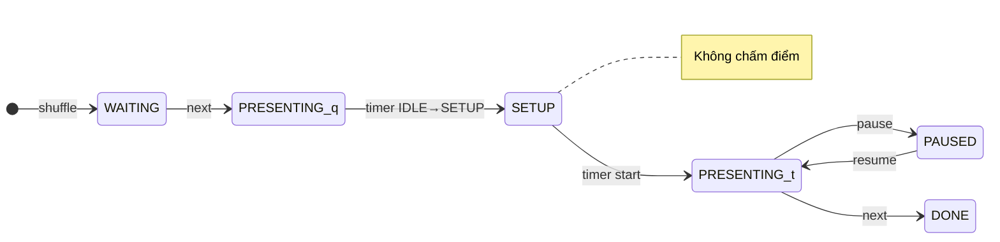

# Postman Playbook — GĐ2 + GĐ3 (Integration + Unit GĐ3)

> **Mục đích:** Gom **7 integration test** (`Gd2Gd3FlowIntegrationTest`) + **11 unit test class GĐ3** thành từng request Postman — method, path, body, token, kỳ vọng.  
> **Cập nhật:** 2026-06-09 · Base URL: `http://localhost:8080/api/v1`  
> **Liên quan:** [e2e-gd2-gd3-v41-manual-test.md](e2e-gd2-gd3-v41-manual-test.md) (E2E chi tiết) · [fe-gd3-api-mapping.md](fe-gd3-api-mapping.md) (contract FE)

---

## Mục lục

| § | Nội dung |
|---|----------|
| [0](#0-chuẩn-bị-postman) | Chuẩn bị Postman |
| [0.5](#05-quy-trình-presentation--timer--fe-đọc-trước-it-04--it-07) | **FE:** Presentation + timer + chấm |
| [1](#1-bảng-integration-test--postman) | Integration test → Postman (IT-01→08) |
| [2](#2-checklist-unit-gđ3--postman) | 11 unit class GĐ3 → Postman |
| [3](#3-setup-chung-tiên-quyết) | Setup chung (login, bootstrap) |
| [4](#4-checklist-tổng) | Checklist tổng |

---

## 0. Chuẩn bị Postman

### 0.1 Khởi động BE

```bash
mvn spring-boot:run -Dspring-boot.run.profiles=dev
```

| Kiểm tra | Kỳ vọng |
|----------|---------|
| Swagger | `http://localhost:8080/swagger-ui.html` |
| Log `[Gd3DataSeeder]` | In `hackathonId`, `prelimRoundId`, `track1Id`, … |
| `mvn test` (tuỳ chọn) | 167/167 pass |

### 0.2 Environment variables

| Biến | Ví dụ | Ghi chú |
|------|-------|---------|
| `baseUrl` | `http://localhost:8080` | Không gồm `/api/v1` |
| `coordToken` | `eyJ…` | Login coordinator |
| `studentToken` | `eyJ…` | Student leader |
| `judgeToken` | `eyJ…` | Judge được phân công track — `POST /scores`. IT-07 dùng judge **phụ** (không giữ quyền điều khiển) để test phân quyền |
| `controllerToken` | `eyJ…` | **Một trong các judge** trên track giữ quyền điều khiển tạm thời (HEAD mặc định hoặc `PUT …/controller` grant) — **cùng người** vừa `timer/*` + `next` vừa chấm; HEAD có thể set `judgeToken` = `controllerToken` |
| `mentorToken` | `eyJ…` | Mentor (tuỳ test) |
| `gd3HackathonSlug` | `seal-gd3-prelim-open` | Seed GĐ3 |
| `gd2HackathonSlug` | `seal-spring-2026` | Seed GĐ2 |
| `hackathonId` | `3` | GET hackathons?q=slug |
| `prelimRoundId` | `5` | GET hackathons/{id}/rounds → `isFinal=false` |
| `track1Id` | `10` | GET rounds/{prelimId}/tracks |
| `track2Id` | `11` | Track thứ 2 (seed GĐ3) |
| `teamId` | `20` | GET /me/teams (student) |
| `submissionId` | `42` | Sau POST submit hoặc seed |
| `criterionId` | `1` | GET /tracks/{trackId}/criteria |
| `presentingSubmissionId` | `42` | Sau shuffle — item `PRESENTING` |

### 0.3 Login mẫu (mọi request protected)

```http
POST {{baseUrl}}/api/v1/auth/login
Content-Type: application/json

{
  "email": "coord@fpt.edu.vn",
  "password": "Coordinator@dev1"
}
```

→ Lưu `data.accessToken` vào biến role tương ứng.

### 0.4 Hai đường test

| Đường | Slug | Dùng cho |
|-------|------|----------|
| **A — GĐ3 seed** | `seal-gd3-prelim-open` | IT-03→07, unit GĐ3 (đã active, đã lottery) |
| **B — GĐ2→GĐ3 full** | `seal-spring-2026` + lock/lottery | IT-01, IT-02 (lottery gate + submit mới) |

### 0.5 Quy trình Presentation & Timer — **FE đọc trước IT-04 → IT-07**

> Tài liệu contract đầy đủ: [fe-gd3-api-mapping.md §9](fe-gd3-api-mapping.md#90-quy-trình-fe-presentation--timer--chấm-điểm).

#### Khái niệm cốt lõi

| Khái niệm | Ý nghĩa | FE cần nhớ |
|-----------|---------|------------|
| **Queue (hàng đợi)** | Danh sách bài nộp gradable trên **một track** (hoặc round CK) | Mỗi track = một queue **độc lập** |
| **Slot** | Một dòng trong queue, gắn `submissionId` + `displayCode` (`#26`) | Tạo khi **shuffle**, không tạo lúc activate round |
| **`PRESENTING`** | Đúng **1** slot đang thuyết trình trên mỗi track | Đây là “bài đang thi” — mọi timer/chấm đều xoay quanh slot này |
| **`displayCode`** | `#` + `submissionId` — nhãn ẩn danh | **Không** phải số thứ tự random; thứ tự random nằm ở `order` sau shuffle |
| **Timer** | Đồng hồ gắn **slot `PRESENTING`**, không gắn request riêng lẻ | `start`/`pause`/`resume` **không** cần `submissionId` trên query |
| **`timer.phase = SETUP`** | **Chuyển tiếp** sau `next` — đội kế đã lên lượt nhưng chưa start / **chưa cho chấm** | FE hiển thị “Đang setup” cho đến khi controller `start` |

#### Phân vai — Coordinator vs judge trên track

> **Không có người thứ 3 chỉ bấm timer.** Mỗi track có **N judge** (2, 3, … — không cố định). **Một** judge trên track đó giữ quyền điều khiển (mặc định HEAD; coordinator có thể grant sang judge khác) và **vẫn chấm điểm** — cùng login, hai nhóm nút UI. Các judge còn lại chỉ chấm.

| Việc | Ai làm (nghiệp vụ) | Token Postman | API |
|------|-------------------|---------------|-----|
| Kích hoạt round, lottery, cấu hình track | **Coordinator** | `coordToken` | `PATCH …/activate`, lottery, … |
| Xáo queue trước giờ thi (setup) | **Coordinator** *(BE cũng cho phép judge giữ quyền)* | `coordToken` | `POST …/queue/shuffle` |
| Chuyển quyền điều khiển sang judge kia trên track | **Coordinator** | `coordToken` | `PUT /presentation/tracks/{trackId}/controller` |
| **Start / pause / resume / qa / reset / next** | **Một judge** trên track (HEAD hoặc được grant) — **đồng thời chấm** | `controllerToken` (= login judge đó) | `POST …/timer/*`, `PATCH …/queue/next` |
| Chấm điểm | **Mọi judge** phân công track (kể cả người giữ quyền điều khiển) | `judgeToken` hoặc **cùng** `controllerToken` | `POST /scores` |
| Xem queue | Tất cả role approved | bất kỳ | `GET …/queue` |

> **Lưu ý BE:** Coordinator bypass timer/next (test/dev). **FE:** nút điều khiển chỉ trên màn judge **đang giữ quyền** track đó — không tách màn “operator” riêng.

**Ví dụ (minh hoạ, không bắt buộc đúng 2 người):** track có judge A (HEAD) + judge B + … — A login một lần → start/pause/next **và** chấm; B chỉ chấm. A vắng → coordinator `PUT …/controller` `{ judgeId: B }` → B làm cả hai.

#### Luồng màn hình — Coordinator (setup trước giờ thi)

```text
1. PATCH /rounds/{id}/activate
2. POST /presentation/queue/shuffle   (coordToken)
3. [Tuỳ chọn] PUT /presentation/tracks/{trackId}/controller  → grant judge phụ
```

#### Luồng màn hình — Judge giữ quyền điều khiển (trong giờ thi)

```text
1. GET  /presentation/queue                    → lưu presentingSubmissionId + displayCode
2. POST /presentation/timer/start              → timer=PRESENTING (đội 1)
3. pause / resume / qa (tuỳ)
4. POST /scores (cùng judge — và judge phụ trên track cũng chấm song song)
5. PATCH /presentation/queue/next            → đội 1 DONE; đội 2 PRESENTING + timer=SETUP ⏳
6. [Đội 2 setup máy — mọi judge tạm không chấm đội mới]
7. POST /presentation/timer/start              → bắt đầu đội 2
8. Lặp 3–7
```

**API chuyển đội (bước 5)** — canonical:

```http
PATCH {{baseUrl}}/api/v1/presentation/queue/next?roundId={{prelimRoundId}}&trackId={{track1Id}}
Authorization: Bearer {{controllerToken}}
Content-Type: application/json

{
  "currentSubmissionId": {{presentingSubmissionId}}
}
```

Alias tương đương: `POST /api/v1/presentation/timer/next` (cùng query + body, **không** auto-start timer).

**Response `data`:**

| Field | Ý nghĩa |
|-------|---------|
| `nextSubmissionId` | Đội kế — lưu làm `presentingSubmissionId` mới |
| `nextTeamId` | Team id (coord/judge nội bộ; judge portal ẩn danh) |
| `trackId` | Track vừa next |

Sau `next`, `GET queue` → item `PRESENTING` có `timer.phase` = **`SETUP`**.

#### Luồng màn hình (Judge chấm điểm)

```text
1. GET /me/judge/submissions?roundId=&trackId=
2. GET /presentation/queue
3. Chỉ bật form chấm khi timer.phase ∈ { PRESENTING, PAUSED, QA, ENDED }
   — KHÔNG chấm khi IDLE hoặc SETUP (422 SCORING_NOT_OPEN)
4. POST /scores { submissionId: presentingSubmissionId, ... }
5. Sau controller `queue/next` → đội cũ DONE; đội mới SETUP (chờ `timer/start`)
```

#### Tại sao timer không truyền `submissionId`?

Backend tìm slot duy nhất `queue_status = PRESENTING` theo `roundId` + `trackId`.  
FE **không bấm mù**: luôn hiển thị `displayCode` từ `GET queue` hoặc `data.submissionId` sau mỗi action timer.

| API | Cần `submissionId`? | Ghi chú |
|-----|---------------------|---------|
| `timer/start`, `pause`, `resume`, `qa`, `reset` | **Không** (query) | Response có `data.submissionId` để UI đối chiếu |
| `queue/next`, `timer/next` | **Nên có** (body `currentSubmissionId`) | Xác nhận đang kết thúc đúng bài trước khi chuyển |
| `POST /scores` | **Bắt buộc** (body) | Queue `PRESENTING` + timer **không** IDLE/SETUP |

#### `timer.phase` — khi nào chấm được?

| Phase | Ý nghĩa | `POST /scores` |
|-------|---------|----------------|
| `IDLE` | Chưa start (đội 1 sau shuffle) | ❌ |
| `SETUP` | Chuyển tiếp sau `next` (đội 2 setup máy) | ❌ |
| `PRESENTING` / `QA` | Đang thi | ✅ |
| `PAUSED` | Tạm dừng — vẫn chấm được | ✅ |
| `ENDED` | Hết giờ, chưa `next` | ✅ |

#### State machine (một track)



#### Biến Postman FE nên set

| Biến | Lấy từ đâu | Dùng cho |
|------|------------|----------|
| `presentingSubmissionId` | `GET queue` → item `status=PRESENTING` → `submissionId` | IT-06 assert, IT-07 body scores |
| `presentingDisplayCode` | Cùng item → `displayCode` (vd. `#26`) | Hiển thị UI coordinator/judge |
| `prelimRoundId`, `track1Id` | Bootstrap | Mọi timer/queue |

#### WebSocket (đồng bộ realtime)

Subscribe: `/topic/rounds/{roundId}/tracks/{trackId}/presentation-queue`  
Payload = full `PresentationQueueResponse` sau shuffle / next / timer.

---

## 1. Bảng integration test → Postman

Mã Java tự động: `Gd2Gd3FlowIntegrationTest` (IT-01→09). IT-06/07/08 dùng **`controllerToken`** = judge HEAD (không dùng `coordToken` cho timer/next — phản ánh production).

---

### IT-01 — `lottery_rejectsExplicitAssignmentWhenTeamNotLocked`

**Mục tiêu:** Lottery assignment tường minh khi `is_locked=false` → `TEAM_NOT_LOCKED`.

**Tiên quyết:** Team `ACTIVE`, `is_locked=false` (vd. team mới trên `seal-spring-2026` hoặc `GD3-04` trước khi lock).

| Bước | Method | Path | Token | Body | Kỳ vọng |
|------|--------|------|-------|------|---------|
| 1 | `POST` | `/api/v1/auth/login` | — | `{"email":"coord@fpt.edu.vn","password":"Coordinator@dev1"}` | `200` → `coordToken` |
| 2 | `GET` | `/api/v1/hackathons?q=seal-spring-2026` | `coordToken` | — | `hackathonId`, `prelimRoundId` |
| 3 | `GET` | `/api/v1/teams?hackathonId={{hackathonId}}` | `coordToken` | — | Chọn team `isLocked: false` → `teamId` |
| 4 | `GET` | `/api/v1/rounds/{{prelimRoundId}}/tracks` | `coordToken` | — | `track1Id` |
| 5 | `PATCH` | `/api/v1/hackathons/{{hackathonId}}/lottery` | `coordToken` | Xem dưới | **`422`** `error.code` = `TEAM_NOT_LOCKED` |

**Body bước 5:**

```json
{
  "roundId": {{prelimRoundId}},
  "assignments": [
    {
      "teamId": {{teamId}},
      "trackId": {{track1Id}},
      "assignedGroup": "Bảng A"
    }
  ]
}
```

| ☐ | Pass |
|---|------|
| ☐ | HTTP 422 |
| ☐ | `error.code` = `TEAM_NOT_LOCKED` |

---

### IT-02 — `gd2ToGd3_lotteryActivateMultipartSubmitAndSlide`

**Mục tiêu:** GĐ2 lottery → GĐ3 activate → multipart submit → tải slide PDF.

**Tiên quyết:** Team `ACTIVE` + **`is_locked=true`** (sau `registrationEnd` seed tự lock, hoặc đợi cron/seed repair).

| Bước | Method | Path | Token | Body / form | Kỳ vọng |
|------|--------|------|-------|-------------|---------|
| 1 | `PATCH` | `/api/v1/hackathons/{{hackathonId}}/lottery` | `coordToken` | `{"roundId":{{prelimRoundId}},"assignments":[]}` | `200`, `data.assignedCount` ≥ 1 |
| 2 | `PATCH` | `/api/v1/rounds/{{prelimRoundId}}/activate` | `coordToken` | `{"note":"postman-it02"}` | `200`, `data.isActive: true` |
| 3 | `POST` | `/api/v1/submissions` | `studentToken` | multipart — xem bảng | **`201`**, `data.slideFile` có tên PDF, `slideDownloadPath` |
| 4 | `GET` | `/api/v1/submissions/{{submissionId}}/slide` | `studentToken` | — | **`200`**, `Content-Type: application/pdf`, `Content-Disposition: inline` |
| 5 | `GET` | `/api/v1/submissions/{{submissionId}}/slide?download=true` | `studentToken` | — | **`200`**, `Content-Disposition: attachment` |

**Multipart bước 3 (Postman: form-data):**

| Key | Type | Value |
|-----|------|-------|
| `teamId` | Text | `{{teamId}}` |
| `trackId` | Text | `{{track1Id}}` |
| `repoUrl` | Text | `https://github.com/octocat/Hello-World` |
| `slideFile` | File | `sample-slide.pdf` (header `%PDF-1.4`) |

**Đường tắt seed GĐ3:** Bỏ bước 1–2 (prelim đã active); dùng `student.gd3.leader04@` submit bước 3–4.

| ☐ | Pass |
|---|------|
| ☐ | Lottery `assignedCount` ≥ 1 |
| ☐ | Activate `isActive: true` |
| ☐ | Submit `201`, `slideFile` + `slideDownloadPath` có giá trị |
| ☐ | GET slide `200` PDF |

---

### IT-03 — `judgeSubmissions_areAnonymous`

**Mục tiêu:** Judge list submission ẩn danh — có `displayCode`, **không** `teamName`.

**Tiên quyết:** Đã có submission gradable (seed `GD3-01` hoặc IT-02).

| Bước | Method | Path | Token | Query | Kỳ vọng |
|------|--------|------|-------|-------|---------|
| 1 | `POST` | `/api/v1/auth/login` | — | — | `judge1@fpt.edu.vn` / `Judge@dev1` |
| 2 | `GET` | `/api/v1/me/judge/submissions` | `judgeToken` | `roundId={{prelimRoundId}}&trackId={{track1Id}}` | **`200`** |

**Assert `data[]`:**

| Field | Kỳ vọng |
|-------|---------|
| `displayCode` | Bắt đầu `#` |
| `submissionId` | Có |
| `teamName` | **Không có** field |
| `teamId` | **Không có** field |

| ☐ | Pass |
|---|------|
| ☐ | Mảng không rỗng |
| ☐ | `displayCode` = `#<id>` |
| ☐ | Không có `teamName` |

---

### IT-04 — `scoring_rejectsWhenNoPresentingSlot`

**Mục tiêu:** Chấm khi **chưa shuffle** (không có slot `PRESENTING`) → `SCORING_NOT_OPEN`.

> **FE:** Màn judge chấm điểm phải **disable** hoặc báo lỗi khi chưa có item `PRESENTING` trên queue (hoặc khi `GET queue` trống). Không dựa vào `submissionId` tĩnh trên URL — phải khớp slot đang thi.

**Tiên quyết:** Round active, có submission `SUBMITTED`, **chưa** gọi shuffle (hoặc xóa slot bằng cách dùng team mới submit xong).

| Bước | Method | Path | Token | Body | Kỳ vọng |
|------|--------|------|-------|------|---------|
| 1 | `GET` | `/api/v1/tracks/{{track1Id}}/criteria` | `coordToken` | — | Lưu `criterionId` |
| 2 | `POST` | `/api/v1/scores` | `judgeToken` | Xem dưới | **`422`** `SCORING_NOT_OPEN` |

**Body bước 2:**

```json
{
  "submissionId": {{submissionId}},
  "criterionId": {{criterionId}},
  "scoreValue": 8
}
```

| ☐ | Pass |
|---|------|
| ☐ | HTTP 422 (không phải 201) |
| ☐ | `error.code` = `SCORING_NOT_OPEN` |

---

### IT-05 — `shuffle_createsSlotsWithFirstPresenting`

**Mục tiêu:** Shuffle tạo slot; item đầu queue = `PRESENTING`.

> **FE — sau bước 2:** Lưu `presentingSubmissionId` và `presentingDisplayCode` từ item `PRESENTING`.  
> Đây là **nguồn sự thật** cho header “Đang thuyết trình: #26” trên màn controller + form chấm judge.  
> Các item `WAITING` có `order` 2, 3, … — đó mới là thứ tự random sau shuffle.

**Tiên quyết:** Có ≥1 submission gradable trên track (seed hoặc IT-02).

| Bước | Method | Path | Token | Body | Kỳ vọng |
|------|--------|------|-------|------|---------|
| 1 | `POST` | `/api/v1/presentation/queue/shuffle` | `coordToken` | Xem dưới | `200` |
| 2 | `GET` | `/api/v1/presentation/queue` | `coordToken` | `?roundId=&trackId=` | `200` |

**Body bước 1:**

```json
{
  "roundId": {{prelimRoundId}},
  "trackIds": [{{track1Id}}]
}
```

**Assert bước 1 — `data.tracks[0]`:**

| Field | Kỳ vọng |
|-------|---------|
| `trackId` | = `{{track1Id}}` |
| `slotCount` | ≥ 1 |
| `shuffled` | `true` |

**Assert bước 2 — `data.tracks[0].items[0]`:**

| Field | Kỳ vọng |
|-------|---------|
| `status` | `PRESENTING` |
| `submissionId` | Có → lưu `presentingSubmissionId` |
| `displayCode` | Có → lưu `presentingDisplayCode` (vd. `#26`) |

| ☐ | Pass |
|---|------|
| ☐ | Shuffle `slotCount` ≥ 1 |
| ☐ | Queue item `PRESENTING` có `submissionId` + `displayCode` |
| ☐ | Đã lưu biến `presentingSubmissionId` cho IT-06/07 |

---

### IT-06 — `timer_startPauseResume_afterShuffle`

**Mục tiêu:** Timer start → pause → resume; phase đúng.

> **FE — Presentation Controller (không phải Coordinator):**  
> - Dùng `controllerToken` (Judge HEAD hoặc judge được grant).  
> - Query chỉ `roundId` + `trackId` — backend áp dụng lên slot `PRESENTING`.  
> - Assert `data.submissionId === presentingSubmissionId` sau mỗi bước.

**Tiên quyết:** IT-05 pass; `controllerToken` = login judge HEAD track; có `presentingSubmissionId`.

| Bước | Method | Path | Token | Query / assert | Kỳ vọng |
|------|--------|------|-------|----------------|---------|
| 0 | `GET` | `/api/v1/presentation/queue` | `controllerToken` | `?roundId=&trackId=` | 1 item `PRESENTING` → `presentingSubmissionId` |
| 1 | `POST` | `/api/v1/presentation/timer/start` | `controllerToken` | `roundId=&trackId=` | `timer.phase` = `PRESENTING`; `submissionId` khớp |
| 2 | `POST` | `/api/v1/presentation/timer/pause` | `controllerToken` | cùng query | `timer.phase` = `PAUSED` |
| 3 | `POST` | `/api/v1/presentation/timer/resume` | `controllerToken` | cùng query | `timer.phase` = `PRESENTING` |

| ☐ | Pass |
|---|------|
| ☐ | Bước 0: queue có đúng 1 `PRESENTING` |
| ☐ | start → phase `PRESENTING`, `submissionId` khớp |
| ☐ | pause → phase `PAUSED` |
| ☐ | resume → phase `PRESENTING` |

---

### IT-07 — `scoring_succeedsWhenSlotPresenting_afterShuffle`

**Mục tiêu:** Sau shuffle (slot `PRESENTING`), judge chấm thành công.

> **FE — form chấm:**  
> - Gọi **`timer/start`** trước (IT-06) — không chấm khi `IDLE`/`SETUP`.  
> - Body `submissionId` = `presentingSubmissionId`.  
> - Có thể chấm khi `PAUSED` (hội đồng chấm trong lúc dừng đồng hồ).

**Tiên quyết:** IT-05 + IT-06 (`timer/start`); `presentingSubmissionId` + `criterionId`.

| Bước | Method | Path | Token | Body | Kỳ vọng |
|------|--------|------|-------|------|---------|
| 0 | `POST` | `/api/v1/presentation/timer/start` | `controllerToken` | query round/track | `timer.phase` = `PRESENTING` |
| 1 | `POST` | `/api/v1/scores` | `judgeToken` | Xem dưới | **`201`** |

**Body:**

```json
{
  "submissionId": {{presentingSubmissionId}},
  "criterionId": {{criterionId}},
  "scoreValue": 8.5
}
```

**Assert `data`:**

| Field | Kỳ vọng |
|-------|---------|
| `submissionId` | = `presentingSubmissionId` |
| `criterionId` | = `criterionId` |
| `scoreValue` | `8.5` |

| ☐ | Pass |
|---|------|
| ☐ | HTTP 201 |
| ☐ | `scoreValue` = 8.5 |

---

### IT-08 — `queue_next_rejectsWhenNoScores`

**Mục tiêu:** Gọi `next` khi chưa có điểm → `422` `SCORING_INCOMPLETE_BEFORE_NEXT`.

**Tiên quyết:** ≥2 đội trên track; đã shuffle + `timer/start`; **chưa** `POST /scores`.

| Bước | Method | Path | Token | Body | Kỳ vọng |
|------|--------|------|-------|------|---------|
| 1 | `PATCH` | `/api/v1/presentation/queue/next` | `controllerToken` | `{"currentSubmissionId":{{presentingSubmissionId}}}` | **`422`** `SCORING_INCOMPLETE_BEFORE_NEXT` |

| ☐ | Pass |
|---|------|
| ☐ | HTTP 422, `reason` = `NO_SCORES` trong `error` details (nếu có) |

---

### IT-09 — `queue_next_transitionsToSetup` (chuyển đội)

**Mục tiêu:** Sau khi đội 1 đã chấm, **Presentation Controller** gọi `next` → đội kế `PRESENTING` + `timer.phase=SETUP`.

> **FE:** Nút **“Đội tiếp theo”** — judge giữ quyền; **confirm** nếu BE trả `MISSING_JUDGE_SCORES` (nhiều judge, chưa đủ người chấm).  
> Sau `next`, đội cũ `DONE` — **không chấm được nữa**.

**Tiên quyết:** IT-05 pass; track **≥ 2** submission; IT-07 đã chấm đội 1.

| Bước | Method | Path | Token | Body / query | Kỳ vọng |
|------|--------|------|-------|--------------|---------|
| 1 | `PATCH` | `/api/v1/presentation/queue/next` | `controllerToken` | Query: `roundId`, `trackId` — Body bên dưới | `200` |
| 2 | `GET` | `/api/v1/presentation/queue` | `controllerToken` | `?roundId=&trackId=` | Xem assert bảng |

**Body bước 1:**

```json
{
  "currentSubmissionId": {{presentingSubmissionId}}
}
```

**Assert bước 1 — `data`:**

| Field | Kỳ vọng |
|-------|---------|
| `nextSubmissionId` | Có (≠ `presentingSubmissionId` cũ) → lưu biến mới |
| `trackId` | = `{{track1Id}}` |

**Assert bước 2 — queue:**

| Kiểm tra | Kỳ vọng |
|----------|---------|
| Đội vừa xong | `status` = `DONE` |
| Đội kế | `status` = `PRESENTING`, `timer.phase` = **`SETUP`** |
| `POST /scores` đội kế (chưa start) | **`422`** `SCORING_NOT_OPEN` |
| `POST /timer/start` | `timer.phase` = `PRESENTING` → sau đó chấm được |

**Alias (cùng hành vi):**

```http
POST {{baseUrl}}/api/v1/presentation/timer/next?roundId={{prelimRoundId}}&trackId={{track1Id}}
Authorization: Bearer {{controllerToken}}
Content-Type: application/json

{ "currentSubmissionId": {{presentingSubmissionId}} }
```

| ☐ | Pass |
|---|------|
| ☐ | `next` 200, `nextSubmissionId` có giá trị |
| ☐ | Queue: đội mới `SETUP` |
| ☐ | Chấm đội mới khi SETUP → 422 |
| ☐ | Sau `start` → chấm 201 |

---

### Luồng IT gộp (chạy tuần tự một lần)

```text
Login coord + student + judge (HEAD → controllerToken)
→ [IT-01] lottery fail (team chưa lock)          — đường B
→ [IT-02] lottery → activate → submit → slide   — hoặc seed + leader04
→ [IT-03] judge submissions ẩn danh
→ [IT-04] score FAIL (chưa shuffle)
→ [IT-05] shuffle (coord) → GET queue → presentingSubmissionId
→ [IT-06] timer start/pause/resume (controllerToken)
→ [IT-07] score 201 (judgeToken, sau start)
→ [IT-08] next không điểm → 422
→ [IT-09] queue/next sau chấm → SETUP → start đội 2
```

**Thời gian ước tính:** 15–20 phút trên Postman.

---

## 2. Checklist unit GĐ3 → Postman

Unit test chạy auto: `mvn test -Dtest=SubmissionSlideStorageTest,GitHubRepoValidatorTest,...`  
Bảng dưới map **logic unit** → request Postman tương đương (hoặc ghi **Maven only**).

---

### U3-01 — `RoundActivationServiceImplTest`

| Unit case | Postman | Token | Kỳ vọng |
|-----------|---------|-------|---------|
| `activatePreliminary_failsWhenTrackHasNoJudge` | `PATCH /api/v1/rounds/{prelimId}/activate` trên hackathon **thiếu judge** track | `coordToken` | `422` `JUDGE_NOT_ASSIGNED` |

**Ghi chú:** Khó tái hiện trên seed dev (đã có judge). Dùng hackathon test tạm hoặc tin `mvn test`.

| ☐ | Maven `RoundActivationServiceImplTest` pass |
| ☐ | (Tuỳ chọn) Postman activate fail đúng code |

---

### U3-02 — `SubmissionSlideStorageTest`

| Unit case | Postman | Token | Body / form | Kỳ vọng |
|-----------|---------|-------|-------------|---------|
| `validatePdf_rejectsNonPdf` | `POST /api/v1/submissions` | `studentToken` | `slideFile` = file `.txt` hoặc PDF giả | `422` `INVALID_SLIDE_FILE` |
| `storeAndLoadSlide_roundTrip` | `POST` multipart + `GET /submissions/{id}/slide` | `studentToken` | PDF hợp lệ `%PDF-1.4` | `201` + `slideFile`; GET `200` PDF |

| ☐ | Reject non-PDF |
| ☐ | Round-trip PDF |

---

### U3-03 — `GitHubRepoValidatorTest`

| Unit case | Postman | `repoUrl` | Kỳ vọng |
|-----------|---------|-----------|---------|
| `rejectsNonGitHubUrl` | `POST /api/v1/submissions` multipart | `https://gitlab.com/foo/bar` | `422` (URL không hợp lệ) |
| `rejectsGoogleDrive` |同上 | `https://drive.google.com/...` | `422` |
| `acceptsGitHubUrlWhenPublicCheckDisabled` |同上 | `https://github.com/octocat/Hello-World` | `201` (dev: `github-public-check-enabled=false`) |
| `requiresRepoUrl` |同上 | *(bỏ trống repoUrl)* | `400` validation |

| ☐ | GitLab → fail |
| ☐ | GitHub → pass |
| ☐ | Thiếu repoUrl → 400 |

---

### U3-04 — `JudgePortalServiceTest`

| Unit case | Postman | Token | Kỳ vọng |
|-----------|---------|-------|---------|
| `listSubmissions_doesNotExposeTeamName` | `GET /api/v1/me/judge/submissions?roundId=&trackId=` | `judgeToken` | Không field `teamName` (= **IT-03**) |

| ☐ | = IT-03 pass |

---

### U3-05 — `PresentationQueueShuffleTest`

| Unit case | Postman | Token | Kỳ vọng |
|-----------|---------|-------|---------|
| `shuffle_createsSlotsFromGradableSubmissions` | `POST /presentation/queue/shuffle` | `coordToken` | `slotCount` = số bài gradable; 1 slot `PRESENTING` (= **IT-05**) |

| ☐ | = IT-05 pass |

---

### U3-06 — `PresentationQueueAnonymityTest`

| Unit case | Postman | Token | Kỳ vọng |
|-----------|---------|-------|---------|
| `judgeQueue_hidesTeamIdentity` | `GET /presentation/queue?roundId=&trackId=` | `judgeToken` | `items[].teamId` null, `teamName` null |

| Bước | Method | Path | Token | Kỳ vọng |
|------|--------|------|-------|---------|
| 1 | `GET` | `/api/v1/presentation/queue?roundId={{prelimRoundId}}&trackId={{track1Id}}` | `judgeToken` | `200` |

**So sánh:** Cùng request với `coordToken` → coord **thấy** `teamName`; judge **không**.

| ☐ | Judge: `teamName` null |
| ☐ | Coord: `teamName` có giá trị |

---

### U3-07 — `ScoringWindowTest`

| Unit case | Postman | Kỳ vọng |
|-----------|---------|---------|
| `normalScore_blockedWhenSlotWaiting` | `POST /scores` submission ở slot `WAITING` (track 2 item thứ 2 sau shuffle) | `422` `SCORING_NOT_OPEN` |
| `normalScore_allowedWhenJudgingAndPresenting` | `POST /scores` sau shuffle item `PRESENTING` | `201` (= **IT-07**) |
| `normalScore_blockedWhenScoringLocked` | `PATCH /rounds/{prelimId}/lock-scoring` rồi `POST /scores` | `423` hoặc scoring locked error |

**Lock scoring:**

```http
PATCH {{baseUrl}}/api/v1/rounds/{{prelimRoundId}}/lock-scoring
Authorization: Bearer {{coordToken}}
Content-Type: application/json

{ "note": "unit-test-lock" }
```

| ☐ | WAITING → SCORING_NOT_OPEN |
| ☐ | PRESENTING → 201 |
| ☐ | Sau lock-scoring → không chấm được |

---

### U3-08 — `PresentationControllerAuthTest`

| Unit case | Postman | Token | Kỳ vọng |
|-----------|---------|-------|---------|
| `coordinatorAlwaysAllowed` | `POST /presentation/queue/shuffle` | `coordToken` | `200` |
| `headJudgeCanControlTrackByDefault` | Shuffle/timer với judge **HEAD** (seed judge1) | `judgeToken` | `200` (nếu assignmentType HEAD) |
| `nonControllerJudgeForbidden` | `POST /presentation/timer/start` | judge **NORMAL** chưa grant | `403` |
| `roundControllerGrantAllowsFinal` | *(GĐ5 CK)* `PUT /presentation/rounds/{finalId}/controller` | `coordToken` | Chỉ test khi có round CK |

**Grant controller (để judge NORMAL điều khiển):**

```http
PUT {{baseUrl}}/api/v1/presentation/tracks/{{track1Id}}/controller
Authorization: Bearer {{coordToken}}
Content-Type: application/json

{
  "judgeId": {{judgeUserId}}
}
```

| ☐ | Coord shuffle OK |
| ☐ | Judge NORMAL không grant → timer `403` |
| ☐ | Sau grant → timer `200` |

---

### U3-09 — `PresentationTimerPauseTest`

| Unit case | Postman | Kỳ vọng |
|-----------|---------|---------|
| `pausedSlot_freezesRemainingSeconds` | start → pause → đọc `data.timer.remainingSeconds` → đợi 5s → pause vẫn giữ remaining | remaining không giảm khi PAUSED |
| `idleReturnsFullPresentationDuration` | Sau shuffle, trước start: `GET /presentation/queue` → `timer.phase` = `IDLE` | `remainingSeconds` = full presentation minutes |

| ☐ | = IT-06 + kiểm tra `remainingSeconds` trên queue GET |

---

### U3-10 — `RoundPhaseResolverTest`

Logic phase (không có API riêng) — suy ra từ `GET /rounds/{id}`:

| Unit case | Điều kiện round (seed) | Phase kỳ vọng | Cách verify Postman |
|-----------|------------------------|---------------|---------------------|
| `resolve_published` | `isPublished: true` | `PUBLISHED` | Score thường đóng; queue read-only |
| `resolve_scoringLocked` | `scoringLocked: true` | `SCORING_LOCKED` | `POST /scores` → locked |
| `resolve_setupWhenInactive` | `isActive: false` | `SETUP` | `POST /submissions` → round chưa active |
| `resolve_codingBeforeExamAt` | `examAt` tương lai | `CODING` | `SCORING_NOT_OPEN` nếu chấm sớm |
| `resolve_judgingWhenActiveAndExamStarted` | `isActive`, `examAt` qua | `JUDGING` | Shuffle + PRESENTING → score OK |

```http
GET {{baseUrl}}/api/v1/rounds/{{prelimRoundId}}
Authorization: Bearer {{coordToken}}
```

| ☐ | Seed GĐ3: `isActive`, `examAt` qua → JUDGING path (IT-07) |
| ☐ | Sau lock-scoring → không score |

---

### U3-11 — `PresentationDurationResolverTest`

| Unit case | Postman | Kỳ vọng |
|-----------|---------|---------|
| `usesTrackOverrideWhenPresent` | `GET /rounds/{id}/tracks` → track có `presentationMinutes` | Queue/timer dùng phút track |
| `fallsBackToRoundDefaults` | `GET /rounds/{prelimId}` → `defaultPresentationMinutes` | Timer full duration |
| `fallsBackToHardcodedDefaults` | Round/track không set phút | Mặc định 10+5 (seed thường có giá trị) |

```http
GET {{baseUrl}}/api/v1/rounds/{{prelimRoundId}}/tracks
Authorization: Bearer {{coordToken}}
```

| ☐ | Track có `presentationMinutes` / `qaMinutes` |
| ☐ | Timer `data.timer.presentationMinutes` khớp |

---

## 3. Setup chung (tiên quyết)

### 3.1 Bootstrap seed GĐ3 (`seal-gd3-prelim-open`)

```http
GET {{baseUrl}}/api/v1/hackathons?q=seal-gd3-prelim-open&size=5
Authorization: Bearer {{coordToken}}
```

```http
GET {{baseUrl}}/api/v1/hackathons/{{hackathonId}}/rounds
Authorization: Bearer {{coordToken}}
```

```http
GET {{baseUrl}}/api/v1/rounds/{{prelimRoundId}}/tracks
Authorization: Bearer {{coordToken}}
```

```http
GET {{baseUrl}}/api/v1/tracks/{{track1Id}}/criteria
Authorization: Bearer {{coordToken}}
```

| Assert | Kỳ vọng |
|--------|---------|
| Hackathon | `status: ONGOING` |
| Prelim | `isActive: true`, `scoringLocked: false` |
| Tracks | 2 track |
| Criteria | ≥ 1 criterion / track |

### 3.2 Login accounts (dev seed)

| Role | Email | Password |
|------|-------|----------|
| Coordinator | `coord@fpt.edu.vn` | `Coordinator@dev1` |
| Judge 1 | `judge1@fpt.edu.vn` | `Judge@dev1` |
| Student (chưa nộp) | `student.gd3.leader04@fpt.edu.vn` | `Student@dev1` |
| Student GĐ2 | `student.gd2.hcm.leader03@fpt.edu.vn` | `Student@dev1` |

### 3.3 Lệnh Maven tương ứng

```powershell
# Integration GĐ2→GĐ3 (7 tests)
mvn test "-Dtest=Gd2Gd3FlowIntegrationTest"

# Unit GĐ3
mvn test "-Dtest=RoundActivationServiceImplTest,SubmissionSlideStorageTest,GitHubRepoValidatorTest,JudgePortalServiceTest,PresentationQueueShuffleTest,PresentationQueueAnonymityTest,ScoringWindowTest,PresentationControllerAuthTest,PresentationTimerPauseTest,RoundPhaseResolverTest,PresentationDurationResolverTest"
```

---

## 4. Checklist tổng

### Integration (IT-01→08)

| ID | Test Java | Postman | ☐ |
|----|-----------|---------|---|
| IT-01 | `lottery_rejectsExplicitAssignmentWhenTeamNotLocked` | Lottery team chưa lock → 422 | ☐ |
| IT-02 | `gd2ToGd3_lotteryActivateMultipartSubmitAndSlide` | Lottery → activate → submit → slide | ☐ |
| IT-03 | `judgeSubmissions_areAnonymous` | GET judge/submissions ẩn danh | ☐ |
| IT-04 | `scoring_rejectsWhenNoPresentingSlot` | Score trước shuffle → 422 | ☐ |
| IT-05 | `shuffle_createsSlotsWithFirstPresenting` | Shuffle + queue PRESENTING | ☐ |
| IT-06 | `timer_startPauseResume_afterShuffle` | start / pause / resume (judge giữ quyền) | ☐ |
| IT-07 | `scoring_succeedsWhenSlotPresenting_afterShuffle` | Score sau start → 201 | ☐ |
| IT-08 | `queue_next_rejectsWhenNoScores` | Next chưa chấm → 422 | ☐ |
| IT-09 | `queue_next_transitionsToSetup` | Next sau chấm → SETUP → start đội kế | ☐ |

### Unit GĐ3 (11 class)

| ID | Class | Postman / Maven | ☐ |
|----|-------|-----------------|---|
| U3-01 | `RoundActivationServiceImplTest` | Maven (+ activate fail tuỳ chọn) | ☐ |
| U3-02 | `SubmissionSlideStorageTest` | PDF reject + round-trip | ☐ |
| U3-03 | `GitHubRepoValidatorTest` | repoUrl valid/invalid | ☐ |
| U3-04 | `JudgePortalServiceTest` | = IT-03 | ☐ |
| U3-05 | `PresentationQueueShuffleTest` | = IT-05 | ☐ |
| U3-06 | `PresentationQueueAnonymityTest` | Judge queue ẩn danh | ☐ |
| U3-07 | `ScoringWindowTest` | IT-04 + IT-07 + lock-scoring | ☐ |
| U3-08 | `PresentationControllerAuthTest` | Coord OK / judge 403 / grant | ☐ |
| U3-09 | `PresentationTimerPauseTest` | IT-06 + remainingSeconds | ☐ |
| U3-10 | `RoundPhaseResolverTest` | GET round + hành vi score | ☐ |
| U3-11 | `PresentationDurationResolverTest` | GET track/round minutes | ☐ |

---

**Tài liệu liên quan**

- E2E chi tiết + negative: [e2e-gd2-gd3-v41-manual-test.md](e2e-gd2-gd3-v41-manual-test.md)
- API contract FE: [fe-gd3-api-mapping.md](fe-gd3-api-mapping.md)
- Chiến lược test: [test-strategy-gd1-gd6-unit-to-e2e.md](test-strategy-gd1-gd6-unit-to-e2e.md)
