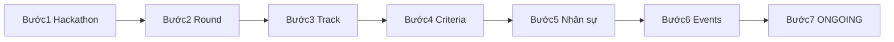

# Quy trình chạy API — Giai đoạn 1 (MF-01)

**Dự án:** SEAL Hackathon Management System — Backend  
**Phạm vi:** Giai đoạn Chuẩn bị sự kiện (GĐ1) — Coordinator only  
**Spec:** MF-01 v3.0 / v3.1 · Kiến trúc **Hackathon → Round → Track**

**Tài liệu liên quan:**

| Tài liệu | Mục đích |
|----------|----------|
| [mf01-gd1-qa-uat-manual.md](mf01-gd1-qa-uat-manual.md) | **QA/UAT GĐ1** — đánh giá %, findings, 64 TC happy/negative/edge, biểu mẫu Pass/Fail |
| [mf01-gd1-test-happy-path.md](mf01-gd1-test-happy-path.md) | **Test happy path** — checklist, JSON mẫu, seed, biến Postman |
| [mf01-gd1-timeline-events.md](mf01-gd1-timeline-events.md) | **Timeline & Events** — PDF Spring/Fall, validate 3 lớp, `examAt`, readiness |
| [../mf01/README.md](../mf01/README.md) | Spec normative đầy đủ (đã chuyển khỏi `mf01.md`) |
| [../mf02/01-auth-users.md](../mf02/01-auth-users.md) | Login / register / JWT (MF-02) |
| [Gd1SeedConstants.java](../../src/main/java/com/sealhackathon/api/config/seed/Gd1SeedConstants.java) | Slug / email seed dev |

---

## Tiền đề khi gọi API

| Mục | Giá trị |
|-----|---------|
| Base URL | `http://localhost:8080` (hoặc port trong `application.properties`) |
| **Swagger UI** | http://localhost:8080/swagger-ui.html · OpenAPI: `/v3/api-docs` |
| Prefix | `/api/v1` |
| Profile dev | `spring.profiles.active=dev` → `Gd1DataSeeder` tạo dữ liệu mẫu |
| Auth | JWT (MF-02): `Authorization: Bearer` — xem [../mf02/01-auth-users.md](../mf02/01-auth-users.md). Dev: `security.jwt.enabled=false` → stub user **id=1** |
| Coordinator seed | `coord@fpt.edu.vn` (phải là user id=1 trên DB trống) |
| Response envelope | `{ "success": true, "data": ..., "message": "..." }` — lỗi: `error.code`, `errors[]` |

**Thứ tự bắt buộc:** Bước 2 (Round) trước Bước 3 (Track). Không bỏ bước khi chưa đủ gate G1–G5.



---

## Tổng quan 7 bước

| Bước | Hành động | Đầu ra DB |
|------|-----------|-----------|
| 1 | Tạo Hackathon | `hackathons` (status=DRAFT) |
| 2 | Tạo Rounds (Sơ loại + Chung kết) | `rounds` |
| 3 | Tạo Tracks trong Round Sơ loại | `tracks` |
| 4 | Thiết lập Criteria (XOR) | `criteria` |
| 5 | Quản lý nhân sự | `users`, `invitations`, `mentor_assignments`, `judge_assignments` |
| 6 | Lên lịch sự kiện | `events`, `notifications` |
| 7 | Chuyển DRAFT → ONGOING | `hackathons.status=ONGOING` |

---

## Bước 1 — Tạo Hackathon

**Mục đích:** Định nghĩa kỳ thi. Trạng thái khởi tạo luôn **DRAFT** (không gửi `status` trong body).

### API bắt buộc (happy path)

| # | Method | Path | Ghi chú |
|---|--------|------|---------|
| 1 | **POST** | `/api/v1/hackathons` | Tạo hackathon mới → `201` |

**Body gợi ý (POST):**

```json
{
  "name": "SEAL E2E 2026",
  "slug": "seal-e2e-2026-test",
  "season": "Spring",
  "year": 2026,
  "description": "...",
  "registrationStart": "2026-03-01",
  "registrationEnd": "2026-04-01",
  "eventStart": "2026-04-11",
  "eventEnd": "2026-04-12",
  "_comment": "Spring 2026 PDF: WS 9/4, KO 11/4, thi+trao 12/4"
  "wildcardEnabled": true,
  "individualRankingEnabled": false
}
```

### API bổ sung

| Method | Path | Khi nào dùng |
|--------|------|----------------|
| GET | `/api/v1/hackathons` | Danh sách / tìm kiếm (`status`, `year`, `season`, `q`, page) |
| GET | `/api/v1/hackathons/{id}` | Xem chi tiết sau khi tạo |
| PUT | `/api/v1/hackathons/{id}` | Sửa thông tin — **chỉ khi** `status=DRAFT` |
| DELETE | `/api/v1/hackathons/{id}` | Xóa — chỉ DRAFT, không còn Track/Event con |

### Ràng buộc nhanh

- UNIQUE `(name, season, year)` và UNIQUE `slug` → `409 HACKATHON_DUPLICATE`
- `eventStart >= registrationEnd` → `422 HACKATHON_DATE_RANGE`
- Chuyển ONGOING **không** qua PUT hackathon — dùng Bước 7

**Lưu `hackathonId`** từ response cho các bước sau.

---

## Bước 2 — Tạo Round

**Mục đích:** Tạo **Vòng Sơ loại** (PRELIMINARY) và **Vòng Chung kết** (FINAL). Round FINAL **không** có Track con.

### API bắt buộc (happy path)

| # | Method | Path | Ghi chú |
|---|--------|------|---------|
| 1 | **POST** | `/api/v1/hackathons/{hackathonId}/rounds` | Round Sơ loại — `sequenceOrder=1`, `isFinal=false` |
| 2 | **POST** | `/api/v1/hackathons/{hackathonId}/rounds` | Round Chung kết — `sequenceOrder=2`, `isFinal=true`, `roundType=FINAL` |

**Body gợi ý — Sơ loại:**

```json
{
  "name": "Vòng Sơ loại",
  "sequenceOrder": 1,
  "isFinal": false,
  "roundType": "PRELIMINARY",
  "submissionDeadline": "2026-04-12T23:59:59",
  "codingDurationHours": 7,
  "lateSubmissionPolicy": "ALLOW_LATE_PENDING",
  "topNAdvance": 2,
  "minTeamsFinal": 6,
  "wildcardEnabled": true
}
```

**Body gợi ý — Chung kết:**

```json
{
  "name": "Vòng Chung kết",
  "sequenceOrder": 2,
  "isFinal": true,
  "roundType": "FINAL",
  "submissionDeadline": "2026-04-12T23:59:59",
  "lateSubmissionPolicy": "HARD_LOCK"
}
```

### API bổ sung

| Method | Path | Khi nào dùng |
|--------|------|----------------|
| GET | `/api/v1/hackathons/{hackathonId}/rounds` | List rounds theo thứ tự |
| GET | `/api/v1/rounds/{id}` | Chi tiết một round |
| PUT | `/api/v1/rounds/{id}` | Cập nhật deadline, lock chấm điểm, **thời lượng timer** (`defaultPresentationMinutes`, `defaultQaMinutes`), … |
| DELETE | `/api/v1/rounds/{id}` | Xóa — không khi `isActive` hoặc có submission; nếu không active → tự xóa Criteria con rồi xóa Round |

**Field thời lượng timer (GĐ1 — thiết lập sớm, optional):**

| Field | Round SL | Round CK | Ghi chú |
|-------|----------|----------|---------|
| `defaultPresentationMinutes` | ✅ GET/PUT | ✅ GET/PUT | Phút thuyết trình; default **10** |
| `defaultQaMinutes` | ✅ GET/PUT | ✅ GET/PUT | Phút Q&A; default **5** |

Round SL: default fallback cho mọi track chưa override. Round CK: dùng trực tiếp cho timer GĐ5. Khi vận hành GĐ3/GĐ5, Coordinator có thể dùng thêm `PUT /api/v1/presentation/duration` (không cần full body round).

Response list round gồm `trackCount` (số track con; 0 nếu FINAL), `criteriaCount`, `currentWeightTotal`.

### Ràng buộc nhanh

- `submissionDeadline > NOW()` → `422 ROUND_DEADLINE_INVALID`
- Round FINAL: `sequenceOrder` **>** max PRELIMINARY → `422 ROUND_FINAL_SEQUENCE_ORDER` (v3.1)
- Mỗi hackathon đúng **1** round `isFinal=true` (DB unique partial index)

**Lưu `prelimRoundId`** (round Sơ loại) và **`finalRoundId`** cho Bước 3–4.

---

## Bước 3 — Tạo Track

**Mục đích:** Tạo bảng đấu **trong Round Sơ loại** (`isFinal=false`). Mỗi Track có Criteria / Mentor / Judge riêng.

### API bắt buộc (happy path)

| # | Method | Path | Ghi chú |
|---|--------|------|---------|
| 1 | **POST** | `/api/v1/rounds/{roundId}/tracks` | Tạo từng track (`roundId` = Sơ loại) |

**Body gợi ý:**

```json
{
  "name": "Track 1 — RAG Pipeline",
  "topic": null,
  "maxTeams": 18,
  "maxTeamsPerGroup": 6,
  "minTeamSize": 3,
  "maxTeamSize": 5,
  "sequenceOrder": 1
}
```

Lặp lại với `sequenceOrder: 2` cho Track 2 (nếu cần).

### API bổ sung

| Method | Path | Khi nào dùng |
|--------|------|----------------|
| **GET** | **`/api/v1/rounds/{roundId}/tracks`** | **List tracks thuộc một round** (sort `sequenceOrder`; query `status` tùy chọn) — UI “round gồm track nào” |
| GET | `/api/v1/hackathons/{hackathonId}/tracks` | List toàn bộ tracks hackathon (mỗi item có `roundId`, `sequenceOrder`) |
| GET | `/api/v1/tracks/{id}` | Chi tiết |
| PUT | `/api/v1/tracks/{id}` | Sửa; **topic** sau KICKOFF (GĐ2); **override timer** (`presentationMinutes`, `qaMinutes`) |
| DELETE | `/api/v1/tracks/{id}` | Hard delete — FE xác nhận một bước; không bắt `CANCELLED` trước. Chặn nếu còn team active hoặc Round cha `is_active=TRUE`. Criteria/Mentor/Judge con cascade (DB) |

**Field thời lượng timer (GĐ1 — optional trên Track Sơ loại):**

| Field | GET/PUT | Ghi chú |
|-------|---------|---------|
| `presentationMinutes` | ✅ | Override phút thuyết trình cho track; `null` = dùng default round |
| `qaMinutes` | ✅ | Override phút Q&A cho track |

Không có trên `POST` tạo track — mặc định `null` (fallback round). Có thể set sớm bằng `PUT` hoặc lúc GĐ3 qua `PUT /api/v1/presentation/duration?trackId=`.

**Hủy track:** `PUT` body `{ "status": "CANCELLED" }` — block nếu còn đội (`TRACK_CANCEL_HAS_TEAMS`).

### Ràng buộc nhanh

- Không tạo track trong Round FINAL → `422 DESIGN_VIOLATION`
- Hackathon phải DRAFT hoặc ONGOING

**Lưu `trackId`** từng track cho Bước 4–5.

---

## Bước 4 — Thiết lập Criteria

**Mục đích:** Tiêu chí chấm điểm — **XOR**: Sơ loại gắn `track_id`, Chung kết gắn `round_id` (FINAL).

> **Chung kết không có Track con** — tạo criteria qua `POST /rounds/{finalRoundId}/criteria`, **không** qua `/tracks/...`. Round Sơ loại trong `GET /rounds` có `criteriaCount=0` vì criteria nằm trên từng Track.

### API bắt buộc (happy path)

**Cho mỗi Track Sơ loại:**

| # | Method | Path | Ghi chú |
|---|--------|------|---------|
| 1 | **POST** | `/api/v1/tracks/{trackId}/criteria` | Tạo từng criterion |
| hoặc | **POST** | `/api/v1/tracks/{trackId}/criteria/batch` | Tạo nhiều criterion một lần |

**Cho Round Chung kết:**

| # | Method | Path | Ghi chú |
|---|--------|------|---------|
| 1 | **POST** | `/api/v1/rounds/{roundId}/criteria` | `roundId` = round FINAL |
| hoặc | **POST** | `/api/v1/rounds/{roundId}/criteria/batch` | Batch |

**Body một criterion (ví dụ):**

```json
{
  "name": "Tính ứng dụng & khả thi",
  "type": "TECHNICAL",
  "weight": 0.30,
  "maxScore": 10,
  "displayOrder": 1
}
```

Tổng weight (không tính PENALTY) = **1.0** (±0.001) — gate cứng tại Bước 7.

### API bổ sung

| Method | Path | Mục đích |
|--------|------|----------|
| GET | `/api/v1/tracks/{trackId}/criteria` | List criteria Sơ loại |
| GET | `/api/v1/tracks/{trackId}/criteria/weight-summary` | Warn mềm tổng weight |
| POST | `/api/v1/tracks/{trackId}/criteria/clone` | Clone từ track khác — body `{ "sourceTrackId": ... }` |
| GET | `/api/v1/rounds/{roundId}/criteria` | List criteria Chung kết |
| GET | `/api/v1/rounds/{roundId}/criteria/weight-summary` | Warn weight FINAL |
| POST | `/api/v1/rounds/{roundId}/criteria/clone` | Clone vào round FINAL |
| GET | `/api/v1/criteria/{id}` | Chi tiết |
| PUT | `/api/v1/criteria/{id}` | Sửa |
| DELETE | `/api/v1/criteria/{id}` | Xóa — không khi đã có scores |

### Ràng buộc nhanh

- XOR: chỉ `trackId` **hoặc** `roundId` (parent path quyết định)
- PENALTY không tính vào tổng weight

---

## Bước 5 — Quản lý nhân sự

**Mục đích:** Judge khách mời, Mentor, Judge Sơ loại. **Không** phân công Judge Chung kết tại GĐ1.

### 5a — Judge EXTERNAL (tạm)

| Method | Path | Ghi chú |
|--------|------|---------|
| **POST** | `/api/v1/users/temp-judges` | Tạo user + invitation email |
| GET | `/api/v1/users/temp-judges` | List / search |
| **POST** | `/api/v1/invitations/{invitationId}/resend` | Gửi lại token — chỉ khi **đã hết hạn** |
| **PATCH** | `/api/v1/users/{userId}` | Set `isDeptHead: true` (Trưởng khoa) trước CK GĐ4 |

**Body POST temp-judges:**

```json
{
  "fullName": "Guest Judge",
  "email": "guest@company.com",
  "institution": "Google Vietnam",
  "phone": "+84...",
  "hackathonId": 1
}
```

`hackathonId` tùy chọn — gắn invitation với hackathon.

### 5b — Mentor → Track

| Method | Path | Ghi chú |
|--------|------|---------|
| **POST** | `/api/v1/mentor-assignments` | Body `{ "mentorId", "trackId" }` |
| GET | `/api/v1/tracks/{trackId}/mentors` | List |
| DELETE | `/api/v1/mentor-assignments/{id}` | Hủy phân công |

### 5c — Judge Sơ loại → Track

| Method | Path | Ghi chú |
|--------|------|---------|
| **POST** | `/api/v1/judge-assignments` | Body `{ "judgeId", "trackId", "assignmentType": "NORMAL" }` |
| GET | `/api/v1/tracks/{trackId}/judges` | List Judge Sơ loại |
| GET | `/api/v1/rounds/{roundId}/judges` | List Judge **Chung kết** — **GĐ4 only**, không dùng GĐ1 |
| DELETE | `/api/v1/judge-assignments/{id}` | Hủy |

### Không làm ở GĐ1

| Method | Path | Lý do |
|--------|------|--------|
| POST judge-assignments với `roundId` + `FINAL_EXTERNAL` | — | `422 JUDGE_FINAL_AT_PHASE1` — Judge CK chỉ ở GĐ4 |

### Ràng buộc nhanh

- Mentor ↔ Judge cùng track → **BLOCK** `CONFLICT_SAME_TRACK`
- Email judge tạm trùng → `409 USER_EMAIL_TAKEN`

---

## Bước 6 — Lên lịch sự kiện

**Mục đích:** WORKSHOP, KICKOFF, AWARDS (milestone). Gate G5 yêu cầu ≥1 **KICKOFF**.  
**Chi tiết timeline (PDF, 3 lớp, `examAt`, mã lỗi):** [mf01-gd1-timeline-events.md](mf01-gd1-timeline-events.md).

### API bắt buộc (happy path)

Tạo milestone theo thứ tự thời gian (v3.3 — **block** nếu sai):

| Thứ tự | Type | Method | Path |
|--------|------|--------|------|
| 1 | WORKSHOP | **POST** | `/api/v1/hackathons/{hackathonId}/events` |
| 2 | KICKOFF | **POST** | `/api/v1/hackathons/{hackathonId}/events` |
| 3 | AWARDS | **POST** | `/api/v1/hackathons/{hackathonId}/events` |

PRESENTATION (tùy chọn — không phải milestone, không ràng buộc thứ tự, trong `[eventStart, eventEnd]`).

**Body gợi ý (mỗi event):**

```json
{
  "title": "Workshop RAG",
  "type": "WORKSHOP",
  "description": "...",
  "location": "Online (Teams)",
  "meetUrl": null,
  "startsAt": "2026-04-09T20:00:00",
  "endsAt": "2026-04-09T21:30:00",
  "isPublic": true
}
```

Ít nhất một trong `location` hoặc `meetUrl` phải có → `422 EVENT_LOCATION_REQUIRED`.

### API bổ sung

| Method | Path | Khi nào dùng |
|--------|------|----------------|
| GET | `/api/v1/hackathons/{hackathonId}/events` | List lịch |
| GET | `/api/v1/events/{id}` | Chi tiết |
| PUT | `/api/v1/events/{id}` | Sửa — re-validate thứ tự |
| DELETE | `/api/v1/events/{id}` | Xóa |

### Ràng buộc nhanh (Lớp 3 — block)

- WORKSHOP / KICKOFF / AWARDS: **bắt buộc `endsAt`** (milestone)
- WORKSHOP **kết thúc** trước KICKOFF **bắt đầu** (`workshop.endsAt < kickoff.startsAt`)
- KICKOFF **kết thúc** trước AWARDS **bắt đầu**
- `round.examAt`: sau `KICKOFF.endsAt`; trong `[eventStart, eventEnd]`; CK trước `AWARDS.startsAt` (nếu AWARDS đã tạo)
→ `422 EVENT_ORDER_VIOLATION` / `EVENT_END_REQUIRED` / `ROUND_EXAM_*` / `EVENT_AWARDS_MISSING`

---

## Bước 7 — Chuyển DRAFT → ONGOING

**Mục đích:** Mở cổng đăng ký. Phải pass **5 gate** G1–G5.

### API bắt buộc (happy path)

| # | Method | Path | Ghi chú |
|---|--------|------|---------|
| 1 | **GET** | `/api/v1/hackathons/{id}/readiness?target=ONGOING` | Dry-run — xem `ready`, `blockers[]`, `warnings[]` |
| 2 | **PATCH** | `/api/v1/hackathons/{id}/status` | Chuyển trạng thái |

**Body PATCH status:**

```json
{
  "status": "ONGOING"
}
```

(Hoặc `"targetStatus": "ONGOING"` — alias được hỗ trợ.)

### Gate G1–G5 (tóm tắt)

| Gate | Điều kiện |
|------|-----------|
| G1 | ≥1 Round PRELIMINARY + ≥1 Track con |
| G2 | Đúng 1 Round FINAL |
| G3 | Mọi Track Sơ loại: có Criteria, SUM(weight)=1.0 |
| G4 | Round FINAL: có Criteria, SUM(weight)=1.0 |
| G5 | ≥1 event type=KICKOFF hợp lệ |

Fail → `422 READINESS_NOT_PASSED` + `blockers[]`.

---

## Phụ lục A — Kích hoạt Round (FR-07B, thường GĐ3)

| Method | Path | Ghi chú |
|--------|------|---------|
| **PATCH** | `/api/v1/rounds/{id}/activate` | Validate weight + conflict; tự deactivate round active khác |

Không bắt buộc để PATCH hackathon ONGOING, nhưng dùng khi bắt đầu vòng thi thực tế.

---

## Phụ lục B — Minimal Postman (readiness PASS)

Thứ tự tối thiểu sau khi có `hackathonId`, `prelimRoundId`, `finalRoundId`, `trackIds`, `userIds`:

1. `POST /hackathons`
2. `POST /hackathons/{id}/rounds` ×2 (prelim + final)
3. `POST /rounds/{prelimId}/tracks` ×N
4. `POST /tracks/{trackId}/criteria` (hoặc batch) — mỗi track, tổng weight=1
5. `POST /rounds/{finalId}/criteria` — tổng weight=1
6. `POST /users/temp-judges` (tuỳ chọn)
7. `POST /mentor-assignments`, `POST /judge-assignments` (tuỳ chọn cho gate; mentor thiếu = warning)
8. `POST /hackathons/{id}/events` ×3 (WORKSHOP → KICKOFF → AWARDS)
9. `GET /hackathons/{id}/readiness?target=ONGOING`
10. `PATCH /hackathons/{id}/status` `{ "status": "ONGOING" }`

**Hoặc dùng seed có sẵn:** slug `seal-e2e-2026` — chỉ cần bước 9–10.

| Slug | Mục đích |
|------|----------|
| `seal-gd1-incomplete` | Readiness **fail** |
| `seal-e2e-2026` | Readiness **pass** → PATCH ONGOING |
| `seal-e2e-2026` | Đã ONGOING — dataset đầy đủ |

---

## Phụ lục C — Bảng API đầy đủ theo module

| Module | Endpoints |
|--------|-----------|
| Hackathon | POST/GET/PUT/DELETE `/hackathons`, GET/PATCH `/hackathons/{id}/readiness`, `/status` |
| Round | POST/GET `/hackathons/{id}/rounds`, GET/PUT/DELETE `/rounds/{id}`, PATCH `/rounds/{id}/activate` |
| Track | POST/GET `/rounds/{id}/tracks`, GET `/hackathons/{id}/tracks`, GET/PUT/DELETE `/tracks/{id}` |
| Criteria | POST/GET/batch/clone/weight-summary dưới `/tracks/{id}/criteria` và `/rounds/{id}/criteria`, GET/PUT/DELETE `/criteria/{id}` |
| Users | POST/GET `/users/temp-judges`, PATCH `/users/{userId}` |
| Invitations | POST `/invitations/{id}/resend` |
| Mentor | POST/GET/DELETE mentor-assignments |
| Judge | POST/GET/DELETE judge-assignments |
| Events | POST/GET `/hackathons/{id}/events`, GET/PUT/DELETE `/events/{id}` |

---

*SEAL Hackathon BE — Quy trình API GĐ1 — FPT University HCMC*
