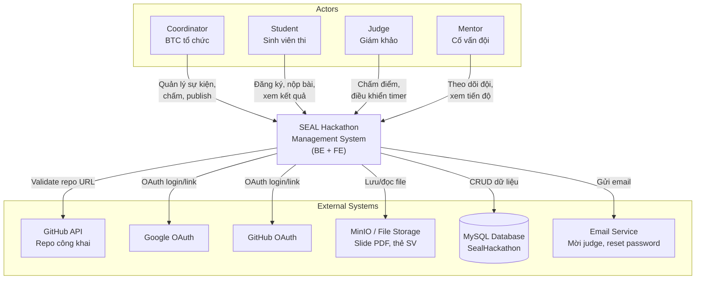

# 02 — Context Diagram (Sơ đồ ngữ cảnh)

> **Mức:** C0 — một hệ thống trung tâm, actors và external systems.  
> Dùng file này để vẽ trên Draw.io, Lucidchart, hoặc PlantUML.

---

## 1. Mô tả ngữ cảnh

**SEAL Hackathon Management System** là hệ thống quản lý cuộc thi lập trình SEAL Hackathon: từ thiết lập sự kiện, đăng ký đội, nộp bài, thuyết trình, chấm điểm, đến công bố kết quả và trao giải.

Hệ thống giao tiếp với người dùng qua **Web Frontend (React)** và với các dịch vụ bên ngoài qua HTTP/API.

---

## 2. Sơ đồ ngữ cảnh (Mermaid — vẽ lại trên công cụ UML)



---

## 3. Bảng Actor

| Actor | Vai trò thực tế | Tương tác chính với hệ thống |
|-------|-----------------|------------------------------|
| **Coordinator** | Ban tổ chức (BTC) | Tạo hackathon, cấu hình round/track, duyệt đội/user, lottery, shuffle queue, publish, wildcard, trao giải |
| **Student** | Sinh viên tham gia | Đăng ký, tạo đội, nộp bài (PDF + GitHub), xem đề, BXH, khiếu nại |
| **Judge** | Giám khảo (nội bộ / khách) | Chấm điểm, điều khiển presentation (HEAD), calibration, tiebreak vote |
| **Mentor** | Cố vấn đội | Xem đội được gán, submission, điểm (sau lock), lịch thi |

---

## 4. Bảng External System

| Hệ thống ngoài | Loại | Giao tiếp | Dữ liệu trao đổi |
|----------------|------|-----------|------------------|
| **MySQL** | Database | JDBC (Hibernate) | Toàn bộ entity: users, teams, submissions, scores… |
| **MinIO / Local FS** | Object storage | S3-compatible API | Slide PDF, thẻ SV, export CSV, certificate PDF |
| **GitHub API** | Third-party REST | HTTP (optional) | Kiểm tra repo public khi nộp bài |
| **Google OAuth** | Identity provider | OAuth 2.0 | Login / link account |
| **GitHub OAuth** | Identity provider | OAuth 2.0 | Login / link account |
| **Email (SMTP)** | Notification | JavaMail / stub | Mời guest judge, forgot password |
| **Web Frontend** | Client application | REST `/api/v1`, WS `/ws` | UI cho 4 roles — repo `seal-hackathon-fe` |

> **Lưu ý khi vẽ:** Frontend có thể vẽ **bên trong** boundary hệ thống (nếu coi FE+BE là một product) hoặc **actor Client** — tùy yêu cầu giảng viên. Assignment thường gom FE+BE vào một khối “System”.

---

## 5. Ranh giới hệ thống (System Boundary)

### Trong boundary (In scope)

- API Server (Spring Boot) — `src/main/java/com/sealhackathon/api/`
- Business rules, guards, scoring engine
- WebSocket broker (STOMP)
- Schema DB & migration

### Ngoài boundary (Out of scope — external)

- MySQL server
- MinIO / filesystem
- GitHub / Google OAuth providers
- Mail server
- React SPA (repo riêng — liên kết qua API)

---

## 6. Gợi ý vẽ Draw.io

```
                    ┌─────────────────────────────────────┐
                    │                                     │
   Coordinator ─────┤                                     │
   Student      ────┤   SEAL Hackathon Management System  ├─── MySQL
   Judge        ────┤                                     ├─── MinIO
   Mentor       ────┤                                     ├─── GitHub
                    │                                     ├─── Google OAuth
                    └─────────────────────────────────────┘
```

- Hình **tròn** = Actor (người)
- Hình **chữ nhật** = System
- Hình **song song** hoặc **hình trụ** = External system / DB
- Mũi tên có nhãn = luồng dữ liệu / hành động

---

## 7. Luồng dữ liệu chính (Data Flow tóm tắt)

| Luồng | From → To | Dữ liệu |
|-------|-----------|---------|
| DF-1 | Student → System | JWT, multipart submission (PDF, repoUrl) |
| DF-2 | System → MinIO | Binary slide, student card, export CSV, certificate PDF |
| DF-3 | System → GitHub | HEAD repo (public check) |
| DF-4 | Judge → System | Score JSON, timer commands |
| DF-5 | System → Client (WS) | Queue state, leaderboard preview |
| DF-6 | Coordinator → System | CRUD hackathon, lottery, publish |
| DF-7 | System → MySQL | Persist all domain entities |
