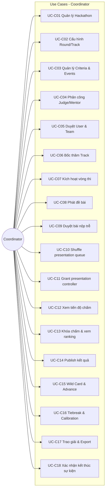
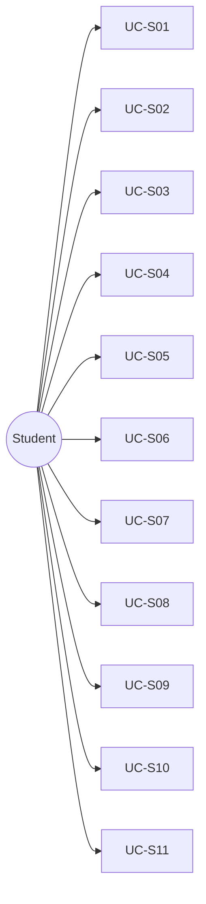

# 03 — Use Case Diagram (Sơ đồ Use Case)

> Liệt kê use case theo **Actor**. Mỗi nhóm có thể vẽ thành **1 diagram riêng** hoặc **1 diagram tổng** (rút gọn).

---

## 1. Actors

| Actor | Mô tả | Kế thừa (optional) |
|-------|-------|---------------------|
| Coordinator | Ban tổ chức | — |
| Student | Sinh viên thi | — |
| Judge | Giám khảo | Guest Judge ⊂ Judge |
| Mentor | Cố vấn | — |
| System | Timer, guard, trigger DB | Secondary actor |

---

## 2. Use Case — Coordinator (BTC)



### Chi tiết UC Coordinator

| UC ID | Tên | Mô tả ngắn | Include / Extend |
|-------|-----|------------|------------------|
| UC-C01 | Quản lý Hackathon | CRUD, đổi status DRAFT→ONGOING→FINISHED | Include: Đăng nhập |
| UC-C02 | Cấu hình Round/Track | Tạo vòng sơ loại, chung kết, track | UC-C01 |
| UC-C03 | Criteria & Events | Tiêu chí chấm, timeline workshop | UC-C02 |
| UC-C04 | Phân công nhân sự | Judge HEAD/NORMAL, Mentor | UC-C02 |
| UC-C05 | Duyệt User & Team | Approve/reject account & team; bulk-approve đội | — |
| UC-C06 | Bốc thăm Track | Lottery gán track cho đội locked | UC-C05 |
| UC-C07 | Kích hoạt vòng | Activate round (weight = 1) | UC-C03 |
| UC-C08 | Phát đề | Release problem statement | UC-C07 |
| UC-C09 | Duyệt bài trễ | LATE_PENDING → APPROVED/REJECT | UC-C07 |
| UC-C10 | Shuffle queue | Random thứ tự thuyết trình | UC-C07 |
| UC-C11 | Grant controller | Chỉ định judge điều khiển timer | UC-C04 |
| UC-C12 | Tiến độ chấm | scoring-progress, RBL dashboard | UC-C07 |
| UC-C13 | Khóa chấm & ranking | lock-scoring, ranking preview | UC-C12 |
| UC-C14 | Publish | Công bố kết quả vòng | UC-C13 |
| UC-C15 | Wild Card & Advance | Duyệt wildcard, advance đội | UC-C14 |
| UC-C16 | Tiebreak & Calibration | Giải hòa, phiên hiệu chuẩn | UC-C13 |
| UC-C17 | Trao giải & Export | Prizes, thu hồi giải, tải CSV export | UC-C18 |
| UC-C18 | Kết thúc | confirm FINISHED, BXH cuối | — |

---

## 3. Use Case — Student

| UC ID | Tên | Mô tả |
|-------|-----|-------|
| UC-S01 | Đăng ký tài khoản | Register + upload thẻ SV |
| UC-S02 | Đăng nhập / OAuth | Login, Google, GitHub |
| UC-S03 | Đăng ký hackathon | Browse & register event |
| UC-S04 | Tạo & quản lý đội | Create team, invite members |
| UC-S05 | Nộp bài | Multipart PDF + repoUrl |
| UC-S06 | Xem đề & deadline | Problem, countdown |
| UC-S07 | Xem bài nộp của đội | me/submission |
| UC-S08 | Tải/xem slide | GET slide inline/download |
| UC-S09 | Xem BXH | Leaderboard sau publish |
| UC-S10 | Nộp khiếu nại | Appeal |
| UC-S11 | Xem giải & chứng chỉ | List prizes/certificates; xem/tải PDF (`?download=true`) |



---

## 4. Use Case — Judge

| UC ID | Tên | Mô tả | Điều kiện |
|-------|-----|-------|-----------|
| UC-J01 | Xem assignment | Track/final được gán | Approved |
| UC-J02 | Xem bài ẩn danh | displayCode, không teamName | Assigned track |
| UC-J03 | Chấm điểm | POST scores NORMAL | Slot PRESENTING + timer mở |
| UC-J04 | Sửa comment điểm | PATCH comment | Own score |
| UC-J05 | Điều khiển timer | start/pause/resume/qa | HEAD hoặc granted controller |
| UC-J06 | Chuyển đội (next) | queue/next | Controller + guard điểm |
| UC-J07 | Chấm calibration | RBL session | Session OPEN |
| UC-J08 | Vote tiebreak | Dept head only | Tiebreak active |
| UC-J09 | Xem lịch sử chấm | judge-history | — |

**Quan hệ đặc biệt:** UC-J05, UC-J06 **extend** UC-J03 (cùng judge có thể vừa controller vừa chấm).

---

## 5. Use Case — Mentor

| UC ID | Tên | Mô tả |
|-------|-----|-------|
| UC-M01 | Xem track assignment | Mentor được gán track nào |
| UC-M02 | Xem danh sách đội | assigned-teams theo round |
| UC-M03 | Xem submission đội | Read-only |
| UC-M04 | Xem điểm đội | Sau lock-scoring |
| UC-M05 | Xem lịch presentation | Final schedule |
| UC-M06 | Xem BXH | Read-only rankings |

> Mentor **có thể** chấm nếu được assign thêm role Judge — use case UC-J03.

---

## 6. Use Case — System (Secondary)

| UC ID | Tên | Trigger |
|-------|-----|---------|
| UC-X01 | Validate GitHub repo | Student nộp bài |
| UC-X02 | Lock team sau hạn đăng ký | Cron / seed repair |
| UC-X03 | Gate SCORING_NOT_OPEN | Judge chấm sai phase |
| UC-X04 | Gate next scoring | Controller next sớm |
| UC-X05 | Broadcast WebSocket | Shuffle, score, timer |
| UC-X06 | Tính ranking | lock-scoring / preview |
| UC-X07 | Cấm Judge+Mentor cùng track | Assign personnel |

---

## 7. Diagram tổng hợp (rút gọn — vẽ 1 trang)

```
                    ┌──────────────────────────────────────────┐
                    │     SEAL Hackathon Management System      │
                    │                                          │
  Coordinator ──────┤  Manage Event │ Lottery │ Publish       │
                    │  Personnel    │ Shuffle │ Awards        │
                    │                                          │
  Student ──────────┤  Register │ Team │ Submit │ View Result│
                    │                                          │
  Judge ────────────┤  Score │ Control Timer │ Calibration   │
                    │                                          │
  Mentor ───────────┤  View Teams │ View Progress             │
                    │                                          │
                    └──────────────────────────────────────────┘
```

---

## 8. Ma trận Actor × Use Case (traceability)

| Use Case | Coord | Student | Judge | Mentor |
|----------|:-----:|:-------:|:-----:|:------:|
| UC-C01..18 | ✓ | | | |
| UC-S01..11 | | ✓ | | |
| UC-J01..09 | | | ✓ | |
| UC-M01..06 | | | | ✓ |
| UC-J03 (score) | | | ✓ | ✓* |

\* Mentor khi được assign judge.

---

## 9. Gợi ý vẽ assignment

1. Vẽ **4 diagram** (1 actor/diagram) — dễ đọc, đủ điểm.
2. Hoặc **1 diagram tổng** với ~15 UC gom nhóm (Manage Event, Participate, Score, Operate Presentation).
3. Ghi **<<include>>** Đăng nhập cho mọi UC cần auth.
4. Ghi **<<extend>>** Acknowledge incomplete scoring cho UC-J06.
