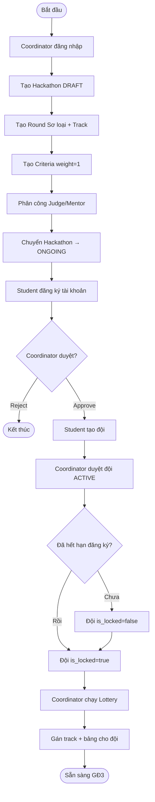
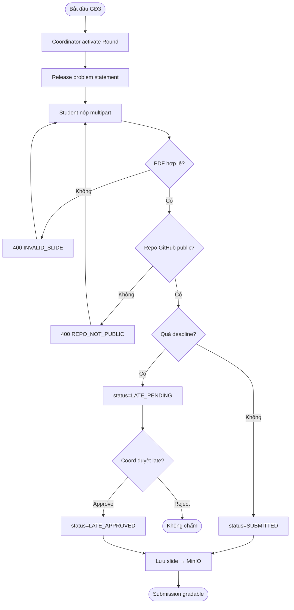
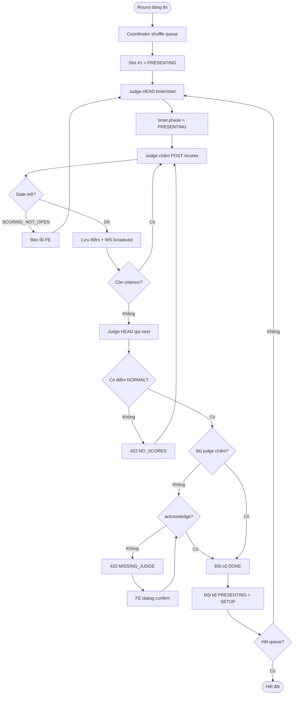
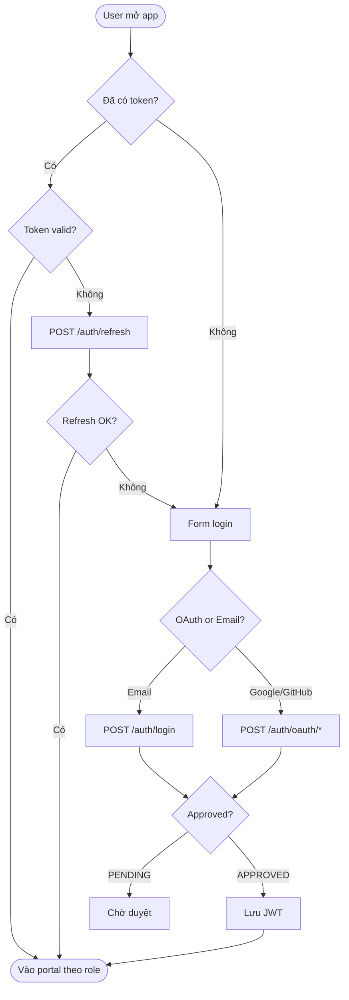

# 04 — Activity Diagrams (Sơ đồ hoạt động)

> 6 luồng chính — copy mermaid sang [mermaid.live](https://mermaid.live) hoặc vẽ lại trên Draw.io.  
> Mỗi diagram = 1 activity diagram cho assignment.

---

## AD-01 — Đăng ký & thiết lập sự kiện (GĐ1 → GĐ2)

**Mục tiêu:** Coordinator tạo hackathon → Student đăng ký đội → Lottery.



**Swimlane gợi ý:** Coordinator | Student | System

---

## AD-02 — Kích hoạt vòng & nộp bài (GĐ3)



---

## AD-03 — Presentation & chấm điểm (GĐ3 core)



**Swimlane:** Coordinator (shuffle) | Judge Controller (timer/next) | Judge (score) | System (gate)

---

## AD-04 — Khóa chấm & publish (GĐ3 → GĐ4)

```mermaid
flowchart TD
    Start([Sau khi chấm xong]) --> A[Coord xem scoring-progress]
    A --> B{100% gradable?}
    B -->|Chưa| C[Tiếp tục chấm/nhắc judge]
    C --> A
    B -->|Rồi| D[PATCH lock-scoring]
    D --> E[GET ranking preview]
    E --> F[Coord xác nhận]
    F --> G[PATCH publish]
    G --> H[Student xem leaderboard]
    H --> I{Wildcard enabled?}
    I -->|Có| J[Coord review wildcard]
    J --> K[Approve/Reject wildcard]
    K --> L[POST /rounds/{id}/advance]
    I -->|Không| L
    L --> End([Chuyển vòng kế / CK])
```

---

## AD-05 — Đăng nhập & OAuth (Auth)



---

## AD-06 — Kết thúc sự kiện (GĐ6)

```mermaid
flowchart TD
    Start([Chung kết xong]) --> A[Coord lock-scoring final]
    A --> B[GET team/chapter/individual rankings]
    B --> C[Coord trao giải POST prizes]
    C --> D[Student xem prizes/certificates]
    D --> E[Coord tạo export job]
    E --> F[Poll export status]
    F --> G[GET /export-jobs/{id}/download — stream CSV]
    G --> H[PATCH confirm FINISHED]
    H --> End([Hackathon FINISHED])
```

---

## Bảng chọn diagram cho assignment

| Ưu tiên | Diagram | Lý do |
|---------|---------|-------|
| ⭐⭐⭐ | AD-03 | Core GĐ3 — presentation + scoring + next guard |
| ⭐⭐⭐ | AD-02 | Submit multipart — tính năng mới v4.1 |
| ⭐⭐ | AD-01 | End-to-end từ setup → lottery |
| ⭐⭐ | AD-04 | Publish workflow |
| ⭐ | AD-05 | Auth — nếu assignment yêu cầu |
| ⭐ | AD-06 | Closure — nếu cover full lifecycle |

---

## Ký hiệu Activity Diagram (UML)

| Ký hiệu | Ý nghĩa |
|---------|---------|
| `( )` / stadium | Start / End node |
| `[]` / rectangle | Action / Activity |
| `{ }` / diamond | Decision / Merge |
| Swimlane | Partition theo actor |
| Fork/Join | Song song (ít dùng trong doc này) |

---

## Decision points quan trọng (ghi chú khi vẽ)

| # | Điều kiện | Nhánh |
|---|-----------|-------|
| D1 | `teams.is_locked` | Lottery được / không |
| D2 | `submission.status` | SUBMITTED / LATE_PENDING |
| D3 | `timer.phase` | Chấm được / SCORING_NOT_OPEN |
| D4 | `scoreCount > 0` | Next được / 422 |
| D5 | `round.scoring_locked` | Chấm được / locked |
| D6 | `user.status` | APPROVED / PENDING |
